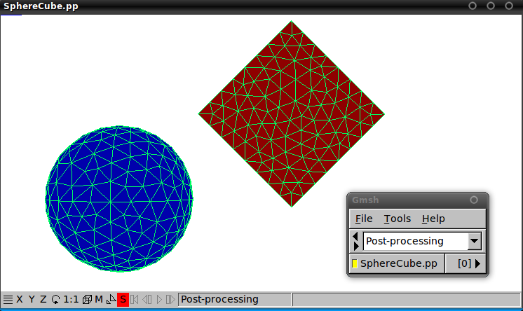
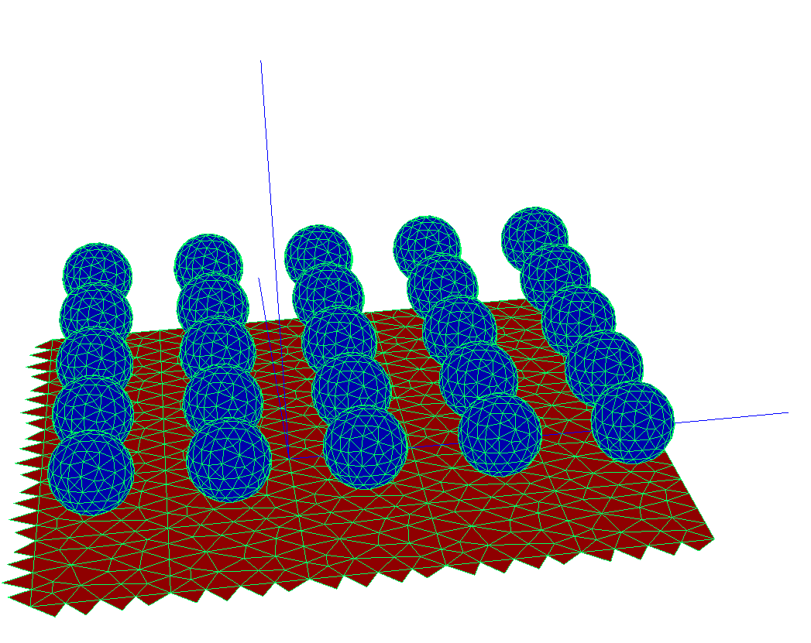
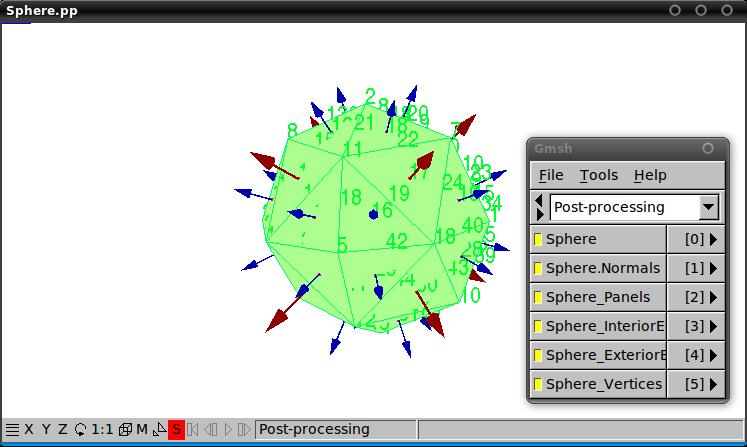
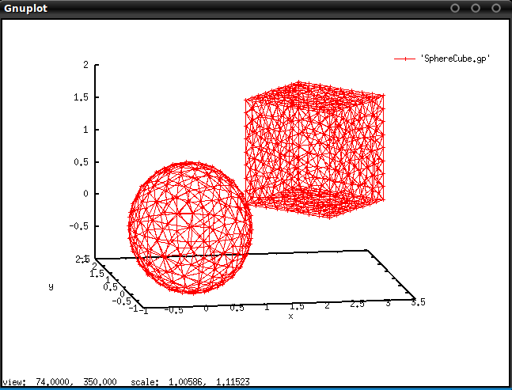
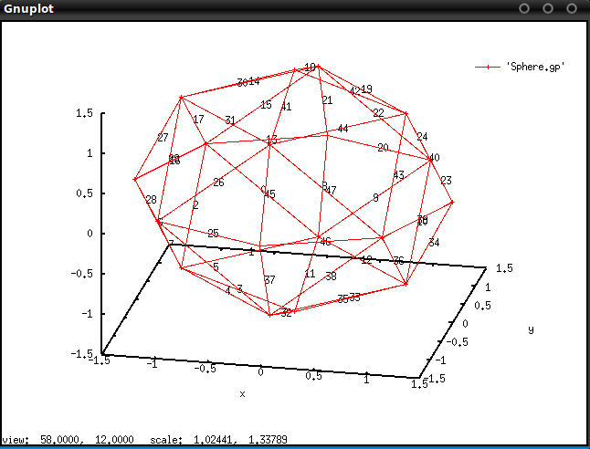

<h1> Analyzing objects and geometries with <span class="SC">scuff-analyze</span></h1>

The [[scuff-em]] suite comes with a simple standalone utility named 
[[scuff-analyze]] that you can use to gather some quick statistics on
meshed objects and scattering geometries described by mesh files and 
geometry files.

There are several situations in which this can be useful:

-   You want to know how much memory will be occupied by the BEM matrix 
    for a geometry described by a `.scuffgeo` file.
-   Your `.scuffgeo` file contains multiple `OBJECTs` or `SURFACEs`, each 
    described by a separate surface mesh and possibly displaced, rotated, 
    or periodically replicated via `LATTICE` statements, and you want to 
    visualize the full geometry to make sure the file you wrote actually 
    describes what you want.
-   You have created a `.trans` file describing a list of 
    [geometrical transformations](../../reference/Transformations.md) 
    to be applied to your geometry, and before running a full calculation 
    you want to do a quick sanity check by visualizing the geometry under
    each of your transformations to make sure they are what you intended.
-   You want to delve into the innards of [[libscuff]] by playing around 
    with the simultaneous linear BEM system it constructs. In this case 
    you will need to know how the RWG basis functions in your surface mesh 
    are ordered within the BEM matrices and vectors, i.e. you need the 
    correspondence between rows of the BEM matrix and interior edges in your 
    surface-mesh geometry.

[TOC]

-------------------------------------
# scuff-analyze Command-Line Options

## *Options specifying the file to analyze*

````bash
    --geometry MyGeometry.scuffgeo
````

Analyze a full geometry described by a
[<span class="SC">scuff-em</span> geometry file](../../reference/Geometries.md).

````bash
    --mesh     MyObject.msh
    --meshFile MyObject.mesh
````

Analyze a single object described by a surface mesh. (The
two options are synonomous.)

## *Option specifying a list of geometrical transformations*

````bash
    --TransFile MyTransFile.trans
````

Specify a list of 
[geometrical transformations](../../reference/Transformations.md) 
to be applied to a geometry. This is useful for **(a)** checking
that your transformation file can be properly parsed by 
[[scuff-em]], and **(b)** producing a visualization output file to 
confirm that the transformations you got are the ones you wanted.

## *Options controlling the generation of visualization files*

````bash
    --WriteGMSHFiles 
````

Write visualization files suitable for viewing with 
[<span class="SC">gmsh</span>](http://www.geuz.org/gmsh).

````bash
    --WriteGMSHLabels 
````

Append visualization data to [[gmsh]] visualization files that 
provides information on how the geometry is represented internally 
within [[scuff-em]]. This option is automatically enabled when the 
`--mesh` option is used.

````bash
    --Neighbors nn
````

(For periodically repeated geometries only). If this option is specified, 
the [[gmsh]] visualization files will include the first `nn` neighboring 
cells in all directions. (For example, `--Neighbors 1` will produce a 
plot showing the innermost 3x3 grid of unit cells, while `--Neighbors 2` 
will show the innermost 5x5 grid of cells.) This is useful for visualizing 
how your unit-cell meshes fit together with their images across unit-cell 
boundaries to comprise a periodically replicated lattice.

````bash
    --WriteGnuplotFiles 
````

Write visualization files suitable for viewing with 
[<span class="SC">gnuplot</span>](http://www.gnuplot.info).

-------------------------------------
# [[scuff-analyze]] console output

### Running [[scuff-analyze]] on a geometry file

Running [[scuff-analyze]] on a typical [[scuff-em]] geometry file 
yields console output that looks like this:

````bash
      % scuff-analyze --geometry CylinderRing.scuffgeo
   
         ***********************************************
         *  GEOMETRY CylinderRing.scuffgeo 
         ***********************************************
               2 objects
           22548 total basis functions
          Size of BEM matrix: 3.84 GB
         
         ***********************************************
         *  OBJECT 0: Label = Ring
         ***********************************************
          Meshfile: Ring.msh 
          7360 panels
          11040 total edges
          22080 total basis functions
          11040 interior edges
          3680 total vertices (after eliminating 0 redundant vertices)
          3680 interior vertices
          0 boundary contours
         
          interior vertices - interior edges + panels = euler characteristic
                       3680 -          11040 +   7360 = 0
         
          Total area: 6.1547934e+00 
          Avg area: 8.3624910e-04 // sqrt(Avg Area)=2.8917972e-02
          
         ***********************************************
         *  OBJECT 1: Label = Cylinder
         ***********************************************
          Meshfile: Cylinder.msh 
          156 panels
          234 total edges
          468 total basis functions
          234 interior edges
          80 total vertices (after eliminating 0 redundant vertices)
          80 interior vertices
          0 boundary contours
         
          interior vertices - interior edges + panels = euler characteristic
                         80 -            234 +    156 = 2
         
          Total area: 6.6885562e-01 
          Avg area: 4.2875360e-03 // sqrt(Avg Area)=6.5479279e-02
          
         Thank you for your support.
````

### Running [[scuff-analyze]] on a mesh file

You can also run [[scuff-analyze]] on a mesh file describing just a 
single object:

````bash
      % scuff-analyze --mesh Cylinder.msh

         Meshfile: Cylinder.msh 
         156 panels
         234 total edges
         234 total basis functions
         234 interior edges
         80 total vertices (after eliminating 0 redundant vertices)
         80 interior vertices
         0 boundary contours
        
         interior vertices - interior edges + panels = euler characteristic
                        80 -            234 +    156 = 2
        
         Total area: 6.6885562e-01 
         Avg area: 4.2875360e-03 // sqrt(Avg Area)=6.5479279e-02
         
        Thank you for your support.
````

One use of [[scuff-analyze]] is to generate visualization files that 
may be opened in [gnuplot](http://www.gnuplot.info) 
or [gmsh.](http://www.geuz.org/gmsh) In addition to showing you what 
your geometry looks like, these files will also indicate the internal 
numbering that [[scuff-em]] uses for the vertices, panels, and edges 
in the surface discretization. This information can be useful, for 
example, in interpreting the BEM matrices exported by passing the 
`--ExportBEMMatrix` option to various [[scuff-em]] programs.

-----------------------------------
# Viewing [[gmsh]] visualization files

The [[gmsh]] visualization files generated by [[scuff-analyze]] 
contain different information depending on whether you use the 
`--geometry` option to specify a full [[scuff-em]] geometry 
(a [`.scuffgeo`](../../reference/Geometries.md) file) or the 
`--mesh` option to specify a single surface mesh for an 
individual object (as described by a [[gmsh]] `.msh` file or 
other mesh file format).

### [[gmsh]] Visualization of Full Geometries

If you specify the `--geometry` option, the resulting `.pp` file 
will contain only a single "view" giving you a graphical 
representation of the various objects in the geometry. This is 
convenient for confirming that objects are positioned relative 
to one another in the way that you intended. For instance, 
consider the following geometry file (called `SphereCube.scuffgeo`), 
which describes a geometry involving a sphere and a cube, with the 
cube displaced and rotated vis-a-vis the base position and orientation 
described by its `.msh` file:

````bash 
 OBJECT TheSphere
    MESHFILE  Sphere.msh
    MATERIAL  Silicon
 ENDOBJECT

 OBJECT TheCube
    MESHFILE  Cube.msh
    MATERIAL  Teflon
    ROTATED   45 ABOUT 0 0 1
    DISPLACED 0.9 1.1 2.3
 ENDOBJECT
````    


To visualize this configuration of objects, from the command line we can say

````bash
    % scuff-analyze --geometry SphereCube.scuffgeo --WriteGMSHFiles
    % gmsh SphereCube.pp
````

The first command here creates a file called `SphereCube.pp` (as well 
as a bunch of console output, which we omit), while the second line 
opens this file in [[gmsh]], yielding this:



### [[gmsh]] Visualization of Extended Geometries: The `--neighbors` Option

Here's an example in which we have a periodically extended geometry 
and we'd like to visualize how the unit cell described by our 
`.scuffgeo` file fits together with its images across the unit-cell 
boundaries. This geometry describes an array of nanospheres atop a 
silicon substrate.

The `.scuffgeo` file:

````bash
LATTICE 
    VECTOR 2.4 0.0 0.0 
    VECTOR 0.0 2.4 0.0
ENDLATTICE 

REGION UpperHalfSpace MATERIAL Vacuum
REGION LowerHalfSpace MATERIAL Silicon
REGION SphereInterior MATERIAL Gold

SURFACE Sphere
    MESHFILE Sphere.msh
    DISPLACED 1.2 1.2 1.85
    REGIONS UpperHalfSpace SphereInterior
ENDOBJECT


SURFACE Substrate
    MESHFILE Square.msh
    REGIONS UpperHalfSpace LowerHalfSpace
ENDOBJECT
````
    
To visualize the unit cell together with a few surrounding lattice 
cells, we use the `--Neighbors` option to [[scuff-analyze]]:

````bash
    % scuff-analyze --geometry SphereSubstrateArray.scuffgeo --WriteGMSHFiles --Neigbors 2
    % gmsh SphereSubstrateArray.pp
````



Notice that the visualization plot here includes extra panels hanging off 
two of the four edges of each lattice cell. These are called *straddlers;* 
they are not present in the actual `.msh` file specified in your `.scuffgeo` 
file, but are automatically added internally by [[scuff-em]] for contiguous 
surfaces extending beyond the confines of the unit cell.

### gmsh Visualization of Individual Meshes

On the other hand, if you specify the `--mesh` option to [[scuff-analyze]], 
then the `.pp` files generated by the `--WriteGMSHFiles` option will contain 
various additional information. For example, suppose we wanted to get some 
more information on the sphere mesh from the previous example:

````bash
    % scuff-analyze --mesh Sphere.msh --WriteGMSHFiles
    % gmsh Sphere.pp
````

The first command here creates a [[gmsh]] post-processing file called 
`Sphere.pp` which contains several "views," each providing a different 
set of information on how [[scuff-em]] internally processes the surface 
mesh. Within the gmsh GUI, you can zoom in and out, rotate and translate 
the object, and click the little yellow squares in the menu window to 
turn on and off the display of individual views. (For clarity, the 
screenshot below was generated using a more coarsely-meshed sphere than 
in the screenshot above.)



The first view here (the one named "Sphere") just plots the triangular 
panels that define the surface mesh. This is the same information that 
you would get from running [[scuff-analyze]] with the `--geometry` option.

The remaining views contain the following additional information. (This 
information is probably only of interest to people who want to hack about 
in the internals of [[libscuff]] and need to know the details of the internal 
representation of objects and BEM quantities.)

-   The direction of the surface normal to each panel as read in from the `.msh` file.
At present this information is not used for anything inside [[libscuff]], because [[scuff-em]]
makes its own overriding decision about how to orient the surface normal.
-   The (zero-based) indices of the panels.
-   The (zero-based) indices of the internal edges. The internal edge whose 
    index is *n* corresponds to the *n*th RWG basis function for this object 
    and hence to the *n*th surface-current expansion coefficient (for PEC 
    objects) or the *2n*th and *2n+1*th surface-current expansion coefficients 
    (for non-PEC objects) in the portion of the BEM solution vector 
    corresponding to the object in question.
-   The (zero-based) indices of the exterior edges.
-   The (zero-based) indices of the vertices.

----------------------------------------------------------
# Viewing [[gnuplot]] visualization files

### [[gnuplot]] Visualization of Full Geometries

Running [[scuff-analyze]] with the `--WriteGNUPLOTFiles` option will 
create a file called `MyGeometry.gp` (where `MyGeometry.scuffgeo` was 
the geometry file specified using the `--geometry` option) which you 
can visualize in [[gnuplot]] using the command `splot 'MyGeometry.gp' w lp.`

````bash
    % scuff-analyze --geometry SphereCube.scuffgeo --WriteGNUPLOTFiles
    % gnuplot
    gnuplot> splot 'SphereCube.gp' w lp
````    



### [[gnuplot]] Visualization of Individual Meshes

Running [[scuff-analyze]] with the `--WriteGNUPLOTFiles` option will 
create a file called `MyObject.gp` (where `MyObject.msh` was the mesh 
file specified using the `--mesh` option), together with a bunch of 
auxiliary files named, for instance, `MyObject.gp.edgelabels`. 
These auxiliary files contain [[gnuplot]] commands to superpose 
various types of additional information atop the basic plots, and 
should be used with the `load` command, like this:

````bash
    % scuff-analyze --mesh Sphere.msh --WriteGNUPLOTFiles
    % gnuplot
    gnuplot> load 'Sphere.gp.edgelabels'
    gnuplot> splot 'Sphere.gp' w lp
````bash


