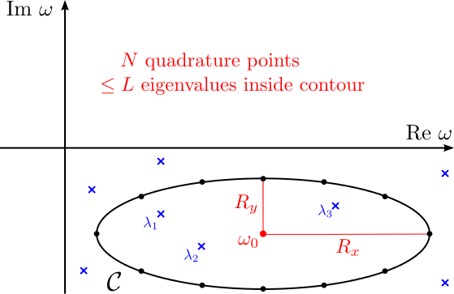
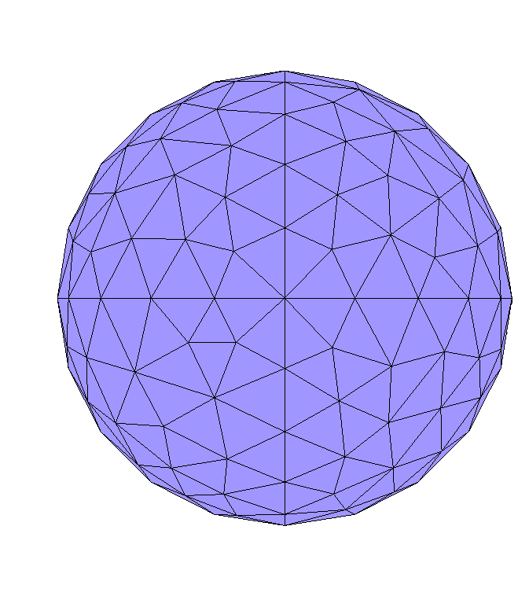
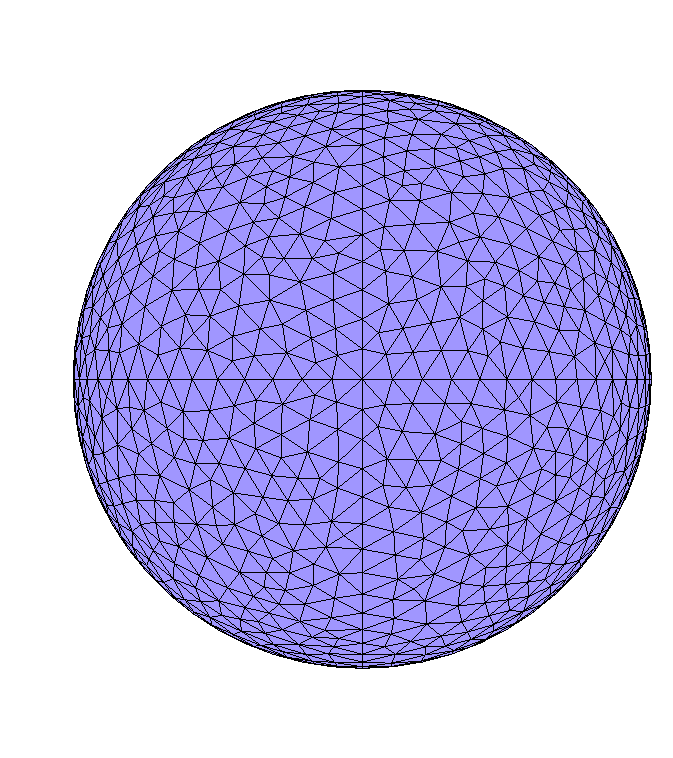
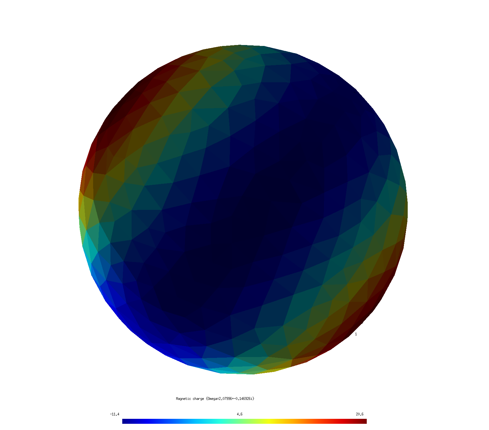

<h1> Computing electromagnetic modes with <span class="SC">scuff-spectrum</span>
</h1>

[[scuff-spectrum]] is a tool within the [[scuff-em]] code suite
for computing frequencies and field patterns of resonant modes
in arbitrary material geometries. More specifically, [[scuff-spectrum]]
implements [Beyn's contour-integral algorithm for nonlinear
eigenproblems][BeynMethod], described in more detail below,
to pinpoint frequencies $\omega$ at which the
[BEM system matrix $\mathbf{M}(\omega)$][PMCHWTSystem] is singular,
allowing nonzero surface currents to flow in the absence of
external fields. [[scuff-spectrum]] reports mode frequencies
and, optionally, visualization diagrams and various
types of information on the current and field patterns
of the corresponding eigenvectors.

Of course, the information reported by [[scuff-spectrum]] could
also be obtained *indirectly* from other codes in the
[<span class=SC>scuff-em</span> application suite][ApplicationSuite]---for
example, the resonant modes of the
[spherical dielectric cavity][SphericalDielectricCavity]
shown below would show up as blips in (say) the
scattering cross section as the frequency is scanned past
the vicinity of the resonance.
<!--# while the [circuit-QED resonator][CircuitQEDResonator]-->
However, this would be an inefficient and imprecise way to
determine resonance frequencies---we would probably wind up
computing scattering cross sections at hundreds of frequencies
on a dense grid just to approximate the resonance with 
one- or two-digit accuracy---and it would not yield
direct information on the current and field patterns
of the corresponding modes. In contrast, the method
used by [[scuff-spectrum]] is optimized to pinpoint
mode frequencies with many-digit accuracy---using
only a small number of samples---and, moreover, directly
furnishes all information we may need about the current a
and field patterns of the modes themselves.

[TOC]

<a name="BeynMethod"></a>
# 1. Beyn's algorithm: the computational engine behind <span class="SC">scuff-spectrum</span>

### Mode frequencies as nonlinear eigenvalues

The basic problem solved by <span class=SC>scuff-spectrum</span>
is to find values of the angular frequency $\omega$ at which the
[BEM system matrix $\mathbf{M}(\omega)$][PMCHWTSystem] is singular
(has non-empty nullspace), in which case we can find a 
nonzero vector $\mathbf{v}$ that solves the equation

$$ \mathbf{M}(\omega) \mathbf{v} = 0. \qquad (1) $$

This is just the 
[usual linear system of equations solved in <span class=SC>scuff-em</span> scattering problems][PMCHWTSystem],
but now with zero right-hand side, i.e. there is no incident field or
other external stimulus exciting the structure; instead,
the eigenvector $\mathbf{v}={\mathbf{k} \choose \mathbf{n}}$
describes a configuration of surface currents that can exist
in the absence of external fields---a resonance mode.

Equation (1) resembles an eigenvalue problem, but with the
complication that the matrix $\mathbf{M}(\omega)$ depends
in a complicated nonlinear way on the frequency $\omega$; 
this means we can't simply use standard solvers
for linear eigenproblems such as those implemented
in [<span class=SC>lapack</span>](http://www.netlib.org/lapack/).

### Beyn's contour-integral algorithm: A lightning overview

Instead, [[scuff-spectrum]] implements the contour-integral approach
to nonlinear eigenproblems proposed by W. Beyn in this 2012 paper:

+ Wolf-J&uuml;rgen Beyn, "An integral method for solving nonlinear eigenvalue problems." *Linear Algebra and its Applications* **436** 3839 (May 2012).

+ DOI: [https://doi.org/10.1016/j.laa.2011.03.030](https://doi.org/10.1016/j.laa.2011.03.030)

+ ArXiV: [https://arxiv.org/abs/1003.1580](https://arxiv.org/abs/1003.1580)

In a nutshell, Beyn's method locates eigenvalues of (1) by
evaluating a certain contour integral in the complex $\omega$ plane;
the evaluation proceeds via numerical quadrature, sampling
the integrand at a total of $N$ quadrature points
$\{\omega_n\},n=1,2,\cdots,N$ (see figure below).
The number of quadrature points, and the shape and location
of the contour, are user-tweakable parameters that you 
will specify as inputs to [[scuff-spectrum]]; the basic idea
is that Beyn's method will identify all eigenvalues located 
*inside* the contour, and will ignore any eigenvalues lying
*outside* the contour, so the challenge from the user's 
perspective is to have a rough idea of where your eigenvalues
will be---and to design contours that enclose the ones you
want while omitting the others.

We are being deliberately vague here about precisely
*what* contour integral we are evaluating, as this is not
crucial knowledge for using [[scuff-spectrum]] (for details,
see the original paper linked above). Pretty much all you need
to know is this: Evaluating the integrand at each
quadrature point $\omega_n$ involves **(a)** forming and factorizing 
the matrix $\mathbf{M}(\omega_n)$, and then **(b)** doing some simple
linear-algebra calculations involving the solution
of a small number (see below) of linear systems of equations
of the form $\mathbf{M}(\omega)\mathbf{x}=\mathbf{b}$
for certain given RHS vectors $\mathbf{b}.$ Of course, 
assembling the system matrix $\mathbf{M}(\omega)$ and solving
linear systems is exactly what <span class=SC>scuff-em</span>
does to solve scattering problems, and so *mechanically*
Beyn's algorithm boils down simply to solving integral-equation
scattering problems, at some number of frequencies, with
some number of RHS vectors at each frequency---not different,
in principle, from what we would wind up doing in the brute-force
(frequency-scanning) approach to computing mode frequencies
discussed above. The difference is that Beyn's algorithm
chooses the frequencies at which we calculate, and combines
the results of all those calculations, in clever ways to ensure
that maximal benefit is extracted from the computations,
allowing us to converge quickly to highly accurate values
for the eigenvalues $\omega$ in (1). Of course, in addition
to the eigenvalue $\omega$, Beyn's method also gives us
the eigen*vectors* $\mathbf{v}$, which we can use in
post-processing to do things like visualizing the distribution
of currents and fields in the various eigenmodes we find (see examples
below).

### Beyn's algorithm: Mechanics
Having briefly outlined the idea of Beyn's method---and referring
interested readers to Beyn's paper cited above for more detail on the 
theory---let's now turn to a discussion of the mechanics
of running Beyn-method calculations in [[scuff-spectrum]].

The following figure illustrates a typical elliptical
contour $\mathcal{C}$ in the complex-$\omega$ plane over
which we might wish to execute Beyn's algorithm.
(Contours in [[scuff-spectrum]] are always elliptical.)



In this figure, blue crosses indicate eigenvalues of (1);
note that there are 3 eigenvalues contained inside the
contour $\mathcal{C}$---labeled $\omega_{1,2,3}$---as
well as several other eigenvalues not enclosed by the 
contour, which we do not label as they will be ignored
by our calculation. The black dots on the contour indicate
quadrature points; the $\omega$ values represented by these points
are the complex frequencies at which [[scuff-scatter]]
will assemble the matrix $\mathbf{M}(\omega)$
and do some linear algebra to compute 
the integrand of the Beyn-method contour integrals.

Items in *red* in the figure above indicate user-specified
inputs to [[scuff-scatter]]: these are

+ the complex-valued frequency $\omega_0$ at which
  the contour $\mathcal{C}$ is centered

+ the horizontal and vertical radii (half-minor axes)
  $R_x$ and $R_y$ of the elliptical contour

+ the number of quadrature points $N$ (12 in this case)

+ an integer $L$ which should be greater than or equal to
  the number of eigenvalues you *expect* to be found
  within the contour; if [[scuff-spectrum]] finds more than
  this number of eigenvalues, Beyn's method breaks down and 
  must be restarted with a larger value of $L$. (You will 
  get a console warning in this case.)

  On the other hand, the algorithm works fine if $L$ winds up
  being *larger* than the number of eigenvalues found inside
  the contour, so you should give yourself some leeway by 
  choosing generous values for $L$ (typical values might 
  be 10 or 20); higher values of $L$ do result in slightly
  greater computation time, but not much. (More specifically, $L$
  is the number of linear-system solves of the form
  $\mathbf{M}(\omega_n)\mathbf{x}=\mathbf{b}$ that must be done
  at each quadrature point $\omega_n$; increasing $L$ from 10 to 20
  or 30 or so does require more solves, but that cost is 
  generally negligible compared to the cost of assembling 
  and factorizing the matrix $\mathbf{M}(\omega)$, so don't
  bother with excessive parsimony in choosing $L$.)

Running [[scuff-spectrum]] with the above inputs as illustrated
in the figure above would yield accurate values for the three 
eigenvalues $\omega_{1,2,3}$ inside the contour---with the
accuracy increasing with the number of quadrature points $N$---as
well as values for the corresponding eigenvectors.

<a name="SphericalDielectricCavity"></a>
# 2. <span class="SC">scuff-spectrum</span> tutorial: Modes of a spherical dielectric cavity

In this example we'll use the Beyn algorithm as implemented by [[scuff-spectrum]] to
compute the modes of a spherical dielectric cavity, i.e. a simple dielectric sphere.

## Exact (spherical-wave) calculation

For this simple geometry, the mode frequencies can be
calculated to any desired numerical precision by looking
for poles of the Mie-scattering coefficients for plane waves
impinging on a dielectric sphere; the calculation is discussed
on page 15 of [this memo](../../tex/scuffSpherical.pdf)
and implemented by 
[this simple <span class=SC>mathematica</span> code.](GetSphericalCavityFrequencies.math)
For a sphere of relative permittivity
$\epsilon=4$ (refractive index $n=2$), some typical results are:

+ For $\mathbf{N}$-type (electric multipole) waves with $\ell=1$ there is a resonance at

$$ a= 1.1362178236179127955 - 0.63063395652811684933i $$

where $a=\frac{\omega R}{c}$ with $R$ the sphere radius.

+ For $\mathbf{M}$-type (magnetic multipole) waves with $\ell=2$ there is a resonance at

$$ a=2.0714122747181446982 - 0.14636128063766849563i $$

Next let's ask how well we can reproduce these results
in [[scuff-spectrum]].

## <span class=SC>scuff-spectrum</span> calculation

### <span class=SC>scuff-em</span> geometry files for spherical cavity

For [[scuff-spectrum]] calculations I use a simple `.scuffgeo`
file describing an isolated sphere with $\epsilon_r=4$;
this file is called `E4Sphere_501.scuffgeo`:

```bash
OBJECT Sphere
	MESHFILE Sphere_501.msh
	MATERIAL CONST_EPS_4
ENDOBJECT
```

The file [`Sphere_501.msh`](Sphere_501.msh) to which this refers is a 
[<span class=SC>gmsh</span>](gmsh.info)
mesh file produced from a <span class=SC>gmsh</span> 
geometry file named [`Sphere.geo`](Sphere.geo)
by running `gmsh -2 Sphere.geo -o Sphere.msh`; to investigate
the effect of meshing resolution I will also create a series
of more finely discretized spheres by saying e.g.
`gmsh -2 Sphere.geo -clscale 0.75 -o Sphere_Finer.msh`
(where the `-clscale` option, short for "characteristic
length scale", may be used to refine the discretization length
everywhere in the geometry.)
The finest-resolution sphere I will use has $N=4107$ interior
edges; for comparison , here are images of the coarsest $(N=501)$ 
and finest $(N=4107)$ sphere meshes I will use.




### Running <span class=SC>scuff-spectrum</span> to pinpoint mode frequencies

Based on the discussion above, I expect to find modes
at frequencies near $\omega_0\approx 1.1-0.63i$
and $\omega_0\approx 2.1-0.14i$. Thus, I will use [[scuff-spectrum]]
to execute Beyn's method for contours centered near these points
and enclosing them.

For example, here's a run in which I specify a contour centered
at $\omega_0=1.1-0.63i$, with horizontal and vertical
radii $R_x=R_y=0.2$, using $N$=14 quadrature points, and 
allowing a budget of up to $L$=5 eigenvalues to be 
found within the contour:

````bash
% scuff-spectrum --geometry E4Sphere_501.scuffgeo \
                 --omega0 1.1-0.63i               \
                 --Rx 0.2 --Ry 0.2                \
                 --N 14 --L 5                     
````

This produces the file `E4Sphere_501.ModeFrequencies`:

````bash
# For contour w0=1.1+-0.63i, Rx=2.000000e-01, Ry=2.000000e-01, N=14, L=5# w0=1.1+-0.63i, Rx=2.000000e-01, Ry=2.000000e-01, N=14, L=5:
# re(w) im(w)   estimated error in re(w), im(w)
+1.149426e+00 -6.378139e-01  +3.180420e-05 +7.130373e-05  
````

As the header says, the 4 numbers reported here are 
the real and imaginary parts of the mode frequency
(which is being estimated at $\omega \approx 1.149-0.63i$)
followed by estimates of the integration error,
i.e. the error incurred by approximating the contour
integral via numerical quadrature; in this case the 
error is evidently tiny, and we can be confident that Beyn's
method has converged even with just the 14 quadrature points
we used. (For larger contours we would probably need
more points.)

Also, in this case Beyn's method only found a single eigenvalue
within the contour. If we had considered a larger contour,
there would most probably have been several lines of data
each with the 4-number format shown above, corresponding to
multiple eigenvalues identified within the contour.

### Mesh convergence

Of course, even if Beyn's method converges to many-digit
precision on an eigenmode, we don't necessarily 
expect the 
resulting mode frequency to agree with Mie-theoretic predictions
to high accuracy, because we are here studying a slightly
different *structure*---namely, a sphere approximated by a
discretized version in the form of a 501-sided polygon---but
we may expect the mode frequencies to converge toward exact 
results for spheres as the *discretization* is refined.

To test this, I repeated the [[scuff-spectrum]] calculations
above using more finely-meshed spheres. 
Here are results for mode frequency vs. mesh
discretization, characterized by the number *N*
of interior edges in the discretized sphere:

| **N**  | Re($\omega$)   | Im($\omega$)  |
|--------|:--------------:|---------------|
|  501   | 1.14943        | -0.63781      |
| 1482   | 1.14076        | -0.63318      |
| 2604   | 1.13877        | -0.63204      |
| 4107   | 1.13787        | -0.63157      | 
|        |                |               |
|inf     | 1.13627        | -0.63071      |
|        |                |               |
|exact   | 1.13622        | -0.63063      |

In this table, the first four data rows show
results of [[scuff-spectrum]] calculations 
for discretized meshes with $N$ interior edges.
The column marked `inf` corresponds to an extrapolation
of the finite-$N$ data to the $N\to \infty$ limit
(basically, just fit the data to $A+B/N$ and 
retain only the $A$ coefficient.)
The row labeled `exact` shows
numerically exact predictions of Mie theory.

Here are the analogous results for the $M$-type $\ell=2$ spherical
cavity mode:

| **N**  | Re($\omega$)   | Im($\omega$)  |
|--------|:--------------:|---------------|
| 501    | 2.09595        | -0.147858     |
| 1482   | 2.07996        | -0.146926     |
| 2604   | 2.07615        | -0.146679     |
| 4107   | 2.07442        | -0.146564     |
|        |                |               |
| inf    | 2.07151        | -0.146403     |
|        |                |               |
| exact  | 2.07141        | -0.146361     |

These results demonstrate that the Beyn method implemented by 
[[scuff-spectrum]] easily achieves 4-digit precision
in determining mode frequencies, despite the modest 
computational burden (equivalent to solving scattering 
problems at 14 different frequencies). This is *much* 
better accuracy than we could hope to get for the 
same computational cost from a brute-force frequency-scan
method.

### Running <span class=SC>scuff-spectrum</span> to analyze eigenmode field patterns

Moreover,
having identified the *frequencies* (eigenvalues) of
our structure with high precision, we can now look
at the *surface currents* (eigenvectors) and the *field patterns*
they produce. [[scuff-spectrum]] offers several command-line
options to facilitate this analysis, many of which are 
similar to the post-processing outputs available in 
[<span class=SC>scuff-scatter</span>][scuffScatter] and other
<span class=SC>scuff-em</span> codes:

+ `--EPFile MyEPFile` requests computation of **E** and **H**
field components at each evaluation point in a user-specified
list of evaluation points.

+ `--FVMesh MyFVMesh.msh` requests generation of 
<span class=SC>gmsh</span> visualization files
showing fields and fluxes on the user-specified visualization
mesh (screen) `MyFVMesh.msh.`

+ `--CartesianMomentFile MyFile` requests that values of the 
Cartesian multipole moments corresponding to the eigen-current
distribution be written to file `MyFile.`

+ `--SphericalMomentFile MyFile` is like the previous option,
but for *spherical* multipole moments.

+ `--PlotSurfaceCurrents` requests visualization files
showing the distribution of electric and magnetic
surface currents on the geometry.

For example, here are images showing the distribution of
surface currents for the two eigenmodes captured by the
above tables.




The quadrupole structure of the $\ell=2$ resonance is clearly
distinguishable from the dipole structure of the $\ell=1$ mode.

<a name="CommandLineReference"></a>
# 3. <span class="SC">scuff-spectrum</span> command-line reference

[ApplicationSuite]:            ../../index.md/#ApplicationSuite
[SphericalDielectricCavity]:   ../../applications/scuff-spectrum/scuff-spectrum/#SphericalDielectricCavity
[BeynMethod]:                  ../../applications/scuff-spectrum/scuff-spectrum/#BeynMethod
[PMCHWTSystem]:                ../../forDevelopers/Implementation.md/#PMCHWTSystem
[scuffScatter]:                ../../applications/scuff-scatter/scuff-scatter/#Options
