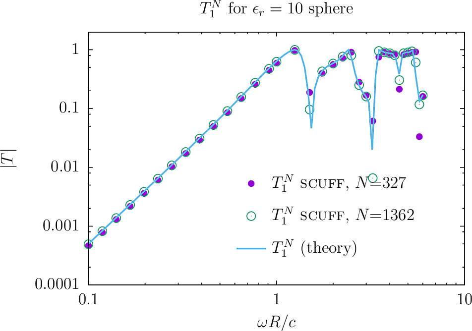
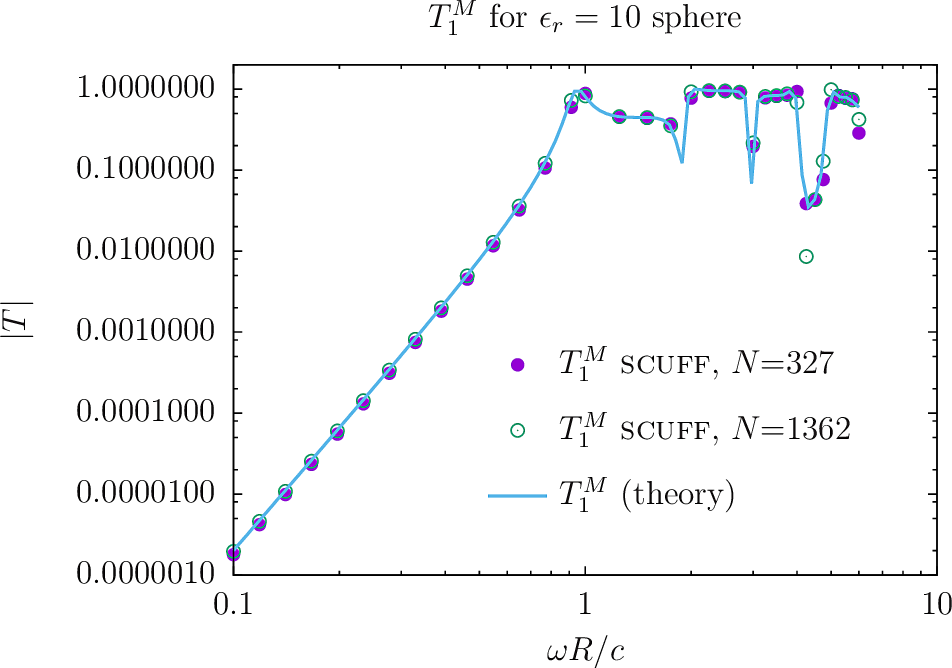
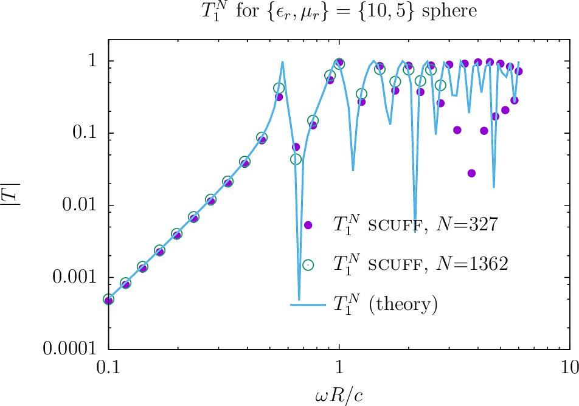
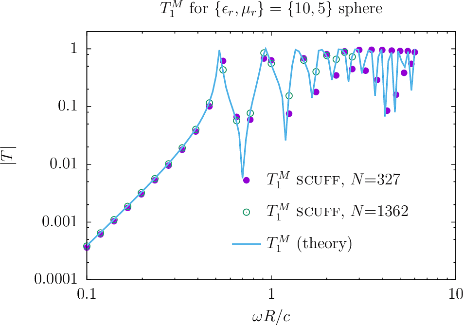

<h1>Computing T-Matrices of arbitrary objects with <span class=SC>scuff-tmatrix</span> </h1>

The well-known [*T-matrix method*](http://en.wikipedia.org/wiki/T-matrix_method) is a widely used
technique for solving problems involving electromagnetic scattering from
compact objects. In this method, the scattering properties of a compact
body are encapsulated in its *T-matrix*, whose entries give the
amplitudes of the *outgoing* spherical waves that arise from irradiating
the object with a single *regular* spherical wave.

<span class="SC">scuff-tmatrix</span> is a specialized tool within
the <span class="SC">scuff-em</span> code suite for computing the
*T*-matrix of arbitrarily-shaped objects with arbitrary
frequency-dependent material properties.

To compute the *T-*matrix of an object (or a collection of objects)
using <span class="SC">scuff-tmatrix,</span> you will

1.  create a [geometry file](../../reference/scuffEMGeometries.shtml)
    describing the shapes and material properties of the scattering
    objects in your geometry;

2.  run <span class="SC">scuff-tmatrix</span> with command-line
    options specifying the geometry, the maximum spherical-wave
    index $\ell^{\text{max}}$ of the
    spherical waves to consider (which determines the dimension of the 
    computed *T-*matrix), and the frequency range over which to run computations.

You will get back

1.  a text file listing the *T-*matrix elements $T_{\alpha\beta}(\omega)$,
    at all frequencies $\omega$ you requested,
    for all pairs of vector-spherical-wave indices
    $\alpha=\{\ell_\alpha,m_\alpha,P_\alpha\}, \beta=\{\ell_\beta,m_\beta,P_\beta\}$
    satisfying 
    $$ 1\le \ell \le \ell^{\text{max}}, 
       \quad 
       -\ell \le m \le +\ell,
       \quad 
       P\in \{M,N\}
    $$

2.  optionally, a binary `.HDF5` file containing the *T-*matrix data
    together with simple scripts for importing the data into 
    <span class="SC">julia.</span>

[TOC]

<a name="Options"></a>
## 1. <span class="SC">scuff-tmatrix</span> Command-Line Options

The following table summarizes all command-line options currently
available in <span class="SC">scuff-tmatrix.</span>

As is true for all programs in the <span
class="SC">scuff-em</span> suite, command-line options may be
specified in a text file catted to standard input; see
[here](../GeneralReference#CommandLineOptionsByFile)
for an example of how this works.

#### Options controlling the scattering geometry

```
--geometry MyGeometry.scuffgeo
```

Specifies the [geometry file](../../reference/Geometries) describing the
scattering geometry. This option is always mandatory.

*Options specifying the frequencies considered*

```
--Omega xx 

--OmegaFile MyFile
```

`--Omega` specifies an angular frequency at which to run computations, in units of $\omega_0 \equiv 3\times 10^{14} $ rad/sec ($=c/1 \mu$m).

The value specified for `--Omega` may be a [complex number.](../GeneralReference#Complex)

You may request computations at more than one frequency by using the
`--Omega` option more than once, i.e. you may say

``` {.listing}
--Omega 1e-2 --Omega 1e-1 --Omega 1 --Omega 10
           
```

However, for more than a few frequencies it is more convenient to use
the `--OmegaFile` option, which specifies a file containing an 
entire list of `--Omega` values, one per line; blank lines and comments (lines beginning with `#`) are skipped.


#### Option describing the range of spherical-wave indices

```{.listing}
--lMax 3
```

Request calculation of *T-*matrix entries with spherical wave indices up to and including $\ell=\ell^{\text{max}}$
(and all $m$-values and polarizations). As described 
[below](#SphericalWaveOrder), for a maximum $\ell$-value of $\ell^\text{max}$
the $T$-matrix has dimension $D\times D,$ where $D=2(\ell^{\text{max}}+1)^2 - 2$.

If you do not specify this option, the default value is `lMax=3`.

*Options controlling output files*

```
--FileBase MyFileBase
```

Sets the base file name for output files. *T*-matrix
data in text format are written to `FileBase.TMatrix.`
*T*-matrix data in binary (HDF5) format are written
to `FileBase_wXXXX.HDF5` where `XXXX` denotes the 
angular frequency.

If not specified,
`--FileBase` defaults to the base filename of the `.scuffgeo`
file. 

```
--WriteHDF5Files 
```

This boolean flag requests that binary *T*-matrix data be written
to HDF5 files.
A separate HDF5 file is created for each frequency,
with file name `FileBase_wXXXX.HDF5` where `XXXX` denotes
the angular frequency. T matrix data are written
in the form of a real-valued matrix (data set) named `T`
with dimension $D\times 2D$;
for $d=0,1,\cdots,D-1,$ columns $2d$ and $2d+1$ give the
real and imaginary parts of the $T$-matrix entry for 
column $d$. 
Here $D=2(\ell^{\text{max}}+1)^2 - 2$ is 
the total number of vector spherical waves with
$1\le \ell \le \ell^{\text{max}}.$
(T-matrix rows and columns
are indexed as shown in [this table](#Table).)

Note that, in contrast to text-based output, binary data output is
disabled by default; you must specify this option to enable 
binary data output.

<a name="OutputFiles"></a>
## 2. <span class="SC">scuff-tmatrix</span> Output Files

#### 1. *T-*matrix data in text form

<span class="SC">scuff-tmatrix</span> always writes *T-*matrix
data to a text-based output file named `FileBase.TMatrix,`
where `FileBase` is the value you gave for the `--FileBase`
command-line parameter. (If you didn't set this option,
`FileBase` defaults to `MyGeometry` where `MyGeometry.scuffgeo` 
was the name of the file you specified with the `--geometry` 
option.)

Each line of the text-based output file contains a single *T-*matrix
element at a single frequency. The format of each line is this:

  -----------------------------------------------------
  *Omega  A La Ma Pa   B Lb Mb Pb    real(T)   imag (T)*
  -----------------------------------------------------

The tuple`(A,La,Ma,Pa)` labels the spherical wave that constitutes the
**row index** for the *T-*matrix entry.
(Here `(La,Ma)`=$(\ell_\alpha,m_\alpha)$ are the usual spherical-wave
indices, `Pa`=$P_\alpha \in[0,1]$ is a polarization
index (0 or 1 for $\mathbf{M}$ and $\mathbf{N}$-type 
vector spherical waves respectively) and `A`=$\alpha$
is an integer in the range $[0,D-1]$ that uniquely
indexes the spherical wave. (See the [table](#Table) below).

The tuple`(B,Lb,Mb,Pb)` labels the spherical wave that constitutes the
**column index** for the *T-*matrix entry.

The final two entries on the line are the real and imaginary parts of
the *T-*matrix entry for the given pair of spherical waves at the given
frequency.

Physically, the *T-*matrix element with row index $\alpha$ and column
index $\beta$ is the amplitude of the outgoing spherical wave with
indices $\{\ell,m,P\}_\alpha$ that results from illuminating your
object with a regular spherical wave with indices
$\{\ell,m,P\}_\beta$.

See below for a simple shell script you can use to extract a particular
*T-*matrix entry vs. frequency from the `.TMatrix` file.

Also see below for a [julia](http://julialang.org){.SC} code that
you can use to import T-matrix data into a
[julia](http://julialang.org){.SC} session.

#### 2. *T-*matrix data in binary form

If you specify the `--WriteHDF5Files` command-line argument, then 
*T-*matrix data will be written in binary `HDF5` format to 
files named `FileBase_wXXXX.HDF5` where `XXXX` stands for 
the angular frequency $\omega$.

<a name="#SphericalWaveOrder"></a>
##### Ordering and indexing of spherical waves

For a fixed single value of $\ell\ge 1$ there are
$=2(2\ell+1)$ spherical waves: 
$(2\ell+1)$ pairs of spherical-wave indices $(\ell,m)$ 
times 2 polarizations (\mathbf{M},\mathbf{N}). The total number
of distinct spherical waves $(\ell,m,P)$
with $1\le \ell \le \ell^{\text{max}}$
is $D=2(\ell^{\text{max}}+1)^2 - 2$.
This is the dimension of the $T$ matrix computed at each
frequency.
(Note that I exclude $\ell=0$ waves from my indexing
scheme entirely.)

The rows and columns of the $T$-matrix are indexed
by integers $(\alpha,\beta)$ running from $0$ to $D-1$.
Spherical waves are ordered and indexed as follows:

<a name="Table"></a>
$$\begin{array}{|c|c|}\hline
  \alpha & (\ell,m,P) \\\hline
  0      & (1,-1,0)   \\\hline
  1      & (1,-1,1)   \\\hline
  2      & (1, 0,0)   \\\hline
  3      & (1, 0,1)   \\\hline
  4      & (1, 1,0)   \\\hline
  5      & (1, 1,1)   \\\hline
  6      & (2,-2,0)   \\\hline
 \vdots  & \vdots     \\\hline
  15     & (2,+2,1)   \\\hline
  16     & (3,-3,0)   \\\hline
 \vdots  & \vdots     \\\hline
   \end{array}
$$
The integer index $\alpha$ for a given triple
$(\ell, m, P)$ may be computed 
according to
$$ \alpha = 2\Big[\ell(\ell+1) + m - 1\Big] + P. $$

<a name="Examples"></a>
## 3. <span class="SC">scuff-tmatrix</span> Examples

Here are some examples of calculations you can do with <span
class="SC">scuff-tmatrix</span>. Input files and command-line
runscripts for all these examples are included in the
`share/scuff-em/examples` subdirectory of the <span
class="SC">scuff-em</span> installation.

### 4a. Dielectric and magnetic spheres

We start with the canonical textbook stalwart of scattering from a
homogeneous sphere of uniform isotropic relative permittivity $\epsilon_r$
and relative permeability $\mu_r.$

#### Analytical expressions for T-matrix elements

This is an example (indeed, the only example) of a
dielectric object whose *T-*matrix may be computed analytically, making
it a useful benchmark for our numerical computation;
the $T$-matrix is diagonal and independent of the $m$ spherical-wave
index, with $\ell$-dependent elements

$$ T_\ell^M = 
 -\frac{ \mu_r j_\ell(na)\overline{j_\ell}(a) - j_\ell(a)\overline{j_\ell}(na) }
       { \mu_r j_\ell(na)\overline{h_\ell}(a) - h_\ell(a)\overline{j_\ell}(na) }
$$
$$
   T_\ell^N = 
 -\frac{ \epsilon j_\ell(na) \overline{j_\ell}(a) - j_\ell(a)\overline{j_\ell}(na) }
       { \epsilon j_\ell(na)\overline{h_\ell}(a) - h_\ell(a)\overline{j_\ell}(na) }
$$
where $j_\ell$, $h_\ell$ are the usual spherical Bessel and Hankel functions
and 
$$ a=\frac{\omega R}{c}, \qquad n=\sqrt{\epsilon_r \mu_r},
   \quad \overline{f(x)} \equiv f(x) + x\frac{d}{dx}f(x).
$$

#### Geometry and mesh files

The first step is to create meshed surfaces representing
spheres discretized with various resolutions, then write
[<span class=SC>scuff-em</span> geometry files][scuffGeometries]
describing spheres of various material properties.
This process is described in detail
[here.](../../examples/MieScattering/MieScattering.md)
In this case we will use two <span class=SC>gmsh</span>
mesh files for a sphere of radius $R=1$:

+ [`Sphere_327.msh`](mshFiles/Sphere_327.msh), a moderate-resolution mesh with 327 internal triangle edges, and

+ [`Sphere_1362.msh`](mshFiles/Sphere_1362.msh), a finer mesh with 1362 internal triangle edges.

For each meshing resolution I will create 3 `.scuffgeo` files
describing spheres of different materials:

+ perfect metal (PEC),

+ homogeneous dielectric with $\epsilon_r=10$, and

+ homogeneous dielectric/magnetic with $\epsilon_r=10, \mu_r=5$.

**[`PECSphere_327.scuffgeo:`](scuffgeoFiles/PECSphere_327.scuffgeo)**

``` {.listing}
OBJECT Sphere
        MESHFILE Sphere_327.msh
ENDOBJECT
```

**[`E10Sphere_327.scuffgeo:`](scuffgeoFiles/E10Sphere_327.scuffgeo)**

``` {.listing}
OBJECT Sphere
        MESHFILE Sphere_327.msh
        MATERIAL CONST_EPS_10
ENDOBJECT
```

**[`E10M5Sphere_327.scuffgeo:`](scuffgeoFiles/E10M5Sphere_327.scuffgeo)**

``` {.listing}
OBJECT Sphere
        MESHFILE Sphere_327.msh
        MATERIAL CONST_EPS_10_MU_5
ENDOBJECT
```

#### Frequency list

We create a simple file called
[`OmegaFile`](OmegaFile) containing a
list of angular frequencies (in units of $3\cdot 10^{14}$ rad/sec)
at which to compute *T-*matrices:

``` {.listing}
0.10000000
0.11853758
....
6.00000000
```

#### Run <span class=SC>scuff-tmatrix</span>

And now we launch <span class="codename">scuff-tmatrix: </span>

``` {.bash}
% scuff-tmatrix --geometry E10Sphere_327.scuffgeo --omegafile OmegaFile --lmax 3
    
```

This produces the file `E10Sphere_327.TMatrix`, which contains one
*T-*matrix entry per line, with a file header at the top to 
remind you which is which:

``` {.listing}
## scuff-tmatrix run on hikari (11/06/17::01:34:31)
## columns:
## 1 omega
## 2,3,4,5 (alpha, {L,M,P}_alpha)   (T-matrix row index)
## 6,7,8,9 ( beta, {L,M,P}_beta)    (T-matrix columnindex)
## 10, 11  real, imag T_{alpha, beta}
0.1  0 1 -1 +0   0 1 -1 +0  -1.34273817e-07 +3.62883443e-04
0.1  0 1 -1 +0   1 1 -1 +1  +1.13651828e-09 -1.05703395e-06
...
...
...
3.25  2 1 +0 0   9 2 -1 1  +8.56628506e-05 +2.48397970e-04
...
...
...
```

As an example, the lowest line above is interpreted as follows:
At angular frequency $\omega=3.25 \times 3\cdot 10^{14}$ rad/sec,
for the spherical-wave pair $(\alpha,\beta)=(2,9)$
[where $\alpha$ is a $\mathbf{M}$-type wave with $(\ell,m)=(1,0)$
and $\beta$ is an $\mathbf{N}$-type wave with $(\ell,m)=(2,-1)$,
the $T$-matrix element is 
$$T_{2,9}(3.25) = 8.5 \times 10^{-5} + 2.48\times 10^{-4} i.$$

To assess the impact of meshing fineness, let's re-run the example with
a finer mesh. We will use the sphere mesh with 1362 interior edges:

``` {.listing}
% scuff-tmatrix --geometry E10Sphere_1362.scuffgeo --omegafile OmegaValues.dat
```
This produces the file `E10Sphere_1362.TMatrix`, with file format
similar to the above.

Here are plots of $T_1^M(\omega)$ and $T_1^N(\omega)$,
for both non-magnetic and magnetic spheres,
as computed **(1)** by <span class=SC>scuff-tmatrix</span>, 
with both coarse and finer meshes, **(2)** using the exact analytical
formulas above. (Here is the [<span class=SC>gnuplot</span> script](PlotTMatrix.gp)
I used to generate the plots.)









<a name="Julia"></a>
##4. Reading T-Matrix data into <span class="SC">julia</span>

[scuffGeometries]:		../../reference/Geometries.md
