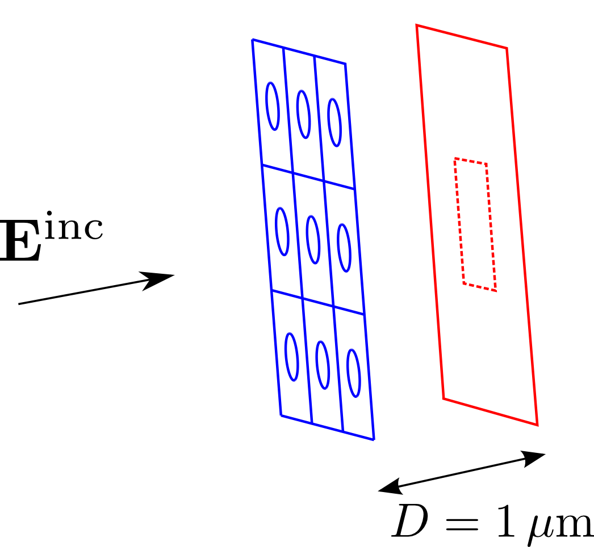
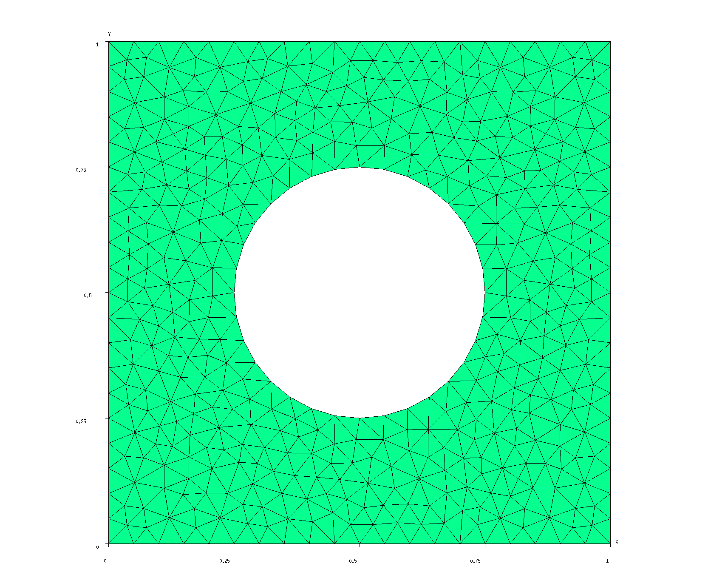
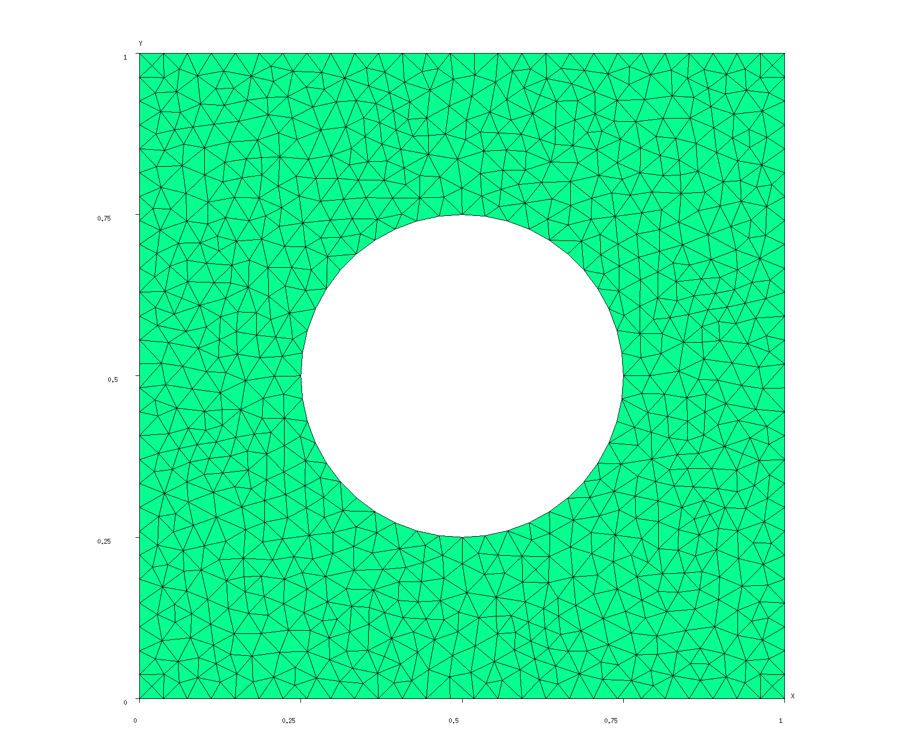
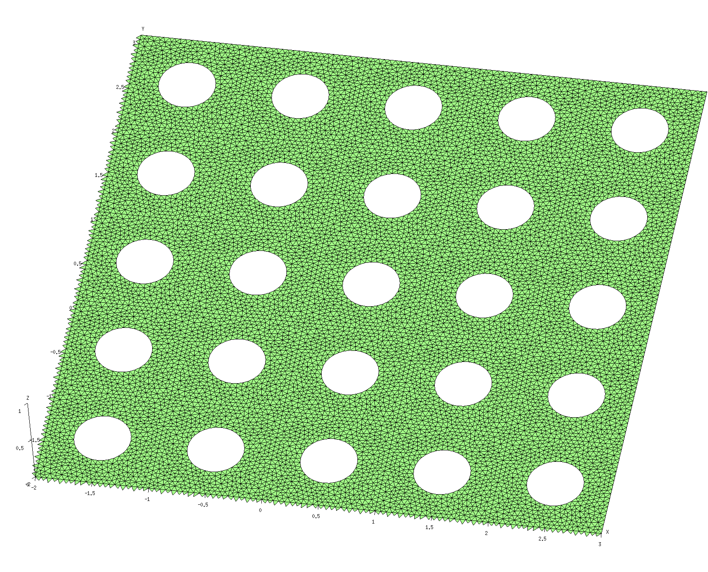
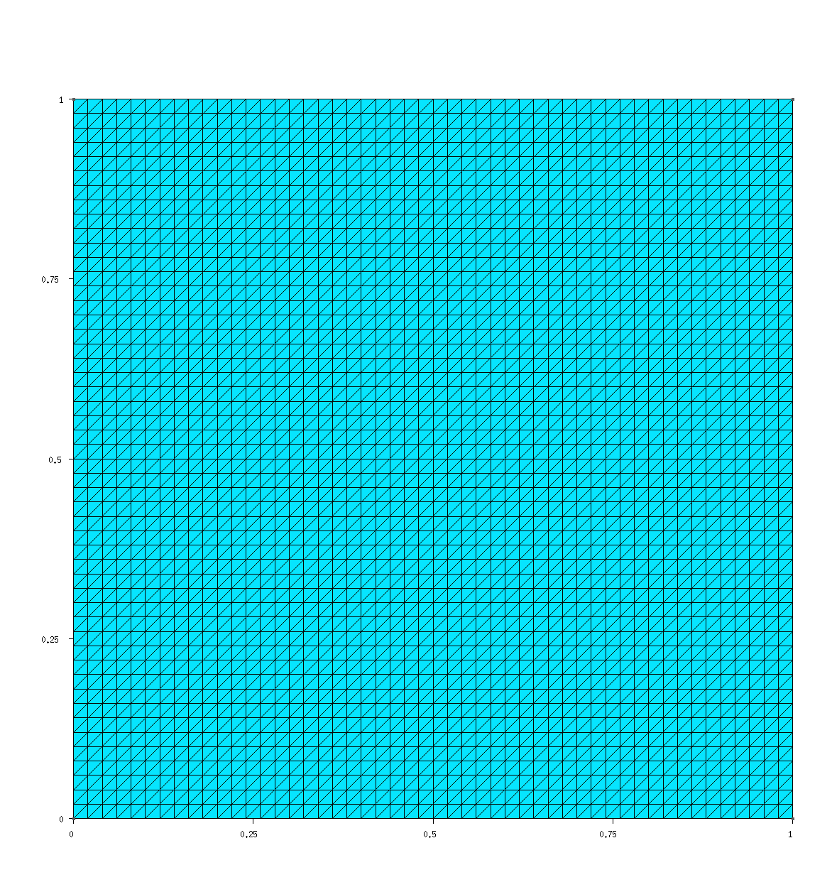

# Diffraction patterns for discs, disc arrays, and hole arrays in metal screens

In this example, we shine a laser beam (or a plane wave) on an 
(infinite-area) metal screen perforated by a square-lattice
array of circular holes, and produce images of the diffraction 
patterns as observed on a visualization surface located behind the 
perforated screen. Here's a schematic depiction of the configuration:



The files for this example may be found in the
`share/scuff-em/examples/DiffractionPatterns` subdirectory
of your [[scuff-em]] installation.

--------------------------------------------------
## [[gmsh]] geometry file and surface mesh for the screen unit cell

The [[gmsh]] geometry file [`HoleyScreenUnitCell.geo`](HoleyScreenUnitCell.geo)
describes an (infinitely thin) square metallic screen, 
of dimensions 1&mu;m &times; 1&mu;m, with a hole of radius 0.25 &mu;m
centered at the center of the square. I produce coarser and 
finer surface meshes for this geometry by saying

````python
% gmsh -2 -clscale 1 HoleyScreenUnitCell.geo
% RenameMesh HoleyScreenUnitCell.msh
% gmsh -2 -clscale 0.75 HoleyScreenUnitCell.geo
% RenameMesh HoleyScreenUnitCell.msh
````

(where [`RenameMesh`](../SiO2Spheres/RenameMesh) is a simple 
`bash` script that uses [[scuff-analyze]] to count the number 
of interior edges in a surface mesh and rename the mesh file 
accordingly.)
This produces the files `HoleyScrenUnitCell_1228.msh`
and `HoleyScreenUnitCell_2318.msh,`
which you can visualize by opening in [[gmsh]]:

````python
% gmsh HoleyScreenUnitCell_1228.msh
% gmsh HoleyScreenUnitCell_2318.msh
````





Note that finer meshing resolution is obtained by specifying
the `-clscale ` argument to [[gmsh]] (it stands
for "characteristic length scale"), which specifies an overall
scaling factor for all triangle edges.

--------------------------------------------------
## [[scuff-em]] geometry files

The [[scuff-em]] geometry files
[`HoleyScreen_1228.scuffgeo`](HoleyScreen_1228.scuffgeo)
and
[`HoleyScreen_2318.scuffgeo`](HoleyScreen_2318.scuffgeo)
describe infinite square lattices with unit
cells defined by the unit-cell meshes we created
above. The *N*=1228 guy looks like this:

````bash
LATTICE
        VECTOR 1 0
        VECTOR 0 1
ENDLATTICE    

OBJECT HoleyScreen
        MESHFILE HoleyScreenUnitCell_1228.msh
ENDOBJECT
````

Note that we don't have to specify a `MATERIAL`
for the screen, since PEC is the default.

We can use [[scuff-analyze]] to produce an image
of what the full geometry looks like, including
the lattice repetitions:

````bash
% scuff-analyze --geometry HoleyScreen_1228.scuffgeo --WriteGMSHFiles --Neighbors 2
````

This produces the file `HoleyScreen_1228.pp`, which you 
can view by opening it in [[gmsh]]:

````bash
% gmsh HoleyScreen_1228.pp
````



--------------------------------------------------
## Field visualization mesh

The next step is to create a meshed representation of the
surface on which we will visualize the diffraction patterns.
Here's a [[gmsh]] file called
[`FVMesh.geo`](FVMesh.geo) that describes a square of
side length 1 micron, parallel to the *xy* plane and
located at a height of *z*=1 micron, thus corresponding
to the region enclosed by the dotted line in the schematic
figure above. ("FVMesh" stands for "field-visualization
mesh.") This `.geo` file contains a user-specifiable
parameter `N` that sets the number of triangle edges per
unit length in the mesh representation; I would
like to set this number to 50, so I say

````bash
% gmsh -2 -setnumber N 50 FVMesh.geo -o FVMesh.msh
% RenameMesh FVMesh.msh
````

This produces the file `FVMesh_7400.msh`:



--------------------------------------------------
## Running [[scuff-scatter]]

Now all that's left is to run the calculation.
Put the following content into a little text
file called `scuff-scatter.args` and pipe it into
the standard input of [[scuff-scatter]]:

````bash
geometry        HoleyScreen_1228.scuffgeo
FVMesh          FVMesh_7400.msh
Lambda          0.3751
Lambda          0.2501
Lambda          0.1251
pwDirection     0 0 1
pwPolarization  1 0 0 
````

Note that I have chosen wavelengths of 
$\lambda=\{1.5,1.0,0.5\}R$ where $R=0.25\,\mu$m is 
the hole radius. In each case I have shifted the wavelength by a 
tiny amount away from being commensurate with the lattice period
to avoid numerical instabilities associated with Wood anomalies.

````bash
 % scuff-scatter < scuff-scatter.args
 % scuff-scatter --geometry HoleyScreen_2318.scuffgeo < scuff-scatter.args
````

In the second command line here, the command-line specified 
geometry overrides the geometry in the `.args` file. 

This produces the files `HoleyScreen_1228.FVMesh_7400.pp`
and `HoleyScreen_2318.FVMesh_7400.pp`, which can be
visualized by opening them in [[gmsh]].

<table border="1" cellpadding="1" align="center">
 <tr>
  <td> </td>
  <td> </td>
 </tr>
 <tr>
  <td> &lambda;=1.5 R (coarse mesh)
  <td> &lambda;=1.5 R (fine mesh)
 </tr>
 <tr>
  <td> </td>
  <td> </td>
 </tr>
 <tr>
  <td> &lambda;=1.0 R (coarse mesh)
  <td> &lambda;=1.0 R (fine mesh)
 </tr>
 <tr>
  <td> </td>
  <td> </td>
 </tr>
 <tr>
  <td> &lambda;=0.5 R (coarse mesh)
  <td> &lambda;=0.5 R (fine mesh)
 </tr>
</table>

--------------------------------------------------

[scuff-neq]:              ../../applications/scuff-neq/scuff-neq.md
[Transformations]:        ../../reference/Transformations
[KruegerPaper]:           http://dx.doi.org/10.1103/PhysRevB.86.115423
