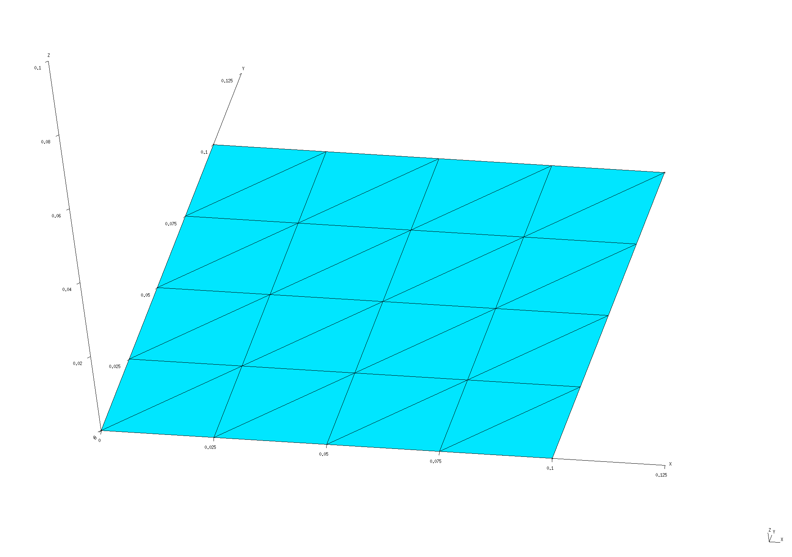
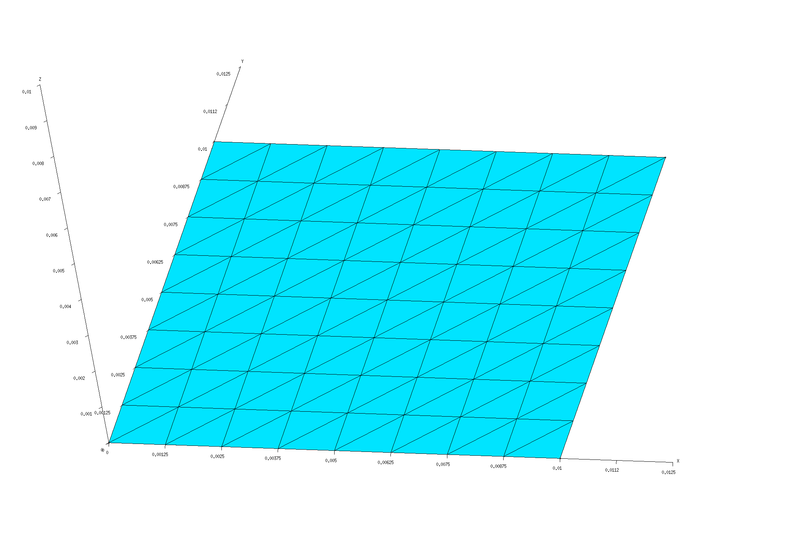

<h1>Dyadic Green's Functions and LDOS above a material half-space</h1>

In this example, we exploit [[scuff-em]]'s
[support for 2D periodic geometries][ExtendedGeometries]
by using [<span class="SC">scuff-ldos</span>][scuff-ldos]
to compute dyadic Green's functions (DGFs) and 
electromagnetic local densities of states (LDOS) 
at evaluation points lying above an
infinite planar dielectric interface.

Because this geometry happens to be amenable to an analytical
treatment, we will also *check* the numerical results of
[[scuff-em]] against the results of analytical calculations of
the LDOS.

The files for this example may be found in the
`share/scuff-em/examples/HalfSpaceLDOS` subdirectory
of your [[scuff-em]] installation.

Also, the computational procedure implemented by [scuff-ldos]
is described in this memo:
[Computation of Green's Functions and LDOS in <span class="SC">scuff-em</span>][LDOSMemo].

### Review: What we are computing and why we need Brillouin-zone integration

The scattering dyadic Green's function
$\boldsymbol{\mathcal G}^{\text{\tiny{EE}}}
(\omega; \mathbf{x}_{\hbox{\tiny{D}}}, \mathbf{x}_{\hbox{\tiny{S}}})$
is a $3\times 3$ matrix whose $i,j$ entry gives the 
$i$-component of the scattered electric field at
$\mathbf{x}_{\hbox{\tiny{D}}}$
due to a 
$j$-directed point electric dipole source at
$\mathbf{x}_{\hbox{\tiny{S}}}$, all quantities having
time dependence $\sim e^{-i\omega t}$. 
(We could also consider the magnetic Green's function
$\boldsymbol{\mathcal G}^{\text{\hbox{MM}}},
which describes the scattered magnetic fields
arising from a point magnetic dipole excitation.)
The subscripts "D" and "S" label the "destination" and 
"source" points; if the destination and source points
coincide $(\mathbf{x}_{\hbox{\tiny{D}}}=\mathbf{x}_{\hbox{\tiny{S}}})$
then we are talking about *one-point DGFs*; otherwise
we have *two-point DGFs.*
The electric and magnetic local densities of states
$\rho^\tiny{E,M}(\omega; \mathbf{x})$ are proportional to 
the traces of the imaginary parts of the one-point DGFs:
$$ 
   \texttt{LDOS}(\omega; \mathbf{x})
   \equiv 
   \frac{\rho(\omega; \mathbf{x})}{\rho_0(\omega)}
   \equiv 
   \frac{\pi}{k_0^2}\text{Tr }\text{Im }
   \Big[ \boldsymbol{\mc G}\supt{E}(\omega; \mathbf x, \mathbf x)
        +\boldsymbol{\mc G}\supt{M}(\omega; \mathbf x, \mathbf x)
   \Big]
$$
where $\rho_(\omega)=\omega^3/(\pi c^4)$ is the vacuum LDOS.

The electric and magnetic DGFs for a given source point
thus collectively describe the results of 6 scattering
problems (with incident fields produced by electric and
magnetic dipoles oriented in each of the 3 cartesian
directions), and---for *compact* geometries---can
be computed in <span class=SC>scuff-em</span> simply by
assembling 6 right-hand-side vectors, solving the 
BEM system for the corresponding surface currents, and 
computing the scattered fields at all desired destination 
points.

However, the situation is more complicated for
periodic geometries. To compute the LDOS at a point
in the vicinity of (say) an infinitely extended
(periodically replicated) surface, we need to solve a
scattering problem in which the incident field is not 
Bloch-periodic, but is instead the field of a localized 
point source, which certainly does not obey
Bloch-periodic boundary conditions.
However, when working with periodic geometries in [[scuff-em]],
each individual scattering problem has the property
that *everything* in the problem---including the incident
field---must be Bloch-periodic with a specific Bloch vector
$\bf k_{\hbox{B}}$. Thus, when we do a single scattering
problem with a point-source incident field in a 
periodic [[scuff-em]] geometry at Bloch vector
$\bf k_{\hbox{B}}$, the incident field is really
the field of an infinite phased *array* of point
sources at $\mathbf{x}_{\hbox{\text{\tiny{S}}}}$
and its (infinitely many) lattice images,
with the source in lattice cell $\bf L$ phased
by the Bloch factor $e^{i\bf k_B\cdot \bf L}.$
Evaluating the scattered fields at the destination point
then yields the \textit{periodic} DGF
$\overline{\boldsymbol{\mathcal G}(\mathbf{x}_{\hbox{\tiny{D}}}, \mathbf{x}_{\hbox{\tiny{s}}}; \omega, \mathbf k_{\hbox{\tiny{B}}})$,
describing the scattered fields at 
$\mathbf{x}_{\hbox{\tiny{D}}}$ due to a $k_{\hbox{\tiny{B}}}$-phased arry of point sources at $\mathbf{x}_{\hbox{\tiny{s}}}$ and its 
lattice images.
This is not the incident field we want to consider
when computing LDOS.

Of course, it is still possible to get what we want---the
response of our geometry to a non-periodic point source---but
it requires summing the results of many scattering problems,
with different phase factors for the point-souce array,
in such a way as to cancel out
the effects of all image sources in all lattice cells except the 
particular cell we want. More specifically, the non-periodic
DGF is related to the periodic DGF by integration over the Brillouin
zone:

$$ \boldsymbol{\mathcal G}(\mathbf{x}_{\hbox{\tiny{D}}}, \mathbf{x}_{\hbox{\tiny{s}}}; \omega)
 =\frac{1}{\mc V\subt{BZ}} 
   \int\subt{BZ} 
   \overline{\boldsymbol{\mathcal G}(\mathbf{x}_{\hbox{\tiny{D}}}, \mathbf{x}_{\hbox{\tiny{s}}}; \omega, \mathbf k_{\hbox{\tiny{B}}})
   \, d\mathbf{k}_{\hbox{\tiny{B}}}.
$$
or, approximately evaluating the integral by numerical cubature,
$$ \approx 
   \frac{1}{\mc V\subt{BZ}} 
   \sum w_m
   \overline{\boldsymbol{\mathcal G}(\mathbf{x}_{\hbox{\tiny{D}}}, \mathbf{x}_{\hbox{\tiny{s}}}; \omega, \mathbf k_{m})
$$
where $\{\mathbf{k}_m, w_m\}$ are the points and weights in a cubature rule for integration over
the Brillouin zone.
Thus, getting the LDOS at a single point in a periodic geometry
requires summing the results of many scattering calculations at
various Bloch vectors $\bf k_B$ lying in the Brillouin zone of the reciprocal lattice.

The question of how to choose the cubature rule---that is, the set of
Bloch wavevectors $\{\mathbf{k}_{\hbox{\tiny{B}}}\}$ at which the integrand
is sampled and the weights $\{w\}$ with which the resulting values are 
combined---to yield accurate integral estimates without exorbitant computational cost is a 
tricky one, and one whose answer varies from problem to problem.
There are two ways to proceed:

+ You can design your own cubature scheme for integration over
the Brillouin zone, and simply ask [[scuff-ldos]] to give you
values of the integrand 
$\overline{\boldsymbol{\mathcal{G}(\mathbf{k}_{\hbox{\tiny{B}}}}}$
at specific Bloch vectors $\bf k_B$.
In this case you will pass the ``--OmegakBlochFile`` command-line
argument to [[scuff-ldos]].

+ Alternatively, you can use the built-in Brillouin-zone integrator
in [[scuff-ldos]] to perform the BZ integral automatically. In
this case you will probably want to set various command-line 
options to optimize the integral evaluation; this is illustrated
below and discussed in more detail on the page 
[Brillouin-zone integration in <span class="SC">scuff-em</span>](../../reference/BrillouinZoneIntegration.md).

--------------------------------------------------

# [[gmsh]] geometry file for unit-cell geometry

To compute DGFs and LDOS in a half-space geometry,
we will describe the interface between the upper (vacuum)
and lower (dielectric) regions of our geometry as the
infinite periodic replication of a unit-cell mesh 
over the sites of a 2D square lattice.
Because this particular geometry has infinite translational
symmetry, we are free to choose the lattice constant 
$L=L_x=L_y$ however we like; here we will consider 
the two values $L=10$ nm and $L=100$ nm.

The [[gmsh]] geometry file [`Square_L_N.geo`](Square_L_N.geo)
describes a square with user-adjustable parameters 
`L` and `N` that may be configured using the `-setnumber`
option on the [[gmsh]] command line to define the square
side length and the number of triangle edges per side length 
(the meshing fineness). To produce unit-cell meshes for
the two desired lattice constants, I go like this:

````bash
% gmsh -2 -setnumber L 0.1 -setnumber N 4 Square_L_N.geo -o Square_L0P1.msh 
% RenameMesh Square_L0P1.msh

% gmsh -2 -setnumber L 0.01 -setnumber N 4 Square_L_N.geo -o Square_L0P01.msh 
% RenameMesh Square_L0P01.msh
````
(Here [`RenameMesh`][RenameMesh] is a simple `bash` script
that uses [[scuff-analyze]] to count the number of interior
edges in a surface mesh and rename the mesh file accordingly.)
These commands produce the files 
`Square_L0P1_40.msh` and `Square_L0P01_40.msh.` I also repeat the process with `-setnumber N 8` to yield finer meshes (with 176 instead
of 40 interior edges).
These meshes may be visualized in [[gmsh]] by saying e.g.

````bash
% gmsh Square_L0P1.40.msh
% gmsh Square_L0P01.176.msh
````




Note the following:

 * For 2D periodic geometries in [[scuff-em]], the 
   lattice vectors must lie in the $xy$ plane.

 * For surfaces that straddle the unit-cell boundaries
   (as is the case here), each triangle edge that lies
   on any edge of the unit cell must have an identical
   image edge on the opposite side of the unit cell.
   An easy way to achieve this is to use *extrusions*
   in [[gmsh]], as in the `.geo` file above.

 * In this case the unit cell dimensions are 
   $L_x\times L_y$ where $L_x=L_y=1\, \mu\text{m}$.
   (More generally, $L_x$ and $L_y$ may be any arbitrary
   nonzero values, and they need not equal each other.)

 * Among the various possible ways to discretize a square
intro triangles, I have chosen one that preserves as 
much symmetry as possible---specifically, the mesh 
is symmetric under the transformations
$x \leftrightarrow -x$, $y \leftrightarrow -y$, and
$x \leftrightarrow y$. This is important for exploiting
symmetries to reduce the cost of Brillouin-zone integration
(see below).

The `.msh` files needed to run the calculations in this
tutorial may be found in the `mshFiles` subfolder
of the `HalfSpaceLDOS` example distributed with
[[scuff-em]].

--------------------------------------------------
# [[scuff-em]] geometry files

For each unit-cell mesh I create
[<span class="SC">scuff-em</span> geometry files][Geometries]
describing three material geometries:

+ an infinite-area perfectly electrically conducting (PEC) plate at height $z=0$;

+ an infinite lossless dielectric ($\epsilon \equiv 10$) filling
  space for $z<0$, with vacuum for $z>0$;

+ same as previous, but now with lossy metal (aluminum) instead
  of lossless dielectric.

The resulting `.scuffgeo` files may be found in the 
`.scuffgeoFiles` subfolder of the `HalfSpaceLDOS`
example directory.
For example, the PEC-plate geometry at the coarser resolution
with the longer lattice constant is
[`PECPlate_L0P1_40.scuffgeo`](scuffgeoFiles/PECPlate_L0P1_40.scuffgeo),
while the aluminum half-space geometry at the finer resolution
with the shorter lattice constant is
[`AlHalfSpace_L0P01_176.scuffgeo`](scuffgeoFiles/AlHalfSpace_L0P01_176.scuffgeo).
The latter file looks like this:
````bash
# this comes from Phys Rev B **68** 245405
MATERIAL ALUMINUM
    wp = 1.747e16; 
    gamma = 7.596e13;
    Eps(w) = 1 - wp^2 / (w * (w + i*gamma));
ENDMATERIAL

LATTICE
	VECTOR 0.01 0.00
	VECTOR 0.00 0.01
ENDLATTICE

REGION UpperHalfSpace MATERIAL Vacuum
REGION Exterior       MATERIAL Aluminum

SURFACE Plate
	MESHFILE Square_176.msh
	REGIONS Exterior UpperHalfSpace
ENDSURFACE
````

--------------------------------------------------
# List of evaluation points

We'll compute one-point DGFs and LDOS at four points,
located at distances of 1, 10, 100, and 1000 nm above
the surface on the $z$-axis. Thus our `EPFile` looks like
this:

````
0.0 0.0 0.001
0.0 0.0 0.010
0.0 0.0 0.100
0.0 0.0 1.000
````
--------------------------------------------------
## Studying the integrand to select the optimal cubature rule

Ultimately we will want to launch a full
Brillouin-zone-integrated calculation to get
the total LDOS at our desired evaluation points 
and frequencies. However, before doing this we
should acquire some insight into the behavior of
the integrand so that we can make intelligent
choices for the various 
[options controlling Brillouin-zone integration][BZI].

### Checking Brillouin-zone symmetry

A first thing to check is the *symmetry* of the
integrand within the Brillouin zone (BZ).
As discussed [here][BZI], the built-in cubature
routines for 2D BZ integration in [[scuff-em]]
can exploit 2, 4, or 8-fold rotational symmetry.
In this case, because

+ **(1)** the underlying (real-space) geometry is symmetric
under $x\leftrightarrow -x$, $y\leftrightarrow -y$,
and $x\leftrightarrow y$,

+ **(2)** we have chosen a mesh discretization that 
preserves these symmetries, and

+**(3)** we are computing a one-point DGF, 

we expect the BZ integrand 
$\overline{\boldsymbol{\mathcal{G}}}(k_x,k_y)$
to have 8-fold rotational symmetry, and thus
we should be able to restrict the domain of the 
BZ integration to just the *irreducible* Brillouin
zone (a triangular wedge having 1/8 the total area
of the BZ, as shown [here][BZI]) and multiply by 8 
to get the full BZ integral.

[Geometries]:          ../../reference/Geometries.md
[ExtendedGeometries]:  ../../reference/Geometries.md#Extended
[RenameMesh]:          ../../examples/SiO2Spheres/RenameMesh
[scuff-ldos]:          ../../applications/scuff-ldos/scuff-ldos.md
[LDOSMemo]:            ../../tex/scuff-ldos.pdf
[BZI]:                 ../../reference/BrillouinZoneIntegration.md
