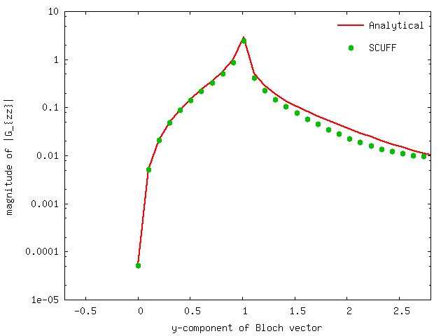

<h1>Photonic LDOS above a dielectric half-space</h1>

In this example, we exploit [[scuff-em]]'s
[support for 2D periodic geometries][ExtendedGeometries]
by using [<span class="SC">scuff-ldos</span>][scuff-ldos]
to compute the electromagnetic local density
of states (LDOS) at evaluation points lying above an
infinite planar dielectric interface.

Because this geometry happens to be amenable to an analytical 
treatment, we will also *check* the numerical results of
[[scuff-em]] against the results of analytical calculations of
the LDOS.

The files for this example may be found in the
`share/scuff-em/examples/HalfSpaceLDOS` subdirectory
of your [[scuff-em]] installation.

--------------------------------------------------

# [[gmsh]] geometry file for unit-cell geometry 

The [[gmsh]] geometry file [`Square_N.geo`](Square_N.geo)
describes the portion of the half-space interface
that lies within the *unit cell,*
i.e. the cell that is infinitely periodically
replicated to yield the full geometry.

I call this file `Square_N.geo` to remind myself that 
it contains a parameter `N` that describes the meshing 
fineness; more specifically, `N` defines the number of 
segments per unit length. (The file also contains 
a parameter named `L` that defines the unit-cell
length in microns; here we will keep this parameter
fixed at $L$=1 micron.)

To produce a discretized surface-mesh
representation of this geometry, we run it through 
[[gmsh]], using the [[gmsh]] command-line argument
`-setnumber` to fix a value for the `N` parameter.

````bash
% gmsh -2 -setnumber N 4 Square_N.geo -o Square.msh
% RenameMesh Square.msh

% gmsh -2 -setnumber N 8 Square_N.geo -o Square.msh
% RenameMesh Square.msh
````

(Here [`RenameMesh`][RenameMesh] is a simple `bash` script
that uses [[scuff-analyze]] to count the number of interior
edges in a surface mesh and rename the mesh file accordingly.)
These commands produce the files `Square_40.msh`
and `Square_176.msh`.
These meshes may be visualized in [[gmsh]]:

````bash
% gmsh Square_40.msh
% gmsh Square_176.msh
````

Note the following:

 * For 2D periodic geometries in [[scuff-em]], the 
   lattice vectors must lie in the $xy$ plane.

 * For surfaces that straddle the unit-cell boundaries
   (as is the case here), each triangle edge that lies
   on any edge of the unit cell must have an identical
   image edge on the opposite side of the unit cell.
   An easy way to achieve this is to use *extrusions*
   in [[gmsh]], as in the `.geo` file above.

 * In this case the unit cell dimensions are 
   $L_x\times L_y$ where $L_x=L_y=1\, \mu\text{m}$.
   (More generally, $L_x$ and $L_y$ may be any arbitrary
   nonzero values, and they need not equal each other.)

--------------------------------------------------
# [[scuff-em]] geometry files

The 
[<span class="SC">scuff-em</span> geometry files][Geometries]
describing an infinite-area PEC ground plane at $z$=0
are 
[`PECPlate_40.scuffgeo`](PECPlate_40.scuffgeo)
and 
[`PECPlate_176.scuffgeo`](PECPlate_176.scuffgeo).

The 
[<span class="SC">scuff-em</span> geometry files][Geometries]
describing an infinite aluminum half-space occupying
the region $z<0$ are 
[`AlHalfSpace_40.scuffgeo`](AlHalfSpace_40.scuffgeo)
and 
[`AlHalfSpace_176.scuffgeo`](AlHalfSpace_176.scuffgeo).

--------------------------------------------------
# List of evaluation points

We'll compute the LDOS at two points, located 
a distance of 0.1 $\mu$m and 1 $\mu$m above the 
origin on the $z$ axis. The `EPFile` looks like
this:

````
0.0 0.0 0.1
0.0 0.0 1.0
````

--------------------------------------------------
# List of $(\omega, \mathbf k_B)$ points

We'll run calculations at a single frequency 
($\omega=3\times 10^{14}$ rad/sec) and at Bloch
vectors of the form $\mathbf k_B=(0,k_y)$ for 
values of $k_y$ running from $0$ to $\pi$.
Thus we create a text file called `OKBFile` that
looks like this:

````
1.0 0.0 0.00
1.0 0.0 0.10
...
1.0 0.0 3.14
````

--------------------------------------------------

# Launching the run

We will do two [[scuff-ldos]] runs, one in which
the LDOS is computed using a semi-analytical approach
(plane-wave decomposition) and another in which
the LDOS is computed using the [[scuff-em]] core
library.

````bash
  #!/bin/bash

  ARGS=""
  ARGS="${ARGS} --geometry ../${GEOM}"
  ARGS="${ARGS} --EPFile  ../EPFile"
  ARGS="${ARGS} --OmegakBlochFile ../OKBFile"
  ARGS="${ARGS} --HalfSpace Aluminum"
  scuff-ldos ${ARGS}

  ARGS=""
  ARGS="${ARGS} --geometry ../${GEOM}"
  ARGS="${ARGS} --EPFile  ../EPFile"
  ARGS="${ARGS} --OmegakBlochFile ../OKBFile"
  scuff-ldos ${ARGS}
````




[Geometries]:          ../../reference/Geometries.md
[ExtendedGeometries]:  ../../reference/Geometries.md#Extended
[RenameMesh]:          ../../examples/SiO2Spheres/RenameMesh
[scuff-ldos]:          ../../applications/scuff-ldos/scuff-ldos.md
