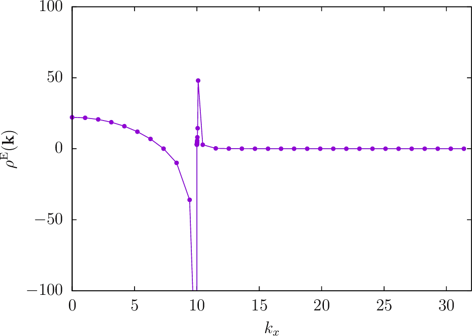
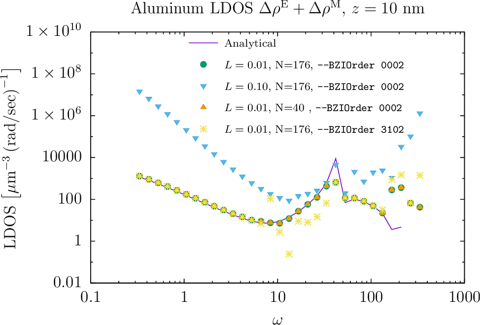

<h1>Dyadic Green's Functions and LDOS above a material half-space</h1>

In this example, we exploit [[scuff-em]]'s
[support for 2D periodic geometries][ExtendedGeometries]
by using [<span class="SC">scuff-ldos</span>][scuff-ldos]
to compute dyadic Green's functions (DGFs) and 
electromagnetic local densities of states (LDOS) 
at evaluation points lying above an
infinite planar dielectric interface.

Because this geometry happens to be amenable to an analytical
treatment, we will also *check* the numerical results of
[[scuff-em]] against the results of analytical calculations of
the LDOS.

The files for this example may be found in the
`share/scuff-em/examples/HalfSpaceLDOS` subdirectory
of your [[scuff-em]] installation.

#### Review: What we are computing and why we need Brillouin-zone integration

For the benefit of users who may be wondering why numerical Brillouin-zone
integration is needed for this calculation, this section briefly reviews
some of the theoretical background. 
(This material is discussed in more detail in the memo
[Computation of Green's Functions and LDOS in <span class="SC">scuff-em</span>][LDOSMemo]).
If you just want to get started running the calculations in [[scuff-em]], 
feel free to [skip to the next section](#GMSHFiles).

##### Green's functions and LDOS

The scattering dyadic Green's function
$\boldsymbol{\mathcal G}^{\text E}(\omega;
             \mathbf{x}_{\text D},
             \mathbf{x}_{\text S})$
of a material geometry
is a $3\times 3$ matrix whose $i,j$ entry is proportional to the
$i$-component of the scattered electric field 
at $\mathbf{x}_{\text D}$ due to a 
$j$-directed point electric dipole source at
$\mathbf{x}_{\text S}$, all quantities having
time dependence $\sim e^{-i\omega t}$. (We could also 
consider the magnetic Green's function
$\boldsymbol{\mathcal G}^{\text M}$,
which describes the scattered *magnetic* fields
arising from a point *magnetic* dipole excitation.)
The subscripts "D" and "S" label the "destination" and 
"source" points; if these coincide
$(\mathbf{x}_{\text D}=\mathbf{x}_{\text S})$,
we are talking about *one-point DGFs*; otherwise
we have *two-point DGFs.*

The one-point scattering DGFs for a material geometry contain
information on how the bodies in the geometry modify
the electromagnetic local density of states (LDOS)
in the vicinity of the body. More specifically,
the full LDOS $\rho(\mathbf{x})$ at a point $\mathbf{x}$
may be decomposed as a sum of electric and magnetic
contributions, which themselves may be further decomposed
into vacuum and scattering contributions:
$$ \begin{array}{lcl}
\rho(\omega; \mathbf{x}) &=& \rho^\text{E}(\omega; \mathbf{x}) + \rho^\text{M}(\omega; \mathbf{x})
\\[5pt]
\rho^{\text{E,M}}(\mathbf{x})
 &=&   \rho_0(\omega)
     + \Delta \rho^\text{E,M}(\omega; \mathbf{x})
\\[5pt]
\rho_0(\omega) &=&\frac{\omega^2}{\pi^2 c^3}
\\[5pt]
\Delta \rho^{\text{E,M}}(\omega; \mathbf{x})
 &=& \frac{\omega}{\pi c^2}
     \text{Tr Im }\boldsymbol{\mathcal{G}}^\text{E,M}(\omega; \mathbf{x}, \mathbf{x})
\end{array}$$

##### Computing Green's functions

The electric and magnetic DGFs for a given source point
(and any number of destination points)
collectively describe the results of 6 scattering
problems (with incident fields produced by electric and
magnetic dipoles oriented in each of the 3 cartesian
directions), and---for *compact* geometries---could
be computed in <span class=SC>scuff-em</span> simply by
assembling 6 right-hand-side vectors, solving the 
BEM system for the corresponding surface currents, and
computing the scattered fields at all desired destination
points. 

However, the situation is more complicated for
infinitely extended geometries. 
[Recall][ExtendedGeometries] that such
geometries are described in [[scuff-em]] by a
unit-cell geometry together with a basis of vectors 
for a (one- or two-dimensional) lattice $\mathcal{L}$.
By restricting our attention to scattering problems
in which the incident fields (and thus all fields and
currents) satisfies the Bloch-periodicity
condition 
$$f(\mathbf{x}+\mathbf{L})
  =
  e^{i\mathbf{k}_\text{B}\cdot \mathbf{L}}f(\mathbf{x})
  \quad\text{ for all } \quad
  \mathbf{L}\in\mathcal{L}
$$
for some Bloch wavevector $\mathbf{k}_\text{B}$,
we can get away with solving only for the surface
currents within the unit cell, the currents
everywhere else being then fixed by the Bloch periodicity.
This is the basic magic trick that allows infinite
geometries to be modeled on finite computers.

Of course, the restriction to scattering problems involving
only Bloch-periodic incident fields is in fact highly restrictive;
indeed, it excludes the particular problem we must solve
to compute DGFs and LDOS, in which the incident field emanates
from a point source at $\mathbf{x}_\text{S}$ and is certainly 
not Bloch-periodic. But here we can avail to the linearity
of Maxwell's equations and the magic of Fourier analysis.
Instead of solving a scattering problem involving the field
of a point source at $\mathbf{x}_\text{S}$, we consider
the field of an infinite phased *array* of point sources,
located at points $\{\mathbf{x}_\text{S} + \mathbf{L}\}$
with phases $e^{i\mathbf{k}_\text{B} \cdot \mathbf{L}}$,
for all $\mathbf{L}\in \mathcal{L}$. This *is* a
Bloch-periodic field, so we can take it as the incident
field in a [[scuff-em]] scattering problem, 
and the 
resulting scattered fields at $\mathbf{x}_\text{D}$
define the *Bloch-periodic scattering DGFs*
$\overline{\boldsymbol{\mathcal{G}}}(\omega; \mathbf{k}_\text{B};
\mathbf{x}_\text{D}, \mathbf{x}_\text{S}).$
To recover the non-periodic DGF $\boldsymbol{\mathcal{G}}$
from $\overline{\boldsymbol{\mathcal{G}}}$, we now
imagine solving and summing the results of
many scattering problems involving our infinite array
of point sources phased with many different Bloch vectors 
$\mathbf{k}_\text{B}$, chosen cleverly to ensure that the
contributions of the single point source at $\mathbf{x}_\text{S}$ add
constructively, while the contributions of all *other* 
point sources in the array add destructively
and cancel. The formal expression of this procedure
is a sort of inverse Fourier transform relating
$\boldsymbol{\mathcal{G}}$ to the average of
$\overline{\boldsymbol{\mathcal{G}}}(\mathbf{k}_\text{B})$ 
over the Brillouin zone (BZ) of the reciprocal lattice:
$$ \boldsymbol{\mathcal G}(\omega; \mathbf{x}_\text{D}, \mathbf{x}_\text{S})
  =\frac{1}{V_\text{BZ}}
   \int_\text{BZ}
   \overline{\boldsymbol{\mathcal G}}(\omega; \mathbf{k}_\text{B};
                           \mathbf{x}_\text{D},
                           \mathbf{x}_\text{S})
   \, d\mathbf{k}_\text{B}
   \qquad (1)
$$
or, evaluating the integral approximately by numerical cubature,
$$ \boldsymbol{\mathcal G}(\omega; \mathbf{x}_\text{D}, \mathbf{x}_\text{S})
   \approx \frac{1}{V_\text{BZ}}
   \sum_{m} w_m 
   \overline{\boldsymbol{\mathcal G}}(\omega; \mathbf{k}_{\text{B}m}; \mathbf{x}_\text{D},
                           \mathbf{x}_\text{S})
$$
where $\{\mathbf{k}_{\text{B}m}, w_m\}$ are the points and weights in a
cubature rule for integration over the Brillouin zone.
Thus, getting the LDOS at a single point in a periodic geometry
requires summing the results of many scattering calculations at
various Bloch vectors $\mathbf{k}_{\text{B}m}$ lying in the Brillouin 
zone of the reciprocal lattice.

The question of how to choose the cubature rule---that is, the set of
Bloch vectors $\{\mathbf{k}_{\text{B}m}\}$ at which the integrand
is sampled and the weights $\{w_m\}$ with which the samples are 
combined---to yield accurate integral estimates without exorbitant 
computational cost is a tricky one, and one whose answer varies from 
problem to problem. There are two ways to proceed:

+ You can design your own cubature scheme for integration over
the Brillouin zone, and simply ask [[scuff-ldos]] to give you
values of the integrand 
$\overline{\boldsymbol{\mathcal{G}}}(\mathbf{k}_\text{B})$
at specific Bloch vectors $\bf k_\text{B}$.
In this case you will pass the ``--OmegakBlochFile`` command-line
argument to [[scuff-ldos]], and you will get back a data file
(with extension `.byOmegakBloch`) reporting values of 
$\overline{\boldsymbol{\mathcal{G}}}$ at each $\bf k_\text{B}$
point you specified. (See below for examples).

&nbsp;

+ Alternatively, you can use the built-in Brillouin-zone integrator
in [[scuff-ldos]] to perform the BZ integral automatically. In this
case you will get back a data file with extension `.LDOS`
reporting values of $\boldsymbol{\mathcal{G}}$ and $\Delta\rho$
at each frequency and evaluation point you specified, *plus* a 
data file with extension `.byOmegakBloch` reporting the Bloch
vectors $\bf k_\text{B}$ at which the internal integrator
sampled the integrand and the values of
$\overline{\boldsymbol{\mathcal{G}}}(\bf k_\text{B})$ 
at each sample point. 
In this case you will probably want to set various command-line 
options to optimize the integral evaluation; this is illustrated
below and discussed in more detail on the page 
[Brillouin-zone integration in <span class="SC">scuff-em</span>](../../reference/BrillouinZoneIntegration.md).

--------------------------------------------------
<a name="GMSHFiles">
## [[gmsh]] geometry files for unit-cell geometries

To compute DGFs and LDOS in a half-space geometry,
we will describe the interface between the upper (vacuum)
and lower (dielectric) regions of our geometry as the
infinite periodic replication of a unit-cell mesh 
over the sites of a 2D square lattice.
Because this particular geometry has infinite translational
symmetry, we are free to choose the lattice constant 
$L=L_x=L_y$ however we like; here we will consider 
the two values $L=10$ nm and $L=100$ nm.

The [[gmsh]] geometry file [`Square_L_N.geo`](Square_L_N.geo)
describes a square with user-adjustable parameters 
`L` and `N` that may be configured using the `-setnumber`
option on the [[gmsh]] command line to define the square
side length and the number of triangle edges per side length 
(the meshing fineness). To produce unit-cell meshes for
the two desired lattice constants, I go like this:

````bash
% gmsh -2 -setnumber L 0.1 -setnumber N 4 Square_L_N.geo -o Square_L0P1.msh 
% RenameMesh Square_L0P1.msh

% gmsh -2 -setnumber L 0.01 -setnumber N 4 Square_L_N.geo -o Square_L0P01.msh 
% RenameMesh Square_L0P01.msh
````
(Here [`RenameMesh`][RenameMesh] is a simple `bash` script
that uses [[scuff-analyze]] to count the number of interior
edges in a surface mesh and rename the mesh file accordingly.)
These commands produce the files 
`Square_L0P1_40.msh` and `Square_L0P01_40.msh.` I also repeat the 
process with `-setnumber N 8` to yield finer meshes (with 176 instead
of 40 interior edges).
These meshes may be visualized in [[gmsh]] by saying e.g.

````bash
% gmsh Square_L0P1.40.msh
% gmsh Square_L0P01.176.msh
````


Note the following:

 * For 2D periodic geometries in [[scuff-em]], the 
   lattice vectors must lie in the $xy$ plane.

 * For surfaces that straddle the unit-cell boundaries
   (as is the case here), each triangle edge that lies
   on any edge of the unit cell must have an identical
   image edge on the opposite side of the unit cell.
   An easy way to achieve this is to use *extrusions*
   in [[gmsh]], as in the `.geo` file above.

 * Among the various possible ways to discretize a square
intro triangles, I have chosen one that preserves as 
much symmetry as possible---specifically, the mesh 
is symmetric under the transformations
$x \leftrightarrow -x$, $y \leftrightarrow -y$, and
$x \leftrightarrow y$. This is important for exploiting
symmetries to reduce the cost of Brillouin-zone integration
(see below).

The `.msh` files needed to run the calculations in this
tutorial may be found in the `mshFiles/` subfolder
of the `HalfSpaceLDOS` example distributed with
[[scuff-em]].

--------------------------------------------------
## [[scuff-em]] geometry files

For each unit-cell mesh I create
[<span class="SC">scuff-em</span> geometry files][Geometries]
describing three material geometries:

+ an infinite-area perfectly electrically conducting (PEC) plate at height $z=0$;

+ an infinite lossless dielectric ($\epsilon \equiv 10$) filling
  space for $z<0$, with vacuum for $z>0$;

+ same as previous, but now with lossy metal (aluminum) instead
  of lossless dielectric.

The resulting `.scuffgeo` files may be found in the 
`scuffgeoFiles/` subfolder of the `HalfSpaceLDOS`
example directory.
For example, the PEC-plate geometry at the coarser resolution
with the longer lattice constant is
[`PECPlate_L0P1_40.scuffgeo`](scuffgeoFiles/PECPlate_L0P1_40.scuffgeo),
while the aluminum half-space geometry at the finer resolution
with the shorter lattice constant is
[`AlHalfSpace_L0P01_176.scuffgeo`](scuffgeoFiles/AlHalfSpace_L0P01_176.scuffgeo).
The latter file looks like this:
````bash
# this comes from Phys Rev B **68** 245405
MATERIAL ALUMINUM
    wp = 1.747e16; 
    gamma = 7.596e13;
    Eps(w) = 1 - wp^2 / (w * (w + i*gamma));
ENDMATERIAL

LATTICE
	VECTOR 0.01 0.00
	VECTOR 0.00 0.01
ENDLATTICE

REGION UpperHalfSpace MATERIAL Vacuum
REGION Exterior       MATERIAL Aluminum

SURFACE Plate
	MESHFILE Square_L0P01_176.msh
	REGIONS Exterior UpperHalfSpace
ENDSURFACE
````

--------------------------------------------------
## List of evaluation points

We'll compute one-point DGFs and LDOS at four points,
located at distances of 1, 10, 100, and 1000 nm above
the surface on the $z$-axis ($x=y=0$). Thus our evaluation-point
file (`EPFile`) looks like this:

````bash
0.0 0.0 0.001
0.0 0.0 0.010
0.0 0.0 0.100
0.0 0.0 1.000
````

--------------------------------------------------
### Studying the integrand to select the optimal cubature rule

Ultimately we will want to launch a full
Brillouin-zone-integrated calculation to get
the total LDOS at our desired evaluation points 
and frequencies. However, before doing this we
should acquire some insight into the behavior of
the integrand so that we can make intelligent
choices for the various 
[options controlling Brillouin-zone integration][BZI].

#### Checking Brillouin-zone symmetry

A first thing to check is the *symmetry* of the
integrand within the Brillouin zone (BZ).
As discussed [here][BZI], the built-in cubature
routines for 2D BZ integration in [[scuff-em]]
can exploit 2, 4, or 8-fold rotational symmetry.
In this case, because

+ **(1)** the underlying (real-space) geometry is symmetric
under $x\leftrightarrow -x$, $y\leftrightarrow -y$,
and $x\leftrightarrow y$,

+ **(2)** we have chosen a mesh discretization that 
preserves these symmetries, and

+ **(3)** we are computing a one-point DGF, 

we expect the BZ integrand 
$\overline{\boldsymbol{\mathcal{G}}}(k_x,k_y)$
to have 8-fold rotational symmetry, and thus
we should be able to restrict the domain of the 
BZ integration to just the *irreducible* Brillouin
zone (a triangular wedge having 1/8 the total area
of the BZ, as shown [here][IrreducibleBZ]) and multiply by 8 
to get the full BZ integral. 

To test this, we'll run a quick first calculation in which
we compute just the integrand $\boldsymbol{\mathcal{G}}(k_x,k_y)$
at 8 $(k_x,k_y)$ points related by symmetry. Specifically,
for a square lattice with lattice constant $L=100\text{ nm}$
(reciprocal lattice constant $\Gamma=\frac{2\pi}{100\text{ nm}}$)
we'll consider the point
$$(k_x,k_y)=(0.40\Gamma,0.27\Gamma)\approx(25,17)\,\mu\text{m}^{-1}$$
and the 7 other points obtained by flipping signs and interchanging
components. Here's a picture showing the locations of these 8 points
within in the BZ:


Working at angular frequency $\omega=10 \cdot 3\times 10^{14}$ rad/sec,
we create a little text file named [`EightPoints`](EightPoints) listing the
$(\omega, k_x, k_y)$ values at which we want to sample the BZ integrand:

````bash
10 +25 +17
10 +17 +25
10 -17 +25
10 -25 +17
10 -25 -17
10 -17 -25
10 +17 -25
10 +25 -17
````

Now run [[scuff-ldos]]:

````bash
% scuff-ldos --geometry scuffgeoFiles/AlHalfSpace_L0P1_40.scuffgeo --OmegakBlochFile EightPoints --EPFile EPFile
````

This produces the file `AlHalfSpace_L0P1_40.byOmegakBloch`,
in which each individual line reports $\overline{\mathcal{G}}$ values
for a single evaluation point, frequency, and Bloch vector.
Looking at just the portion of the file corresponding to the
evaluation point at $z=100$ nm, we see this:


This shows that, as expected, the Brillouin-zone integrands for
the electric and magnetic LDOS $\rho^\text{E,M}$ are
invariant---up to small numerical errors on the order 
of around 1%, which are reduced to around 0.1% when we re-run
the calculation on the finer [N=176] mesh---under the 8-fold
symmetry relating the various Brillouin-zone points here. 
Later we will exploit this symmetry by specifying the command-line
option `--BZSymmetryFactor 8` to reduce the cost of
evaluating the full BZ integral.

Incidentally, notice that the individual components of the DGFs (such as
$\overline{\mathcal{G}}_{xx}$) do *not* obey the full set of symmetries obeyed by the LDOS. You will need to take this into account if your goal is to compute DGFs and not just LDOS.

#### Observing the variation of the integrand with $|\mathbf{k}_\text{B}|$ 

Another diagnostic test is to inspect the variation of the integrand with the magnitude of the Bloch vector. For this purpose we'll compute the integrand at points lying on the $x$-axis between the origin and the edge of the BZ, again working with the $L=100$ nm lattice at $\omega=10$.  We create a file called `XAxisPoints` specifying the ($\omega,k_x,k_y$) points we want to sample: 

````bash
10  00.0  0.0
10  1.57  0.0
10  3.14  0.0
...
10  29.8  0.0
10  31.4  0.0
````

Run [[scuff-ldos]]:

````bash
% scuff-ldos --geometry scuffgeoFiles/AlHalfSpace_L0P1_40.scuffgeo --OmegakBlochFile XAxisPoints --EPFile EPFile
````

This produces the file `AlHalfSpace_L0P1_40.byOmegakBloch.`
We plot the BZ integrand for the electric LDOS 
$\rho^\text{E}(\mathbf{k})$ versus $k_x$ at $z=100$ nm: 

````bash
% gnuplot
gnuplot> FILE='AlHalfSpace_L0P1_40.byOmegakBloch'
gnuplot> set yrange [-100:100]
gnuplot> plot FILE u ($3==0.1 ? $6 : 1/0):8 w lp pt 7 ps 1
````



Whoops! There seems to be some sort of blowup happening
near $k_x=10$, i.e. near the point $k_x=\frac{\omega}{c}$
where the Bloch wavelength coincides with the free-space
photon wavelength. Zooming in on the region near $k_x=10$,
the data look like this (where we have additionally plotted
data for evaluation points at a couple of other heights
off the surface):


The important things to read off from this plot are:

+ As $|\mathbf{k}_\text{B}|\to k_0\equiv \frac{\omega}{c}$ from below, the integrand
  blows up like $1/\sqrt{k_0 - |\mathbf{k}_\text{B}|}.$

+ On the other side of $k_0$, the integrand decays exponentially
  at a $z$-dependent rate.

This behavior is expected for cases in which the photon wavenumber
lies within the Brillouin zone; the square-root blowup in
the LDOS is just the usual van Hove singularity, while 
the exponential decay for larger $k$ arises because plane waves
with transverse wavelength shorter than the free-space 
photon wavelength are evanescent (not propagating) waves
that decay exponentially with distance from the surface.

(BTW, [here](XAxisPlotter.gp) is the <span class=SC>gnuplot</span>
script that produces the two plots above.)

--------------------------------------------------
### Running full Brillouin-zone-integrated calculations

Now it's time to launch runs for full BZ-integrated LDOS. For
this purpose we will want to set appropriate values for the
[command-line options controlling Brillouin-zone integration][BZI].
We have already determined that the integrand has 
8-fold symmetry, so we will be specifying `--BZSymmetryFactor 8.`
The next task is to choose a cubature
rule ("BZ integration method"), i.e. a strategy for sampling
the integrand at appropriately-chosen $|\mathbf{k}_\text{B}|$
points to estimate the integral accurately with as few
samples as possible.

The presence of the $|\mathbf{k}_\text{B}|=k_0$ singularity
in the Brillouin zone makes this a good candidate for
the `Polar2` strategy, which performs the BZ integral
using a polar decomposition
$\mathbf{k}_\text{B}=(k_\rho, k_\theta)$,
with the integrals over the regions $k_\rho < k_0$ 
and $k_\rho>k_0$ handled separately, and with the 
change of variables $k_\rho \to k_z=\sqrt{|k_0^2 - k_\rho^2|}$
to neutralize the square-root singularity at 
$k_\rho = k_0.$ In this case the integrals
over $k_z$ and $k_\theta$ are performed using 
$N_\rho$ and $N_\theta$ evaluation points, 
respectively, where $N_\rho$ and $N_\theta$ 
are combined into a single value specified as 
the `--BZIOrder` command-line option, i.e.
$$ \texttt{--BZIOrder} = N_\rho \times 100 + N_\theta.$$
For example, to use 31 points for the radial integral
and 11 points for the $\theta$ integral, we would
say `--BZIOrder 3111`.

(Actually, in this particular case, we expect to have
full rotational symmetry, i.e. the integrand should be 
independent of $k_\theta$, and thus we can specify
the special value $N_\theta=2$ to request that the
$k_\theta$ integral be evaluated by a one-point
cubature sampling just the point $k_\theta=0$.)

Choosing an 11-point integration rule for the
radial integral and the above-discussed 1-point
cubature for the $\theta$ integral, our [[scuff-ldos]]
command-line looks like this:

````bash
% scuff-ldos --geometry scuffgeoFiles/AlHalfSpace_L0P1_40.scuffgeo --OmegaFile OmegaFile --EPFile EPFile --BZIMethod Polar2 --BZIOrder 1102
````

As a comparison, I will also run calculations with
$N_\rho=0$. This selects an *adaptive* integration
algorithm for the radial integral, which determines
the number and location of the sample points
automatically to achieve user-specified relative
and absolute error tolerances, which are set with the 
``--BZIRelTol`` and ``--BZIAbsTol`` command-line options:

````bash
% scuff-ldos --geometry scuffgeoFiles/AlHalfSpace_L0P1_40.scuffgeo --OmegaFile OmegaFile --EPFile EPFile --BZIMethod Polar2 --BZIOrder 0002 --BZIRelTol 1.0e-2 --BZIRelTol 1.0e-8
````

I also run calculations on the finer-resolution mesh (the `_176.scuffgeo` files) and the 
mesh with lattice constant $L=0.01\,\mu\text{m}$ (the `L0P01` files).

Here's a plot of the LDOS enhancement at $z=10 nm$:



The green dots are for the calculation with all numerical
resolution parameters
set to their maximum (most accurate and most expensive) values: 
finest mesh, smallest lattice constant, and adaptive BZ cubature. 
These points agree well with the analytical prediction up to the 
highest frequencies, where they start to deviate.

The other data symbols are the results of calculations in
which one fineness parameter is relaxed to a less-expensive 
value:

+ The blue triangles are for the geometry with lattice constant
$L=100$ nm (but still using a fine mesh with adaptive cubature).
Evidently this degrades the quality of the numerical data
completely. That makes sense, since the evaluation point 
is at a height $z=10$ nm above the surface. For larger $z$ 
values the data values for the two lattice constants are in 
better agreement.

&nbsp;

+ The orange triangles are for the geometry with lattice
constant $L=10$ nm, but now meshed at coarser resolution
(resulting in $N=40$ triangle edges instead of $N=176$ for
the finer case). Evidently this doesn't degrade the 
quality of the data *at all*, so for this case we can 
run calculations with the (significantly cheaper) coarser
mesh at no cost in accuracy. 

&nbsp;

+ The yellow stars are for the $L=10$ nm geometry with
the fine ($N=176$) mesh resolution, but with the BZ integration
performed using a fixed-order numerical integration ($N_\rho=31$ samples)
instead of adaptive quadrature
for the radial part of the BZ integral. Evidently this 
yields data that agree with the more accurate adaptive-quadrature
data at most frequencies, but deviate over a range of 
frequencies in the range $\omega\in[10,40]$
and again at high frequencies.


[Geometries]:          ../../reference/Geometries.md
[ExtendedGeometries]:  ../../reference/Geometries.md#Extended
[RenameMesh]:          ../../examples/SiO2Spheres/RenameMesh
[scuff-ldos]:          ../../applications/scuff-ldos/scuff-ldos.md
[LDOSMemo]:            ../../tex/scuff-ldos.pdf
[BZI]:                 ../../reference/BrillouinZoneIntegration.md
[IrreducibleBZ]:       ../../reference/BrillouinZoneIntegration.md#IrreducibleBZ
