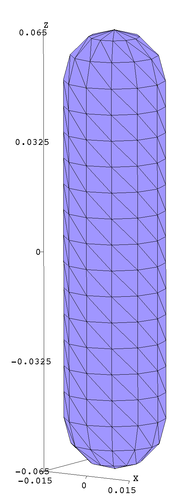
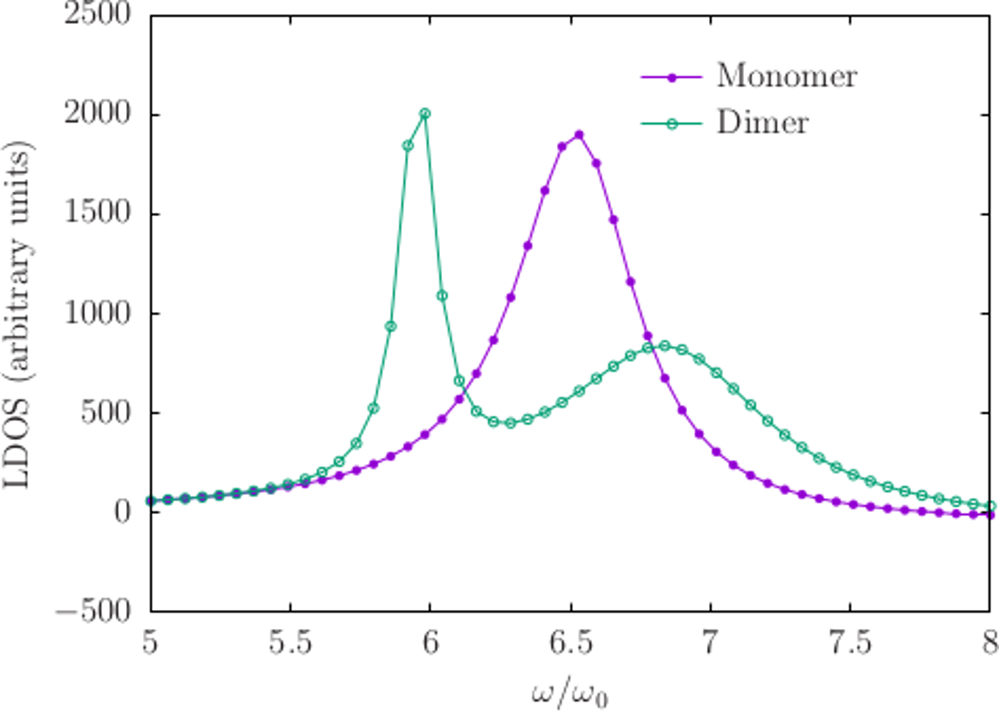
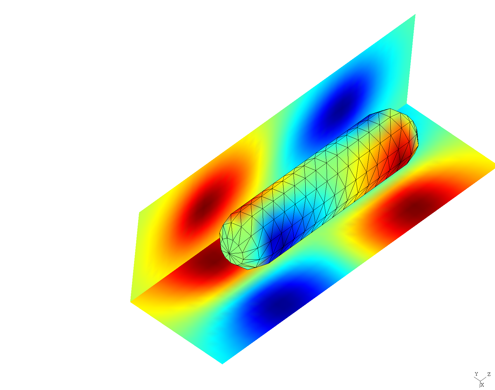
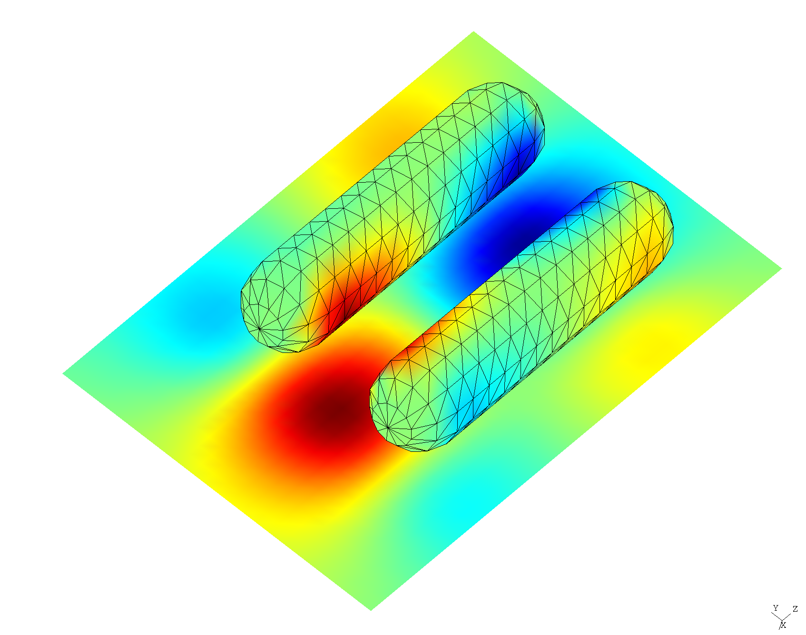
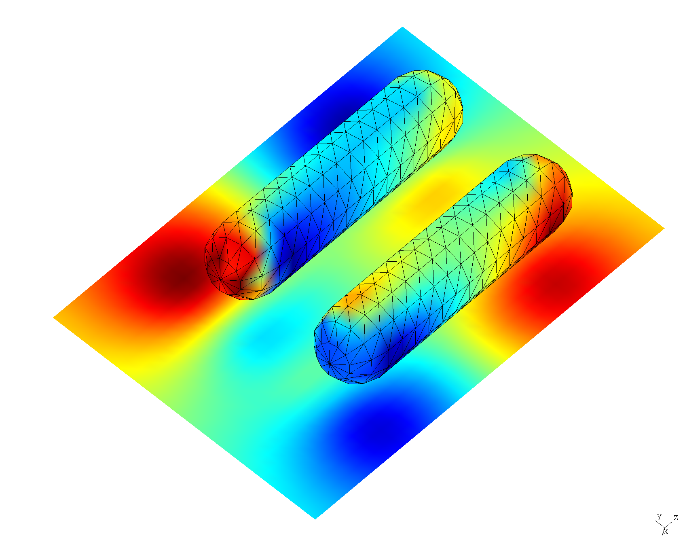

<h1> Mode frequencies and field patterns of resonant modes in gold nanorods</h1>

In this example, we use a combination of methods---including
[python scripts driving the <span class=SC>scuff-em</span> high-level interface][HighLevelInterface]
as well as the 
[<span class=SC>scuff-spectrum</span> command-line tool][scuff-spectrum]---to
investigate resonant modes of isolated and twinned gold nanorods.

This example is inspired by the work of
[J&ouml;rn Zimmerling](http://ens.ewi.tudelft.nl/People/bio.php?id=290),
who used a finite-difference solver and Krylov-subspace techniques to
study resonant modes in single and paired nanorod geometries; see e.g.
this paper:

+ Zimmerling et al., "Efficient computation of the spontaneous decay
    rate of arbitrarily shaped 3D nanosized resonators: a Krylov model-order 
    reduction approach," *Appl. Phys. A.* 122:158 (2016).
    [DOI: 10.1007/s00339-016-9643-4](https://link.springer.com/article/10.1007/s00339-016-9643-4)

In contrast to the finite-difference/Krylov-subspace method of this paper,
the <span class=SC>scuff-em</span> approach to resonant-mode problems
is based on the [Beyn method for nonlinear eigenproblems][BeynMethod], which
identifies eigenvalues as poles of a resolvent operator---which are in turn
identified as residues of a certain contour integral in the complex $\omega$ plane,
estimated by *N*-point numerical quadrature. (Under the hood, this amounts to
solving some number of scattering problems at complex-valued frequencies---namely, 
the *N* quadrature points). We specify the contour to
<span class=SC>scuff-spectrum</span>, and it reports the values of
all resonant-mode frequencies (eigenvalues)
detected inside the contour, together with (optional) visualizations or
other information on the field patterns at each mode.

Following Zimmerling et al., we will consider both the case
of a single nanorod ("monomer" configuration), in which case
we expect a single nanoplasmonic resonance in the frequency 
range of interest, and a "dimer" configuration of two closely-spaced
nanorods, for which we expect the single monomer resonant mode
to split into two:
a lower-frequency ("bonding") mode and a higher-frequency ("antibonding")
mode.

The input files for this example may be found in the `share/scuff-em/examples/NanorodResonantModes`
subdirectory of your <span class=SC>scuff-em</span> installation.

(Note: The nanorods considered here have slightly different geometries
than those considered by Zimmerling et al.---they are the same radius
and height, but have rounded instead of flat end caps. Also, we use a 
slightly different dielectric function for gold. Thus, we don't expect
results to match exactly quantitatively, but qualitative aspects should
be similar.)

[TOC]

## Nanorod surface mesh

[GMSH][GMSH] geometry file describing an individual nanorod: [Nanorod.geo](`Nanorod.geo`). 

Process with <span class=SC>gmsh</span> to produce coarse and moderately-fine meshes:

```
% gmsh -setnumber N 3 Nanorod.geo -2 -o Nanorod_648.msh
% gmsh -setnumber N 5 Nanorod.geo -2 -o Nanorod_1860.msh
% gmsh Nanorod_648.msh
```



Note that, in writing the `.geo` file, we have taken pains to ensure that the mesh
produced by <span class=SC>gmsh</span>
is *highly structured* (has lots of identical triangles), which massively reduces
the cost of <span class=SC>scuff-em</span> calculations due to
[support for equivalent edge-pair detection in <span class=SC>scuff-em</span>
version 0.96 and later][EquivalentEdgeSurfacePairs].

## Initial coarse frequency sweep

<span class=SC>scuff-spectrum</span> can pinpoint eigenfrequencies
efficiently and with high accuracy, but it's useful to have at least
a *rough* estimate of the mode frequencies before we attempt to 
define a contour containing them. Thus, again following 
Zimmerling et al, before launching
<span class=SC>scuff-spectrum</span> runs we'll do a quick
frequency sweep to calculate the local density of states (LDOS) 
at a point in the vicinity of the nanorod. (Recall that the LDOS
at a point **x** may be computed by solving a scattering calculation
in which the incident field is sourced by a point dipole at **x**,
then evaluating the scattered field at **x**.)
This could be done using the 
[<span class=SC>scuff-ldos</span> command-line tool][scuff-ldos],
but it's even easier to do it from a python script making 
calls to the 
[<span class=SC>scuff-em</span> command-line tool][scuff-ldos].
This script is called [`NanorodLDOS.py`](NanorodLDOS.py), 
and here's an excerpt of just the most salient bits; note that
the script contains a flag called `Dimer`, which, when `True,`
will define the geometry to contain two identical nanorods 
separated by 50 nm:

```python

Res="648"
MeshFile="Nanorod_" + Res + ".msh";

Material="Gold"
Dimer=False;

Name = ("Nanorods" if Dimer else "Nanorod") + "_" + Res
Solver=scuff.scuffSolver(Name)

Solver.SetMediumPermittivity(2.25)

# add first nanorod to geometry 
Solver.AddObject(MeshFile, Material, "Nanorod")

# add second nanorod if we're doing the dimer
Dimer=False;
if Dimer:
    Transformation="DISPLACED 0 0.05 0"
    Solver.AddObject(MeshFile, Material, "Nanorod2", Transformation)

# location of point dipole source, lying above one of the nanorods
SourcePoint = [0.0, 0.0, 0.09]

###################################################
# sweep frequency, compute LDOS
###################################################
LDOSFile=open(Name + ".LDOS", "w")
for Omega in OmegaRange:

    # re-compute system matrix for this frequency
    Solver.AssembleSystemMatrix(Omega)

    # solve 3 scattering problems to get electric LDOS at SourcePoint
    GEDiag=[0,0,0]
    for Mu in range(0,3):

       # create Mu-directed dipole source
       SourceOrientation=[0,0,0]
       SourceOrientation[Mu]=1
       PS=scuff.PointSource(SourcePoint, SourceOrientation)

       # solve scattering problem
       Solver.Solve(PS)

       # get scattered E, H fields at source location and 
       # accumulate E[Mu] component
       EH=Solver.GetFields(SourcePoint,"scattered")
       GEDiag[Mu]=EH[Mu]

    
    # write to file
    GETrace=sum(GEDiag)
    LDOSFile.write("%e %e %e " % (Omega,GETrace.real, GETrace.imag))
    LDOSFile.write("%e %e "    % (GEDiag[0].real,GEDiag[0].imag))
    LDOSFile.write("%e %e "    % (GEDiag[1].real,GEDiag[1].imag))
    LDOSFile.write("%e %e\n"   % (GEDiag[2].real,GEDiag[2].imag))
    LDOSFile.flush()

LDOSFile.close()

```

Running this script as is and with `Dimer=True` produces the
files `Nanorod_648.LDOS` and `Nanorods_648.LDOS`, which we plot
in [<span class=SC>gnuplot</span>][GNUPLOT]:

```
gnuplot> plot 'Nanorod_648.LDOS' u 1:3 t 'Monomer', 'Nanorods_648.LDOS' u 1:3 t 'Dimer'
```



So, this comports with our expectations: the monomer configuration has a
single resonance near $\omega\approx 6.5\omega_0$
(where $\omega_0\equiv c/1\,\mu\hbox{m}\equiv 3\times 10^{14}$ rad/sec
is the [default unit of angular frequency in <span class=SC>scuff-em</span>][Units],
in terms of which all frequencies are quoted below)
which splits into a lower-frequency "bonding" and a higher-frequency "anti-bonding" 
mode in the dimer configuration.

## Run <span class=SC>scuff-spectrum</span> to pinpoint frequency of monomer resonant mode

The `${SCUFF_PREFIX}/share/scuff-em/examples/NanorodResonantModes`
directory contains a shell script called `ComputeNanorodModes.sh`
that runs <span class=SC>scuff-spectrum</span>
with various options for post-processing.

For the monomer, we run Beyn's algorithm with 14 quadrature points on a
circular contour of radius $0.1$ centered at $\Omega_0=(6.5-0.3i)$

```
  % export OMP_NUM_THREADS=8
  % export GOMP_CPU_AFFINITY="0-7"
  % ComputeNanorodModes.sh --Omega0 6.5-0.3i --RX 0.1 --RY 0.1 --NQ 14
```

This runs in 6 seconds on my laptop and produces several output files:

+ a text file (`GoldNanorod_648.ModeFrequencies`) reporting all eigenvalues found
    within the contour; in this case the algorithm finds one mode, at
    $\omega=6.531328-0.2583246i$, resolved to 12 decimal places (more digits
    can be obtained by increasing the number of quadrature points).

```
#/home/homer/work/scuff-em-development-installation/bin/../bin/scuff-spectrum running on miho (07/05/18::11:50:09)
# For contour w0=6.5+-0.3i, Rx=1.000000e-01, Ry=1.000000e-01, N=14, L=5:
# re(w) im(w)   estimated error in re(w), im(w)    residual
+6.531328e+00 -2.583246e-01  +7.798207e-13 +8.039625e-12  +1.650360e-18
```

+ Several `.pp` files that may be opened in <span class=SC>gmsh</span> to
visualize field patterns. For example, here's a plot of the real part of
$E_y$, both on the nanorod surface and on some nearby visualization screens:

+[`MonomerEy.png`](MonomerEy.png):




## Run <span class=SC>scuff-spectrum</span> to pinpoint frequencies of dimer resonant modes

For the dimer, we run Beyn's algorithm over an elliptical contour
centered at the same point as above but now of radii $1.5$ in the
horizontal direction and 0.2 in the vertical direction, and with
30 quadrature points:

```
  % ComputeNanorodModes.sh --Omega0 6.5-0.3i --RX 1.5 --RY 0.2 --NQ 30 --Dimer
```

Again this produces a text file (`GoldNanorods_648.ModeFrequencies`) stating
that the Beyn algorithm found 2 eigenvalues, one shifted downward
and narrowed to $\omega=5.954-0.07617i$, and the other shifted upward
and broadened to $\omega=6.867-0.4560i$, both frequencies being
resolved to roughly 12 decimal-place accuracy: 

```
# For contour w0=6.5+-0.3i, Rx=1.500000e+00, Ry=2.000000e-01, N=30, L=5:
# re(w) im(w)   estimated error in re(w), im(w)    residual
+6.867448e+00 -4.560186e-01  +1.323386e-13 +3.055944e-12  +3.839727e-17 
+5.953535e+00 -7.617430e-02  +1.891820e-13 +8.747864e-12  +1.240623e-08 
```

We also get <span class=SC>gmsh</span> visualization files plotting
field configurations:

### Ey fields for the dimer "bonding" mode

+[`DimerBondingEy.png`](DimerBondingEy.png):



### Ey fields for the dimer "anti-bonding" mode

+[`DimerAntibondingEy.png`](DimerAntibondingEy.png):




{!Links.md!}
