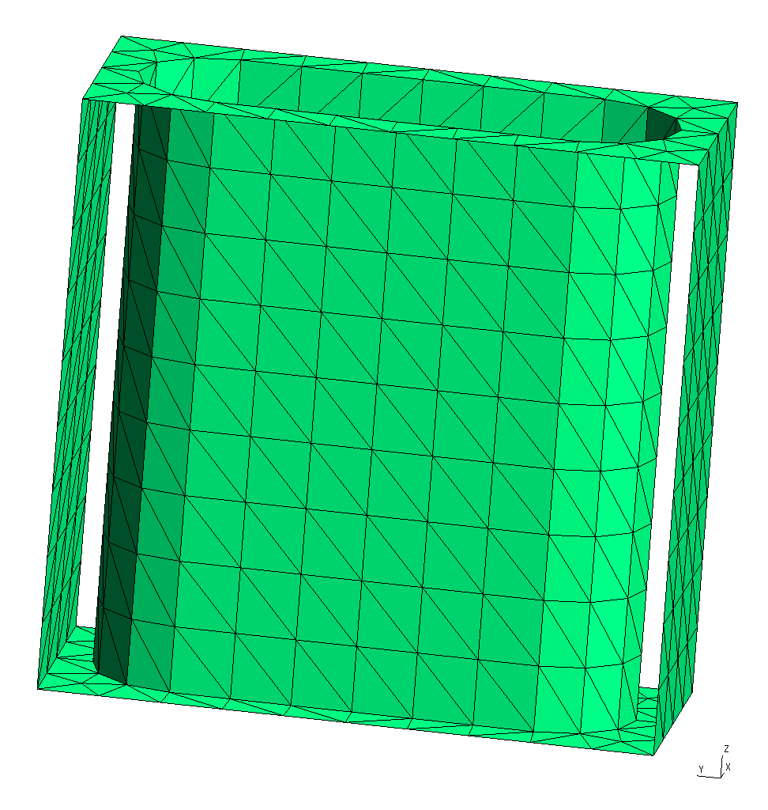
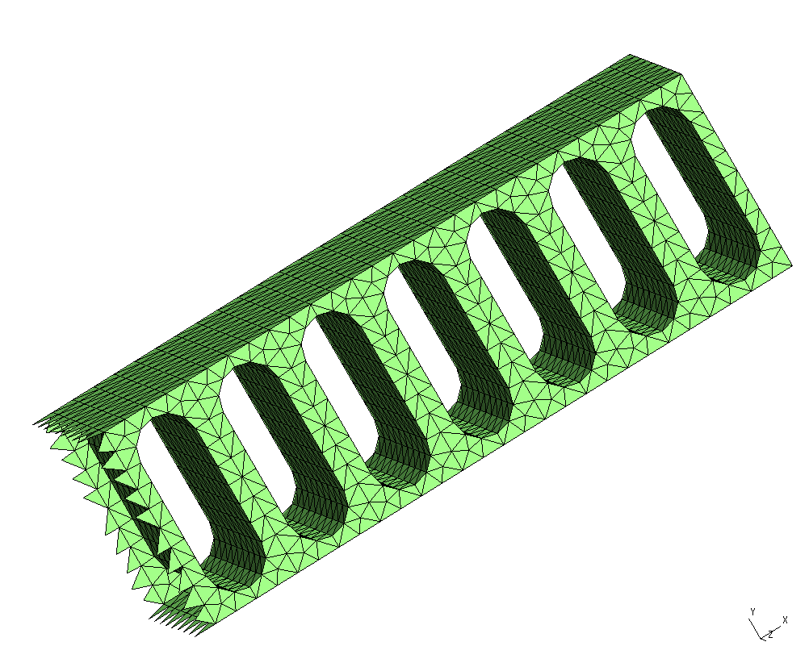
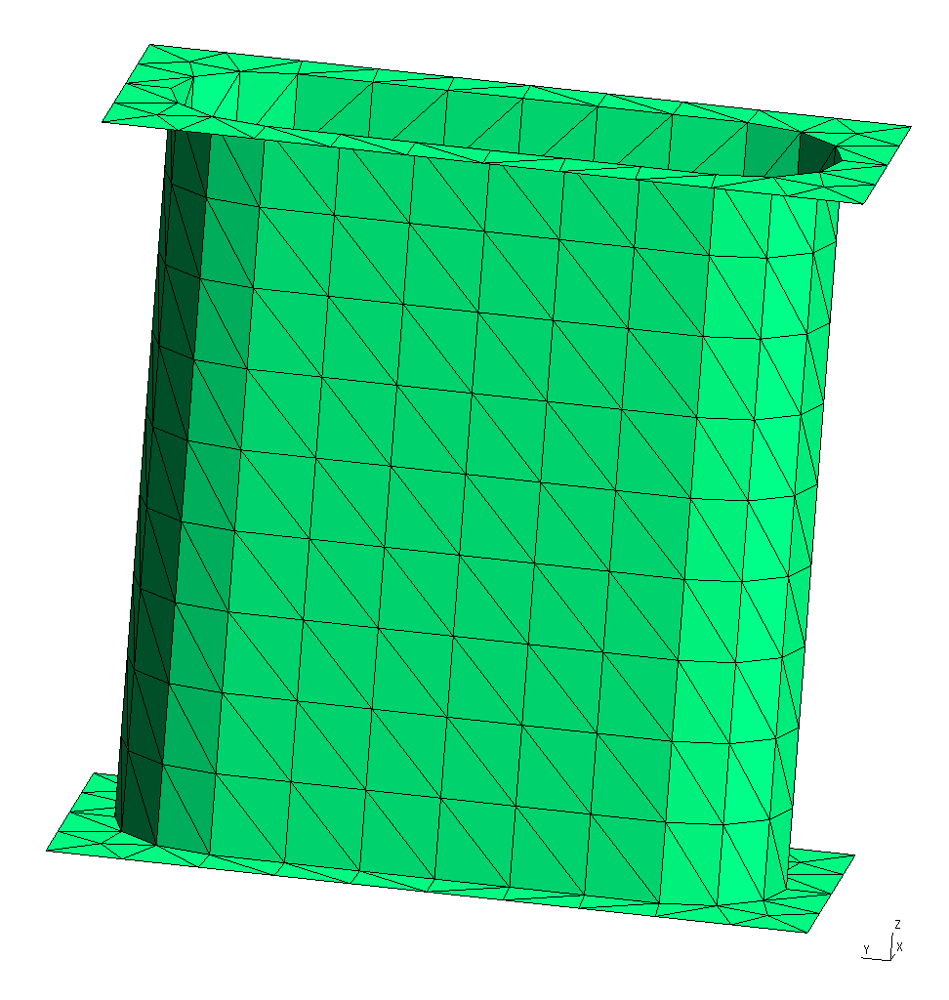
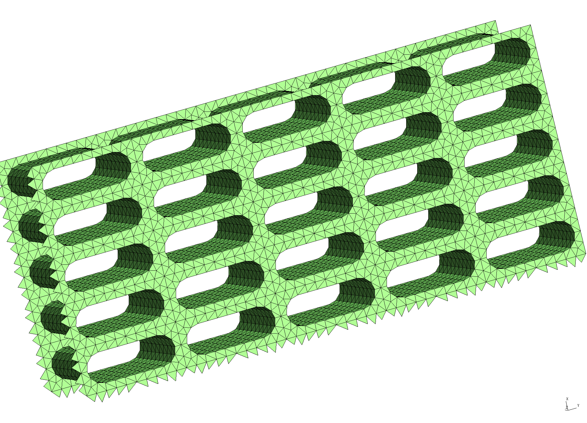
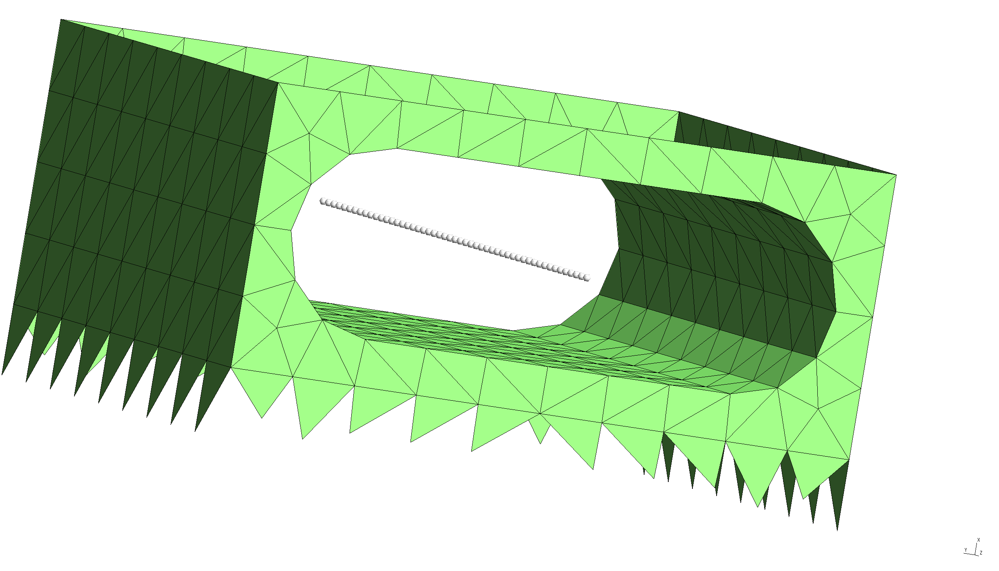

<h1>Casimir-Polder potentials in dielectric nanostructures</h1>

In this example, we exploit [[scuff-em]]'s support for periodic
geometries to compute Casimir-Polder potentials for atoms inside
dielectric waveguides. Our basic test example will be the 1D 
photonic crystal studied in this paper:

 + [C. L. Hung, S. M. Meenehan, D. E. Chang, O. Painter,
    H. J. Kimble, ``Trapped atoms in one-dimensional
    photonic crystals.'' *New Journal of Physics* **15**
    083026 (2013).](http://stacks.iop.org/1367-2630/15/i=8/a=083026)

We will illustrate the use of [[scuff-em]]'s Casimir-Polder
module [[scuff-caspol]] by reproducing the results of 
Hung et al. for a 1D lattice, then extend the calculation
to the case of a 2D square lattice.
The files for this example may be found in the
`share/scuff-em/examples/NanobeamCasimirPolder` subdirectory
of your [[scuff-em]] installation.

--------------------------------------------------

## [[gmsh]] geometry and surface mesh for nanobeam unit cell

The [[gmsh]] geometry file [`UnitCell.geo`](UnitCell.geo)
describes just the portion of the nanobeam surface that 
lies within the *unit cell,* i.e. the cell that is 
infinitely periodically replicated to yield the full 
geometry. To produce a discretized surface-mesh
representation of this geometry, we run it through
[[gmsh]]:

````bash
% gmsh -2 UnitCell.geo
````

This produces a file named `UnitCell.msh`, which
I rename to `NanoBeamUnitCell_1006_.msh` because
**(a)** I will be using it as the unit cell of a beam
geometry, in contrast to a different use I will find
for the same unit cell below; and **(b)** the mesh has 1006 
interior edges (this is the number that defines the 
memory and computation time requirements for the 
[[scuff-em]] calculation; it may be found by running
`scuff-analyze --mesh UnitCell.msh`).
You can open the `.msh` file in [[gmsh]] to visualize
the unit-cell mesh:

````bash
% gmsh NanoBeamUnitCell_1006.msh
````


Note the following:

 * For 1D periodic geometries in [[scuff-em]], the direction
   of infinite extent must be the *x* direction.

 * The sidewalls normal to the $y$ and $z$ directions are 
   meshed, but the sidewalls normal to the $x$ direction are 
   *not* meshed for this structure, because those surfaces are 
   not interfaces between different dielectrics.

 * For surfaces that straddle the unit-cell boundaries
   (as is the case here), each triangle edge that lies
   on the unit-cell boundary must have an identical
   image edge on the opposite side of the unit cell.
   An easy way to achieve this is to use *extrusions*
   in [[gmsh]], as in the `.geo` file above.

 * In this case the unit cell is 0.367 \(\mu\)m long.
   This and other geometric parameters can be modified 
   by editing the file `UnitCell.geo` or directly
   on the [[gmsh]] commmand line using the `-setnumber` option.

--------------------------------------------------

## [[scuff-em]] geometry file for dielectric nanobeam

A [[scuff-em]] [geometry file][scuffEMGeometries] 
describing an extended nanobeam consisting of infinitely
many repetitions of the above unit cell filled with
a dielectric material of constant relative permittivity
$\epsilon=4$, is 
[`NanoBeam_1006.scuffgeo`](NanoBeam_1006.scuffgeo).
The file reads, in its entirety, 

````
LATTICE
	VECTOR 0.367 0.0
ENDLATTICE

OBJECT Nanobeam
	MESHFILE NanoBeamUnitCell_1006.msh
	MATERIAL CONST_EPS_4
ENDOBJECT
````

We can use [[scuff-analyze]] to visualize the geometry 
described by this `.scuffgeo` file:

````bash
% scuff-analyze --geometry NanoBeam_1006.scuffgeo --WriteGMSHFiles --Neighbors 3
````

[The option `--Neighbors 3` requests that, in addition to the unit-cell
geometry, the first 3 periodic images of the unit cell *in both the 
positive and negative directions* (for a total of 5 copies of the 
unit cell) be plotted as well. This helps to convey a slightly
better sense of the actual infinite-length structure being 
simulated.\] This produces the file `NanoBeam_1006.pp`, which you 
can view in [[gmsh]]:

````bash
% gmsh NanoBeam_1006.pp
````



Note that the visualization file produced by [[scuff-analyze]] includes
extra triangles (visible at the left end of the structure) that are
not present in the unit-cell geometry. These are called <i>straddlers</i>,
and they are added automatically by [[scuff-em]] to account for 
surface currents that flow across the unit-cell boundaries in 
periodic geometries.

--------------------------------------------------

## [[gmsh]] geometry and surface mesh for nanoarray unit cell

It's easy to generalize all of this to a geometry
with two-dimensional periodicity. The only modification
required to the unit-cell mesh is that we have to 
remove the sidewalls normal to the $y$ direction.
This can be done using the same [[gmsh]] geometry
we used above for the nanobeam unit cell, but with 
the extra command-line option `-setnumber LDim 2`
on the [[gmsh]] command line. (Here `LDim` stands
for "lattice dimension".)

````bash
% gmsh -2 -setnumber LDim 2 UnitCell.geo
````

This produces a file named `UnitCell.msh`, which
I rename to `NanoArrayUnitCell_800_.msh.` It looks like this



--------------------------------------------------

## [[scuff-em]] geometry file for dielectric nanoarray

A [ <span class="SC">scuff-em</span> geometry file][scuffEMGeometries]
describing a dielectric surface extended in two
dimensions and perforated with a square lattice
of the holes pictured above is 
[`NanoArray_800.scuffgeo`](NanoArray_800.scuffgeo).
The file reads

````
LATTICE
	VECTOR 0.367  0.0
	VECTOR 0.000  0.845
ENDLATTICE

OBJECT NanoArray
	MESHFILE NanoArrayUnitCell_800.msh
	MATERIAL CONST_EPS_4
ENDOBJECT
````

Again we use [[scuff-analyze]] to visualize the geometry
described by this `.scuffgeo` file:

````bash
% scuff-analyze --geometry NanoArray_800.scuffgeo --WriteGMSHFiles --Neighbors 3
````



--------------------------------------------------

## Evaluation points for Casimir-Polder potentials

For a Casimir-Polder calculation we will want to evaluate
the Casimir-Polder potential at range of points. We 
put the Cartesian coordinates of these points into a 
text file named [`EPFile`](EPFile), which looks like 
this:

````bash
0.1835 0.4225 -0.500
0.1835 0.4225 -0.480
0.1835 0.4225 -0.460
...
0.1835 0.4225 0.480
0.1835 0.4225 0.500
````

and defines a line of points running through the middle of the hole
in the beam unit cell.

To double-check that the evaluation points we specify
are actually where we expect them to be vis-a-vis the 
meshed surfaces in our problem, we can ask [[scuff-analyze]]
to plot the evaluation points together with the 
unit-cell geometry:

````bash
 % scuff-analyze --geometry NanoBeam_1006.scuffgeo --EPFile EPFile --WriteGMSHFiles
````



This confirms that our `EPFile` describes a line of evaluation
points running through the middle of the hole in the beam 
structure, as desired.

--------------------------------------------------

## Setting up the Casimir-Polder calculation

To compute the Casimir-Polder potential on, say,
a rubidium atom at the above evaluation points
for the 1D and 2D extended structures, we now say simply

````bash
  % scuff-caspol --geometry NanoBeam_1006.scuffgeo --EPFile EPFile --Atom Rubidium
````

and/or

````bash
  % scuff-caspol --geometry NanoArray_800.scuffgeo --EPFile EPFile --Atom Rubidium
````

These calculations will produce files named `NanoBeam_1006.out` and 
`NanoArray_800.out` tabulating the Casimir-Polder potential 
experience by the rubidium atom at each of the specified evaluation
points.

For more information on [[scuff-caspol]], see the 
[old <span class="SC">scuff-caspol</span> documentation][oldDoc],
which is thorough and up-to-date (though it does not 
cover CP calculations in extended geometries) despite 
having not yet been ported from its previous format.

[scuffEMGeometries]: reference/Geometries
[scuffEMTransformations]: reference/Transformations
[RoundedBeamUnitCellGeo]: RoundedBeamUnitCell.geo
[SiliconBeamsScuffgeo]: SiliconBeams_192.scuffgeo
[id2]: /path/to/image "alt text"
[oldDoc]: http://homerreid.com/scuff-em/scuff-caspol
