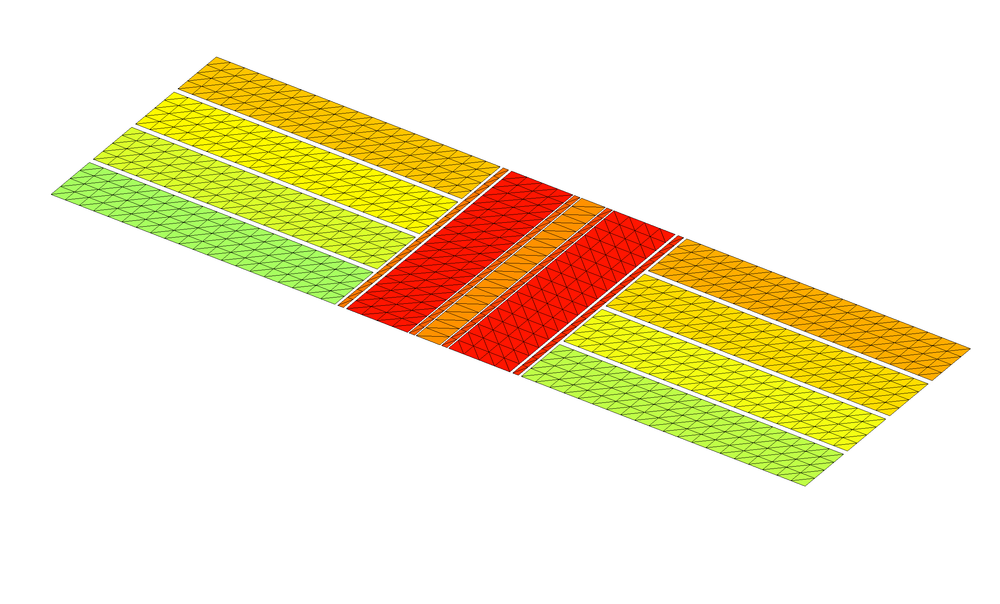
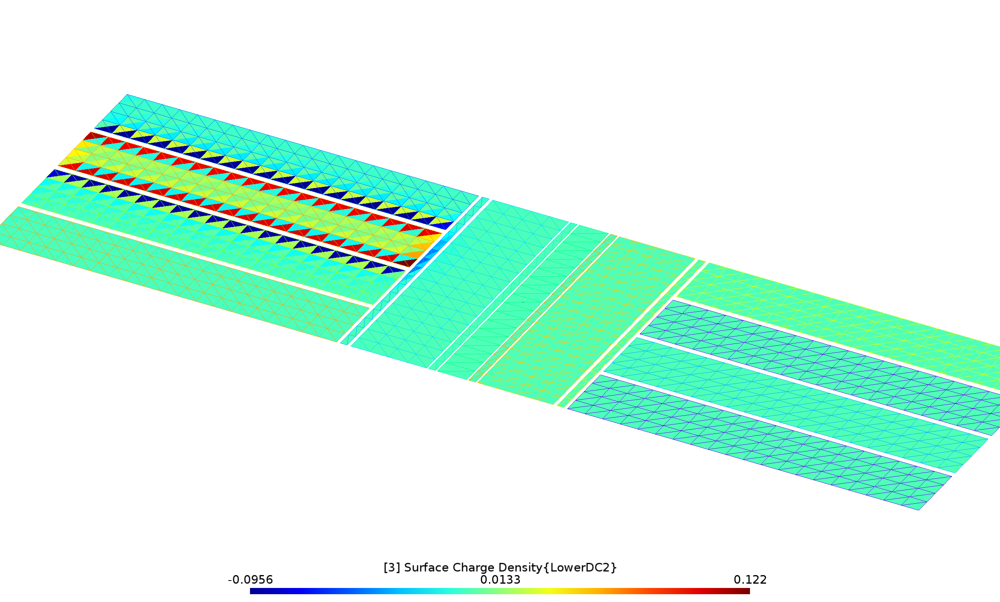

<h1>Electrostatic fields of an electrode array</h1>

In this example we use [[scuff-static]] to compute the electrostatic
fields in the vicinity of a complicated electrode array with the
various electrodes held at various external potentials.

More specifically, the calculation will proceed in two stages:

1. First, for each of the *N* electrodes in the device
   we will compute the fields produced by maintaining that
   electrode at a potential of 1 volt, with all other electrodes 
   grounded.
   This will produce *N* separate datasets, each reporting
   the electrostatic potential and **E**-field components
   at our desired evaluation points.
   The 
   [structure of the boundary-element-method (BEM) solver implemented by <span class=SC>scuff-static</span>][scuffStaticMemo]
   ensures that this calculation is fast, even for large *N*:
   once we have assembled and factorized the BEM matrix
   for a given geometry, we can solve any number of electrostatic
   problems involving different excitations of that geometry essentially
   "for free."

2. Then we will run a second calculation in which all electrodes
   are maintained at specific voltages and---in addition---an
   externally-sourced electrostatic field is present. For
   this case we will generate graphic visualization files
   illustrating the fields in the vicinity of the device.

The geometry considered in this example is a model of a
[Paul trap](https://en.wikipedia.org/wiki/Quadrupole_ion_trap);
I am grateful to Anton Grounds for suggesting this
application and for providing the sophisticated
parameterized [[gmsh]] file describing the geometry.

The files for this example may be found in the
`share/scuff-em/examples/PaulTrap` subdirectory
of your [[scuff-em]] installation.

## <span class=SC>gmsh</span> geometry and mesh files

The [<span class=SC>gmsh</span>][GMSH]
geometry file [`Trap.geo`](Trap.geo) describes
a collection of conductor surfaces constituting a Paul trap.
This file contains a user-specifiable parameter `ELCNT`
that may be used to set the number of electrodes; to create
a mesh for a 8-electrode geometry, we say

````bash
% gmsh -2 -setnumber ELCNT 4 Trap.geo -o Trap_4.msh
````

(Note that the total number of electrodes is twice the value
specified for `ELCNT`).
This produces the [[gmsh]] mesh file `Trap_4.msh`, which we can
open in [[gmsh]] to visualize: 

````bash
% gmsh Trap_4.msh
````


## Simple <span class=SC>scuff-em</span> geometry file

The [[gmsh]] file `Trap.geo` is designed to ensure that
each separate metallic strip in the geometry---including
each of the 8 identically-shaped electrodes, plus each of 
the 7 strips of varying thicknesses running down the center
of the structure---is meshed as a separate
entity and assigned a unique (integer) identifier. Thus, one way to
write a [<span class=SC>scuff-em</span> geometry file][scuffEMGeometries]
for this geometry would be simply to include each of the 15
distinct surfaces in `OBJECT...ENDOBJECT` clauses, each clause
referencing a unique entity in the mesh. This strategy
is pursued by the file [`Trap_4.scuffgeo`](Trap_4.scuffgeo),
which looks like this:

````bash
OBJECT GND
    MESHFILE Trap_4.msh
    MESHTAG 1
ENDOBJECT

OBJECT Rot2
    MESHFILE Trap_4.msh
    MESHTAG 2
ENDOBJECT

OBJECT Rot3
    MESHFILE Trap_4.msh
    MESHTAG 3
ENDOBJECT

OBJECT RF
    MESHFILE Trap_4.msh
    MESHTAG 4
ENDOBJECT

OBJECT Rot1
    MESHFILE Trap_4.msh
    MESHTAG 5
ENDOBJECT

OBJECT Rot4
    MESHFILE Trap_4.msh
    MESHTAG 6
ENDOBJECT

OBJECT UpperDC1
    MESHFILE Trap_4.msh
    MESHTAG 7
ENDOBJECT

OBJECT LowerDC1
    MESHFILE Trap_4.msh
    MESHTAG 8
ENDOBJECT

OBJECT UpperDC2
    MESHFILE Trap_4.msh
    MESHTAG 9
ENDOBJECT

OBJECT LowerDC2
    MESHFILE Trap_4.msh
    MESHTAG 10
ENDOBJECT

OBJECT UpperDC3
    MESHFILE Trap_4.msh
    MESHTAG 11
ENDOBJECT

OBJECT LowerDC3
    MESHFILE Trap_4.msh
    MESHTAG 12
ENDOBJECT

OBJECT UpperDC4
    MESHFILE Trap_4.msh
    MESHTAG 13
ENDOBJECT

OBJECT LowerDC4
    MESHFILE Trap_4.msh
    MESHTAG 14
ENDOBJECT
````

Note that, although each of the `OBJECT` clauses references
the same mesh file, the different values of the `MESHTAG`
field select distinct entities within that file, so that each
of the 15 `OBJECTs` are treated by [[scuff-em]] as
distinct identities.
(The values of the `MESHTAG` identifiers are defined
in `.geo` files by [[gmsh]]'s `Physical Surface` construct;
see [`Trap.geo`](Trap.geo) for an example).`

## Improved <span class=SC>scuff-em</span> geometry file

The file `Trap_4.scuffgeo` above defines a perfectly workable
[[scuff-em]] geometry, and running calculations with this
file will yield results identical to those obtained below.

However, the strategy pursued by `Trap_4.scuffgeo` is *not*
the optimal way to define this geometry to [[scuff-em]],
because it ignores significant potential for computational
cost savings afforded by the structure of the geometry.
Indeed, as we see from the image above, the geometry
here contains many copies of *identical* shapes that
are simply rotated and/or translated with respect to one
another in space. For geometries of this sort, it
is best *not* to define separate mesh entities for each
of the various identical copies of structures, but rather
to inform [[scuff-em]] of the redundancies that are present
so that the code can make maximal reuse of computations
carried out for identical structures.

More specifically, we will modify the above file as follows:

+ Instead of defining each of the 8 electrodes to be a separate
entity in the mesh, we will reference just *one* of the electrode
rectangles in the mesh file, together with `DISPLACED` statements
indicating how identical copies of that entity are to be translated
in space to define the 8 electrodes in the positions shown above.

+ Similarly, instead of defining separate meshed entities
for each of the long runners in the center of the geometry,
we will take advantage of the 180$^\circ$ rotational symmetry
by referencing only one copy of each distinct shape
together with `ROTATED` statements indicating how identical
copies of that shape are to be rotated in space to define the
desired configuration of the runners.

As a result, [[scuff-em]] will need to read and store only
5 distinct entities from the mesh file, together with
instructions for displacements and rotations. This is a major
reduction in complexity from the 15 distinct mesh structures
involved in the simple `.scuffgeo` file above. (The primary
computational efficiency here is that identical mesh
structures--independent of displacement or rotation---contribute
identical diagonal blocks to the BEM system matrix; if
[[scuff-em]] knows that an object in a geometry has 7 identical
mates, then it need only compute the corresponding matrix
block *once* instead of 8 times, yielding huge cost reductions.
[[scuff-static]] also detects and exploits redundancies in *off-diagonal*
matrix blocks.)

The file that implements this improved strategy is [`Trap_4_Improved.scuffgeo`](Trap_4_Improved.scuffgeo),
and it looks like this:

````bash
OBJECT UpperDC1
    MESHFILE Trap_4.msh
    MESHTAG 7
ENDOBJECT

OBJECT LowerDC1
    MESHFILE Trap_4.msh
    MESHTAG 7
    DISPLACED 0 -1656 0
ENDOBJECT
 
OBJECT UpperDC2
    MESHFILE Trap_4.msh
    MESHTAG 7
    DISPLACED 220 0 0 
ENDOBJECT

OBJECT LowerDC2
    MESHFILE Trap_4.msh
    MESHTAG 7
    DISPLACED 0 -1656 0
    DISPLACED 220 0 0 
ENDOBJECT

OBJECT UpperDC3
    MESHFILE Trap_4.msh
    MESHTAG 7
    DISPLACED 440 0 0 
ENDOBJECT

OBJECT LowerDC3
    MESHFILE Trap_4.msh
    MESHTAG 7
    DISPLACED 0 -1656 0
    DISPLACED 440 0 0 
ENDOBJECT

OBJECT UpperDC4
    MESHFILE Trap_4.msh
    MESHTAG 7
    DISPLACED 660 0 0 
ENDOBJECT

OBJECT LowerDC4
    MESHFILE Trap_4.msh
    MESHTAG 7
    DISPLACED 0 -1656 0
    DISPLACED 660 0 0 
ENDOBJECT

OBJECT GND
    MESHFILE Trap_4.msh
    MESHTAG 1
ENDOBJECT

OBJECT Rot1
    MESHFILE Trap_4.msh
    MESHTAG 5
ENDOBJECT

OBJECT Rot2
    MESHFILE Trap_4.msh
    MESHTAG 2
ENDOBJECT

OBJECT Rot3
    MESHFILE Trap_4.msh
    MESHTAG 2
    ROTATED 180 ABOUT 0 0 1
ENDOBJECT

OBJECT Rot4
    MESHFILE Trap_4.msh
    MESHTAG 5
    ROTATED 180 ABOUT 0 0 1
ENDOBJECT

OBJECT RF
    MESHFILE Trap_4.msh
    MESHTAG 4
ENDOBJECT
````

As anticipated above, note that this file references
only 5 distinct `MESHTAG` values instead of the 15 distinct
values referenced by the original `Trap_4.scuffgeo` file.

### Visually confirming the geometry description

Before proceeding, we should certainly pause to check
that the geometry defined by the improved geometry file
does indeed look like what we want. We do this by
running the [<span class=SC>scuff-analyze</span>][scuffAnalyze] utility
with the `--WriteGMSHFiles` command-line option:

````bash
% scuff-analyze --geometry Trap_4_Improved.scuffgeo --WriteGMSHFiles
````

This produces a file named `Trap_4_Improved.pp`, which we open
in `gmsh` for visual confirmation:

````bash
% gmsh Trap_4_Improved.pp
````



## Phase 1 calculation: Computing fields of individual conductors

The first phase of our calculation will be to determine the
electrostatic field configurations produced by holding each of the
individual electrodes at a potential of 1 V with all other electrodes
grounded. This will yield 8 distinct field configurations,
which we can sample at an arbitrary set of evaluation points
or visualize in graphical form; the electrostatic field
obtained by driving all conductors with arbitrary specified
voltages will be a weighted linear combination of
these 8 configurations, so we can use the elemental fields
to optimize a set of electrode voltages to yield a given
field profile (phase 2, below).

### Running multiple calculations at once: The excitation file

One obvious way to do this calculation would be to run [[scuff-static]]
8 times, each time using the [`--PotFile`][Type1Excitations]
command-line option to define a different set of conductor potentials.

However, such an approach would be inefficient given the structure
of the [boundary-element method (BEM) implemented by
<span class=SC>scuff-static</span>][scuffStaticMemo]. In BEM solvers, almost all of the
computational cost goes into assembling and factorizing the
system matrix, which knows only about the geometry itself
and is *independent* of any excitation that may furnish the
stimulus in an electrostatics problem (such as externally-sourced
fields or sets of prescribed conductor potentials).
Thus, in cases where we wish to consider the response of a
geometry to multiple stimuli, it is efficient to do the
calculations all at once; having paid the cost of forming and
factorizing the system matrix, we can solve electrostatics
problems for any number of distinct stimuli essentially **for free.**

To allow this efficiency to be exploited in command-line calculations,
[[scuff-static]] allows users to specify an
[*excitation file*][ExcitationFile]
describing one or more stimuli to be applied to the geometry
sequentially. For the purposes of our first calculation,
the excitation file will specify 8 separate stimuli, each
consisting of a choice of one conductor to be held at 
a potential of `1.0` V (by default, any conductors not
specified are maintained at 0 V). This file is called 
[`Phase1.Excitations`](Phase1.Excitations):

````bash
EXCITATION UpperDC1
	UpperDC1 1.0
ENDEXCITATION

EXCITATION LowerDC1
	LowerDC1 1.0
ENDEXCITATION

EXCITATION UpperDC2
	UpperDC2 1.0
ENDEXCITATION

EXCITATION LowerDC2
	LowerDC2 1.0
ENDEXCITATION

EXCITATION UpperDC3
	UpperDC3 1.0
ENDEXCITATION

EXCITATION LowerDC3
	LowerDC3 1.0
ENDEXCITATION

EXCITATION UpperDC4
	UpperDC4 1.0
ENDEXCITATION

EXCITATION LowerDC4
	LowerDC4 1.0
ENDEXCITATION
````

This file is passed to <span class=SC>scuff-em</span> via
the `--ExcitationFile` command-line option.
Notice that each `EXCITATION` is labeled by an arbitrary user-defined
tag, which will be used to identify the output produced under that
excitation.

Speaking of outputs, we will want to tell [[scuff-static]] what we'd
like it to compute for each excitation. In this case I'll ask for
two types of output:

+ numerical values of the electrostatic potential and field at a set
of evaluation points I choose; I will choose a line of points lying
slightly above the structure and running down the center conductor.
I put the coordinates of these points into a text file called [`MyEPFile`](MyEPFile)
and say `--EPFile MyEPFile` on the <span class=SC>scuff-static</span>
command line.

+ graphical visualization files showing the distribution of surface charge
induced on the geometry by each exciting stimulus. (See below for a
different type of graphical visualization output.) To request
this I use the `--PlotFile` option to specify the visualization output
file name (here I call it `MyPlotFile.pp`).

Here's a script [(`Phase1.RunScript`)](Phase1.RunScript)
that runs the phase-1 calculation:

````bash
#!/bin/bash

ARGS=""
ARGS="${ARGS} --geometry Trap_4_Improved.scuffgeo"
ARGS="${ARGS} --ExcitationFile Phase1.Excitations"
ARGS="${ARGS} --EPFile MyEPFile"
ARGS="${ARGS} --PlotFile MyPlotFile.pp"
scuff-static ${ARGS}
````

This script takes about 3 seconds to run on my laptop.
When it's finished, you have two new output files:

+ `Trap_4_Improved.MyEPFile.out` is a text data file reporting
values of the electrostatic potential and field components
at each evaluation point in `MyEPFile` for each excitation.  
  
    
+ `MyPlotFile.pp` is a [[gmsh]] visualization file plotting the 
induced charge density for each of the 8 excitations. For example,
here's what it looks like when the electrode named `LowerDC2` is 
driven:



## Phase 2 calculation: External sources and field visualization

Having determined the fields produced by each electrode in isolation,
in practice we would now presumably do some sort of design calculation
to identify the optimal voltages at which to drive each electrode
for our desired application. As a follow-up calculation, we'll
now do a run in which **(a)** each conductor is set to a nonzero
voltage, **(b)** additional external field sources are present, **(c)**
we wish to visualize the electrostatic fields over a region of 
space.

Items **(a)** and **(b)** are handled by writing an excitation
file [(`Phase2.Excitations`)](Phase2.Excitations) that specifies,
in addition to prescribed conductor potentials, several
external field sources that are also present in the geometry:
a point monopole, a point dipole, a constant electric field, and
an arbitrary user-specified function.
(Needless to say, this contrived assortment of sources is intended
primarily to illustrate the types of external-field sources
that may be specified in excitation files). 

````bash
EXCITATION KitchenSink

# conductor potentials 

	UpperDC1   0.5
	LowerDC1  -0.7
	UpperDC2  -0.3
	LowerDC2   0.5
	UpperDC3   0.2
	LowerDC3  -0.4
	UpperDC4  -0.6
	LowerDC4   1.0

# point charge at X=(-400,1000,250) with charge -300
	monopole -400.0 1000.0 250.0   -300

# z-directed point dipole at X=(-300,-1000,-400)
	dipole  -300.0 -1000.0 -400.0  0.0 0.0 10000.0

# small constant background field in Z-direction
	constant_field 0 0 1.0e-4

# arbitrary user-specified function of x, y, z, r, Rho, Theta, Phi
        phi 1.0e-8*Rho*Rho*cos(2.0*Phi)

ENDEXCITATION

````

Item **(c)** is handled by using [[gmsh]] to define a *field-visualization
mesh*---in essence, a screen on which we want an image of the electrostatic
field configuration, although it need not be planar---together with a
set of [geometrical transformations][Transformations] specifying how the screen 
is to be replicated throughout space to yield quasi-3D visual information on the 
field configuration. In this case, the mesh is described by 
the simple [[gmsh]] geometry file [`Screen.geo`](Screen.geo),
which we turn into `Screen.msh` by running `gmsh -2 Screen.geo`.
Then, the transformation file [`Screen.trans`](Screen.trans)
specifies three geometrical transformations in which the screen
is rotated and displaced to define the three walls of the diorama
shown in the figure below.

The script that runs the calculation is [`Phase2.RunScript`](Phase2.RunScript):

````bash
#!/bin/bash

ARGS=""
ARGS="${ARGS} --geometry Trap_4_Improved.scuffgeo"
ARGS="${ARGS} --ExcitationFile Phase2.Excitations"
ARGS="${ARGS} --FVMesh Screen.msh"
ARGS="${ARGS} --FVMeshTransFile Screen.trans"
scuff-static ${ARGS}
````

This produces several files with extension `.pp;` we open them
all simultaneously in [[gmsh]] together with the original geometry
mesh to get some graphical insight into the spatial variation of the
fields in our problem.

````bash
 % gmsh Trap_4*.pp Trap_4.msh
````

Click the image below for higher resolution:

<a href="../KitchenSink.png"></a>

[GMSH]:                 	http://www.geuz.org/gmsh
[scuffEMGeometries]: 		../../reference/Geometries
[Transformations]: 		../../reference/Transformations
[scuffAnalyze]: 		../../applications/scuff-analyze/scuff-analyze.md
[Type1Excitations]: 		../../applications/scuff-static/scuff-static.md#Type1Excitations
[ExcitationFile]:   		../../applications/scuff-static/scuff-static.md#ExcitationFile
[scuffStaticMemo]:		../../tex/scuff-static.pdf
