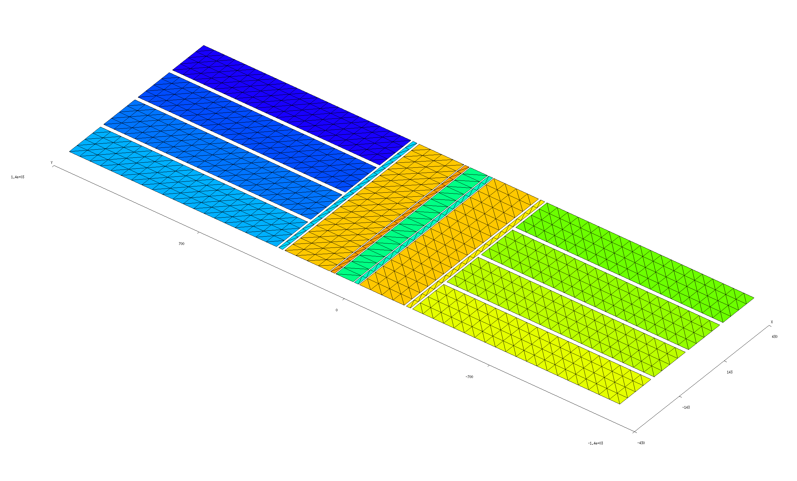

<h1>Electrostatic fields of an electrode array</h1>

In this example we use [[scuff-static]] to compute the electrostatic
fields in the vicinity of a complicated electrode array with the
various electrodes held at various external potentials.

More specifically, the calculation will proceed in two stages:

1. First, for each of the *N* electrodes in the device
   we will compute the fields produced by maintaining that
   electrode at a potential of 1 volt, with all other electrodes 
   grounded.
   This will produce *N* separate datasets, each reporting
   the electrostatic potential and **E**-field components
   at our desired evaluation points.
   The 
   [structure of the boundary-element-method (BEM) solver implemented by <span class=SC>scuff-static</span>][scuffStaticMemo]
   ensures that this calculation is fast, even for large *N*:
   once we have assembled and factorized the BEM matrix
   for a given geometry, we can solve any number of electrostatic
   problems involving different excitations of that geometry essentially
   "for free."

2. Then we will run a second calculation in which all electrodes
   are maintained at specific voltages and---in addition---an
   externally-sourced electrostatic field is present. For
   this case we will generate graphic visualization files
   illustrating the fields in the vicinity of the device.

The geometry considered in this example is a model of a
[Paul trap](https://en.wikipedia.org/wiki/Quadrupole_ion_trap);
I am grateful to Anton Grounds for suggesting this
application and for providing the sophisticated
parameterized [[gmsh]] file describing the geometry.

The files for this example may be found in the
`share/scuff-em/examples/PaulTrap` subdirectory
of your [[scuff-em]] installation.

## <span class=SC>gmsh</span> geometry and mesh files

The [<span class=SC>gmsh</span>][GMSH]
geometry file [Trap.geo](Trap.geo) describes
a collection of conductor surfaces constituting a Paul trap.
This file contains a user-specifiable parameter `ELCNT`
that may be used to set the number of electrodes; to create
a mesh for a 8-electrode geometry, we say

````bash
% gmsh -2 -setnumber ELCNT 4 Trap.geo -o Trap_4.msh
````

(Note that the total number of electrodes is twice the value
specified for `ELCNT`).
This produces the [[gmsh]] mesh file `Trap_4.msh`, which we can
open in [[gmsh]] to visualize: 

````bash
% gmsh Trap_4.msh
````



## <span class=SC>scuff-em</span> geometry file

The [<span class=SC>scuff-em</span> geometry file][scuffEMGeometries] [`Trap_4.scuffgeo`](Trap_4.scuffgeo)
assigns labels to the various conducting surfaces described by the `.msh`
file

```bash
```

````
OBJECT Sphere
	MESHFILE Sphere_501.msh
	MATERIAL CONST_EPS_10
ENDOBJECT
````

To compute the DC polarizability of this object, we say

````bash
% scuff-static --Geometry E10Sphere.scuffgeo --PolFile E10Sphere.pol
````

This produces a file named `E10Sphere.pol`, which reports
all 9 components of the DC polarizability tensor for the 
sphere:

````
# data file columns: 
# 01: object label 
# 02: alpha_{xx} 
# 03: alpha_{yx} 
# 04: alpha_{zx} 
# 05: alpha_{xy} 
# 06: alpha_{yy} 
# 07: alpha_{zy} 
# 08: alpha_{xz} 
# 09: alpha_{yz} 
# 10: alpha_{zz} 
Sphere 9.221300e+00 6.692939e-03 4.299017e-02 1.225110e-02 9.231265e+00 1.831022e-03 -1.860956e-02 1.039749e-02 9.233396e+00 
````

Here are some observations on this result:

+ The diagonal components here are in decent agreement with the
theoretical value of $\frac{\alpha}{\epsilon_0}=4\pi \frac{\epsilon-1}{\epsilon+2}R^3\approx 9.4 R^3$.

+ The slight discrepancies between the three diagonal components
arise because the surface mesh slightly breaks rotational symmetry
of the sphere.

+ The nonzero values of the off-diagonal components are 
numerical noise.

In all three cases, the result is improved by running
calculations with finer surface meshes.

## Polarizability of a dielectric cavity

Here's an alternative geometry file describing a spherical
vacuum *cavity* in a universe filled with $\epsilon=10$ 
dielectric material:

````bash
MEDIUM
	MATERIAL CONST_EPS_10
ENDMEDIUM

OBJECT Sphere
	MESHFILE Sphere_501.msh
	MATERIAL CONST_EPS_1
ENDOBJECT
````

The polarizability data predicted by [[scuff-static]] for this
geometry are

````
Sphere -5.168105e+00 3.103541e-03 1.420259e-02 3.842746e-03 -5.164908e+00 -1.409712e-03 -6.971980e-03 4.036885e-03 -5.165247e+00 
````

The diagonal components here agree with the theoretical value of
$\frac{\alpha}{\epsilon_0}=4\pi \frac{1-\epsilon}{1+2\epsilon}R^3\approx -5.14 R^3$.

## [[bash]] script to run calculations at many different permittivities

Ultimately we want to compute the polarizability at many
different values of the interior and exterior permittivity,
and it would be unwieldy to have to repeat the above process
by hand in each case. Instead, it's convenient to write a
a [[bash]] script to automate the process. This script 
is called [`GetPolVsTau.sh`](GetPolVsTau.sh). It has a 
hard-coded list of surface meshes and reads pairs of 
interior and exterior permittivity values
in the form (EpsOut, EpsIn) from a file named
[`EpsFile`](EpsFile). For each surface mesh and each
pair of permittivity values, the script does the 
following:

+ It constructs a `.scuffgeo` file for the given
mesh and permittivity values by appropriately modifying
a template file called [`Template.scuffgeo`](Template.scuffgeo).

+ It runs [[scuff-static]] to get the polarizability
for this object with this pair of permittivity values.

+ It reads the resulting polarizability data from the output file
written by [[scuff-static]] and writes the data, together
with the (EpsOut, EpsIn) values, to an overall output
file for the shape in question. 

This script, which takes about 10 minutes to run on my laptop,
produces a series of files with names like
`Tetrahedron_1179.AlphaVsTau.` Here `Tau` refers to the quantity
$\tau\equiv \epsilon^{\text{in}}/\epsilon^{\text{out}}$
defined in the paper by Sihvola et al. referenced above.

Plotting polarizability vs. $\tau$ for the three shapes
reproduces Figure 4 of the paper by Sihvola et al.
referenced above,
except for something funky that appears to be happening 
for the tetrahedron around $\epsilon=100.$


Incidentally, here's the [[gnuplot]] script that I
used to produce this plot: [`Plotter.gp`](Plotter.gp).

[GMSH]:                 http://www.geuz.org/gmsh
[scuffEMGeometries]: 		../../reference/Geometries
[scuffStaticMemo]:		../../tex/scuff-static.pdf
