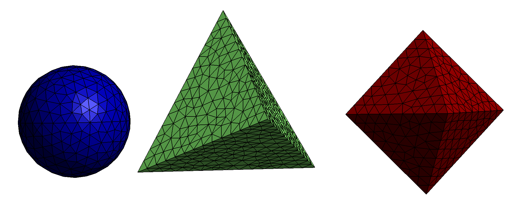
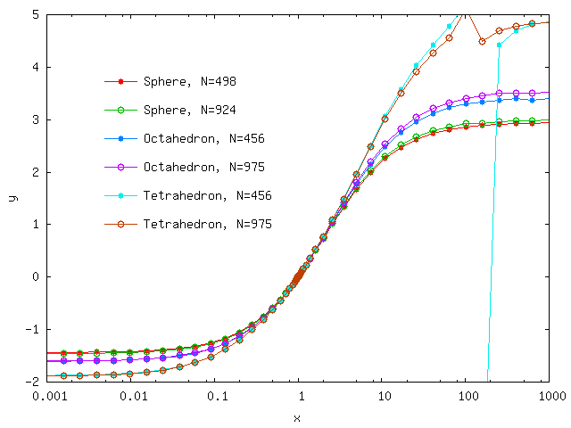

<h1>Electrostatic polarizability of platonic solids</h1>

In this example we use the [[scuff-static]] electrostatic
module of [[scuff-em]] to compute the DC polarizabilities
of dielectric bodies with regular shapes and varying
dielectric permittivity. This example was inspired by this paper:

+ [A. Sihvola, P. Yla-Oijala, S. Jarvenpaa, and J. Avelin, "Polarizabilities of Platonic Solids," *IEEE Transactions on Antennas and Propagation* **52** 9 (2004)](http://ieeexplore.ieee.org/stamp/stamp.jsp?tp=&arnumber=1331608&isnumber=29410)

The files for this example may be found in the
`share/scuff-em/examples/PlatonicSolids` subdirectory
of your [[scuff-em]] installation.

## [[gmsh]] geometry files for spherical, tetrahedral, and octrahedral particles

The [[gmsh]] geometry files
[Sphere.geo](Sphere.geo),
[Tetrahedron.geo](Tetrahedron.geo)
and 
[Octahedron.geo](Octahedron.geo)
respectively describe spherical, tetrahedral, and 
octahedral particles.
I turn them into `.msh` files describing surface meshes of
two different finenesses by running the following [[bash]]
script, which invokes the
[`RenameMesh`](../SiO2Spheres/RenameMesh)
script:

````
#!/bin/bash

for SCALE in 1.0 0.7
do
  for SHAPE in Sphere Tetrahedron Octahedron
  do
    gmsh -clscale ${SCALE} -2 ${SHAPE}.geo -o ${SHAPE}.msh
    RenameMesh ${SHAPE}.msh
  done
done
````

**Note**: The `.geo` files contain a variable parameter `L` that 
sets the sphere radius or the polygon edge length. In each case,
the default value of `L` is chosen to ensure that the volume 
of the result particle matches the volume of a sphere of radius 
1, but you may override this setting (to set `L` to a value of, 
say, 2.34) by adding the command-line option `-setnumber L 2.34` 
to the `gmsh` command above.

Here are pictures of the finer of the three meshes produced by this procedure:



## Polarizability of a dielectric sphere

Here's a simple [<span class="SC">scuff-em</span> geometry file][scuffEMGeometries] named `E10Sphere.scuffgeo` that describes a dielectric sphere with relative permittivity $\epsilon=10$:

````
OBJECT Sphere
	MESHFILE Sphere_501.msh
	MATERIAL CONST_EPS_10
ENDOBJECT
````

To compute the DC polarizability of this object, we say

````bash
% scuff-static --Geometry E10Sphere.scuffgeo --PolFile E10Sphere.pol
````

This produces a file named `E10Sphere.pol`, which reports
all 9 components of the DC polarizability tensor for the 
sphere:

````
# data file columns: 
# 01: object label 
# 02: alpha_{xx} 
# 03: alpha_{yx} 
# 04: alpha_{zx} 
# 05: alpha_{xy} 
# 06: alpha_{yy} 
# 07: alpha_{zy} 
# 08: alpha_{xz} 
# 09: alpha_{yz} 
# 10: alpha_{zz} 
Sphere 9.221300e+00 6.692939e-03 4.299017e-02 1.225110e-02 9.231265e+00 1.831022e-03 -1.860956e-02 1.039749e-02 9.233396e+00 
````

Here are some observations on this result:

+ The diagonal components here are in decent agreement with the
theoretical value of $\frac{\alpha}{\epsilon_0}=4\pi \frac{\epsilon-1}{\epsilon+2}R^3\approx 9.4 R^3$.

+ The slight discrepancies between the three diagonal components
arise because the surface mesh slightly breaks rotational symmetry
of the sphere.

+ The nonzero values of the off-diagonal components are 
numerical noise.

In all three cases, the result is improved by running
calculations with finer surface meshes.

## Polarizability of a dielectric cavity

Here's an alternative geometry file describing a spherical
vacuum *cavity* in a universe filled with $\epsilon=10$ 
dielectric material:

````bash
MEDIUM
	MATERIAL CONST_EPS_10
ENDMEDIUM

OBJECT Sphere
	MESHFILE Sphere_501.msh
	MATERIAL CONST_EPS_1
ENDOBJECT
````

The polarizability data predicted by [[scuff-static]] for this
geometry are

````
Sphere -5.168105e+00 3.103541e-03 1.420259e-02 3.842746e-03 -5.164908e+00 -1.409712e-03 -6.971980e-03 4.036885e-03 -5.165247e+00 
````

The diagonal components here agree with the theoretical value of
$\frac{\alpha}{\epsilon_0}=4\pi \frac{1-\epsilon}{1+2\epsilon}R^3\approx -5.14 R^3$.

## [[bash]] script to run calculations at many different permittivities

Ultimately we want to compute the polarizability at many
different values of the interior and exterior permittivity,
and it would be unwieldy to have to repeat the above process
by hand in each case. Instead, it's convenient to write a
a [[bash]] script to automate the process. This script 
is called [`GetPolVsTau.sh`](GetPolVsTau.sh). It has a 
hard-coded list of surface meshes and reads pairs of 
interior and exterior permittivity values
in the form (EpsOut, EpsIn) from a file named
[`EpsFile`](EpsFile). For each surface mesh and each
pair of permittivity values, the script does the 
following:

+ It constructs a `.scuffgeo` file for the given
mesh and permittivity values by appropriately modifying
a template file called [`Template.scuffgeo`](Template.scuffgeo).

+ It runs [[scuff-static]] to get the polarizability
for this object with this pair of permittivity values.

+ It reads the resulting polarizability data from the output file
written by [[scuff-static]] and writes the data, together
with the (EpsOut, EpsIn) values, to an overall output
file for the shape in question. 

This script, which takes about 10 minutes to run on my laptop,
produces a series of files with names like
`Tetrahedron_1179.AlphaVsTau.` Here `Tau` refers to the quantity
$\tau\equiv \epsilon^{\text{in}}/\epsilon^{\text{out}}$
defined in the paper by Sihvola et al. referenced above.

Plotting polarizability vs. $\tau$ for the three shapes
reproduces Figure 4 of the paper by Sihvola et al.
referenced above,
except for something funky that appears to be happening 
for the tetrahedron around $\epsilon=100.$



Incidentally, here's the [[gnuplot]] script that I
used to produce this plot: [`Plotter.gp`](Plotter.gp).

[scuffEMGeometries]: reference/Geometries
