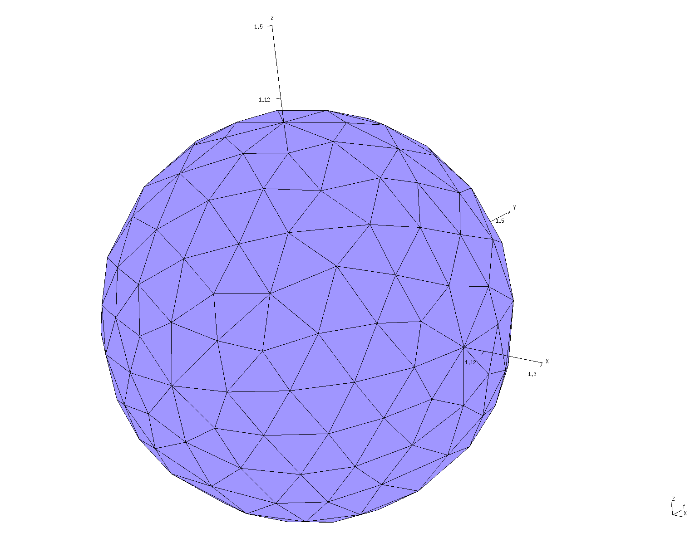
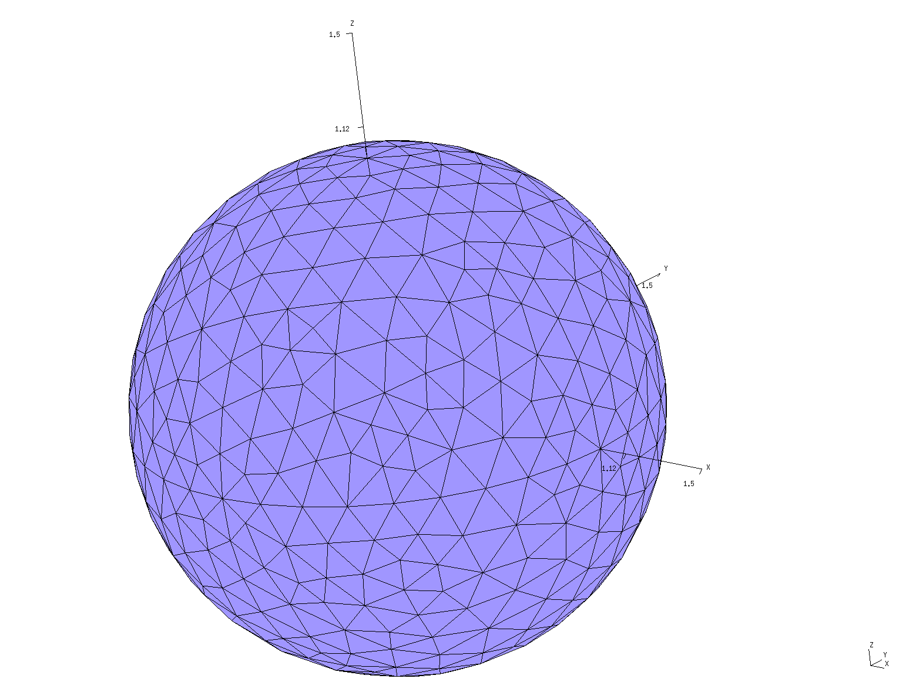
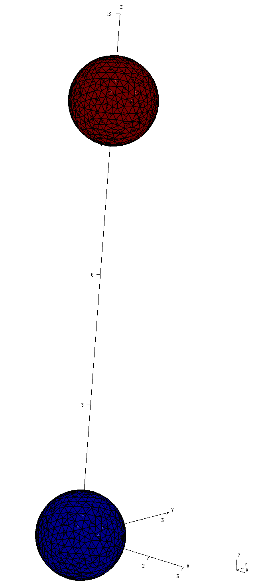
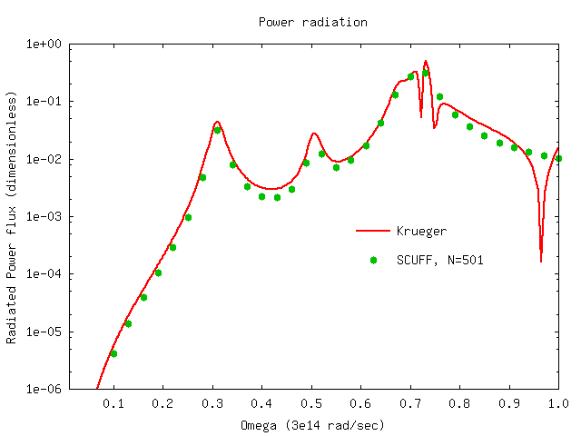
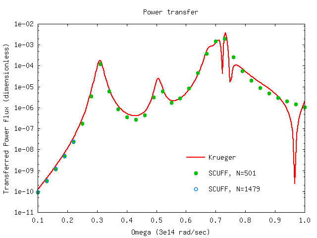
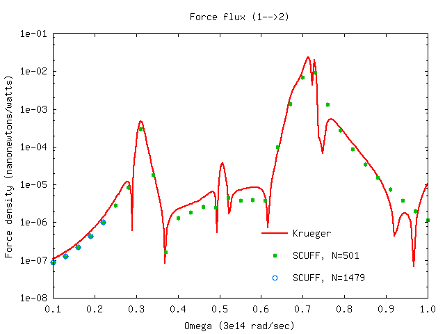

# Thermal radiation, heat transfer, and non-equilibrium Casimir forces between silicon dioxide spheres

In this example, we use [[scuff-neq]] to compute **(1)** the
power radiated by a single SiO2 sphere, and **(2)** the heat
transfer and non-equilibrium Casimir force between two SiO2
spheres. We compare the results of [[scuff-neq]] to 
the predictions of the 
[T-matrix formalism of Krueger et al][KruegerPaper].

The files for this example may be found in the 
`share/scuff-em/examples/SiO2Spheres` subdirectory
of your [[scuff-em]] installation.

--------------------------------------------------
## [[gmsh]] geometry file and surface mesh for a single sphere

The [[gmsh]] geometry file [`Sphere.geo`](Sphere.geo)
describes a sphere of radius 1 micron; it may 
be meshed to generate coarse and fine surface as follows:

````bash
% gmsh -2 -clscale 1 Sphere.geo
% RenameMesh Sphere.msh
% gmsh -2 -clscale 0.5 Sphere.geo
% RenameMesh Sphere.msh
````
(Here [`RenameMesh`](RenameMesh) is a simple `bash` script
that uses [[scuff-analyze]] to count the number of interior
edges in a surface mesh and rename the mesh file accordingly.)
This produces the files `Sphere_501.msh` and `Sphere_1479.msh,`
which you can visualize by opening in [[gmsh]]::

````bash
% gmsh Sphere_501.msh
````


````bash
% gmsh Sphere_1479.msh
````


--------------------------------------------------
## [[scuff-em]] geometry files 

The [[scuff-em]] geometry file
[`SiO2Sphere_501.scuffgeo`](SiO2Sphere_501.scuffgeo)
describes a single SiO2 sphere.

The [[scuff-em]] geometry files
[`SiO2Spheres_501.scuffgeo`](SiO2Spheres_501.scuffgeo)
[`SiO2Spheres_1479.scuffgeo`](SiO2Spheres_1479.scuffgeo)
each describe the same configuration: two SiO2 spheres
separated by a center--center distance of 10 microns.
You can visualize this configuration by typing e.g.

````bash
% scuff-analyze --geometry SiO2Spheres_1479.scuffgeo --WriteGMSHFiles
% gmsh SiO2Spheres_1479.pp
````



--------------------------------------------------
## Spectral density of radiated power

As described in the 
[<span class="CodeName">scuff-neq</span> documentation][scuff-neq],
[[scuff-neq]] computes the total power radiated by
finite-temperature objects as an integral over angular frequencies
$\omega,$ in which the integrand involves a
temperature-dependent Bose-Einstein factor 
and a temperature-independent dimensionless flux $\Phi.$ 
To calculate this radiated-power flux at a given set
of frequencies, we say

````bash
 % scuff-neq --geometry SiO2Sphere_501.scuffgeo --OmegaFile --PRad
````

where [`OmegaFile`](OmegaFile) is a list of
angular frequencies. (Here `--PRad` says that we 
are interested in the radiated power).
This produces the file
``SiO2Sphere_501.SiFlux``, which looks something
like this:

````bash
# scuff-neq run on superhr2 (07/11/15::00:31:36)
# data file columns: 
# 1 transform tag
# 2 omega 
# 3 (sourceObject,destObject) 
# 4 PRad flux spectral density
DEFAULT 1.000000e-01 11 4.18911788e-06 
DEFAULT 1.300000e-01 11 1.38869207e-05 
DEFAULT 1.600000e-01 11 3.93335327e-05 
DEFAULT 1.900000e-01 11 1.05263974e-04 
````

As the file header says, the second column here
is the angular frequency 
in units of $\omega_0=3\cdot 10^{14}$ rad/sec
and the fourth column is the dimensionless power
flux. (The first column lists the 
[geometrical transformation][Transformations]; since 
we didn't specify the `--transfile` option to 
[[scuff-neq]], we have just a single geometric
configuration, labeled `DEFAULT`. The third 
column identifies the source and destination objects;
since this geometry only has a single object,
the source and destination object are both 
always object 1 and this column always reads
`11`.)

Here's a plot of the data:



In this plot, the solid line is the prediction of 
the [Krueger formalism][KruegerPaper], as computed
by a [[julia]] code called [`KruegerFormulas.jl`](KruegerFormulas.jl).

The plot is produced by [[gnuplot]] using 
[this script](Plotter.gp).

--------------------------------------------------
## Spectral density of power transfer and non-equilibrium force

Here's a [bash script](RunScript) that runs [[scuff-neq]]
for both the coarsely-meshed and finely-meshed two-sphere
geometry to compute the fluxes of power transfer
and nonequilibrium force between the spheres. 
Running the script produces files `SiO2Spheres_501.SIFlux`
and `SiO2Spheres_1479.SIFlux.` Here are plots (produced
by the same [[gnuplot]] script referenced above)
of the heat-transfer flux from sphere 1 to sphere 2,
and the force fluxes from sphere 1 to sphere 2 and
from sphere 2 to sphere 2, compared to the Krueger
T-matrix results (again computed using the [[julia]]
code referenced above).






--------------------------------------------------

[scuff-neq]:              ../../applications/scuff-neq
[Transformations]:        ../../reference/Transformations
[KruegerPaper]:           http://dx.doi.org/10.1103/PhysRevB.86.115423
