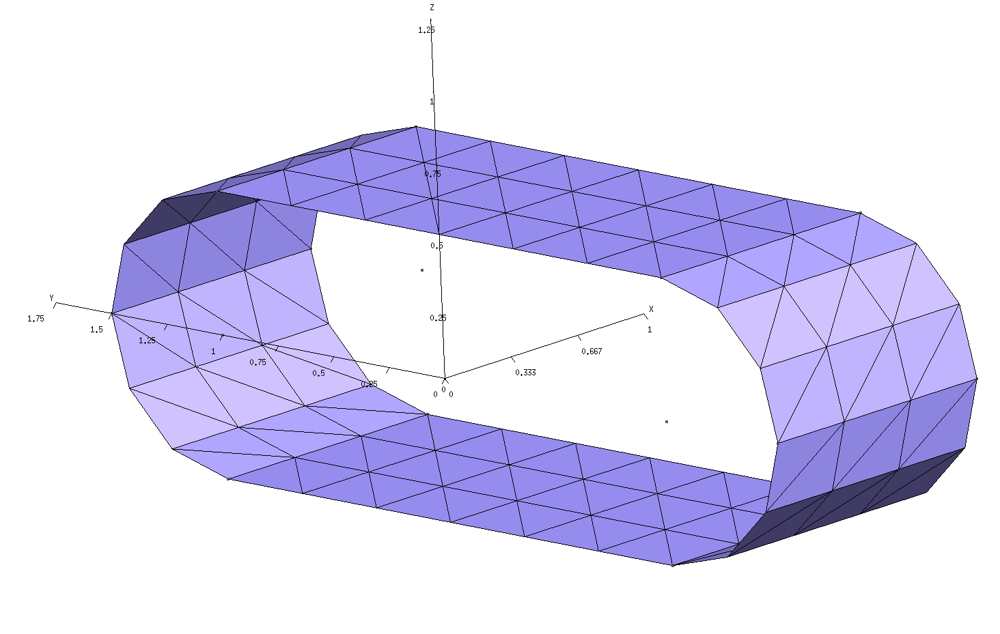
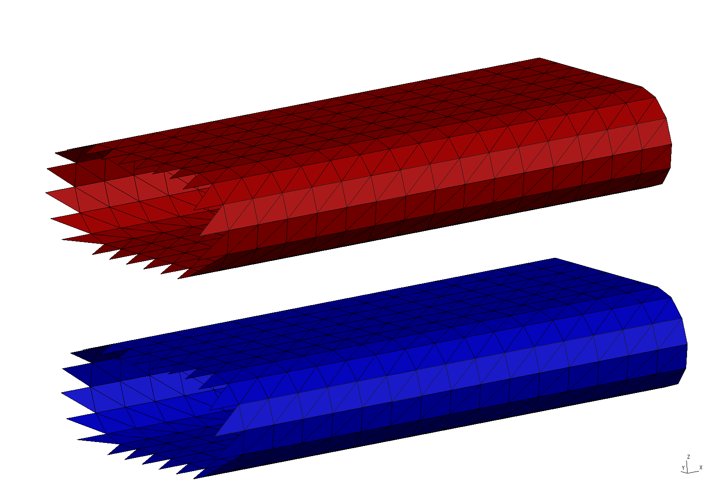
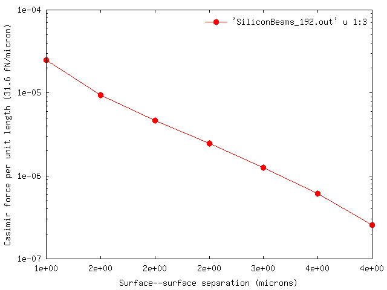

<h1>Casimir forces between infinitely extended silicon beams (1D periodicity)</h1>

In this example, we exploit [[scuff-em]]'s 
support for 1D periodic geometries
to compute the equilibrium Casimir force per unit length 
between infinitely extended silicon beams of 
rounded rectangular cross section.
The files for this example may be found in the
`share/scuff-em/examples/SiliconBeams` subdirectory
of your [[scuff-em]] installation.

--------------------------------------------------

## [[gmsh]] geometry file for unit-cell geometry 

The [[gmsh]] geometry file 
[`RoundedBeamUnitCell.geo`][RoundedBeamUnitCellGeo]
describes the portion of the surface of a single
beam that lies within the *unit cell,*
i.e. the cell that is infinitely periodically
replicated to yield the full geometry.
To produce a discretized surface-mesh
representation of this geometry, we run it through 
[[gmsh]]:

````bash
% gmsh -2 RoundedBeamUnitCell.geo
````


This produces the file `RoundedBeamUnitCell.msh`, which
I rename to `RoundedBeamUnitCell_192.msh` because 192
is the number of interior edges (this information may be 
found, for example, by running 
`scuff-analyze --mesh RoundedBeamUnitCell.msh`).
You can open the `.msh` file in [[gmsh]] to visualize
the unit-cell mesh:

````bash
% gmsh RoundedBeamUnitCell_192.msh
````




Note the following:

 * For 1D periodic geometries in [[scuff-em]], the direction
   of infinite extent must be the *x* direction.

 * Only the sidewall of the cylinder is meshed;
   the endcaps must not be meshed.

 * For surfaces that straddle the unit-cell boundaries
   (as is the case here), each triangle edge that lies
   on the unit-cell boundary must have an identical
   image edge on the opposite side of the unit cell.
   An easy way to achieve this is to use *extrusions*
   in [[gmsh]], as in the `.geo` file above.

 * In this case the unit cell is 1 \(\mu\)m long.
   (More generally, the unit cell could have any 
   length you like.)

--------------------------------------------------

## [[scuff-em]] geometry file 

The [[scuff-em]] 
[geometry file][scuffEMGeometries] 
describing our two infinite-length silicon beams is
[`SiliconBeams_192.scuffgeo`][SiliconBeamsScuffgeo].
This specifies a geometry consisting of two identical
silicon beams, of infinite extent in the *x* direction,
separated by a distance of 2 $\mu$m in the $z$ direction.
The infinite beams consist of the finite-length unit-cell
geometry, periodically replicated infinitely many times.
(The length of the lattice vector specified by the `LATTICE`
statement should agree with the length of the unit cell as 
defined in the [[gmsh]] geometry file.)

````
LATTICE
	VECTOR 1.0 0.0
ENDLATTICE

MATERIAL SILICON
    epsf = 1.035;      # \epsilon_infinity
    eps0 = 11.87;      # \epsilon_0 
    wp = 6.6e15;       # \plasmon frequency
    Eps(w) = epsf + (eps0-epsf)/(1-(w/wp)^2);
ENDMATERIAL

OBJECT Beam1
	MESHFILE RoundedBeamUnitCell_192.msh
	MATERIAL Silicon
ENDOBJECT

OBJECT Beam2
	MESHFILE RoundedBeamUnitCell_192.msh
	MATERIAL Silicon
	DISPLACED 0 0 2
ENDOBJECT
````

We can use [[scuff-analyze]] to visualize the geometry 
described by this `.scuffgeo` file:

````bash
% scuff-analyze --geometry SiliconBeams_192.scuffgeo --WriteGMSHFiles --Neighbors 2
````

[The option `--Neighbors 2` requests that, in addition to the unit-cell
geometry, the first 2 periodic images of the unit cell *in both the 
positive and negative directions* (for a total of 5 copies of the 
unit cell) be plotted as well. This helps to convey a slightly
better sense of the actual infinite-length structure being 
simulated.\] This produces the file `SiliconBeams_192.pp`, which you 
can view in [[gmsh]]:

````bash
% gmsh SiliconBeams_192.pp
````



Note that the visualization file produced by [[scuff-analyze]] includes
extra triangles (visible at the left end of the structure) that are
not present in the unit-cell geometry. These are called <i>straddlers</i>,
and they are added automatically by [[scuff-em]] to account for 
surface currents that flow across the unit-cell boundaries in 
periodic geometries.

--------------------------------------------------

## [[scuff-em]] transformation file 

In Casimir problems we typically want to compute
forces (or torques, or energies) at multiple
values of the surface--surface separation.
This is done by writing a 
[transformation file][scuffEMTransformations].
In this case we'll request the Casimir force between
the beams for 9 distinct values of the surface-surface
separation ranging between 1-5$\mu$m.
The file that specifies this is called
[`Beams.trans`](Beams.trans):

````bash
TRANS 1.00 OBJECT Beam2 DISP 0 0 0.00
TRANS 1.50 OBJECT Beam2 DISP 0 0 0.50
TRANS 2.00 OBJECT Beam2 DISP 0 0 1.00
TRANS 2.50 OBJECT Beam2 DISP 0 0 1.50
TRANS 3.00 OBJECT Beam2 DISP 0 0 2.00
TRANS 3.50 OBJECT Beam2 DISP 0 0 2.50
TRANS 4.00 OBJECT Beam2 DISP 0 0 3.00
TRANS 4.50 OBJECT Beam2 DISP 0 0 3.50
TRANS 5.00 OBJECT Beam2 DISP 0 0 4.00
````

For full details on [[scuff-em]]
transformation files, see 
[this reference page][scuffEMTransformations].
For the time being, note the following:

 * The text `TRANS 4.00` specifies the string `4.00`
   as the *name* of this transformation. This is the string
   that will be written to output files to identify
   the Casimir quantities corresponding to each 
   geometrical transformation. This can be any 
   string not including spaces (in particular, it 
   need not be a number), but it's usually convenient
   to label transformations by numbers so that we can 
   subsequently plot e.g. force vs. distance.

 * The text `OBJECT Beam2 DISP 0 0 3.00` specifies 
   that, in this particular geometrical transformation,
   the object labeled `Beam2` in the `.scuffgeo` file 
   is to be displaced 3 $\mu$m in the *z* direction.

 * Why do we assign the label `4.00` to a transformation
   in which the displacement is 3 $\mu$m? Because 
   transformations are *relative* to the configuration
   described in the `.scuffgeo` file, and in the 
   `.scuffgeo` file discussed above the second beam
   is already displaced a distance of 2 $\mu$m from
   the first beam, which means the default
   surface-surface separation is 1 $\mu$m.
   Applying an addition 3 $\mu$m displacement then
   yields a surface-surface separation of 4 $\mu$m.

You can use [[scuff-analyze]] to obtain a 
visualization of what your geometry looks 
like under each transformation:

````bash
% scuff-analyze --geometry SiliconBeams_192.scuffgeo --TransFile Beams.trans
````

This produces a file named `SiliconBeams_192.transformed.pp`, which
you can open in [[gmsh]] to confirm that the transformations you
got are the ones you wanted.

--------------------------------------------------

## A first trial run of [[scuff-cas3d]] at a single frequency

To compute the full Casimir force per unit length
between the beams (call this quantity $\mathcal F$), 
[[scuff-cas3d]] numerically evaluates an
integral over both imaginary frequencies $\xi$ and Bloch 
wavenumbers $k$:
$$ \mathcal F 
  = \int_0^\infty d\xi
           \underbrace{\left [ \frac{1}{V_{\scriptsize{BZ}}}
                                \int_{V_{\scriptsize{BZ}}}
                                f(\xi, k) dk \,
                       \right]
                      }_{\equiv F(\xi)}
$$
where the $k$ integral is over the Brillouin zone (BZ)
and $V_{\scriptsize{BZ}}$ is the one-dimensional volume 
of the BZ. For a 1D periodic geometry, the Brillouin 
zone is the 1D interval $0\le k \le \frac{2\pi}{L}$,
and its one-dimensional volume (its length) is $\frac{2\pi}{L}$,
where $L=1\, \mu$m is the length of the real-space unit cell.
,
Because the full calculation can be somewhat time-consuming,
it's often useful to run a quick *single-frequency*
calculation just to make sure things are making sense
before launching the full run. We do this by 
specifying the `--Xi` command-line option to
[[scuff-cas3d]], which requests a calculation
of just the quantity $F(\xi)$ in the above
equation at a single imaginary frequency $\xi$.
(Note that, for our 1D periodic geometry,
this single-frequency calculation still entails a 
wavenumber integration over the 1D Brillouin zone.)

````bash
 % scuff-cas3d --geometry SiliconBeams_192.scuffgeo --TransFile Beams.trans --zforce --xi 0.7
````

This produces (among other files) files called 
``SiliconBeams_192.byXi``
and 
``SiliconBeams_192.byXikBloch.``
The former file reports values of the quantity $F(\xi)$,
at the requested value of $\xi$, for each of the
transformations in the `.trans` file. The latter
file gives more granular information: it reports 
values of the quantity $f(\xi,k)$ at the requested 
value of $\xi$ and at each $k$ point sampled by 
the built-in numerical integrator.

The file `SiliconBeams_192.byXi` looks like this:

````bash
# scuff-cas3D run on superhr1 at 06/07/15::01:01:38
# data file columns: 
#1: transform tag
#2: imaginary angular frequency
#3: z-force Xi integrand
#4: z-force error due to numerical Brillouin-zone integration 
1.00 7.000000e-01 1.53365587e-02 1.10343992e-05
1.50 7.000000e-01 3.27174955e-03 6.54894735e-06
...
5.00 7.000000e-01 2.84878401e-06 4.63609357e-08
````

As the file header says, the first column here is the
transform tag (the surface--surface separation), 
the second column is the imaginary angular frequency 
in units of $\xi_0=3\cdot 10^{14}$ rad/sec, and the
third column is the Casimir force per unit length 
per unit frequency (in units of 
 $\hbar c/(\omega_0 L_0^3)=31.6 (\text{fN/micron})/\omega_0$
)
where $L_0=1\mu\text{m}$ and 
where $\text{fN}$=femtoNewtons.

--------------------------------------------------

## The full run

Now just launch the full run:

````bash
 % scuff-cas3d --geometry SiliconBeams_192.scuffgeo --TransFile Beams.trans --zforce
````

(This is the same command line as before, just without the 
``--Xi`` option.) 

After some computation, this produces the output file 
`SiliconBeams_192.out`. You can plot the force (per unit length)
versus surface--surface separation using e.g. [[gnuplot]]:

````bash
% gnuplot
gnuplot> set xlabel 'Surface--surface separation (microns)'
gnuplot> set ylabel 'Casimir force per unit length (31.6 fN/micron)'
gnuplot> set logscale y
gnuplot> plot 'SiliconBeams_192.out' u 1:3 w lp pt 7 ps 1.5
````



--------------------------------------------------

[RoundedBeamUnitCellGeo]: RoundedBeamUnitCell.geo
[SiliconBeamsScuffgeo]: SiliconBeams_192.scuffgeo

{!Links.md!}
