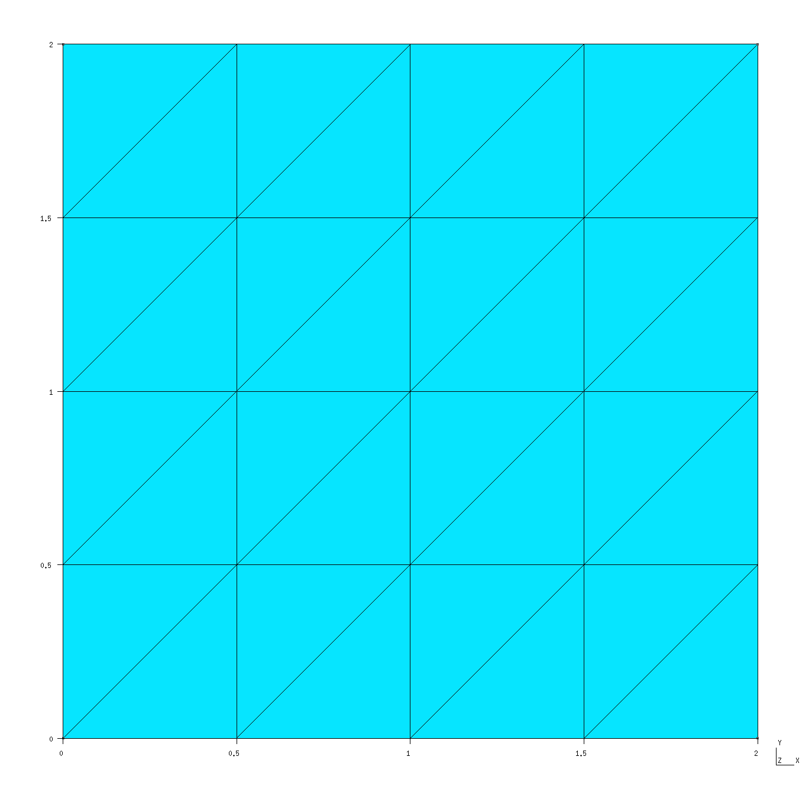
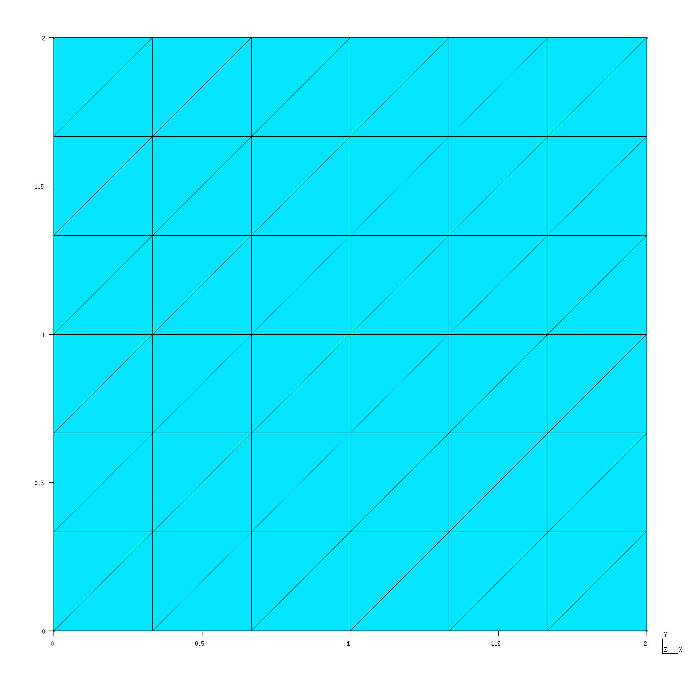
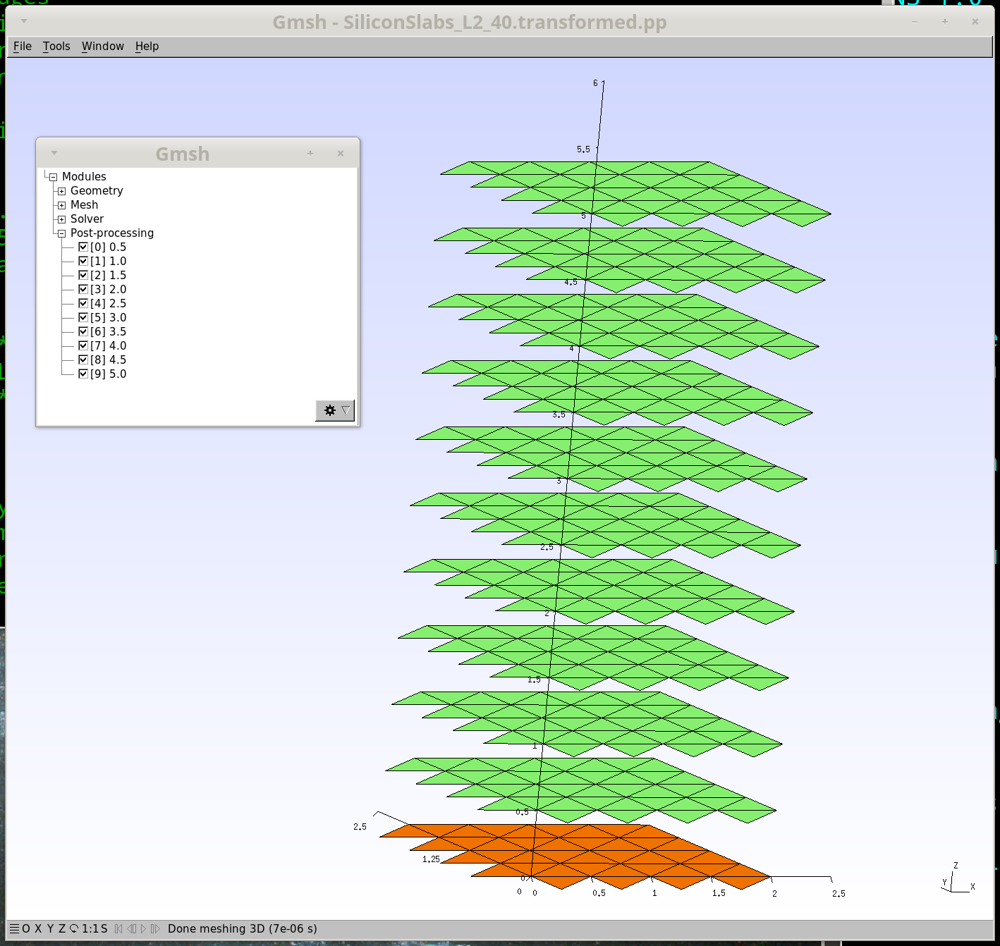
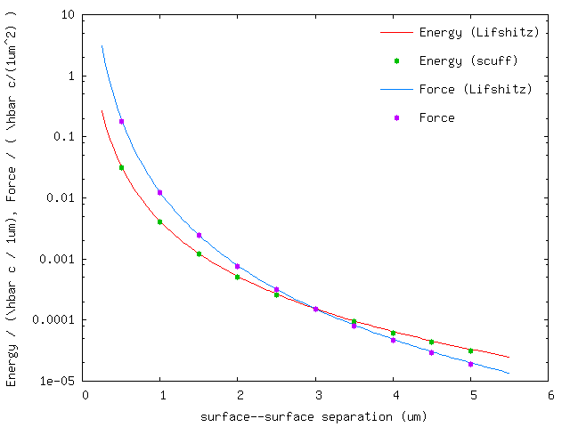

<h1>Casimir forces between infinite-area silicon slabs (2D periodicity)</h1> 

In this example, we exploit [[scuff-em]]'s
[support for 2D periodic geometries][ExtendedGeometries]
to compute the equilibrium Casimir force per unit area
between silicon slabs of infinite surface area.
The files for this example may be found in the
`share/scuff-em/examples/SiliconSlabs` subdirectory
of your [[scuff-em]] installation.

--------------------------------------------------

# [[gmsh]] geometry file for unit-cell geometry 

The [[gmsh]] geometry file [`Square_N.geo`](Square_N.geo)
describes the portion of the surface of a single
slab that lies within the *unit cell,*
i.e. the cell that is infinitely periodically
replicated to yield the full geometry.
In this case, the slab is infinitely thick (it is a 
half-space), so its surface consists of just a single
two-dimensional sheet extending throughout the entire
unit cell. I call this file `Square_N.geo` to 
remind myself that it contains a parameter `N` 
that describes the meshing fineness; more specifically,
`N` defines the number of segments per unit length.

To produce a discretized surface-mesh
representation of this geometry, we run it through 
[[gmsh]]:

````bash
% gmsh -2 Square_N.geo
````

This produces the file `Square_N.msh`, which
I rename to `Square_L2.40.msh` because the side length
of the square is $L=2\,\mu\text{m}$ and because
this particular mesh has 40 interior edges (this
number defines the number of surface-current basis
functions and thus the size of the BEM matrix in a
[[scuff-em]] calculation). Editing the `.geo` file
to change the `N` parameter to 3 (from its default 
value of 2) and re-running `gmsh -2` produces a
finer mesh file, which I rename to `Square_L2_96.msh`.
These meshes may be visualized in [[gmsh]]:

````bash
% gmsh Square_L2_40.msh
% gmsh Square_L2_96.msh
````

** `Square_L2_40.msh`**



** `Square_L2_96.msh`**



Note the following:

 * For 2D periodic geometries in [[scuff-em]], the 
   lattice vectors must lie in the $xy$ plane.

 * For surfaces that straddle the unit-cell boundaries
   (as is the case here), each triangle edge that lies
   on any edge of the unit cell must have an identical
   image edge on the opposite side of the unit cell.
   An easy way to achieve this is to use *extrusions*
   in [[gmsh]], as in the `.geo` file above.

 * In this case the unit cell dimensions are 
   $L_x\times L_y$ where $L_x=L_y=2\, \mu\text{m}$.
   (More generally, $L_x$ and $L_y$ may be any arbitrary
   nonzero values, and they need not equal each other.)

--------------------------------------------------

# [[scuff-em]] geometry file

The 
[<span class="SC">scuff-em</span> geometry file][Geometries]
describing two silicon half-spaces (infinitely-thick slabs)
bounded by the coarser of the two unit-cell meshes described 
above is [`SiliconSlabs_L2_40.scuffgeo`][scuffgeoFile]:

````bash
# SCUFF-EM geometry file for two silicon slabs,
# each of infinite cross-sectional area and infinite
# thickness, separated in the z direction by 1 microns

LATTICE
	VECTOR 2.0 0.0
	VECTOR 0.0 2.0
ENDLATTICE

MATERIAL SILICON
    epsf = 1.035;      # \epsilon_infinity
    eps0 = 11.87;      # \epsilon_0 
    wp = 6.6e15;       # \plasmon frequency
    Eps(w) = epsf + (eps0-epsf)/(1-(w/wp)^2);
ENDMATERIAL

REGION UpperSlab MATERIAL Silicon
REGION Gap       MATERIAL Vacuum
REGION LowerSlab MATERIAL Silicon

SURFACE UpperSurface
	MESHFILE Square_L2_40.msh
	REGIONS UpperSlab Gap
	DISPLACED 0 0 0.5
ENDOBJECT

SURFACE LowerSurface
	MESHFILE Square_L2_40.msh
	REGIONS LowerSlab Gap
ENDOBJECT
````

Note the following points: 

+ Even though our geometry doesn't contain any 
[multi-material junctions][ComplexGeometries],
nonetheless we have to describe it using 
[`REGION` and `SURFACE` statements][ComplexGeometries]
instead of 
[`OBJECT`...`ENDOBJECT` statements][SimpleGeometries]
because the geometry can't be described as one or 
more compact objects embedded in an exterior medium.

+ In the default configuration described by the `.scuffgeo`
file, the slab surfaces are displaced from each other
by a distance of 0.5 $\mu$m. The geometric transformations 
described below will be relative to this default 
separation.

--------------------------------------------------

# [[scuff-em]] transformation file 

The file describing a list of
[geometric transformations][Transformations]
is [`Slabs.trans`](Slabs.trans):

````bash
TRANS 0.5 SURFACE UpperSurface DISP 0 0 0.0
TRANS 1.0 SURFACE UpperSurface DISP 0 0 0.5
TRANS 1.5 SURFACE UpperSurface DISP 0 0 1.0
TRANS 2.0 SURFACE UpperSurface DISP 0 0 1.5
TRANS 2.5 SURFACE UpperSurface DISP 0 0 2.0
TRANS 3.0 SURFACE UpperSurface DISP 0 0 2.5
TRANS 3.5 SURFACE UpperSurface DISP 0 0 3.0
TRANS 4.0 SURFACE UpperSurface DISP 0 0 3.5
TRANS 4.5 SURFACE UpperSurface DISP 0 0 4.0
TRANS 5.0 SURFACE UpperSurface DISP 0 0 4.5
````

It's convenient to visualize the effect of these
transformations on our geometry before we run the calculation:

````bash
% scuff-analyze --geometry SiliconSlabs_L2_40.scuffgeo --TransFile Slabs.trans
````

This produces the file `SiliconSlabs_L2_40.transformed.pp`,
which can be visualized by opening it in [[GMSH]]:



--------------------------------------------------

# Launching the run

Here's a `bash` script that will run the full Casimir 
calculation on both the coarser and finer meshes:

````bash
# /bin/bash

for N in 40 192
do
  ARGS=""
  ARGS="${ARGS} --geometry   SiliconSlabs_L2_${N}.scuffgeo"
  ARGS="${ARGS} --TransFile  Beams.trans"
  ARGS="${ARGS} --BZSymmetry BZSymmetry"
  ARGS="${ARGS} --energy"
  ARGS="${ARGS} --zForce"

  scuff-cas3D ${ARGS}
done
````

This produces the files `SiliconSlabs_L2_40.out`
and `SiliconSlabs_L2_96.out`. The former file looks
like this:

````bash
# scuff-cas3D run on superhr1 at 06/15/15::23:50:32
# data file columns: 
#1: transform tag
#2: energy 
#3: energy error due to numerical Xi integration 
#4: z-force 
#5: z-force error due to numerical Xi integration 
0.5 -1.254502e-01 5.463886e-05 -7.264755e-01 3.268714e-04 
1.0 -1.631064e-02 5.770642e-06 -4.865678e-02 2.055737e-05 
...
````

Now plot the energy and force per unit area vs.
separation distance:

````bash
% gnuplot
gnuplot> set xlabel 'surface--surface separation (um)'
gnuplot> set ylabel 'Energy / (\hbar c / 1um), Force / ( \hbar c/(1um^2) )'
gnuplot> set logscale y
gnuplot> FILE='SiliconSlabs_L2_N40.out'
gnuplot> plot FILE u 1:2 t 'Energy (SCUFF)', '' u 1:4 t 'Force (SCUFF)'

````



In this plot, the solid lines are the results of the Lifshitz
formula for the Casimir energy and force between silicon
slabs.

[SimpleGeometries]: ../../reference/Geometries.md#Simple
[ComplexGeometries]: ../../reference/Geometries.md#Complex
[ExtendedGeometries]: ../../reference/Geometries.md#Extended
[Geometries]: ../reference/Geometries
[Transformations]: ../reference/Transformations
[scuffgeoFile]: SiliconSlabs_L2_40.scuffgeo
