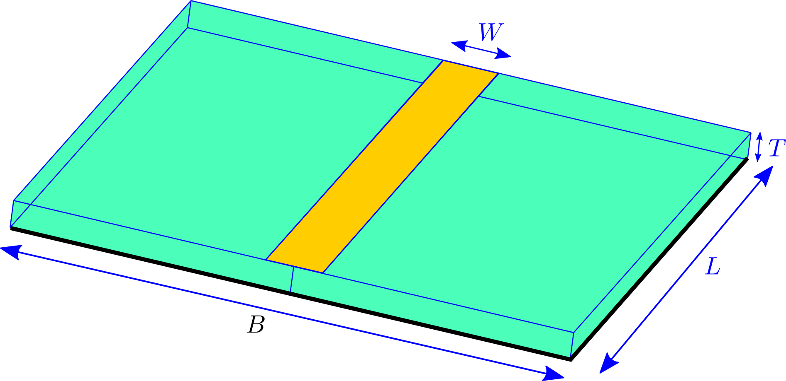
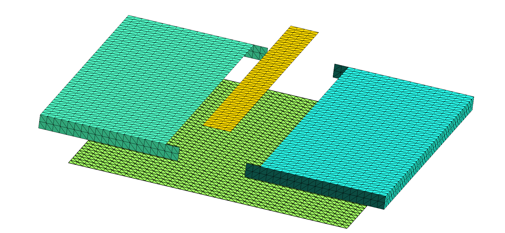
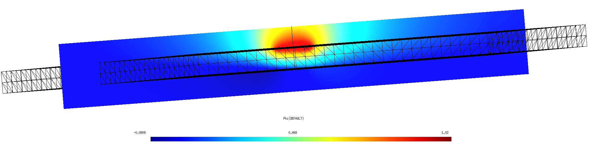

# Capacitance of a PCB stripline trace

In this example, we use [[scuff-static]] to compute the
capacitance of a metal trace on an FR4 printed circuit board (PCB)
with ground plane. Here's a schematic depiction:



Here the green region is dielectric, the yellow region
is an (infinitesimally thin) metallic trace on the upper surface
of the dielectric, and black indicates a ground plane
on the bottom surface of the dielectric.

## [[gmsh]] and <span class="SC">scuff-em</span> geometry files

Due to the presence of [multi-material junctions][MMJs]
(points at which three or more material regions meet, which in the 
figure above occur along the edges of the metal trace and the
ground plane), the geometry cannot be described as a collection
of 3D volumes bounded by closed surfaces, and instead requires
a more sophisticated geometry description in terms of
[*regions* and *surfaces*][MMJs]. More specifically, there
are only two regions in the problem (the exterior vacuum region
and the dielectric), but there are three distinct surfaces:
 **(1)** the metal trace, **(2)** the dielectric-air interface, 
and **(3)** the ground plane.
To define a [[scuff-em]] geometry description
for this case, we need separate meshes for each of these
three surfaces. The following picture shows these three surface
meshes, displaced for clarity from their positions in the actual
geometry:



Here's a [<span class="SC">gmsh</span>][GMSH] geometry file
defining the various surfaces we need; note that this file makes
three `Physical Surface` statements to define surfaces **(1)**, **(2)**, 
and **(3)** above. 

 + [`StriplineCapacitor.geo`](StriplineCapacitor.geo)

This file contains user-specifiable parameters
`W`, `L`, `T`, and `B` corresponding to the geometric quantities 
labeled in the figure above, as well as a user-specifiable parameter `N`
setting the number of triangles per unit length. I generate surface
meshes at two different resolutions like this:

```bash
% gmsh -2 -setnumber N 2 StriplineCapacitor.geo
% gmsh -2 -setnumber N 4 StriplineCapacitor.geo
```

These produce `.msh` files containing respectively 1948 and 7856
inner triangle edges (you can get this information by running
`scuff-analyze --mesh StriplineCapacitor.msh`), so I rename them
to `StriplineCapacitor_1948.msh` and 
`StriplineCapacitor_7856.msh.`

Next I write a [<span class="SC">scuff-em</span> geometry file][scuffGeometries]
for each meshing resolution. This file defines the two regions and
the three surfaces defined above, specifying that the meshes for
each surface
are to be read from the `.msh` file with the appropriate `Physical Surface`
tag.
For the coarser-resolution mesh the file is called
 [`StriplineCapacitor_1948.scuffgeo`](StriplineCapacitor_1948.scuffgeo),
and it looks like this:

```
REGION Exterior   MATERIAL Vacuum
REGION Dielectric MATERIAL CONST_EPS_4

OBJECT Trace
    MESHFILE StriplineCapacitor_1948.msh
    MESHTAG 1
ENDOBJECT

SURFACE RightBoundary
    MESHFILE StriplineCapacitor_1948.msh
    MESHTAG 2
    REGIONS Exterior Dielectric
ENDSURFACE

SURFACE LeftBoundary
    MESHFILE StriplineCapacitor_1948.msh
    MESHTAG 2
    ROTATED 180 ABOUT 0 0 1
    REGIONS Exterior Dielectric
ENDSURFACE

OBJECT GroundPlane
    MESHFILE StriplineCapacitor_1948.msh
    MESHTAG 3
ENDOBJECT
```

Some notes on this geometry description:

 + Since the default material for an `OBJECT` or `SURFACE`
is PEC (**P**erfectly **E**lectrically **C**onducting), I
don't need to include a `Material` specification for the
trace or the ground plane.

 + I have broken up surface 2 (dielectric--vacuum interface)
 into two halves, described by identical surface meshes 
 with one rotated 180 degrees around the *z* axis. This is 
not necessary, but it saves a little time in the matrix 
assembly, as the diagonal matrix blocks corresponding to the
two half-surfaces are identical and thus only need to be 
computed once.

 + This geometry specification is perfectly adequate for
electrostatic problems, but would be not quite right for
finite-frequency problems. For such problems I would 
instead want to define the trace and ground plane 
as regions of (in this case, infinite) surface conductivity
on a closed dielectric boundary surface.

 + Having written this `.scuffgeo` file for the coarser of my two
surface meshes, I can obtain one for the finer mesh by going like
this:

```
 BASE=StriplineCapacitor
 sed 's/1948/7856/g' ${BASE}_1948.scuffgeo > ${BASE}_7856.scuffgeo
```

## Calculation of capacitance matrix

To compute the capacitance matrices for the two mesh resolutions,
go like this from the shell command line:

````bash
for N in 1948 7856 
do
 GEOM=StriplineCapacitor_${N}
 scuff-static --geometry ${GEOM}.scuffgeo --CapFile ${GEOM}.CapMatrix
done
````

This produces files
`StripLineCapacitor_1948.CapMatrix`
and 
`StripLineCapacitor_7856.CapMatrix`
reporting capacitance-matrix entries.

These files look something like this:

````bash
# scuff-static run on hikari (02/18/17::18:46:43)# indices of conducting surfaces: # data file columns: 
# 0 Trace
# 1 GroundPlane
# 01: C_{0,0} 
# 02: C_{0,1} 
# 03: C_{1,1} 
3.644861e+01 -3.080723e+01 1.142077e+02 
````

The three numbers reported here are the capacitance-matrix
entries $C_{11}$, $C_{12}$, $C_{22}$ divided by $\epsilon_0.$
The capacitance from trace to ground plane is
$$
 \begin{array}{lcl} 
 C &=& \displaystyle{
        \frac{1}{\frac{1}{C_{11}} + \frac{1}{C_{22}} - \frac{2}{C_{12}}}
                    }
\\[5pt]
   &=& \displaystyle{
         \frac{1}{   \frac{1}{\texttt{36.45}}
                   + \frac{1}{\texttt{114.2}}
                   + \frac{2}{\texttt{30.81}}
                 }  }
       \cdot \texttt{8.85e-12}
\\[5pt]
   &=& 0.89 \texttt{pf}
 \end{array}
$$

## Field visualization

Here's a cross-sectional plot of electrostatic potential
with the trace and ground plane maintained at potentials
of 1 and 0 volt respectively:



This plot is generated as follows:

````bash
ARGS=""
ARGS="${ARGS} --geometry StriplineCapacitor_7876.scuffgeo"
ARGS="${ARGS} --PotFile MyPotentialFile"
ARGS="${ARGS} --FVMesh FVMesh.msh"
scuff-static ${ARGS}
````

Here [`MyPotentialFile`](MyPotentialFile) is a text file 
specifying the conductor potentials and `FVMesh.msh` is a 
field-visualization screen mesh produced by [[gmsh]] from 
the file [`FVMesh.geo`](FVMesh.geo).

## Capacitance vs. PCB thickness

Here's a [[bash]] script that computes capacitance vs. PCB
thickness:

 + [`CapVsT.sh`](CapVsT.sh)

 For each thickness value `T` in the file `TFile,`
this script

 + runs [[gmsh]] to create a new surface mesh for a PCB stripline
   with thickness `T`

 + runs [[scuff-static]] to compute the capacitance matrix for this thickness

 + extracts the data from the `.CapMatrix` file output and writes 
   it together with `T` to an overall output file.

According to [this memo][PCBTraceMemo], the 
capacitance per unit length (CPUL)
of a stripline trace with the geometry shown above is

$$ \texttt{CPUL} = 
   \frac{1}{25.4}\cdot\frac{0.67(\epsilon_r + 1.41)}
                           {\ln \left[5.98H/(0.8W + T)\right]}
   \qquad \text{pf/mm}
$$
where $\epsilon_r$ is the relative dielectric constant
and $T=0$ for an infinitesimally thin trace.
(The factor 1/25.4 converts units from pf/inch to pf/mm).

--------------------------------------------------

[MMJs]:        		../../reference/Geometries#Complex
[GMSH]:                 http://www.geuz.org/gmsh
[scuffGeometries]:      ../../reference/Geometries
[PCBTraceMemo]:		http://www.analog.com/media/en/training-seminars/tutorials/MT-094.pdf
