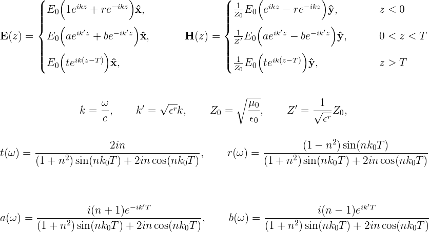
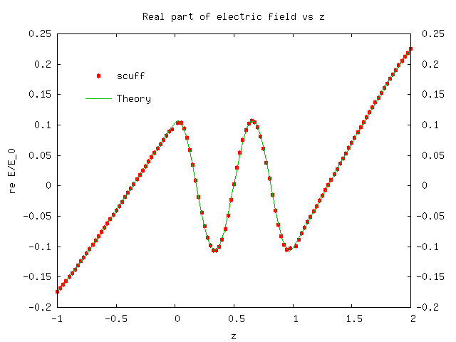
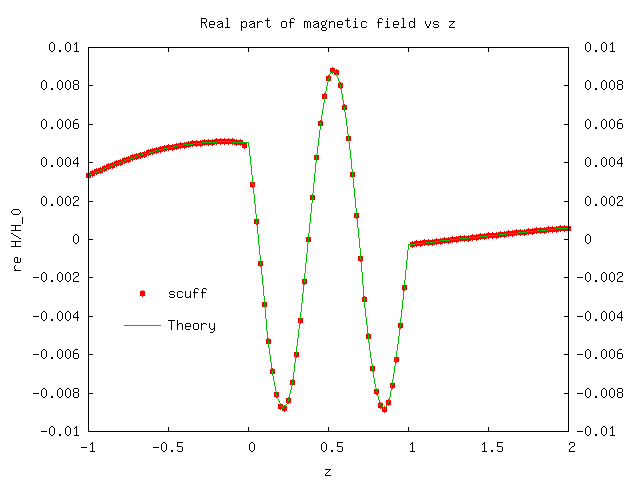

# Spatially-resolved study of plane-wave transmission through an (infinite-area) thin dielectric film

The previous examples dealt with *compact* scatterers. We'll next consider an 
[*extended*][ExtendedGeometries] geometry -- namely, a thin dielectric film of 
finite thickness in the *z* direction but infinite extent in the *x* and *y* 
directions. This is the same geometry for which we used [[scuff-transmission]] 
to look at the plane-wave transmission and reflection coefficients as a function 
of frequency in [this example][scuffTransmissionThinFilm],
but here we'll do a different calculation -- namely, we'll pick a single 
frequency and look at how the electric and magnetic fields vary in space, 
both inside and outside the thin film. (The files for this example may be 
found in the `share/scuff-em/examples/ThinFilm` directory of your [[scuff-em]]
installation.)

The mesh file and `.scuffgeo` file for this geometry are discussed in the 
[documentation for <span class="SC">scuff-transmission</span>][scuffTransmission].
The geometry consists of a film of thickness *T*=1μm, with relative dielectric 
constant $\epsilon^r=100$, illuminated from below by a plane wave at normal 
incidence. (We'll take the incident field to be linearly polarized with **E** field 
pointing in the *x* direction.) The lower and upper surfaces of the film are at 
*z=0* and *z=T.* For this geometry it is easy to solve Maxwell's equation directly 
to obtain the **E** and **H** fields directly at points below, within, and above 
the film:



We will try to reproduce this behavior using 
[[scuff-scatter]]. 

First create a little text file 
([ThinFilm.EvalPoints](ThinFilm.EvalPoints)) containing the 
coordinates of a bunch of points on a straight line passing 
from below the film to above the film. Then put the following 
command-line arguments into a file called `ThinFilm_58.args:`

````bash
 geometry ThinFilm_58.scuffgeo
 cache ThinFilm_58.scuffcache
 omega 1.0
 EPFile ThinFilm.EvalPoints
 pwDirection 0 0 1
 pwPolarization 1 0 0
````

and pipe it into [[scuff-scatter]]:

````bash
 scuff-scatter < scuff-scatter.args
````

This produces files named `ThinFilm.scattered` and 
`ThinFilm.total`. Looking at the first few lines of these
files, we see that the 3rd data column on each line is 
the $z$ coordinate of the evaluation point, the 4th column
is the real part of $E_x$, and the 12th column is 
the real part of $H_x$. Thus, plotting the 4th vs. 3rd
and 12th vs. 3rd columns of the `.total` file yields plots of
the total 
electric and magnetic field vs. $z$, whereupon we find good
agreement with theory:





[ExtendedGeometries]:                             ../../reference/Geometries.md#Extended
[scuffTransmissionThinFilm]:                      http://homerreid.com/scuff-em/scuff-transmission/index.shtml#ThinFilm
[scuffTransmission]:                              http://homerreid.com/scuff-em/scuff-transmission
