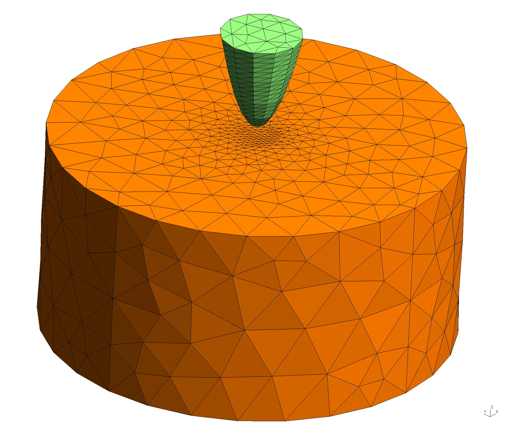
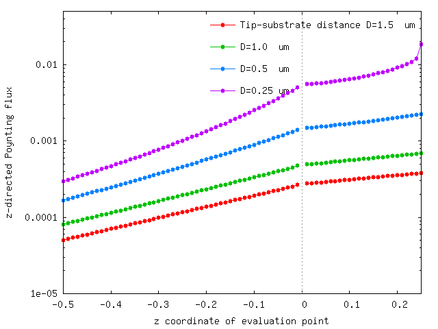

# Spatial distribution of heat flux from a warm tip over a cold substrate

The files for this example may be found in the
`share/scuff-em/examples/TipSubstrate` subdirectory
of your [[scuff-em]] installation.

--------------------------------------------------

## [[gmsh]] geometry files for paraboloidal tip and cylindrical substrate

+ [`Paraboloid.geo`](Paraboloid.geo)
+ [`Cylinder.geo`](Cylinder.geo)

The following script generates coarse and fine meshes of 
these objects; it uses [this script][RenameMesh].

````bash
#!/bin/bash
for SHAPE in Paraboloid Cylinder
do
  for L in 1.0 0.5
  do
    gmsh -2 -clscale ${L} ${SHAPE}.geo -o ${SHAPE}.msh
    RenameMesh ${SHAPE}.msh
  done
done
````

--------------------------------------------------

## [[gmsh]] geometry files

+ [`TipSubstrate_Coarse.scuffgeo`](TipSubstrate_Coarse.scuffgeo)
+ [`TipSubstrate_Fine.scuffgeo`](TipSubstrate_Fine.scuffgeo)



--------------------------------------------------

## List of geometric transformations

+ [`TipSubstrate.trans`](TipSubstrate.trans)

--------------------------------------------------

## List of evaluation points

+ [`EPFile`](EPFile)

--------------------------------------------------

## Command-line arguments

+ [`EPFile`](EPFile)

--------------------------------------------------

## Run [[scuff-neq]]

````bash
#!/bin/bash
ARGS=""
ARGS="${ARGS} --geometry ../TipSubstrate_Fine.scuffgeo"
ARGS="${ARGS} --TransFile ../TipSubstrate.trans"
ARGS="${ARGS} --Omega 0.7"
ARGS="${ARGS} --EPFile ../EPFile"
ARGS="${ARGS} --Power --ZForce"

scuff-neq ${ARGS}
````

--------------------------------------------------

## Plot $z$-directed Poynting flux from the tip through the vacuum and into the substrate:

````bash
gnuplot> plot 'TipSubstrate_Fine.SRFlux' u 5:9
````



[RenameMesh]: ../../applications/scuff-analyze/scuff-analyze.md#RenameMesh
