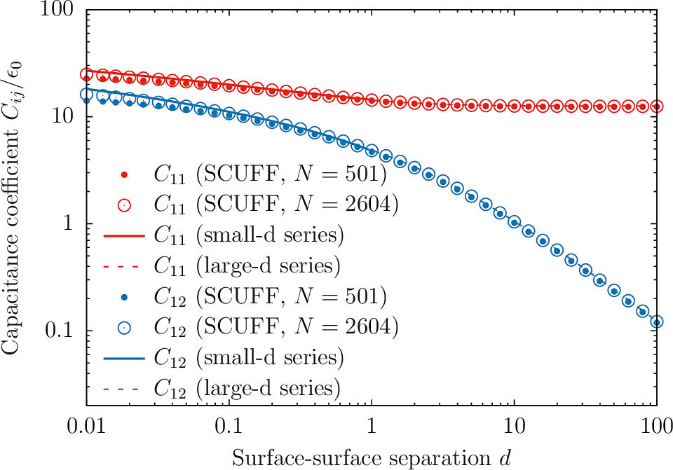

<h1>Capacitance of parallel-plate and two-sphere capacitors</h1>

In this example, we exploit [[scuff-em]]'s
[electrostatics module][scuff-static]
to compute the capacitance of parallel-plate and two-sphere
capacitors. 

The files for this example may be found in the
`share/scuff-em/examples/TwoBodyCapacitors` subdirectory
of your [[scuff-em]] installation.

# Capacitance of a parallel-plate capacitor

I consider a parallel-plate capacitor consisting of
two square conducting plates of side length $L$ separated by
various distances $d$. Neglecting fringing-field (i.e.
finite-size) effects, the capacitance is $C(d)=\epsilon_0 \frac{L^2}{d}.$

## Creating <span class=SC>scuff-em</span> input files

Because [electrostatics is scale-invariant][ScaleInvariance],
I can choose length units arbitrarily, and I will choose
units in which $L=1$. 
To specify my geometry thus
requires meshed representations of squares of side
length 1, which I generate (at two different meshing
resolutions) like this in [<span class=SC>gmsh</span>][GMSH]:

````bash
% gmsh -setnumber N 10 -2 Square_N.geo -o Square.msh 
% RenameMesh Square.msh
% gmsh -setnumber N 20 -2 Square_N.geo -o Square.msh 
% RenameMesh Square.msh
````

Here [`Square_N.geo`](Square_N.geo) is the
<span class=SC>gmsh</span> input file
and [`RenameMesh`](RenameMesh) is a little script that uses
[<span class=SC>scuff-analyze</span>][scuff-analyze] to
count the number of interior edges in a surface mesh and
rename the file accordingly.

This produces files named
`Square_280.msh` and `Square_1160.msh`.
Now write 
[<span class=SC>scuff-em</span> geometry files][GeometryFiles]:

+[`TwoPlateCapacitor_280.scuffgeo`](TwoPlateCapacitor_280.scuffgeo)
    
+[`TwoPlateCapacitor_1160.scuffgeo`](TwoPlateCapacitor_1160.scuffgeo)

and a
[list of geometrical transformations][Transformations]
describing 20 values of the plate-plate spacing $d$
ranging from $d=0.01L$ to $d=L$:

+[`TwoPlateCapacitor.trans`](TwoPlateCapacitor.trans)

Before running calculations, double-check that our `.scuffgeo`
and `.trans` files file correctly describe the range of geometries
we want to study:

````bash
% scuff-analyze --geometry TwoPlateCapacitor_280.scuffgeo --transfile TwoPlateCapacitor.trans 
% gmsh TwoPlateCapacitor_280.transformed.pp
````


## Running the calculation

````bash
% for N in 280 1160
% do
%   ARGS=""
%   ARGS="${ARGS} --geometry  TwoPlateCapacitor_${N}.scuffgeo"
%   ARGS="${ARGS} --TransFile TwoPlateCapacitor.trans"
%   ARGS="${ARGS} --CapFile   TwoPlateCapacitor_${N}.out"
%   scuff-static ${ARGS}
% done
````

## Plotting the data

````bash
% gnuplot
gnuplot> set logscale xy
gnuplot> plot 'TwoPlateCapacitor_280.out' u 1:(abs($3)) t 'SCUFF, N=280' w p pt 7 ps 1, 'TwoPlateCapacitor_1160.out' u 1:(abs($3)) t 'SCUFF, N=1160' w p pt 6 ps 2, 1/x w l lw 2 t 'Theoretical Prediction'
````


The deviations from the theoretical prediction at small $d$ are
due to finite mesh resolution and are reduced in the finer-mesh
calculation. On the other hand, the deviations at large $d$ are
due to the finite size of the plates and are not changed by 
computing at finer resolution.

# Capacitance of a two-sphere capacitor

The `share/scuff-em/examples/TwoBodyCapacitors` subdirectory
of your [[scuff-em]] installation also contains input files
for computing the self- and mutual capacitances of a capacitor
consisting of two conducting spheres of radius $R$ separated by a 
surface-surface separation distance $d$ (center-center separation $d+2R$).
Analytical formulas for the self-capacitance $C_{11}=C_{22}$ and mutual
capacitance $C_{12}=C_{21}$ for this case may be found in this paper
from 1926:

+ A. Russell, "The problem of the spherical condenser", *Journal of the Institution of Electrical Engineers* &nbsp; ** 64 ** &nbsp; 727 (1926). DOI: [10.1049/jiee-1.1926.0065](http://dx.doi.org/10.1049/jiee-1.1926.0065)

The <span class=SC>scuff-static</span> computation proceeds as above with
new geometry and transformation files:

+ [`TwoSphereCapacitor_501.scuffgeo`](TwoSphereCapacitor_501.scuffgeo)
+ [`TwoSphereCapacitor_2604.scuffgeo`](TwoSphereCapacitor_2604.scuffgeo)
+ [`TwoSphereCapacitor.trans`](TwoSphereCapacitor.trans)

````bash
% for N in 501 2604
% do
%   ARGS=""
%   ARGS="${ARGS} --geometry  TwoSphereCapacitor_${N}.scuffgeo"
%   ARGS="${ARGS} --TransFile TwoSphereCapacitor.trans"
%   ARGS="${ARGS} --CapFile   TwoSphereCapacitor_${N}.out"
%   scuff-static ${ARGS}
% done
````

This time we'll plot both $C_{11}(d)$ and $C_{12}(d)$ and
compare against the large-$d$ and small-$d$ analytical formulas
in the paper of Russel above.



Here's the [<span class=SC>gnuplot</span>][GNUPLOT] script I used
to make this plot: [`TwoSphereCapacitor.gp`](TwoSphereCapacitor.gp).

[Transformations]:     ../../reference/Transformations
[GeometryFiles]:       ../../reference/Geometries
[ScaleInvariance]:     ../../reference/FAQ.md#Units
[RenameMesh]:          ../../examples/SiO2Spheres/RenameMesh
[scuff-static]:        ../../applications/scuff-static/scuff-static.md
[GMSH]:                http://www.geuz.org/gmsh
[GNUPLOT]:             http://www.gnuplot.info
