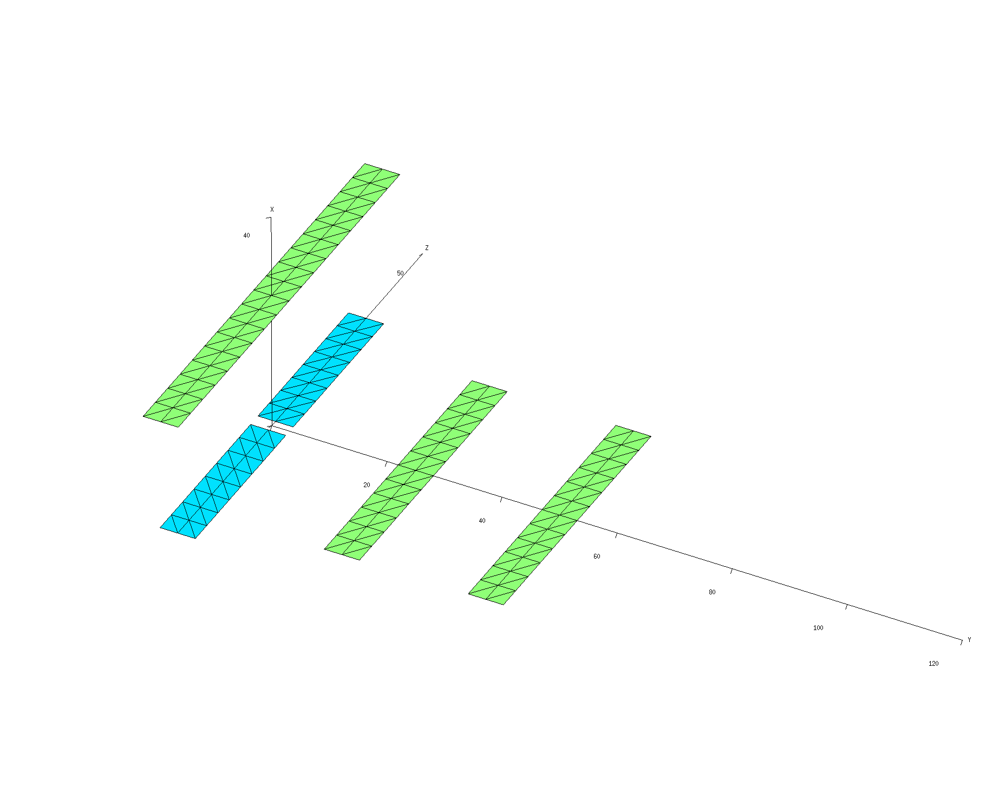
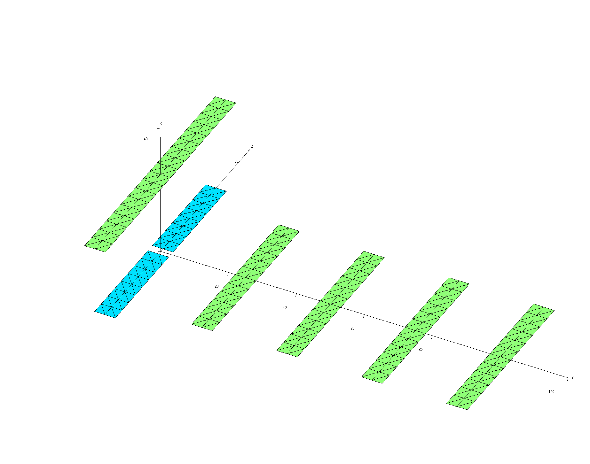
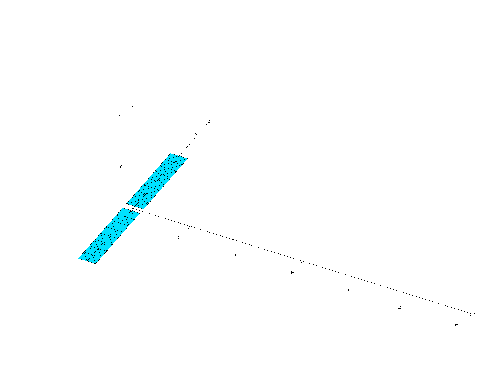
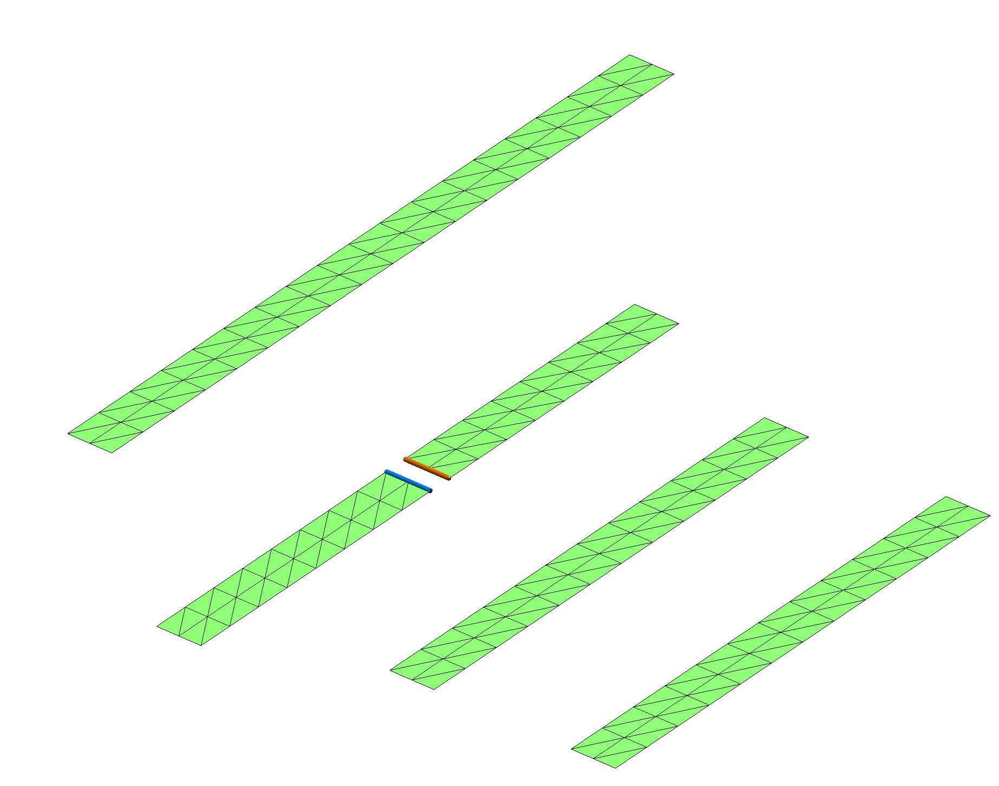
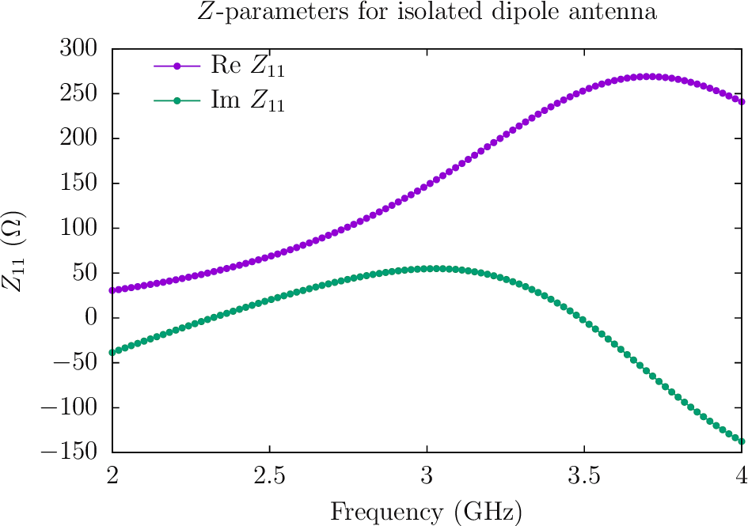
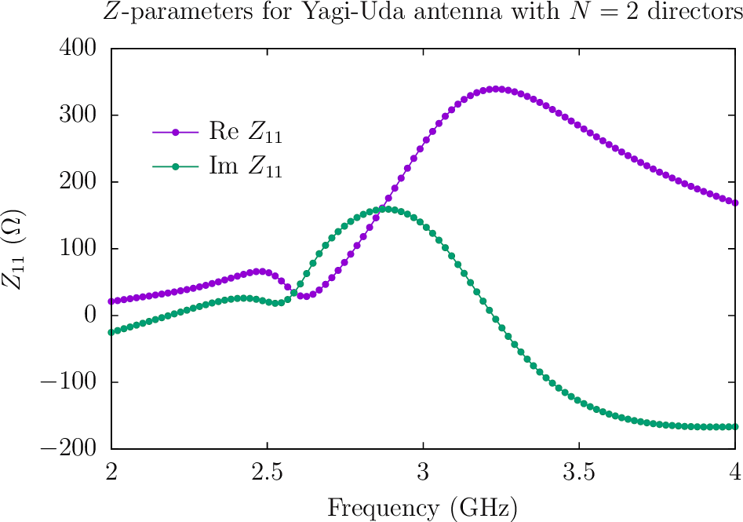
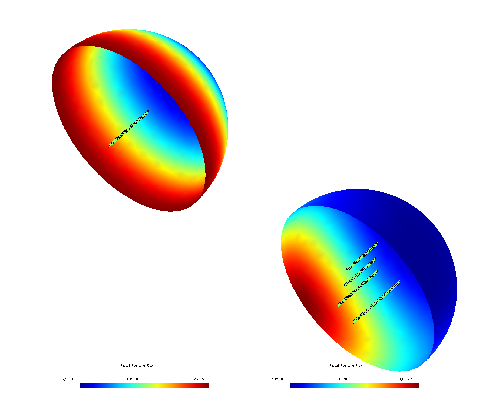

# S-parameters, directivity, and radiated field patterns of Yagi-Uda antennas

In this example we'll use the
[<span class=SC>scuff-rf</span> application module][scuffRF]
 within the 
<span class=SC>scuff-em</span>
suite to investigate a Yagi-Uda antenna design.
We will consider both free-standing antennas and antennas
printed on PCBs, with the effect of the PCB handled
implicitly using [<span class=SC>scuff-em</span>'s support
for implicit treatment of multilayer dielectric substrates.][SubstrateMemo]
We will look at both **(a)** input impedance vs. frequency, **(b)**
radiation patterns and directivity for antennas driven at a given 
frequency with given port currents.

The files for this example may be found in 
the `share/scuff-em/examples/YagiUdaAntennas` directory
of your [[scuff-em]] installation.

## <span class=SC>gmsh</span> geometry and mesh files

The [[gmsh]] geometry file [PlanarYUAntenna.geo](PlanarYUAntenna.geo)
describes three separate structures: a dipole antenna
with a small feed inlet that will be the driven element
in our Yagi-Uda antenna, a reflector, and a director.

````bash
% gmsh -clscale 1   -2 PlanarYUAntenna.geo -o PlanarYUAntenna_Medium.msh
% gmsh -clscale 0.5 -2 PlanarYUAntenna.geo -o PlanarYUAntenna_Fine.msh
````

The various [[scuff-em]] geometry files below then describe Yagi-Uda
antennas consisting of the driven dipole element, optionally
with a reflector, and optionally with one or more directors.

+ [[scuff-em]] geometry file for Yagi-Uda antenna with reflector and 2 directors: [`YUAntenna_N2_Medium.scuffgeo`](YUAntenna_N2_Medium.scuffgeo)

+ [[scuff-em]] geometry file for Yagi-Uda antenna with reflector and 4 directors: [`YUAntenna_N4_Medium.scuffgeo`](YUAntenna_N4_Medium.scuffgeo)

+ [[scuff-em]] geometry file for just the dipole element of the YU antenna alone: [`DipoleAntenna_Medium.scuffgeo`](DipoleAntenna_Medium.scuffgeo)

## Visualize <span class=SC>scuff-em</span> geometries:

#### Antenna with $N=2$ directors:

````bash
% export SCUFF_MESH_PATH=./mshFiles
% scuff-analyze --geometry scuffgeoFiles/YUAntenna_N2_Medium.scuffgeo --WriteGMSHFiles
% gmsh YUAntenna_N2_Medium.pp
````


#### Antenna with $N=4$ directors:

````bash
% export SCUFF_MESH_PATH=./mshFiles
% scuff-analyze --geometry scuffgeoFiles/YUAntenna_N4_Medium.scuffgeo --WriteGMSHFiles
% gmsh YUAntenna_N4_Medium.pp
````



#### Just the dipole element in isolation:

````bash
% export SCUFF_MESH_PATH=./mshFiles
% scuff-analyze --geometry scuffgeoFiles/DipoleAntenna_Medium.scuffgeo --WriteGMSHFiles
% gmsh DipoleAntenna_Medium.pp
````



### Port file

The file [`Dipole.ports`](Dipole.ports) specifies
the RF ports of the structure; in this case there is
just one port, whose positive and negative terminals
are the upper and lower edges of the feed gap in the 
driven dipole element.

To verify that [[scuff-rf]] interprets the `.ports` file
correctly to describe the actual ports we intended, we
do a quick run of [[scuff-rf]] with the `--PlotPorts` option:

````
 % export SCUFF_MESH_PATH=./mshFiles
 % scuff-rf --geometry scuffgeoFiles/YUAntenna_N2_Medium.scuffgeo --PortFile portFiles/Dipole.ports --PlotPorts
 % gmsh YUAntenna_N2_Medium.pp YUAntenna_N2_Medium.ports.pp
````



The red- and blue-highlighted regions of the structure are the
positive and negative terminals of the port.

### First run to compute $S$- and $Z$-parameters

The simple shell script [`RunScript.SZParms`](RunScript.SZParms)
computes $S$- and $Z$-parameters for the various structures
over a range of frequencies. I plot the results in
[<span class=SC>gnuplot</span>](www.gnuplot.info) using
this script: [`Plotter.zparms`](Plotter.zparms).

````bash
 % RunScript.SZParms
 % gnuplot
 gnuplot> load 'Plotter.zparms'
````





### Second run to compute radiation patterns

Based on the $Z$-parameter data, it looks like the $N=2$ Yagi
antenna wants to radiate at a frequency around 3.2 GHz. So let's
drive the antenna with a unit-strength current at that frequency
and visualize the resulting radiation patterns by plotting
outgoing Poynting flux on a hemispherical surface.
The simple shell script [`RunScript.FieldPatterns`](RunScript.FieldPatterns)
does this for the various antennas:

```bash
#!/bin/bash

CODE=scuff-rf

BASE=.
export GEODIR=${BASE}/scuffgeoFiles
export SCUFF_MESH_PATH=${BASE}/mshFiles

ARGS=""
ARGS="${ARGS} --portfile ${BASE}/portFiles/Dipole.ports"
ARGS="${ARGS} --portcurrentFile ${BASE}/portcurrentFiles/Dipole.PortCurrents"
ARGS="${ARGS} --FVMesh Hemisphere.msh"

for GEOM in DipoleAntenna YUAntenna_N2 YUAntenna_N4
do
  ${CODE} ${ARGS} --geometry ${GEODIR}/${GEOM}_Medium.scuffgeo
done
```

Notes:

+ The file [`Dipole.PortCurrents`](Dipole.PortCurrents) is a
list of frequencies at which to run calculations and the currents 
to force into each port at those frequencies. For a geometry
with $N$ ports, each line of this file has $2N+1$ columns: the 
frequency in GHz followed by the real and imaginary parts of 
the current to force into each port. For the case at hand, we
want to run at just the single frequency $f$=3.2 GHz with 
a unit-strength current forced into port 1, so the `.PortCurrents` 
file looks simply like 

```
 3.2 1.0 0.0
```

+ The field-visualization mesh `Hemisphere.msh` is a [[gmsh]] surface
  mesh produced from the [[gmsh]] geometry file 
  [`Hemisphere.geo`](Hemisphere.geo). You can get higher-resolution images
  by meshing this file with higher resolution.

Running the above script produces files with names 
like `YUAntenna_N2_Medium.Hemisphere.pp`
showing outgoing Poynting flux plotted over the hemisphere mesh.
Here's a composite image showing results for the isolated dipole
and the $N=2$ Yagi-Uda antennas, with
the antenna meshes superposed (and enlarged by a factor of 5&times; to 
make it easier to see them). The simple dipole antenna radiates
isotropically, while the Yagi antenna exhibits high directivity.



### Python-driven directivity optimization

[SubstrateMemo]:	../../tex/StaticDielectricSubstrate.pdf
[scuffRF]: 		http://homerreid.com/scuff-em/scuff-RF
