# Data Structures and Class Methods in [[scuff-em]]
   
This page is intended to serve as a starting point for hackers 
seeking to understand, or extend, the nitty-gritty implementation
details of the [[scuff-em]] core library.
    
More technical details may be found in the 
[<span class="SmallCaps">libscuff</span> Implementation Notes and Technical Reference][lsInnards], 
available as a PDF document.

<ol class="TOC">
<p align="center">
 <b> Data Structures and Class Methods in <span class="SmallCaps">scuff-em</span></b>
</p>

 <li> <a href="#Geometries">  Geometries, Regions, Surfaces</a>
 <li> <a href="#Panels">      Panels, Edges, Vertices</a>
 <li> <a href="#Assembling">  Assembling the BEM Matrix</a>
 <li> <a href="#Example">     An Explicit Low-Level Example</a>
</ol>

<a name="Geometries"></a>
## 1. Geometries, Regions, Surfaces

The top-level data structure in [[libscuff]]
is a C++ class named ``RWGGeometry.`` The definition of this class is a 
little too big to present in full here (you can find it in the 
header file ``libscuff.h``), but we will point out its
most important data fields and class methods.

Geometries in [[scuff-em]] are represented
a collection of two or more contiguous 
three-dimensional *regions* 
bounded by one or more two-dimensional *surfaces.*
Material properties (permittivity and permeability) are homogeneous 
(spatially constant) in each region and described by a single
[<span class="CodeName">scuff-em</span> material description](../reference/Materials.md).

Each region is assigned an integer index starting from ``0.``
The ``RWGGeometry`` includes the following data fields for 
identifying physical regions.

````C++
class RWGGeometry 
   { 
      ... 
      int NumRegions;
      char **RegionLabels;
      MatProp **RegionMPs;
      ... 
   }; 
````

Here ``RegionLabels[i]`` is a string description for the 
*i*th region in the problem, and ``RegionMPs[i]`` is
a pointer to an instance of ``MatProp`` describing its 
frequency-dependent material properies. (``MatProp`` is 
a very simple class, implemented by the 
[[libmatprop]] submodule of [[scuff-em]], for
handling frequency-dependent material properties.)

``RWGGeometry`` always starts off with a single 
region (region ``0``) with label ``Exterior`` 
and the material properties of vacuum. 
Each ``REGION`` statement in the
[``.scuffgeo`` file](../reference/Geometries.md)
then creates a new region, starting with region ``1.``
(This is true unless the label specified to the ``REGION``
keyword is ``Exterior,`` in which case the 
statement just redefines the material properties of region ``0``.)
Each ``OBJECT...ENDOBJECT`` section in the ``.scuffgeo``
file also creates a single new region (for the interior of the object).

Regions in a geometry are separated from one another by surfaces.
Each surface is described by a C++ class named ``RWGSurface.``
The ``RWGGeometry`` class maintains an internal array of 
``RWGSurfaces:``
    
````C++
class RWGGeometry 
   { 
      ... 
      int NumSurfaces;
      RWGSurface **Surfaces;
      ... 
   }; 
````

Each ``OBJECT...ENDOBJECT`` or ``SURFACE...ENDSURFACE``
section in the ``.scuffgeo`` file adds a new ``RWGSurface``
structure to the geometry. (Note that, in [[scuff-em]] 
parlance, an "object" is just a special case of a surface in which the 
surface is *closed.*) 

The ``RWGSurface`` class is again slightly
too complicated to list in full here, but we will discuss its most salient 
fields and methods. Among these are the ``RegionIndices`` field:
    
````C++
 class RWGSurface
   { 
      ... 
      int RegionIndices[2];
      ... 
   }; 
````

These two integers are the indices of the regions on the two sides of the 
surface. The *first* region (``RegionIndex[0]``) is 
the *positive* region for the surface; this means that the electric
and magnetic surface currents on the surface contribute to the fields 
in that region with a positive sign. The second region 
(``RegionIndex[1]``) is the *negative* region; currents 
on the surface contribute to the fields in that region with a negative
sign.

Another way to think of this is that the surface normal vector 
**n** points 
**away from** ``RegionIndex[1]`` 
and 
**into** ``RegionIndex[0]``.
    

<a name="Panels"></a>
## 2. Panels, Edges, Vertices</h2>

The mesh describing each surface in a geometry is structure is analyzed 
into lists of *vertices*, triangular *panels,* and panel 
*edges.* Several internal data fields in the ``RWGSurface``
class are devoted to storing this information. 

````C++
class RWGSurface
{ 
  ... 
  int NumVertices;
  double *Vertices;

  int NumPanels;
  RWGPanel **Panels;

  int NumEdges;            
  RWGEdge **Edges;
  ... 

};
````

Here ``Vertices`` is an array of ``3*NumVertices`` 
``double`` values in which the cartesian coordinates of each 
vertex are stored one after another. Thus, the *x, y, z* 
coordinates of the ``nv``th vertex are 
``Vertices[3*nv+0], Vertices[3*nv+1], Vertices[3*nv+2].``

``Panels`` and ``Edges`` are arrays of pointers
to specialized data structures for storing geometric data.

## The ``RWGPanel`` and ``RWGEdge`` structures

The elemental data structure in the <span class="codename">scuff-em</span>
geometry hierarchy is ``RWGPanel``. Each instance of this structure
describes a single triangular panel in the mesh discretization of an 
``RWGSurface.``

** ``RWGPanel`` definition **
      
````C++
typedef struct RWGPanel
 { 
   int VI[3];            /* indices of vertices in Vertices array */
   int EI[3];            /* indices of edges in Edges array */

   double Centroid[3];   /* panel centroid */
   double ZHat[3];       /* normal vector */
   double Radius;        /* radius of enclosing sphere */
   double Area;          /* panel area */

   int Index;            /* index of this panel within RWGSurface */
        
 } RWGPanel;
````

Here the elements of the ``VI`` array are the indices of the 
three panel vertices within the list of vertices for the given 
``RWGSurface.`` The ``Index`` field in ``RWGPanel``
indicates that panel's index within the ``Panels`` array 
of the parent ``RWGSurface.`` The remaining fields tabulate some useful
geometric data on the panel.

In addition to an ``RWGPanel`` structure for each triangle 
in the surface mesh, we also create an ``RWGEdge`` structure
for each panel *edge.*

** ``RWGEdge`` definition **

````C++
typedef struct RWGEdge 
 { 
   int iV1, iV2, iQP, iQM;  /* indices of panel vertices (iV1&lt;iV2) */
   double Centroid[3];      /* edge centroid */
   double Length;           /* length of edge */
   double Radius;           /* radius of enclosing sphere */
        
   int iPPanel;             /* index of PPanel within RWGSurface (0..NumPanels-1)*/
   int iMPanel;             /* index of MPanel within RWGSurface (0..NumPanels-1)*/
   int PIndex;              /* index of this edge within PPanel (0..2)*/
   int MIndex;              /* index of this edge within MPanel (0..2)*/
   int Index;               /* index of this edge within RWGSurface (0..NumEdges-1)*/
        
   RWGEdge *Next;           /* pointer to next edge in linked list */
        
 } RWGEdge;
````

The ``iQP, iV1, iV2, iQM`` fields here are indices into the 
list of vertices for the parent ``RWGSurface.`` 
``iV1`` and ``iV2`` are the actual endpoints of the edge.
``iQP`` and ``iQM`` denote respectively the current
*source* and *sink* vertices for the RWG basis function corresponding
to this edge.

``iPPanel`` and ``iMPanel`` are the indices (into the 
``Panels`` array of the parent ``RWGSurface``) of the 
*positive* and *negative* panels associated with the edge.
(The positive panel is the one from which the RWG current emanates; 
its vertices are ``iQP, iV1, iV2.``
The negative panel is the one into which the RWG current is sunk;
its vertices are ``iQM, iV1, iV2.``) 
The ``iPPanel`` and ``iMPanel`` fields take values
between ``0`` and ``NumPanels-1``, where 
``NumPanels`` is defined in the parent ``RWGSurface.``

``PIndex`` and ``MIndex`` are the indices of the edge 
within the positive and negative ``RWGPanel``s.
(The index of an *edge* within a panel is defined as the index 
within the panel of the panel *vertex* opposite that edge; the 
index of a vertex is its position in the ``VI`` array in the 
``RWGPanel`` structure.)

The ``Index`` field of ``RWGEdge`` is the index of 
the structure within the ``Edges`` array of the parent 
``RWGSurface.``

The remaining fields store some geometric data on the edge.
The ``Centroid`` field stores the cartesian coordinates
of the midpoint of the line segment between vertices ``V1``
and ``V2``.

Here's an example of two panels (panel indices ``17`` and 
``39``) in a surface mesh, and a single 
edge (edge index ``24``) shared between them. 
Panel ``17`` is the positive panel for the edge, 
while panel ``39`` is the negative panel for the edge; the corresponding
direction of current flow is indicated by the arrows.
The larger red numbers near the vertices are the indices of those
vertices in the ``Vertices`` array. 
The smaller magenta and cyan numbers are the indices of the vertices 
within the ``VI`` arrays in the two ``RWGPanels``.
(The other four edges of this panel pair would also have corresponding 
``RWGEdge`` structures; these are not shown in the figure.)

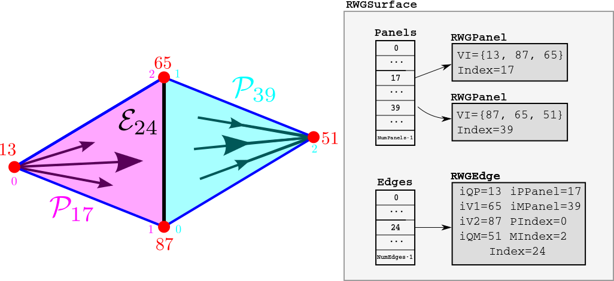

<a name="Assembling"></a>
## 3. Assembling the BEM Matrix 

The ``RWGGeometry`` class contains a hierarchy of 
routines for assembling the BEM matrix. If you are simply
using the code to solve scattering problems, you will
only ever need to call the top-level routine 
``AssembleBEMMatrix`` or perhaps the 
second-highest-level routine, ``AssembleBEMMatrixBlock.``
However, developers of surface-integral-equation methods 
may wish to access the lower-level routines for 
computing the interactions of individual RWG basis functions
or for computing certain integrals over triangular regions.

### ``AssembleBEMMatrix``

The top-level matrix assembly routine is 
``AssembleBEMMatrix.`` This routine loops over 
all unique pairs of ``RWGSurfaces`` in the geometry. 
For each unique pair 
of surfaces, the routine calls ``AssembleBEMMatrixBlock`` 
to assemble the subblock of the BEM matrix corresponding to a single 
pair of ``RWGSurfaces,`` then stamps this subblock 
into the appropriate place in the overall BEM matrix. 

For example, if a geometry contains three ``RWGSurfaces``,
then its overall BEM matrix has the block structure

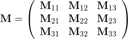

where the $\mathbf{M}__{ij}$ subblock describes the
interactions of surfaces *i* and *j*.
In this case ``AssembleBEMMatrix`` proceeds by making 6 calls
to ``AssembleBEMMatrixBlock``, one for each of the 
diagonal and above-diagonal blocks. (The below-diagonal
blocks are related to their above-diagonal counterparts by 
symmetry.)

### ``AssembleBEMMatrixBlock``

``AssembleBEMMatrixBlock`` computes the subblock of the 
BEM matrix corresponding to a single pair of ``RWGSurface``s.
For compact (non-periodic) geometries, this amounts to making just
a single call to ``SurfaceSurfaceInteractions``. For 
periodic geometries, this involves making multiple calls to 
``SurfaceSurfaceInteractions`` in which one of the two 
surfaces is displaced through various lattice vectors **L** to account
for the contribution of periodic images. 

The contribution of the 
matrix subblock computed by ``SurfaceSurfaceInteractions``
with displacement vector **L** is weighted in the overall
BEM matrix by a Bloch phase factor 
$ e^{i\mathbf{k}\cdot \mathbf{L}}$
where **k** is the Bloch wavevector, i.e. we have 


where the **L** superscript indicates that the corresponding
matrix subblock is to be computed with one of the two surfaces 
displaced through translation vector **L**.
    
### ``SurfaceSurfaceInteractions``

``SurfaceSurfaceInteractions`` loops over all ``RWGEdge``
structures on each of the two surfaces it is considering.
For each pair of edges, it calls ``EdgeEdgeInteractions``
to compute the inner products of the RWG basis functions
with the **G** and **C** dyadic Green's functions
for each of the material regions through which the two surfaces
interact. (Surfaces may interact through 0, 1, or 2 material 
regions.)
Then it stamps these values into their appropriate places
in the BEM matrix subblock. 

For example, if we have surfaces 
*S*<sub>&alpha;</sub> and *S*<sub>&beta;</sub> that 
interact through a single dielectric medium, the structure of 
the corresponding matrix subblock is
    
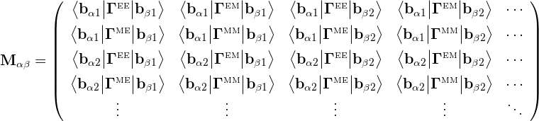

where e.g. **b**<sub>&alpha;*m*</sub> is the 
*m*th basis function on surface *S*<sub>&alpha;</sub>. 
The kernels
here are scalar multiples of the **G** and **C**
dyadics:
    
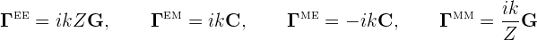

where *k*, *Z* are the wavenumber and (absolute)
wave impedance of the dielectric medium at the frequency
in question.

The matrix structure above is for the case of two surfaces
interacting through a single material region (for example,
*S*<sub>&alpha;</sub> and *S*<sub>&beta;</sub>
might be the outer surfaces of two compact objects embedded 
in vacuum or in a homogeneous medium, in which case the 
surfaces interact only throught that medium).
If the surfaces interact through *two* material regions
(for example, if we have 
*S*<sub>&alpha;</sub>=*S*<sub>&beta;</sub>
and we are computing the self-interaction of the outer
surface of a dielectric object embedded in vacuum) then
each matrix entry is actually a sum of *two* 
inner products, one involving the &Gamma; kernels for 
the interior medium and one involving the kernels for 
the exterior. (If the surfaces are PEC, then the dimension
of the matrix is halved with only the *EE* terms
retained.)

### ``EdgeEdgeInteractions``

``EdgeEdgeInteractions`` considers a pair of RWG basis
functions and computes the inner products of these basis functions
with the **G** and **C** dyadic Green's functions for a 
single material medium. Because each basis function is supported
on two triangles, the full inner products involve sums of four
triangle-pair contributions:

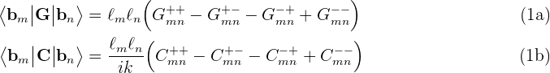

Here <i>l<sub>m</sub>,l<sub>n</sub></i> are the lengths of the
interior edges to which the RWG basis functions are associated, and
each of the four terms in the sum is a four-dimensional integral 
over a single pair of panels, computed by 
``PanelPanelInteractions.``

### ``PanelPanelInteractions``

``PanelPanelInteractions`` is the lowest-level routine in the 
[[scuff-em]] BEM matrix assembly hierarchy.
This routine computes the individual terms in equation (1) above,
i.e. the contributions of a single pair of panels
to the inner products of two RWG basis functions with the **G** and 
**C** dyadic Green's functions:

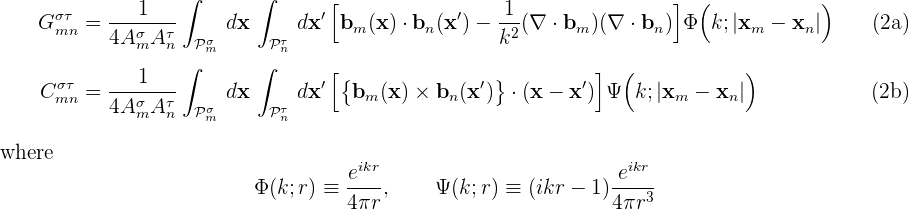

Note that the RWG basis-function prefactor *l/2A* is broken
up into two factors between equations (1) and (2): the *1/2A*
part is included in the panel-panel integrals (2), while 
the *l* part is included when summing the four panel-panel
contributions in equation (1) to obtain the overall inner product. 

If the panels are far away from each other, ``PanelPanelInteractions`` 
uses low-order four-dimensional numerical cubature to compute the full
interactions. Otherwise, ``PanelPanelInteractions`` uses
low-order four-dimensional numerical cubature to compute the interactions
with *singularity-subtracted versions* of the **G** and **C** 
kernels, then adds the contributions of the singular terms after 
looking them up in an internally-stored cache.

<a name="Example"></a>
## 4. An Explicit Low-Level Example

Here's a worked example of a matrix-element computation in a [[scuff-em]] run. 

### The geometry and the labeling of panels, edges, and vertices 

We'll consider a
scattering geometry consisting of a single cube of dielectric
material, with side length *L=*1 &mu;m, discretized into 
triangles with minor side length *L/10*, yielding a total
of 1200 triangles, 1800 interior edges, and 3600 RWG basis 
functions (1800 each for electric and magnetic currents) 
for a dielectric geometry. The 
[[gmsh]] geometry file for this example is 
<a href="scuff-em/reference/CubeExample/Cube_N.geo">Cube_N.geo</a>,
the [[gmsh]] mesh file produced by running
``gmsh -2 Cube_N.geo`` is
<a href="scuff-em/reference/CubeExample/Cube_10.msh">Cube_10.msh</a>,
and a [[scuff-em]] geometry file describing
a geometry consisting of this discretized cube with interior dielectric
permittivity &epsilon;=4 is
<a href="scuff-em/reference/CubeExample/DielectricCube.scuffgeo">DielectricCube.scuffgeo</a>.

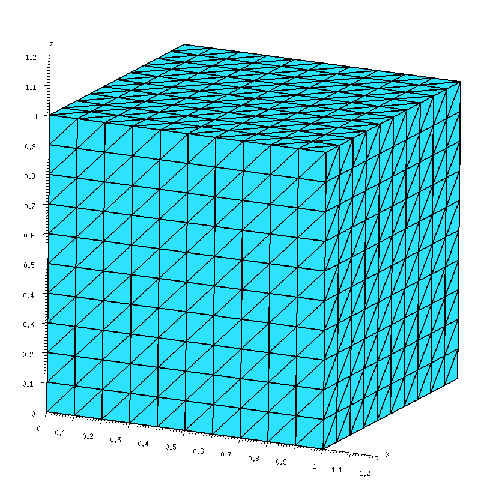

For low-level work it is convenient to have data on the internal 
indices that [[scuff-em]] assigns to 
panels, vertices, and edges when it reads in a geometry file.
We get this by running ``scuff-analyze`` on the mesh file
in question with the ``--WriteGMSHLabels`` options:

````bash
 % scuff-analyze --mesh Cube_10.msh --WriteGMSHFiles --WriteGMSHLabels
````

This produces a file named ``Cube_10.pp``, which we open in 
[[gmsh]] to produce a graphical depiction of 
the labeling of panels, edges, and vertices. Zooming in on the region
near the origin, we will focus on the two panels lying closest to the 
origin in the *xy* plane; we see that 
[[scuff-em]] has assigned these two panels
panel indices ``0`` and ``1``, respectively, while
the edge they share has been assigned interior-edge index ``0``.

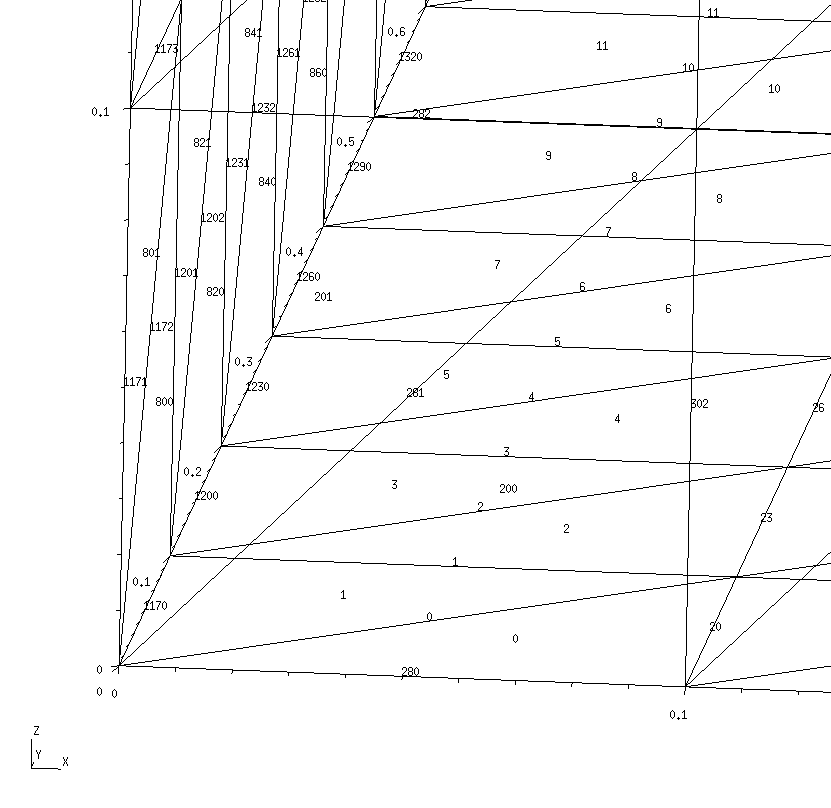

## RWG basis function <b>b<sub>0</sub></b>

Here's a schematic depiction of the panels that comprise the
basis function **b**<sub>0</sub> associated with interior edge
``0``:

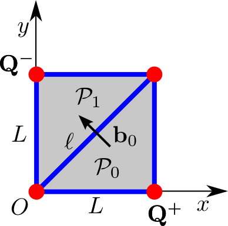

In this diagram, the edge length is *L*=0.1, *O* denotes 
the origin of coordinates, and the vertices marked 
**Q**<sup>&plusmn;</sup> are the
source and sink vertices for the current distribution. 
The RWG basis function <b>b<sub>0</sub></b> associated with 
interior edge 0 is 

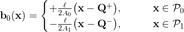

where the RWG basis function edge length is *l*=&radic;2*L*
and the panel areas are 
<i>A<sub>0</sub>=A<sub>1</sub></i>=*L*<sup>2</sup>/2.
Note that 
<i>P<sub>0</sub></i> and
<i>P<sub>1</sub></i> are respectively the positive and negative
panels associated with basis function **b**<sub>0</sub>.

### Panel-panel interactions 

Here's a ``C++`` code snippet that computes the 
quantities 
<i>G<sub>00</sub><sup>++</sup></i> 
and 
<i>G<sub>00</sub><sup>+-</sup></i> in equation (1a)
above, i.e. the contributions of the positive-positive 
and positive-negative panel pairs to the inner product of 
<b>b<sub>0</sub></b> with itself through the **G** kernel,
with the wavenumber set to *k=*1.0;
Just to be totally explicit, the numbers that are being 
computed here are

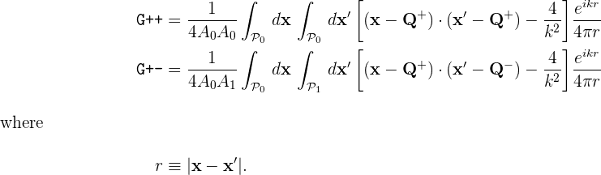

````C++

 // read in geometry from .scuffgeo file
 RWGGeometry *G = new RWGGeometry("DielectricCube.scuffgeo");
 RWGSurface *S = G->Surfaces[0];

 // initialize an argument structure for GetPanelPanelInteractions
 GetPPIArgStruct MyPPIArgs, *PPIArgs=&MyPPIArgs;
 InitGetPPIArgs(PPIArgs);
 PPIArgs->Sa = PPIArgs->Sb = S;
 PPIArgs->k = 1.0;

 // fill in arguments to compute the positive-positive panel pair
 PPIArgs->npa = 0;
 PPIArgs->iQa = 1;
 PPIArgs->npb = 0;
 PPIArgs->iQb = 1;
 GetPanelPanelInteractions(PPIArgs);
 printf("G++ = %e + %ei\n",real(PPIArgs->H[0]),imag(PPIArgs->H[0]));

 // fill in arguments to compute the positive-negative panel pair
 PPIArgs->npa = 0;
 PPIArgs->iQa = 1;
 PPIArgs->npb = 1;
 PPIArgs->iQb = 2;
 GetPanelPanelInteractions(PPIArgs);
 printf("G++ = %e + %ei\n",real(PPIArgs->H[0]),imag(PPIArgs->H[0]));
````

    This code produces the following output:

````
G++ = -3.189105e+00 + -7.950381e-02i
G+- = -1.537561e+00 + -7.956272e-02i
````

Notice that, to compute a panel-panel interaction, you allocate
and initialize an instance of a data structure called 
``GetPPIArgs``. This structure contains a large 
number of fields which in many cases can be set to default 
values; to ensure that these fields are properly initialized,
always call ``InitGetPPIArgs()`` on an newly-allocated
instance of ``GetPPIArgs``.

Then, you fill in the appropriate fields of this structure 
to specify the two panels over which you want to integrate.
Specifically, the fields 
``Sa``, ``npa``
specify the first panel (the ``npa``th ``RWGPanel``
in the ``Panels`` array for surface ``Sa``), 
while the field ``iQa`` (an integer in the range ``0..2``)
identifies the index of the **Q** vertex (RWG current source/sink
vertex) within the three vertices of the panel. 
The fields 
``Sb``, ``npb``, and ``iQb``
similarly identify the second panel and source/sink vertex.
Initialize the ``k`` field in the 
``GetPPIArgs`` structure to the wavenumber parameter
in the Helmholtz kernel. (*k* may be complex or purely imaginary.)

### Edge-panel interactions

Here's a ``C++`` code snippet that computes the 
full basis-function inner product
&lt; **b**<sub>0</sub> | **G** | **b**<sub>0</sub> &gt;
in equation (1a) above.


````C++
 GetEEIArgStruct MyEEIArgs, *EEIArgs=&MyEEIArgs;
 InitGetEEIArgs(EEIArgs);
 EEIArgs->Sa = EEIArgs->Sb = S;
 EEIArgs->nea = EEIArgs->neb = 0;
 EEIArgs->k = 1.0;
 GetEdgeEdgeInteractions(EEIArgs);
 printf("&lt;b|G|b&gt; = %e + %ei\n",real(EEIArgs->GC[0]),imag(EEIArgs->GC[0]));
````

Note that, similar to the case of ``GetPanelPanelInteractions``
discussed above, the call to ``GetEdgeEdgeInteractions`` takes as
argument a pointer to a struct of type ``GetEEIArgStruct``.
As before, you should always call ``InitGetEEIArgs`` 
to initialize this structure, then set whichever fields you 
need to specify.
In this case, the only fields we need to set are 
``Sa,Sb`` (indices of the ``RWGSurface``), 
``nea,neb`` 
(indices of the interior edges in the ``Edges`` array 
corresponding to the RWG basis functions), and ``k`` 
(wavenumber parameter in the Helmholtz kernel). 
The result of this code snippet is

````
 <b|G|b> = -6.606176e-02 + 2.356554e-06i
````

Using equation (1a) above, we can understand this result in conjunction 
with the results printed out above for ``G++`` and 
``G+-``. For this particular basis function, only two 
of the four panel-panel interactions on the RHS of equation (1a) 
have distinct values (because the two panels that comprise the 
basis function have the same shapes and areas, so we have
``G-+ = G+-`` and ``G-- = G++``), and the  
edge-length prefactors *l*<sub>m</sub>, *l*<sup>n</sup> 
both have value 0.1&bullet;&radic;2. Thus for this case 
equation (1a) reads

&lt; **b**<sub>0</sub> | **G** | **b**<sub>0</sub> &gt;
=2&bullet;0.02&bullet;(``G++ - G+-``)

and, indeed, plugging in the numbers printed out above, we find

{6.6e-02, 2.4e-06i} 
= 2&bullet;0.02&bullet;( {-3.19,-7.95e-2i} - {-1.54,7.96e-2i} ).

[lsInnards]: http://homerreid.com/research/codes/scuff-EM/lsInnards.pdf
