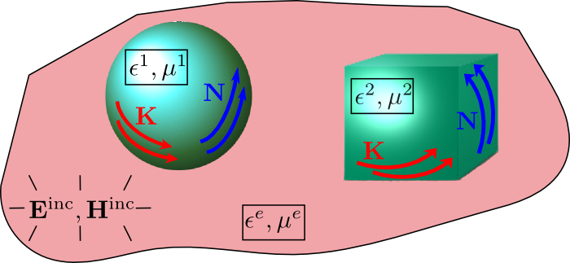
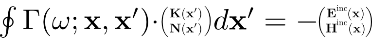
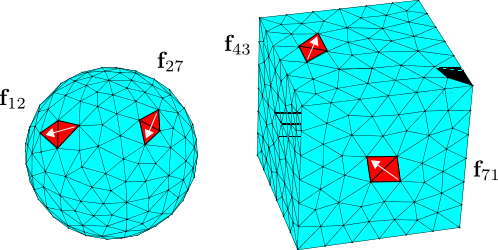
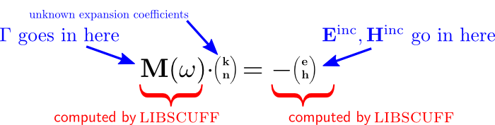

# Under the hood: the algorithms implemented by [[scuff-em]]

This page offers some top-level overview sketches 
of the basic algorithms implemented by the various codes in 
the [[scuff-em]] suite.

For more details on the implementation of these algorithms, see
[Data Structures and Class Methods in scuff-em](DataStructures.md).

For further technical details on the [[scuff-em]] core library, check out the
[libscuff Implementation Notes and Technical Reference][lsInnards],
available as a PDF document.

## The core library ([[libscuff]])

At its heart, the 
[scuff-em core library][libscuff]
is an implementation of the surface-integral-equation /
 boundary-element method (SIE / BEM) 
for solving electromagnetic scattering problems. 

More specifically, 
[[scuff-em]] 
implements the EFIE and PMCHW formulations of the SIE / BEM with 
RWG basis functions used to expand tangential currents on the 
surfaces of compact 3D objects.

If all of those acronyms went by a little quickly, 
here's a sketch of the basic problem addressed by the
[[scuff-em]] core library.
We have a collection of homogeneous material objects (maybe 
gold or silicon spheres or cubes) embedded in some medium 
(generally vacuum or a dielectric liquid), we irradiate the 
configuration with some known electromagnetic disturbance 
(such as a plane wave), and we seek to compute the electromagnetic 
fields scattered from the objects.
In a surface-integral-equation (SIE) method, we do this by first 
computing the *surface currents* induced on the object 
surfaces by the incident field. (For perfectly conducting 
scatterers we have only electric surface currents **K**; 
for general scatterers we have both electric and magnetic 
(**N**) surface currents.) Once we have solved for the 
surface currents, we can use them to evaluate the scattered 
fields anywhere we like.
 

To solve for the surface currents, we write down an 
*integral equation* relating the surface currents to
the incident field. This integral equation basically says 
that the tangential components of the scattered field (the 
field due to the surface currents) should precisely cancel 
the tangential components of the 
incident field at the object surfaces. 
(This statement is more of a mnemonic than a rigorous description;
see the 
<a href="cgi-bin/servdoc.cgi?filename=scuff-EM/lsInnards.pdf">technical memo</a>
for a more thorough treatment.) 
Schematically, the integral
equation looks something like this:
 

$$ \oint 
   \boldsymbol{\Gamma}(\omega; \mathbf{x}, \mathbf{x}^\prime)
   \cdot \left(\begin{array}{c} \mathbf{K}(\mathbf{x}^\prime) \\
                                \mathbf{N}(\mathbf{x}^\prime)
         \end{array}\right) d\mathbf{x}^\prime
       = -\left(\begin{array}{c} \mathbf{E}(\mathbf{x}) \\
                                 \mathbf{H}(\mathbf{x})
          \end{array}\right)^{\hbox{\scriptsize{inc}}}
$$

where $\boldsymbol{\Gamma}$
involves the dyadic Green's function for Maxwell's 
equations. Here the surface integral extends over the surfaces of
all scattering objects in our scattering geometry, and the equation
is required to hold at all points **x** on all object
surfaces. (The equation is understood to apply only to the 
surface-tangential components of the vectors on the two sides.)

This is the surface-integral-equation (SIE) formulation of 
our scattering problem. To solve the integral equation 
numerically, we now proceed to *discretize* it by 
expanding the **K** and **N** surface currents in some 
basis of expansion functions. The particular functions used 
by libscuff are the "RWG" basis 
functions, which were defined in this paper:

> "Electromagnetic Scattering by Surfaces of Arbitrary Shape,"
> by S. Rao, D. Wilton, and A. Glisson, 
> *IEEE Transactions on Antennas and Propagation* **30**
> 409 (1982) 
> [http://dx.doi.org/10.1109/TAP.1982.1142818](http://dx.doi.org/10.1109/TAP.1982.1142818)
   
The RWG basis functions are defined by meshing the surfaces 
of compact 3D objects into flat triangular panels, and assigning 
to each internal *edge* in the discretization a localized 
surface current that is sourced and sunk at the panel vertices 
opposite that edge:
 

Having introduced a discrete basis of expansion functions,
our integral equation becomes a simultaneous system of 
linear equations: 

 
This approach to solving surface integral equations is known 
as the *boundary-element method* (BEM), and the linear 
system in the equation above is sometimes known as the BEM 
system. The [[scuff-em]] core library provides
routines for assembling the BEM matrix **M**, and the right-hand 
side vector of incident-field expansion coefficients, for arbitrary 
scattering geometries and arbitrary incident fields at arbitrary 
frequencies.

Then, using the matrix and RHS vector assembled by the core
library, you can use external linear algebra software like
[lapack](http://www.netlib.org/lapack)
to solve the linear system, after which you can again use
routines provided by the [[scuff-em]] core library to compute the 
scattered fields at arbitrary points.
   
[DataStructures]: forDevelopers/DataStructures.md
[libscuff]:       ../API/libscuff.md
[lsInnards]:      http://homerreid.com/research/codes/scuff-EM/lsInnards.pdf
