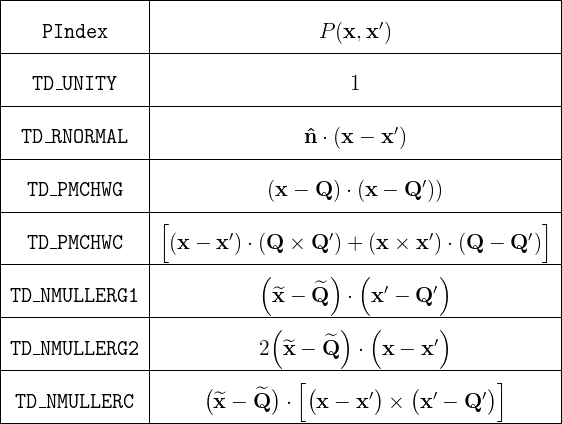
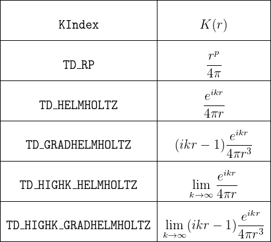

<h1>Computation of Singular Integrals in <span class=SC>scuff-em</span></h1>

A key feature of <span class=SC>scuff-em</span> is an accurate and 
efficient code for computing singular four-dimensional integrals over pairs 
of triangles.
The algorithm that <span class=SC>scuff-em</span>
uses for this purpose---which I call the "generalized Taylor-Duffy method"
in honor of the progenitors of some earlier methods that inspired it---is
discussed in detail in
this paper:

+ ``Generalized Taylor–Duffy Method for Efficient Evaluation of 
    Galerkin Integrals in Boundary-Element Method Computations'',
    *IEEE Transactions on Antennas and Propagation*
    **63** 195 (2015). 

    DOI: [10.1109/TAP.2014.2367492](http://dx.doi.org/10.1109/TAP.2014.2367492)

    ArXiV: [http://arxiv.org/abs/1312.1703](http://arxiv.org/abs/1312.1703).

The code that evaluates singular integrals is packaged
with the <span class=SC>scuff-em</span> distribution;
it is contained in a single `C++` file named
`TaylorDuffy.cc` (around 1,500 lines).
This code calls the `pcubature` code from 
[Steven G. Johnson's numerical cubature package.](http://ab-initio.mit.edu/wiki/index.php/Cubature)

Also, here are the [[mathematica]] codes mentioned in the paper above:

+ [`CommonPanel.math`](SingularIntegrals/CommonPanel.math)
+ [`CommonEdge.math`](SingularIntegrals/CommonEdge.math)
+ [`CommonVertex.math`](SingularIntegrals/CommonVertex.math)

This page is intended for developers who would like 
to use the [[scuff-em]] implementation of the generalized Taylor-Duffy
method in their own codes.

[TOC]

## 1. What the code actually computes

The code provides a `C++` function named `TaylorDuffy`
which computes the following four-dimensional integral over a triangle-product
domain:
$$ \mathcal{I}=
   \frac{1}{4AA^\prime}
   \int_{\mathcal T} \, d\mathbf x \, 
   \int_{\mathcal T^\prime} \, d\mathbf x^\prime \,
   P\big(\mathbf x, \mathbf x^\prime\big) K\big(|\mathbf x-\mathbf x^\prime|\big)
   \qquad (1)
$$

In this expression,

+ $\mathcal T$ and $\mathcal T^\prime$ are 
  triangles with at least one common vertex.
  (You supply to `TaylorDuffy` the cartesian coordinates
  of the triangle vertices.)

&nbsp;

+ *P* is a polynomial function of 6 variables (the Cartesian
  components of **x,x'**). Although the underlying algorithm works 
  for arbitrary polynomials *P*, in the implementation of 
  `TaylorDuffy` provided below you will select one of 
  a predetermined set of possible polynomials (see below).
  Modifying the code to support other polynomials would be 
  a relatively straightforward, if tedious, task.

&nbsp;

+ *K* is a *kernel* function of a single scalar variable
  *r.* Although the algorithm works for a fairly wide family of 
   kernel functions, in the implementation of `TaylorDuffy`
   provided below you will select one of a predetermined set of 
   possible kernels (see below). Again, it should be relatively 
   straightforward to modify the code to support other kernels.

   Actually, it is more accurate to say that `TaylorDuffy` 
   computes *multiple* simultaneous integrals of the form (1);
   in a single call to `TaylorDuffy` you can specify, for 
   the same triangle pair *T,T'*, more than one 
   (polynomial, kernel) pair, i.e. 
   <i>{P<sub>n</sub>, K<sub>n</sub>}</i> 
   for <i>n=1,2,...,N</i>, and 
   `TaylorDuffy` will compute all <i>N</i> integrals at once.
   This is faster than making <i>N</i> separate calls due to the 
   reuse of computational overhead.

## 2. C++ calling convention

The `TaylorDuffy` routine has many input
arguments (many of which may be set to default values)
and multiple output values. For this reason, instead
of the typical calling convention in which you specify
multiple input arguments to a `C++` function
and get back a single output value,
`TaylorDuffy` accepts as its argument a
(pointer to a) single big argument <i>structure</i>.

Thus, within a `C/C++` program, 
to evaluate one or more integrals of the form (1) for a given
pair of triangles you will 

1.	instantiate and initialize a data structure of type `TaylorDuffyArgStruct`, which stores all input and output arguments, and then 

2.	simply call `TaylorDuffy()` with a pointer to your argument structure as the only parameter. On return, the results (the values of the integral) will be stored in the argument structure.

The process looks like this: 

````c++
 // instantiate and initialize argument structure 
 TaylorDuffyArgStruct MyTDArgs, *TDArgs=&MyTDArgs;
 InitTaylorDuffyArgs(TDArgs); // always call this!

 // fill in necessary fields 
 TDArgs->WhichCase = TD_COMMONVERTEX
 TDArgs->NumPKs    = 1; 
 ...

 // evaluate the integral
 TaylorDuffy(TDArgs);

 // results are now available inside TDArgs
 printf("Result: %e \n", real(TDArgs->Result[0]) );
````

### Thread Safety

`TaylorDuffy()` is thread-safe; you may call it 
from multiple simultaneously-executing threads without fear
of crosstalk or race conditions. (Indeed, 
<span class=SC>scuff-em</span> does just this if compiled
with support for <span class=SC>openmp</span>
or <span class=SC>pthreads</span>.)

### Fields in `TaylorDuffyArgStruct`

The table below details all fields in the argument structure
passed to `TaylorDuffy.`

In general, you should always call `InitTaylorDuffyArgs`
first to set all optional fields to default values, then fill in 
your desired values for mandatory fields (and overwrite the default
values for any optional fields you wish to tweak).


<table border="1" cellpadding="5" cellspacing="5">

    <!----%%%%%%%%%%%%%%%%%%%%%%%%%%%%%%%%%%%%%%%%%%%%%%%%%%---->
    <tr>
      <th> Field </th>
      <th> Description </th>
    </tr>

    <!----%%%%%%%%%%%%%%%%%%%%%%%%%%%%%%%%%%%%%%%%%%%%%%%%%%---->
    <tr> 
       <th colspan=2 height="100"> 
           <i>Mandatory input fields describing the triangles</i>
       </th> 
    </tr>

    <!---------------------------------------------------------->
    <tr>
      <td> <code>int WhichCase;</code> </td>
      <td> Counts the number of common vertices between the 
           two triangles. You should set this to 1, 2, or 3 
           for the common-vertex, common-edge, or common-triangle
           cases. (The file <code>TaylorDuffy.h</code> defines
           the constants 
           <code>TD_COMMONVERTEX=1</code>,
           <code>TD_COMMONEDGE=2</code>,
           <code>TD_COMMONTRIANGLE=3</code>).
      </td>
    </tr>

    <!---------------------------------------------------------->
    <tr>
      <td> <table>
            <tr><td><code>double *V1, *V2, *V3;</code></td></tr>
            <tr><td><code>double *V2P, *V3P;</code></td></tr>
           </table>
      </td>
      <td> Pointers to caller-allocated arrays of length 3 
           containing the <i>x,y,z</i> coordinates of the 
           triangle vertices.

           <p>
           <code>V1, V2, V3</code> are the vertices of triangle 
           <i>T</i>. For example, <code>V2[0,1,2]</code>
           are the <code>x,y,z</code> coordinates of the 
           second vertex.

           <p>
           <code>V2P, V3P</code> are the vertices of triangle
           <i>T'</i> that are <i>not</i> shared with triangle 
           <i>T</i>. It is not always necessary to initialize 
           these fields. In particular,

           <p>
            <ul>
            <li> In the common-triangle case (<code>WhichCase=3</code>),
                 neither <code>V2P</code> nor <code>V3P</code>
                 is referenced.
            <li> In the common-edge case (<code>WhichCase=2</code>),
                 only <code>V3P</code> is referenced; <code>V2P</code>
                 is ignored.
            <li> In the common-vertex case (<code>WhichCase=1</code>),
                 both <code>V2P</code> and <code>V3P</code>
                 are referenced.
            </ul>

      </td>
    </tr>

    <!----%%%%%%%%%%%%%%%%%%%%%%%%%%%%%%%%%%%%%%%%%%%%%%%%%%---->
    <tr> 
       <th colspan=2 height="100"> 
           <i>Mandatory input fields describing the <b>P</b> 
              and <b>K</b> functions</i>
       </th>
    </tr>

    <!---------------------------------------------------------->
    <tr>
      <td> <table>
            <tr><td><code>int NumPKs;</code></td></tr>
            <tr><td><code>int *PIndex;</code></td></tr>
            <tr><td><code>int *KIndex;</code></td></tr>
            <tr><td><code>int *KParam;</code></td></tr>
           </table>
      </td>
      <td> 
           <p>
           <code>NumPKs</code> specifies the number of 
           integrals of the form (1) you wish to compute 
           (that is, the number of pairings of a polynomial
           <i>P</i> with a kernel <i>K</i>) for the given
           pair of triangles.
           If you only need to compute a single integral,
           set <code>NumPKs=1.</code>

           <p>
           <code>PIndex</code> and <code>KIndex</code> 
           are pointers to caller-allocated arrays
           of length <code>NumPKs</code>. The <code>n</code>th
           entries in these arrays are the indices 
           (in the tables below) of the 
           <code>n</code>th <i>P</i> and <i>K</i>
           functions.

           <p>
           <code>KParam</code> is a pointer to a 
           caller-allocated array of length
           <code>NumPKs</code> containing values of 
           certain parameters that enter the kernel
           functions. The entries of this array are 
           interpreted in different ways depending on 
           the corresponding entries in the 
           <code>KIndex</code> array:

           <ul>
            <li> If <code>KIndex[n]==TD_RP</code> 
                 (the <i>r<sup>p</sup></i> kernel),
                 then <code>KParam[n]</code> is
                 interpreted as the parameter <i>p</i>,
                 i.e. the integer power to which <i>r</i>
                 is raised. (The <code>cdouble-</code>valued
                 quantity
                 <code>KParam[n]</code> is converted to
                 <code>int</code> inside <code>TaylorDuffy.</code>)
            <li> 
                 For all other kernels,
                 <code>KParam[n]</code> is interpreted as 
                 the parameter <i>k</i>, i.e. the 
                 Helmholtz wavenumber. This quantity can
                 be purely real, purely imaginary, or complex.
           </ul>
      </td> 
    </tr>

    <!----%%%%%%%%%%%%%%%%%%%%%%%%%%%%%%%%%%%%%%%%%%%%%%%%%%---->
    <tr> 
       <th colspan=2 height="100"> 
           <i>Input fields that are required for certain 
              <b>P</b> functions</i>
       </th>
    </tr>

    <!---------------------------------------------------------->
    <tr>
      <td> <code>double *Q, *QP;</code>
      </td>
      <td> Pointers to caller-allocated arrays of length 3 
           containing the <i>x,y,z</i> coordinates of the 
           RWG source/sink vertices <b>Q,Q'</b>. These are 
           only referenced if any entry in the <code>PIndex</code>
           array corresponds to one of the polynomials in the 
           table below whose definition involves <b>Q,Q'.</b>
      </td>
    </tr>

    <!---------------------------------------------------------->
    <tr>
      <td> <code>double *nHat;</code>
      </td>
      <td> Pointers to caller-allocated arrays of length 3 
           containing the <i>x,y,z</i> components of the 
           unit normal vector <b>n</b>. This is only referenced
           if any entry in the <code>PIndex</code> array 
           corresponds to one of the polynomials in the 
           table below whose definition involves <b>n.</b>
      </td>
    </tr>

    <!----%%%%%%%%%%%%%%%%%%%%%%%%%%%%%%%%%%%%%%%%%%%%%%%%%%---->
    <tr> 
       <th colspan=2 height="100"> 
           <i>Optional input fields controlling integration behavior 
           </i>
       </th>
    </tr>

    <!---------------------------------------------------------->
    <tr>
      <td> <code>double AbsTol, RelTol;</code>
      </td>
      <td> The absolute and relative error tolerances to which
           the adaptive integrator will attempt to compute 
           the integral. (The defaults are <code>AbsTol=0.0</code>
           and <code>RelTol=1.0e-10</code>.) 
      </td>
    </tr>

    <!---------------------------------------------------------->
    <tr>
      <td> <code>int MaxEval;</code>
      </td>
      <td> An upper bound on the number of function samples
           the adaptive integrator may compute. (The default 
           is <code>MaxEval=1000.</code>) Reducing this 
           number will cause the code to run more quickly,
           possibly at the expense of lower accuracy.
      </td>
    </tr>

    <!----%%%%%%%%%%%%%%%%%%%%%%%%%%%%%%%%%%%%%%%%%%%%%%%%%%---->
    <tr> 
       <th colspan=2 height="100"> 
           <i>Output fields 
           </i>
       </th>
    </tr>

    <!---------------------------------------------------------->
    <tr>
      <td> <code>cdouble *Result, *Error;</code>
      </td>
      <td> Pointers to caller-allocated output buffers 
           with enough space to store <code>NumPKs</code> 
           values of type <code>cdouble</code>. On return,
           <code>Result[n]</code> is the value of the 
           integral for the <code>n</code>th <i>P,K</i> pairing,
           and <code>Error[n]</code> is an estimate of 
           the error incurred by the numerical quadrature.
      </td>
    </tr>

    <!---------------------------------------------------------->
    <tr>
      <td> <code>int nCalls;</code> 
      </td>
      <td> The number of function evaluations used to evaluate
           the numerical cubature.
           This number will not exceed <code>MaxEval.</code>
      </td>
    </tr>

</table>


### Values of the `PIndex` field

The implementation of `TaylorDuffy` provided here
contains support for the following choices of the <i>P</i>
polynomial in equation (1). (The values of the `PIndex`
field here are constants defined in `TaylorDuffy.h`.)



In this table, the quantities <b>Q, Q', n</b> are vector-valued
parameters that you specify by setting fields in the argument
structure for the `TaylorDuffy` routine (see above).
Also, in the final three table entries, the tilde symbol above
a vector-valued quantity indicates the result of crossing that
quantity with the normal vector you specify via the `nHat` 
field in the argument structure (see above):

$$
\widetilde{\mathbf x} \equiv \mathbf{\hat n} \times \mathbf x, \qquad 
\widetide{\mathbf Q} \equiv \mathbf{\hat n} \times \mathbf Q
$$

For RWG basis-function enthusiasts, note that the last 5 entries 
in the table are appropriate for computing matrix elements of the 
EFIE and MFIE operators between RWG basis functions, but observe
carefully that the prefactor $\frac{1}{4AA'}$ in the definition (1)
is only <i>part</i>
of the full prefactor that arises for RWG basis functions; there 
is also a factor <i>ll'</i> (product of edge lengths) 
which is missing from these calculations, and you must put that 
in yourself, by hand.

### Values of the `KIndex` field

The implementation of `TaylorDuffy` provided here
contains support for the following choices of the <i>K</i>
kernel in equation (1). (The values of the `KIndex`
field here are constants defined in `TaylorDuffy.h`.)



In this table, the values of the parameters <i>p</i> and 
<i>k</i> are what you put into the `KParam`
array in the `TaylorDuffyArgStruct`. 

## 3. Simple demonstration program

Here is a little test program that you can download and compile
against the
[<span class=SC>scuff-em</span> core library](../API/libscuff.md)
to test the code:
 
+ [TestTaylorDuffy.cc](SingularIntegrals/TestTaylorDuffy.cc)

Sample output:
````bash
% TestTaylorDuffy 
Integrand sampled at 33 points.
Integral 1: +3.56771698e-01  (estimated error: 6.0e-12)
Integral 2: +1.57003236e-03  (estimated error: 1.2e-11)
Computation time: 1.209307e+02 microseconds
````

Here is a listing of the program:
````c++
#include "TaylorDuffy.h"
using namespace scuff;

int main(int argc, char *argv[])
{
  /* panel vertices */
  int WhichCase = 2; // 2 common vertices
  double V1[3]  =  { 0.0,  0.0,  0.0 };
  double V2[3]  =  { 0.1,  0.0,  0.0 };
  double V3[3]  =  { 0.05, 0.1,  0.0 };
  double V3P[3] =  { 0.07, -0.08, 0.03 };

  double *Q     = V3;  // source/sink vertex, triangle 1
  double *QP    = V3P; // source/sink vertex, triangle 2

  /* specification of which integrals we want */
  int NumPKs        = 2;
  int PIndex[2]     = {TD_UNITY, TD_PMCHWC};
  int KIndex[2]     = {TD_RP,    TD_RP};
  cdouble KParam[2] = {-1.0,    -3.0};
 
  /* output buffers */
  cdouble Result[2], Error[2];
  
  /* fill in argument structure with problem description */
  TaylorDuffyArgStruct MyTDArgs, *TDArgs=&MyTDArgs;
  InitTaylorDuffyArgs(TDArgs);
  TDArgs->WhichCase = WhichCase;
  TDArgs->V1        = V1;
  TDArgs->V2        = V2;
  TDArgs->V3        = V3;
  TDArgs->V3P       = V3P;
  TDArgs->Q         = Q;
  TDArgs->QP        = QP;
  TDArgs->NumPKs    = NumPKs;
  TDArgs->PIndex    = PIndex;
  TDArgs->KIndex    = KIndex;
  TDArgs->KParam    = KParam;
  TDArgs->Result    = Result;
  TDArgs->Error     = Error;  

  /* specify desired error tolerance */
  TDArgs->RelTol    = 1.0e-10;   // request 10-digit accuracy
  TDArgs->MaxEval   = 25;        // upper limit on integrand samples

  /* calculate the integral */
  TaylorDuffy( TDArgs );

  /* print the results */
  printf("Integrand sampled at %i points.\n",TDArgs->nCalls);
  printf("Integral 1: {%+.8e, %+.8e} (estimated error {%.1e.,%.1e}) \n",
          real(Result[0]),imag(Result[0]),real(Error[0]),imag(Error[0]));
  printf("Integral 2: {%+.8e, %+.8e} (estimated error {%.1e.,%.1e}) \n",
          real(Result[1]),imag(Result[1]),real(Error[1]),imag(Error[1]));

  /* uncomment the following line to report computation time */
//#define MEASURE_RUNTIME
#ifdef MEASURE_RUNTIME
#define REPETITIONS 100
  Tic();
  for(int n=0; n<REPETITIONS; n++)
   TaylorDuffy( TDArgs );
  double TimeElapsed = Toc() / REPETITIONS;
  printf("Computation time: %e microseconds\n",1.0e6*TimeElapsed);
#endif

}
````


And here is a simple [`Makefile`](SingularIntegrals/Makefile)
that compiles and links against the [[scuff-em]] installation 
on your system (you'll need to modify a few lines at the top 
of this file appropriately for your system):

````make
# top of SCUFF-EM src tree
SCUFF_SRC=$(HOME)/work/scuff-em

# SCUFF-EM installation prefix (set with --prefix when running configure)
SCUFF_INSTALL=$(HOME)/work/scuff-em-installation

# HDF5 / Lapack libraries
HDF5_LIBS=-lhdf5_hl -lhdf5
MATH_LIBS=-lopenblas -lgomp -lgfortran -lpthread

##################################################
# shouldn't need to modify the rest
##################################################
CPPFLAGS+=-I$(SCUFF_SRC)/libs/libscuff 
CPPFLAGS+=-I$(SCUFF_INSTALL)/include/scuff-em

LIBDIR=$(SCUFF_INSTALL)/lib
LDFLAGS+=-L$(LIBDIR) -Wl,-rpath,$(LIBDIR)

SCUFF_LIBS=-lscuff
LIBS=$(SCUFF_LIBS) $(HDF5_LIBS) $(MATH_LIBS)

TestTaylorDuffy:		TestTaylorDuffy.o
				$(CXX) $(LDFLAGS) -o $@ $^ $(LIBS)
````
