# Brillouin-zone integration in [[scuff-em]]

Many codes in the [[scuff-em]] suite require evaluating
integrals over the Brillouin zone (BZ) of a 1D or 2D
reciprocal lattice, i.e.

$$Q(\omega) = \int_{\hbox{BZ}} \mathcal{Q}(\omega, \bf{k}) \,d\bf{k}.$$

Examples of calculations that require
Brillouin-zone integrations include

+ the Casimir force per unit imaginary frequency
$\omega=i\xi$ 
on an extended object in
[<span class="SC">scuff-cas3d</span>][scuffCas3D]

+ the Casimir-Polder potential per unit imaginary frequency
$\omega=i\xi$ 
experienced by a polarizable particle near an extended surface
in 
[<span class="SC">scuff-caspol</span>][scuffCaspol]

+ the local density of states at a given angular frequency
$\omega$
at user-specified evaluation points in 
[<span class="SC">scuff-ldos</span>][scuffldos].

In general, Brillouin-zone integrations are evaluated
by numerical cubature---that is, as weighted sums of
integrand samples:
$$ Q(\omega) \approx \sum W_n \mathcal Q(\omega, \bf k_n)$$
where $\{W_n, \bf k_n\}$ are the weights and points in
a cubature rule for the Brillouin zone of your reciprocal
lattice, and where each integrand sample
$\mathcal Q(\omega, \bf k_n)$ is computed by performing a
single [[scuff-em]] calculation at a fixed Bloch
wavevector. The [[scuff-em]] workflow offers two 
options for evaluating such cubatures:   

+ You can design and implement your own cubature scheme
involving your own custom-chosen weights and points
$\{W_n, \bf k_n\}$. In this case, you will use 
the ``--byOmegakBloch`` command-line option to instruct
a [[scuff-em]] application code to report values of the
quantity $\mathcal Q(\omega, \bf k_n)$ at each of your points
(this output will typically be written to file with
extension ``.byOmegakBloch`` or ``.byXikBloch``),
then compute the weighted sums yourself in e.g.
[<span class="SC">julia</span>](http://julialang.org).    

+ Alternatively, you can ask [[scuff-em]] to perform the
BZ integration internally, using one of several
built-in cubature schemes. In this case the BZ-integrated
quantities $Q(\omega)$ will typically be written to 
an output file with extension `.byOmega` or `.byXi`.
You will *also* get an output file named `.byOmegakBloch`
or `.byXikBloch` that reports the Bloch-vector-resolved
integrand samples $\mathcal Q(\omega, \bf k_n)$
chosen internally by the [[scuff-em]] BZ integrator.

### Command-line options for customizing internal BZ integration

If you choose the second option above, you may specify
various command-line options to customize the algorithm
used by [[scuff-em]] to select the cubature points and
weights $\{W_n, \mathbf{k}_n\}$. The options are 
listed here and discussed in more detail below.

````bash
--BZIMethod [CC | TC | Radial]
````

Selects the integration algorithm (see below for details).

````bash
--BZIOrder NN
````

Sets the order (accuracy parameter) of the integration
algorithm to `NN`. The allowed values of `NN` here depend
on the integration algorithm you chose (see below).

````bash
--BZIRelTol xx
--BZIAbsTol xx
--BZIMaxEvals NN
````

For adaptive integration algorithms in which the 
order is determined internally (see below), these 
options allow you to specify relative and absolute
error tolerances and an upper limit on the number of 
integrand samples that will be used.

````bash
--BZSymmetryFactor [2|4|8]
````

This option lets you tell [[scuff-em]] that your
integrand function $\mathcal Q(\mathbf k)$
is invariant under 2, 4, or 8-fold rotational 
symmetry transformations applied to $\mathbf k$. 
See below for more details on what this means.

### Understanding the internal BZ integration algorithms

To help you understand how to configure the various
command-line options above, this section
describes the various integration algorithms available
and how they are affected by the command-line parameters.

##### Integration methods for 1D Brillouin zones

For one-dimensional Brillouin zones, there is only one
BZ integration method available---namely,
[Clenshaw-Curtis quadrature][CCQuadrature]
(`--BZIMethod CC`, the default)
with the number of integrand samples either fixed
or chosen adaptively until user-specified error tolerances
are achieved.

More specifically, you may say either

 + `--BZIOrder [11 | 13 | 15 | ... | 97 | 99]`

or 

 + `--BZIOrder 0`

The former option selects fixed-order CC cubature
with 11, 13, ... 99 sample points. (This number must 
be an odd integer between 11 and 99 inclusive.)

The latter option (`--BZIOrder 0`) selects adaptive
CC cubature
using [this algorithm](http://ab-initio.mit.edu/wiki/index.php/Cubature).
In this case the number of sample points will be chosen
automatically subject to the values you select for the
`--BZIRelTol`, `--BZIAbsTol`, and `--BZIMaxEvals`
command-line options.

##### Symmetry factors for 1D Brillouin zones

For 1D Brillouin zones, the only allowed 
value of the `--BZSymmetryFactor` option is `2`,
indicating that your integrand is symmetric under
sign flip of the Bloch wavevector, i.e.
$\mathcal Q(k_x) = \mathcal Q(-k_x)$.
In this case the BZ integration may be restricted to 
the range $0\le k_x \le \frac{\pi}{L_x}.$

#### Integration methods for 2D Brillouin zones

The following integration methods are implemented for 
2D Brillouin zones. (See below for pictures of where
the various methods place their sample points.)

+ **Clenshaw-Curtis cubature** (`--BZIMethod CC`)

    Nested 2D fixed-order or adaptive Clenshaw-Curtis cubature.
    
    For fixed-order nested CC cubature with `NN` sample points
    per dimension, say `--BZIOrder NN`. Here `NN` must be 
    an odd integer between 11 and 99 inclusive.

    For adaptive 2D CC cubature (subject to your specified values
    of `--BZIRelTol`, `--BZIAbsTol`, and `--BZIMaxEvals`)
    say `--BZIOrder 0.`    

&nbsp;

+ **Triangle cubature** (`--BZIMethod TC`)

    This algorithm divides the Brillouin zone into 8
    triangles and applies a fixed-order triangle cubature scheme
    to each triangle, omitting repetition of triangles
    that are symmetry-equivalent given the value you specified
    for `--BZSymmetryFactor` (see pictures below).

    For this algorithm, the allowed values of
    `--BZIOrder` are 1, 2, 4, 5, 7, 9, 13, 14, 16, 20, or 25.

&nbsp;

+ **Radial cubature** (`--BZIMethod Radial`)

    This algorithm uses a polar decomposition
    $(k_x,k_y) \to (k_\rho, k_\theta)$ to
    evaluate the BZ integral as two nested 1D integrals,
    one over $k_\rho$ and the second over $k_\theta$.
    (The $k_\rho$ integral is evaluated via
     Clenshaw-Curtis quadrature, and the $k_\theta$ 
     quadrature is evaluated using rectangular-rule quadrature,
     not necessarily of the same order).

    This algorithm is useful for integrands that are strongly 
    peaked near the origin of the Brillouin zone and highly
    attenuated near the boundaries, so that most of the integral
    comes from the region near the origin.

    For this algorithm, the number of integration points
    used for the $k_\rho$ and $k_\theta$ integrals (call these
    numbers $N_\rho$ and $N_\theta$) are encoded 
    into the value passed to `--BZIOrder`
    in the form $100\times N_\rho + N_\theta,$
    where $N_\rho$ and $N_\theta$ are each odd integers 
    between 11 and 99 inclusive.

    Thus, for example, `--BZIOrder 3321` specifies that the
    $k_\rho$ integral is to be evaluated via 33-point CC
    cubature, while the $k_\theta$ integral is to be evaluated
    via 21-point rectangular-rule cubature.

#### Symmetry factors for 2D Brillouin zones

For 2D geometries, the option `--BZSymmetryFactor` may
take the value 2, 4, or 8, specifying that the Brillouin-zone
integrand $\mathcal{Q}(k_x, k_y)$ obeys symmetries as follows:

+ `--BZSymmetryFactor 2`: 

    We have
    $\mathcal{Q}(k_x,k_y) = \mathcal{Q}(k_x,-k_y),$ so the BZ integration
    may be restricted to just the right half of the BZ.

&nbsp;

+ `--BZSymmetryFactor 4`:

    We have
    $\mathcal{Q}(k_x,k_y) = \mathcal{Q}(\pm k_x, \pm k_y),$ 
    so the BZ integration
    may be restricted to just the upper-right quadrant of the BZ.

&nbsp;

+ `--BZSymmetryFactor 8`:

    In addition to symmetry under sign changes, the integrand
    is symmetric under $k_x\leftrightarrow k_y$,
    so the BZ integration
    may be restricted to the triangular region
    $0\le k_y \le k_x \le \frac{\pi}{L_x}.$
    (This is only possible for square lattices.)

##### Locations of quadrature points for 2D Brillouin zones

Here are some diagrams indicating the Bloch wavevectors
that will be sampled by the internal algorithms for Brillouin-zone
integration with various values of the command-line parameters:

````bash
--BZIMethod CC    --BZIOrder  21    --BZSymmetryFactor 1
````
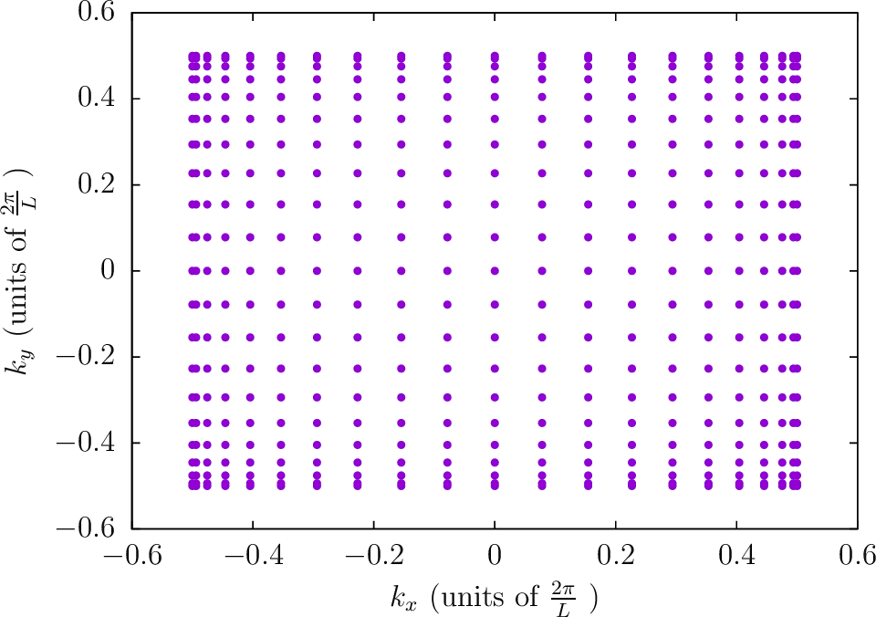

&nbsp;


````bash
--BZIMethod CC    --BZIOrder  21    --BZSymmetryFactor 2
````
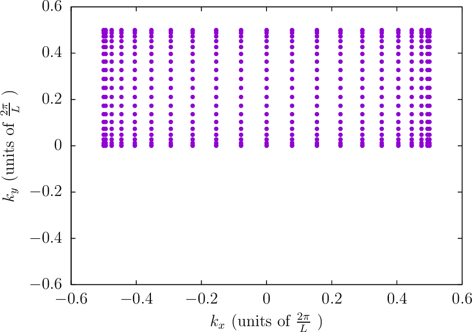

&nbsp;


````bash
--BZIMethod CC    --BZIOrder  21    --BZSymmetryFactor 4
````
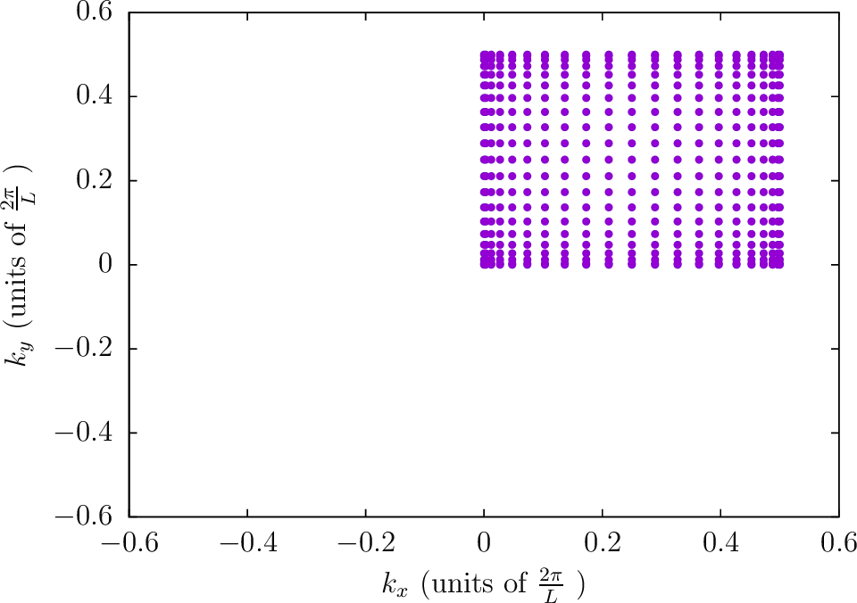
&nbsp;


````bash
--BZIMethod CC    --BZIOrder  21    --BZSymmetryFactor 8
````
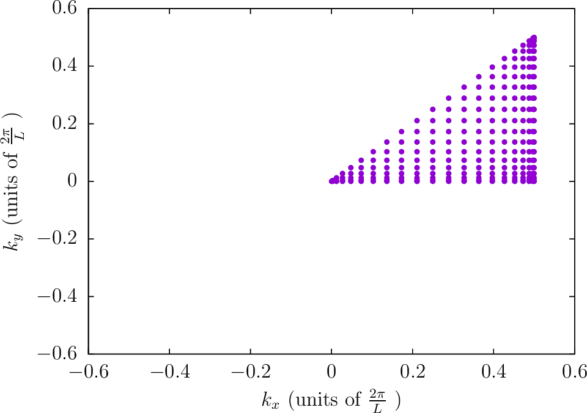
&nbsp;

````bash
--BZIMethod TC    --BZIOrder  20    --BZSymmetryFactor 1
````
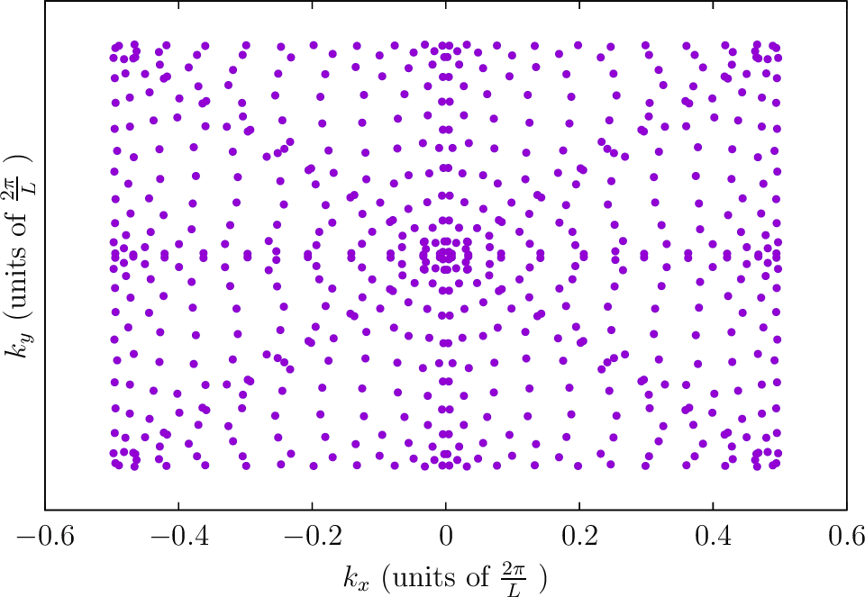

&nbsp;


````bash
--BZIMethod TC    --BZIOrder  20    --BZSymmetryFactor 2
````
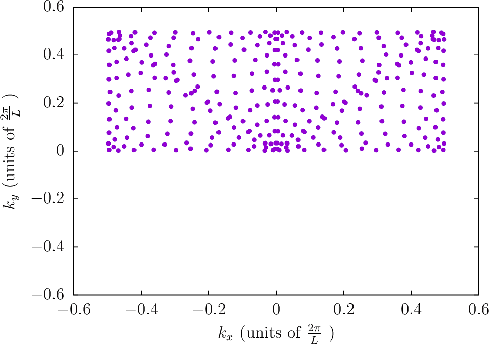

&nbsp;


````bash
--BZIMethod TC    --BZIOrder  20    --BZSymmetryFactor 4
````
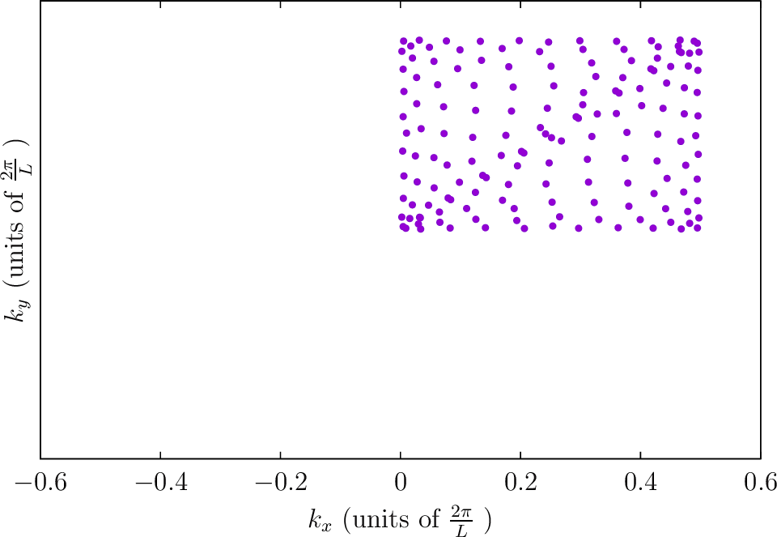
&nbsp;


````bash
--BZIMethod TC    --BZIOrder  20    --BZSymmetryFactor 8
````
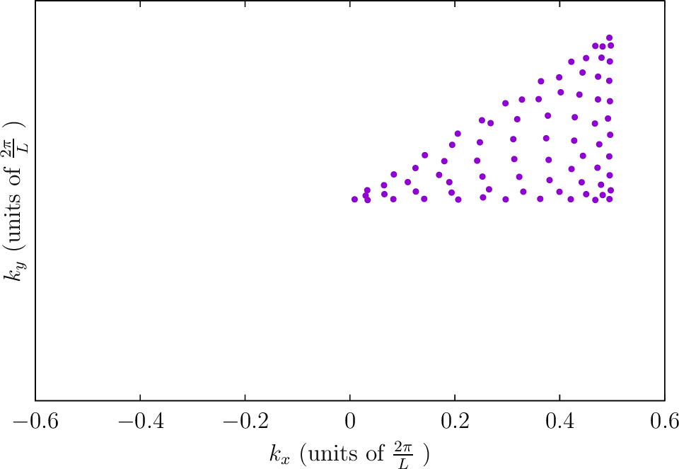
&nbsp;


````bash
--BZIMethod Radial --BZIOrder 3111 --BZSymmetryFactor 1
````
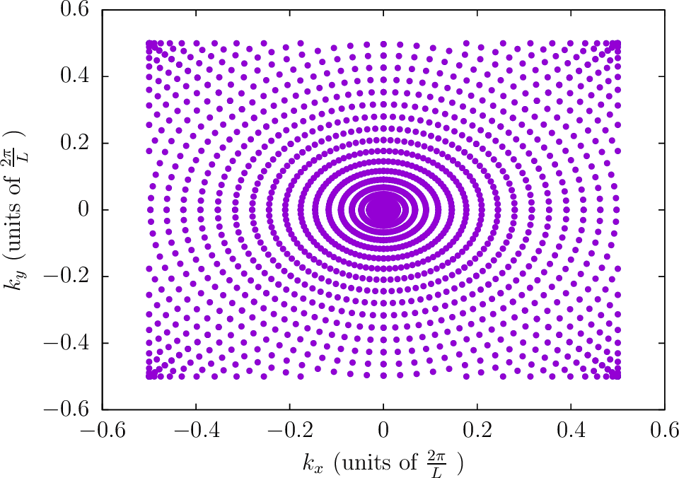

&nbsp;

````bash
--BZIMethod Radial --BZIOrder 3111 --BZSymmetryFactor 2
````
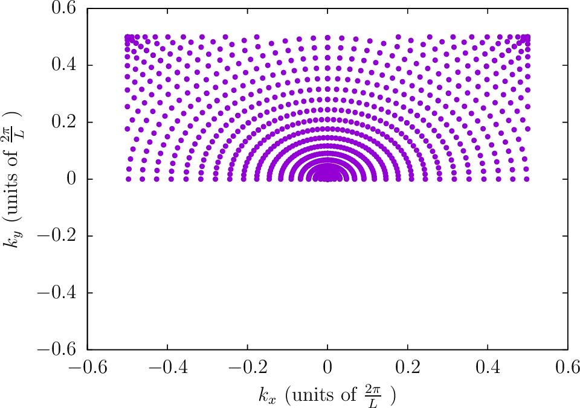

&nbsp;

````bash
--BZIMethod Radial --BZIOrder 3111 --BZSymmetryFactor 4
````


&nbsp;

````bash
--BZIMethod Radial --BZIOrder 3111 --BZSymmetryFactor 8
````
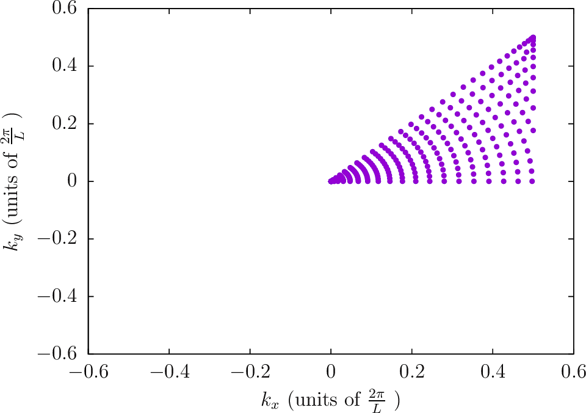

&nbsp;

##### Locations of quadrature points for 1D Brillouin zones

````bash
--BZIMethod CC    --BZIOrder  31    --BZSymmetryFactor 1
````
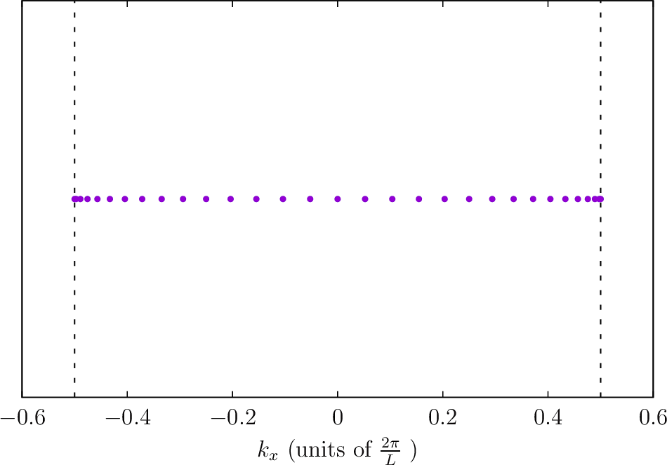

&nbsp;

````bash
--BZIMethod CC    --BZIOrder  31    --BZSymmetryFactor 2
````
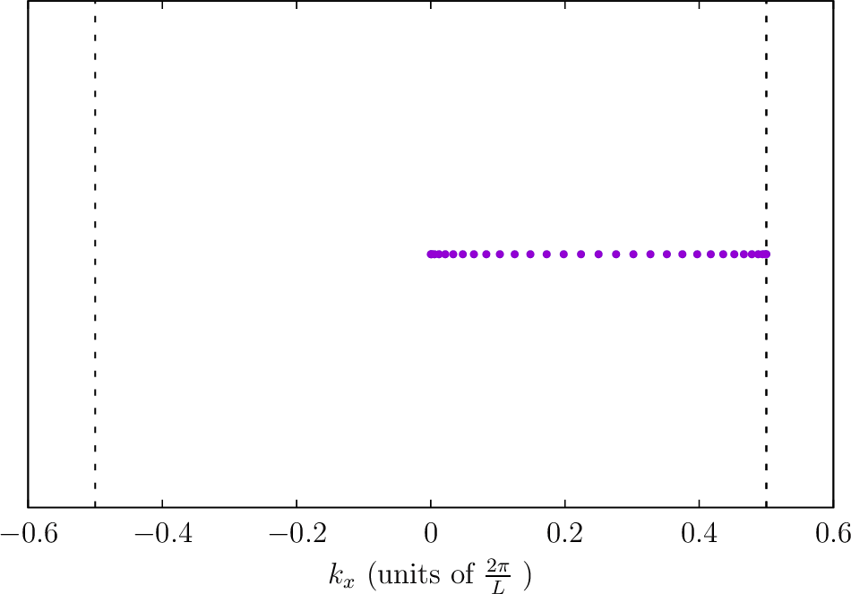

&nbsp;


[scuff-analyze]:               ../applications/scuff-analyze/scuff-analyze.md
[scuffCas3D]:                  ../applications/scuff-cas3D/scuff-cas3D.md
[scuffCaspol]:                 ../applications/scuff-caspol/scuff-caspol.md
[scuffldos]:                   ../applications/scuff-ldos/scuff-ldos.md
[CCQuadrature]:			http://homerreid.com/teaching/18.330/Notes/ClenshawCurtis.pdf
