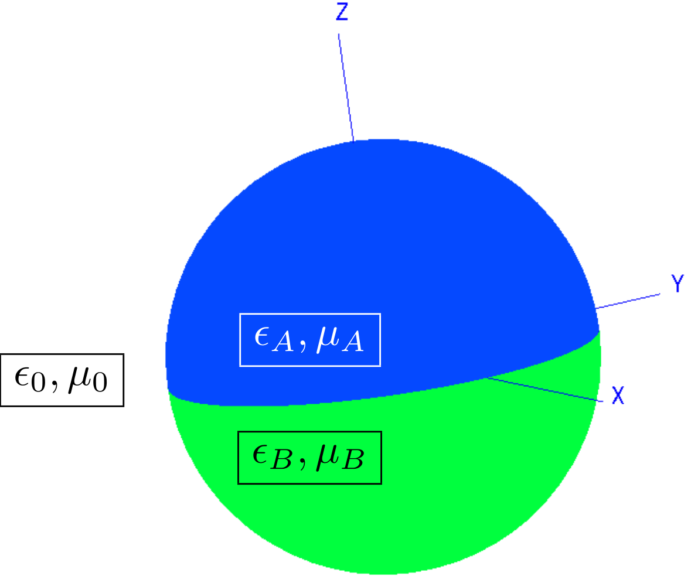
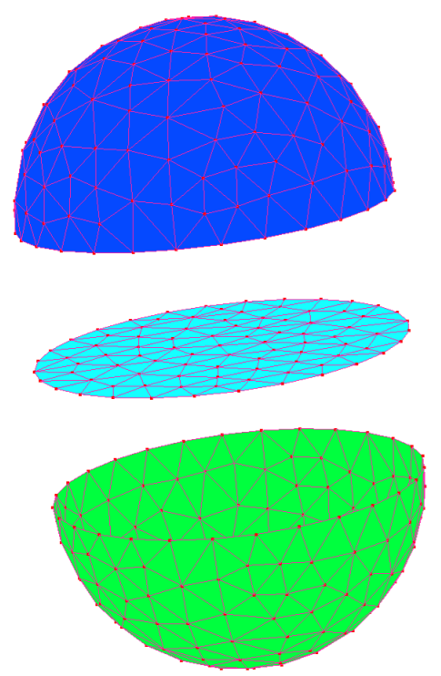
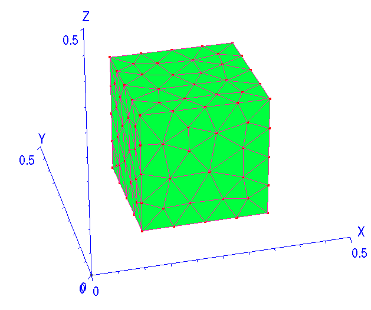
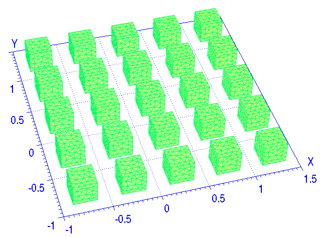
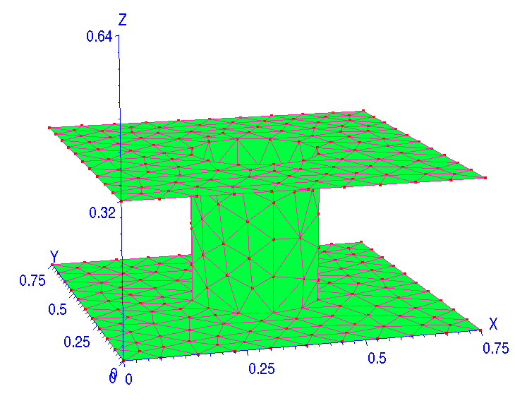
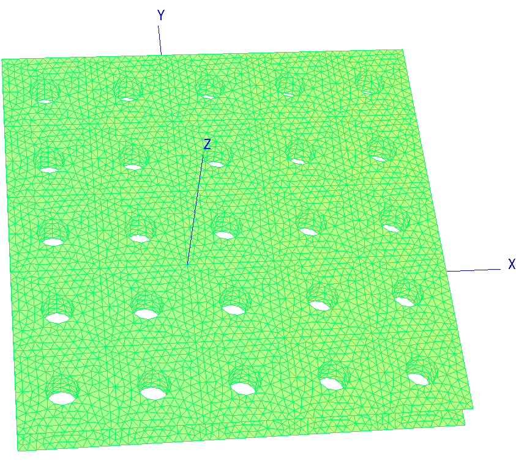
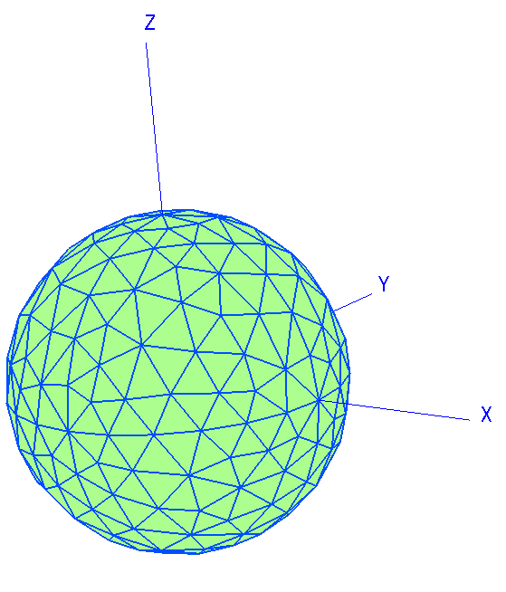
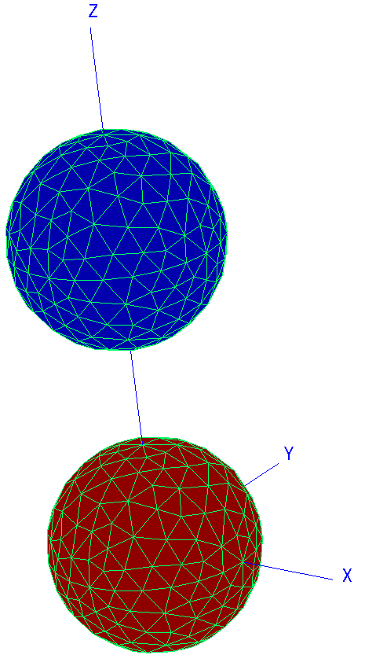

# Geometry Descriptions in scuff-EM

Geometries in [[scuff-em]] are described by simple text files 
that are conventionally given the file extension ``.scuffgeo.`` 
The ``.scuffgeo`` file format supports a variety of options for 
specifying scattering geometries.

The simplest case is one in which you have a collection of
compact homogeneous objects (which may be nested inside 
one another). In this case, your ``.scuffgeo`` 
file will simply specify mesh files representing the 
surfaces of these objects, as well as optional material
specifications for the frequency-dependent electrical properties
of the media inside.
(A *mesh* is a collection of flat triangular panels that 
approximates a two-dimensional surface.
[[scuff-em]] doesn't do the meshing for you;
you use external meshing software such as 
[GMSH](http://geuz.org/gmsh) or 
[COMSOL](http://www.comsol.com)
for that.)

In more complicated cases, it may not be possible to
describe your geometry as a simple collection of
objects. This is true, for example, if your geometry 
contains any *multi-material junctions*---that is, 
points at which three or more disparate media meet.
In this case your ``.scuffgeo`` file will specify 
a series of three-dimensional *regions* and a set of 
two-dimensional meshed *surfaces* lying between them.

Finally, your geometry may be infinitely *extended* in 
one or two directions. Examples of 1D extended geometries
include this description of
[*parallel silicon beams*](../examples/SiliconBeams/SiliconBeams.md),
while examples of 2D extended geometries include
a planar metamaterial array or an infinite square lattice
of spheres. In this case, your ``.scuffgeo`` file will
specify *lattice vectors* together with a description
of the objects, or the regions and surfaces, that constitute
just the *unit-cell* geometry, which is then infinitely
periodically replicated to constitute the actual geometry.

In what follows we will see how to write ``.scuffgeo``
files that describe each of these types of geometries.

<ol class="TOC">

<p align="center">
<b>Geometry Files in <span class="SmallCaps">scuff-em</span></b>
</p>

<li> <a href="#Simple">Simple geometries: One or more compact objects (possibly nested)</a>
<li> <a href="#Complex">More complex geometries: multi-material junctions</a>
<li> <a href="#Extended">Extended geometries: periodic boundary conditions</a>
<li> <a href="#Reference"><code>.scuffgeo</code> file syntax reference</a>
<li> <a href="#Examples">A compendium of <code>.scuffgeo</code> files</a>

</ol>

<a name="Simple"></a> 
## 1. Simple Geometries: One or more compact objects (possibly nested)

The simplest [[scuff-em]] geometries consist of 
one or more *compact objects*---that is, finite volumes of homogeneous media,
bounded by closed 2D surfaces. In this case, all meshed surfaces in the geometry 
must be *closed* surfaces, and no two object surfaces may touch or overlap.
Each surface is then associated with a single homogeneous material
region---namely, the region interior to that surface---and we collectively
refer to that material region and its closed surface as an *object.*

The ``.scuffgeo`` file for geometries of this type consists simply 
of a sequence of *object declarations*, one for each compact object 
in the geometry. A typical object declaration section looks something 
like this:

````
OBJECT UpperSphere
	MESHFILE Sphere_458.msh
	MATERIAL Gold
	DISPLACED 0 0 3
	ROTATED 45 ABOUT 0 0 1
ENDOBJECT
````

The string that follows the ``OBJECT`` keyword 
(``UpperSphere`` in this case) is an arbitrary 
user-specified label that you may attach to your object
for ease of identifying it in output files, etc. 

The only keyword that is strictly required within the 
``OBJECT...ENDOBJECT`` clause is ``MESHFILE.`` This specifies 
a mesh file, generated by [[gmsh]], [[comsol]], or other meshing 
tools, describing the surface of your object. 
[[scuff-em]] will look for this file in several places: 

+ the current working directory
+ the directory specified by the ``SCUFF_MESH_PATH`` environment variable
+ any search directories specified using the ``MESHPATH`` keyword in the ``.scuffgeo`` file.

The latter two options allow you to set up one or more common 
repositories of mesh files which you can then re-use for 
[[scuff-em]] calculations launched from whatever directory you like.

The optional ``MATERIAL`` keyword is used to select a 
[<span class="SC">scuff-em</span> material designation][Materials]
(in this case, `Gold`) for the medium interior to 
your object. The actual definition of the material ``Gold``
(given by a ``MATERIAL...ENDMATERIAL`` clause)
may be present in the ``.scuffgeo`` file before the 
``OBJECT`` specification, or may exist in a separate 
material database file. If you don't specify a ``MATERIAL``
for your object, it will be treated as a perfectly electrically 
conducting (PEC) body. 

The optional ``DISPLACED`` and ``ROTATED``
keywords specify geometrical transformations 
that are applied to the surface mesh after it is read in from 
the mesh file. For example, if your mesh file describes a sphere 
centered around the origin, and you include the line 
``DISPLACED 0 0 3`` in your ``OBJECT...ENDOBJECT``
clause, then your geometry as interpreted by 
[[scuff-em]] will contain a sphere
centered around the point with cartesian coordinates 
(0,0,3). For more details, see the 
[syntax reference](#Reference)
below.

Your ``.scuffgeo`` file may contain any number of
``OBJECT...ENDOBJECT`` clauses.
The objects specified by these clauses may be 
[*nested*](#NestedSpheres),
i.e. one object may be fully contained inside another 
object; this will be autodetected by [[scuff-em]].

(However, this simple way of specifying geometries has 
the constraint that no two object surfaces may touch or intersect. 
If you find yourself needing to describe geometries involving 
objects whose surface touch---thus defining *multi-material junctions*---you
you have graduated to writing the 
[slightly more complicated type of ``.scuffgeo`` file described below](#Complex).)

Here's an example of a simple ``.scuffgeo`` file describing 
a smaller PEC sphere embedded inside a larger silicon dioxide
sphere.

````
# material specification for intrinsic silicon
MATERIAL SILICON
epsf = 1.035;      # \epsilon_infinity
eps0 = 11.87;      # \epsilon_0 
wp = 6.6e15;       # \plasmon frequency
Eps(w) = epsf + (eps0-epsf)/(1-(w/wp)^2);
ENDMATERIAL


OBJECT SiliconSphere 
MESHFILE Sphere_R1P0.msh
MATERIAL Silicon
ENDOBJECT 


OBJECT InnerSphere 
MESHFILE Sphere_R0P5.msh
MATERIAL PEC
ENDOBJECT 
````


Note that the ``MATERIAL PEC`` specification for the 
inner sphere is actually superfluous---we could simply have 
omitted it, because PEC is the default material assumed for 
``OBJECT`` clauses. On the other hand, if we had 
instead said ``MATERIAL Vacuum``, then we would be 
describing an *vacuum* sphere inside our larger 
silicon sphere---that is, a spherical *shell* of silicon,
as considered in 
[this <span class="SmallCaps">scuff-scatter</span> example][SphericalShellExample].

<a name="Complex"></a>
## 2. More complex geometries: multi-material junctions

The attempt to describe a geometry simply as a collection of compact objects 
breaks down for more complicated situations. For example, consider the composite 
sphere (or "bihemisphere") depicted in the figure below; this is a spherical
object formed by adjoining an upper hemisphere of material A to a lower 
hemisphere of material B. 

**Schematic depiction of a Bihemisphere**



**Mesh representations of the three interface surfaces**
(shown displaced for clarity)



Our first thought might be to think of the upper hemispherical volume as one 
compact object, and the lower hemispherical volume as a second compact object.
But this doesn't work, because we can't assign a unique closed surface to each
compact object. Clearly the upper hemispherical surface "belongs" to object 
``UpperHemisphere,`` and the lower hemispherical surface "belongs" to
object ``LowerHemisphere.`` But to which volume do we assign the surface 
of the equatorial plane?

More formally, the key aspect of the bihemisphere geometry that prevents 
it from being describable as a collection of compact objects is the presence
of *multi-material junctions*---that is, regions of the geometry 
at which three or more homogeneous material regions meet. The equator of 
the bihemisphere is a multi-material junction. 

(A note on terminology: In [[scuff-em]] parlance,
a multi-material junction (MMJ) is a point or line 
at which *three or more* homogeneous regions meet.
Of course any meshed surface in a geometry---including 
the closed surfaces used to describe simple compact-object 
geometries above---lies at the junction of
at least *two* regions, and is thus technically 
a "multi-material" junction, but is not considered 
an MMJ for the purposes of the present discussion.)

Geometries involving multi-material junctions are described in 
[[scuff-em]] by explicitly 
specifying the various *regions* and *surfaces* 
that are present. Each *region* is a contiguous volume 
throughout which the material properties are spatially constant.
Each *surface* is a mesh describing a closed *or open* 
2D surface represented as a 
union of flat triangular panels. Each surface must lie at the 
interface between precisely two regions.

For example, in the bihemisphere geometry, there are three 
regions: 

+ The exterior medium (vacuum).
+ The upper hemispherical volume (material A).
+ The lower hemispherical volume (material B).

And there are three surfaces:
 
+ The upper hemispherical surface, which is an interface between regions 1 and 2.
+ The lower hemispherical surface, which is an interface between regions 1 and 3.
+ The surface of the equatorial plane, which is an interface between regions 2 and 3.

The ``.scuffgeo`` file for geometry described
using regions and surfaces will consist, unsurprisingly,
of ``REGION`` lines and 
``SURFACE...ENDSURFACE`` clauses.

Each ``REGION`` line should look something like this:

````
REGION UpperHemisphereVolume MATERIAL Gold
````

The string identifier following the ``REGION`` keyword is an 
arbitrary label you may assign to your region. The string identifier
following the ``MATERIAL`` keyword is a 
[<span class="SmallCaps">scuff-em</span> material designation][Materials]
specifying the frequency-dependent material properties 
of the region.

All [[scuff-em]] geometries by default
start off with an implicitly defined region
named ``Exterior``, of material ``VACUUM``.
If you want to change the material properties of the 
exterior medium---for example, if your entire scattering geometry
is embedded in ethanol---you can say something like 

````
REGION Exterior MATERIAL Ethanol
````

Otherwise, you can refer freely to the region named 
``Exterior`` without defining it, as it will 
be automatically present in all [[scuff-em]]
geometries.

Surfaces in a regions-and-surfaces geometry are identified 
by ``SURFACE...ENDSURFACE`` clauses.
These are similar to ``OBJECT...ENDOBJECT`` 
clauses, but with a couple of differences. A typical 
example looks like this:

````
SURFACE UpperHemisphereSurface
	MESHFILE UpperHemisphereSurface.msh
	REGIONS Exterior UpperHemisphereVolume
ENDSURFACE
````

The string identifier following the ``SURFACE`` keyword
is an arbitrary label you may assign to your surface to 
help identify it in output files, etc.

The mandatory ``MESHFILE`` keyword specifies the 
name of a file from which [[scuff-em]]
will attempt to read the surface mesh.

The mandatory ``REGIONS`` keyword identifies the two 
regions that lie on the two sides of the surface.
These should be regions that were previously declared using 
``REGION`` statements (with the exception of the
region ``Exteror``, which is always implicitly 
present.)

The *order* in which you specify surfaces is 
important for the internal workings of [[scuff-em]],
although most output quantities reported by most 
[[scuff-em]] codes will not depend on 
this ordering.

The distinction is this: The surface normal vector is taken to 
point *into* the first region specified with the 
``REGIONS`` keyword, and thus *away from* the second
region. What this means internally is that surface currents on 
the surface contribute to the fields in the first region with a 
*positive* sign, and to the fields in the second region 
with a *negative* sign. Again, however, this is all handled 
consistently within the internal workings of the code, so flipping
the order in the ``REGION`` specification should not
lead to any differences in physically relevant output quantities.
(If you flip the order of the regions, the currents on the surface
change sign, and their contributions to the fields in each region
change sign, so the fields don't change.)

In addition to the mandatory ``MESHFILE`` 
and ``REGIONS`` keyword, the ``SURFACE...ENDSURFACE``
may also include ``DISPLACED`` and/or ``ROTATED``
statements to apply geometrical transforms to your surface,
as is possible in ``OBJECT...ENDOBJECT`` clauses.

Note that any geometry that may be represented in the simpler
form discussed above (as a sequence of ``OBJECT...ENDOBJECT``
clauses) may also be represented in the regions-and-surfaces 
language. 
A compact object consists of a single region (the interior of 
the object) and a single surface (lying at the interface between
the interior and exterior regions). Thus, if the meshfile 
``MySphere.msh`` represents a meshed sphere, then the 
following two ``.scuffgeo`` files are equivalent:

````
REGION SphereInterior MATERIAL Gold

SURFACE TheSphere
MESHFILE Sphere.msh
REGIONS  Exterior SphereInterior
ENDSURFACE
````

````
OBJECT TheSphere
MESHFILE Sphere.msh
MATERIAL Gold
ENDSURFACE
````

(And see [below](#NestedSpheres) for an example of how to 
rewrite the nested-spheres example from above
in the regions-and-surfaces language.)

In some cases it may be convenient to write a single meshfile
that contains mesh descriptions for multiple surfaces 
in your geometry. This may be done by including a
``MESHTAG`` specification in your 
``SURFACE...ENDSURFACE`` clause:

````
SURFACE MySurface
	MESHFILE MyMeshFile.msh
	MESHTAG 12
	REGIONS MyRegion1 MyRegion2
ENDSURFACE
````

What this does is to instruct [[scuff-em]] to
read from ``MyMeshFile.msh`` only those triangular panels
that have been tagged by the meshing program as belonging 
to entity 12. 
(Different meshing programs have different ways of tagging mesh 
entities. In [[gmsh]], the tag corresponds to
what [[gmsh]] calls the "physical region;"
it is the argument that enters statements
such as ``Physical Surface(12)={...}`` in the ``.geo``
file, and it is the number printed as the *``physical-number``*
field in the ``.msh`` output file.)

As an example, here's a ``.scuffgeo`` file for the bihemisphere 
geometry described above. The meshfile ``BiHemisphere_126.msh``
was produced by a [[gmsh]] file named 
[BiHemisphere.geo](BiHemisphere.geo};
note that the three separate interface surfaces
are created with three separate ``Physical Surface``
commands, each specifying a different tag, which is then used 
in the ``.scuffgeo`` file below to distinguish different 
entities in the ``.msh`` file.

````
REGION Exterior        MATERIAL VACUUM
REGION UpperHemisphere MATERIAL CONST_EPS_20
REGION LowerHemisphere MATERIAL CONST_EPS_2

SURFACE LowerHemisphereSurface 
	MESHFILE BiHemisphere_126.msh
	MESHTAG 1
	REGIONS	Exterior LowerHemisphere
ENDSURFACE

SURFACE UpperHemisphereSurface 
	MESHFILE BiHemisphere_126.msh
	MESHTAG 2
	REGIONS	Exterior UpperHemisphere
ENDSURFACE

SURFACE EquatorialPlane
	MESHFILE BiHemisphere_126.msh
	PHYSICAL_REGION 3
	REGIONS	UpperHemisphere LowerHemisphere
ENDSURFACE
````

# 3. Extended geometries: periodic boundary conditions

[[scuff-em]] can handle geometries that are
infinitely extended (that is, periodically repeated) in one or two
dimensions using Bloch-periodic boundary conditions. In this case,
your ``.scuffgeo`` file will contain a specification of 
the objects, or the surfaces and regions, that constitute the 
*unit-cell* geometry, together with a specification of the 
*lattice vectors* that describe how the unit cell is periodically
repeated.

> **Note**: The current version of [[scuff-em]] 
> requires that 2D lattice basis vectors have vanishing *z*
> component and that 1D lattice basis vectors have vanishing
> *y* and *z* components. In other words, for 2D periodicity
> the lattice vectors must live in the *xy* plane, while
> for 1D periodicity the lattice vector must be aligned 
> with the *x* axis. This places no restriction on the 
> actual geometric configurations that may be treated, but 
> may be inconvenient for some users who are accustomed to 
> setting up their periodic geometries in a different way.
> (For example, if you are studying thin films, and you are 
> used to having the film surfaces parallel to the *yz*
> plane with the film thickness in the *x* direction, you will
> need to rotate your coordinate system so that the surfaces 
> re parallel to the *xy* plane and the thickness is in 
> the *z* direction.) This limitation may be lifted in 
> a future code release.

> **Note**: An additional restriction in the current version
> of [[scuff-em]] is that 2D lattices must be *square* 
> lattices. This actually *does* place restrictions on 
> the geometries that may be treated (for example, it 
> excludes hexagonal lattices), and it will be remedied
> as soon as somebody wants to run calculations on a 
> non-square-lattice geometry and is willing to help me
> test the new feature.

The lattice is specified using a ``LATTICE...ENDLATTICE``
section. For example, a square lattice with lattice constant 
of 1 $\mu$m would look like this: 

````
LATTICE
VECTOR 1 0 
VECTOR 0 1 
ENDLATTICE 
````

Each ``VECTOR xx yy`` statement adds a new lattice vector
with cartesian components of ``(xx,yy)`` length units.

You may specify one or two ``VECTOR`` statements.
If you specify a single ``VECTOR``, your unit-cell
geometry will be periodically repeated in just that one direction.
If you specify two ``VECTOR`` statements, your unit-cell
geometry will be periodically repeated in a two-dimensional lattice
pattern.

Having specified the lattice vectors, the remainder of your 
``.scuffgeo`` file just consists of a specification of 
the unit-cell geometry as if it were a standalone compact 
geometry. For example, you may include `OBJECT...ENDOBJECT` 
sections to describe any compact objects that exist inside 
the unit cell, or `REGION` statements and `SURFACE...ENDSURFACE`
sections to describe more complicated unit-cell geometries.

## Compact objects fully contained in the unit cell

The simplest case is that in which your geometry is simply 
an array of isolated compact objects (with "isolated" here meaning 
that each object does not touch its periodically repeated images.)
In this case, you will want to make sure that the objects 
lie entirely within the unit cell (not straddling its boundaries),

For example, here's a `.scuffgeo` file describing
a square lattice of cubical nanoparticles:

** The unit cell geometry **



** The innermost 25 cells of the full geometry **



** The ``.scuffgeo`` file ** 
````
LATTICE
VECTOR 0.5  0
VECTOR 0.0  0.5
ENDLATTICE 

OBJECT CubicalNanoparticle
MESHFILE Cube.msh
MATERIAL Silicon
ENDOBJECT
````

## Surfaces that straddle the unit-cell boundary

More generally, your unit-cell geometry may include surfaces 
that straddle the unit-cell boundary. (This will be the case 
whenever the infinite surfaces you are describing are 
*connected*, as opposed to the isolated arrays of objects
considered above). For example, here's a `.scuffgeo`
file representing a thin metallic film perforated by an 
array of holes. The parameters here are chosen to mimic 
the geometry studied by 
[Martin-Moreno et al, *Physical Review Letters* **86** 1114 (2001).](http://prl.aps.org/abstract/PRL/v86/i6/p1114_1)

** The unit cell geometry**



**The innermost 25 cells of the full geometry**



** The ``.scuffgeo`` file**
````
LATTICE
VECTOR 0.75  0
VECTOR 0.0   0.75
ENDLATTICE 

OBJECT UnitCellMesh
MESHFILE PFT_794.msh
MATERIAL Gold
ENDOBJECT
````

## Meshing constraints for surfaces that straddle the unit-cell boundary

There is an important constraint on the surface meshes that may be  
used to define the unit-cell geometry for problems involving continuous symmetries.

The constraint is this: 
*For any panel edge that lies on a unit-cell 
boundary, there must be an identical edge lying on the opposite 
side of the unit-cell boundary.* One way to think about this is 
that the periodically-repeated images of the unit-cell geometry must 
all fit together "nicely" at the unit-cell boundaries, as indicated 
in the right panel of the figure above.

<a name="Reference"></a>
# 4. Syntax reference for the ``.scuffgeo`` file format

A ``.scuffgeo`` file consists of one or more multiline
*sections* (delimited by starting and ending keywords)
plus zero or more single-line *statements*.

Blank lines and comments (lines beginning with a ``#`` symbol)
are ignored in ``.scuffgeo`` files.

### ``MESHPATH`` statement

<table width="75%" align="center" border="1" cellpadding="5" cellspacing="5">

<tr> <th width="200"> Keyword </th> 
<th> Description </th> 
</tr>

<tr> 
<td> <code>MESHPATH</code> <b><i>my-mesh-path</i></b></td>
<td> Adds the directory <b><i>my-mesh-path</i></b>
     to the path searched by <span class="SmallCaps">scuff-em</span> 
     for mesh files.
</td>
</tr> 
</table>

### ``REGION`` statement

<table width="75%" align="center" border="1" cellpadding="5" cellspacing="5">

<tr> <th width="200"> Keyword </th> 
<th> Description </th> 
</tr>

<tr> 
<td> <code>REGION</code> <b><i>Name</i></b>
     <code>MATERIAL</code> <b><i>Material</i></b>
</td>
<td> 
     Adds a new homogeneous material region
     to the geometry with name <b><i>Name</b></i>
     and material properties described by the     
     <span class="SmallCaps">scuff-em</span> 
     material designation <b><i>Material</i></b>.
     
     As discussed above, <code>REGION</code>
     statements are <i>not needed</i>
     for geometries consisting of compact homogeneous
     bodies described by <code>OBJECT</code> sections.
     (Each <code>OBJECT</code> section automatically
     adds a new region to the problem for the interior
     of the object in question.) <code>REGION</code>
     statements are generally only necessary when your 
     geometry contains 
     <a href="#Complex">multi-material junctions.</a>

</td>
</tr> 
</table>

### ``OBJECT...ENDOBJECT`` sections

<table width="75%" align="center" border="1" cellpadding="5" cellspacing="5">

<tr> <th width="200"> Keyword </th> 
<th> Description </th> 
</tr>

<tr> 
<td> <code>OBJECT</code> <b><i>object label</i></b> </td>
<td> Begins an object declaration for an object with the specified
label.
</td>
</tr> 

<tr> 
<td> <code>MESHFILE</code> <b><i>MyFile.msh</i></b> </td>
<td> Specifies the mesh file that defines the closed surface
     of the object.
</td>
</tr> 

<tr> 
<td> <code>MESHTAG </code> <b><i>xx</i></b> </td>
<td> Specifies that only panels tagged in the mesh
     file with tag <b><i>xx</i></b> are to be considered 
     part of the surface of this object. This allows a
     single <code>.msh</code> file to contain multiple
     closed surfaces each defining distinct objects.
</td>
</tr> 

<tr> 
<td> <code>MATERIAL </code> <b><i>MyMaterial</i></b> </td>
<td> Specifies a <span class="SmallCaps">scuff-em</span>
     material designation for the homogeneous medium
     interior to the object.
</td>
</tr> 

<tr> 
<td> <code>DISPLACED</code> <b><i>xx yy zz</i></b> </td>
<td> Indicates that the contents of the specified mesh 
file are to be translated through a displacement vector with 
cartesian components (<b><i>xx, yy, zz</i></b>before
inclusion in the geometry.
</td>
</tr>

<tr> 
<td> <code>ROTATED</code> <b><i>dd</i></b> <code>ABOUT</code> <b><i>nx ny nz</i></b> </td>
<td> Indicates that the contents of the specified mesh 
file are to be rotated through an angle of <b><i>dd</i></b>
degrees (<b>degrees, not radians</b>) about an axis passing 
through the origin and through the point with cartesian coordinates
(<b><i>nx, ny, nz/</i></b>before inclusion in the geometry.
</td>
</tr> 

<tr> 
<td> <code>ENDOBJECT</code></td>
<td> Ends the object declaration.
</td>
</tr> 
</table>

### ``SURFACE...ENDSURFACE`` sections

### ``LATTICE...ENDLATTICE`` sections

### ``MATERIAL...ENDMATERIAL`` sections

> For details on how to write a ``MATERIAL`` section,
> see [here][Materials].

<a name="Examples"></a> 
# 5. A compendium of sample ``.scuffgeo`` files

The images corresponding to the ``.scuffgeo`` files below were 
obtained using the ``scuff-analyze`` utility distributed with 
the [[scuff-em]] suite, like this:

````bash
% scuff-analyze --geometry MyGeometry.scuffgeo --WriteGMSHFiles
````

This produces a [[gmsh]] post-processing file 
named ``MyGeometry.pp`` that you can open in 
[[gmsh]] to visualize your geometry and
make sure [[scuff-em]] interpreted your 
``.scuffgeo`` file as you intended.
This is generally a good thing to do before launching any serious
calculations.

<a name="SingleSphere"></a>
**A single perfectly electrically conducting (PEC) sphere**

This is perhaps the simplest imaginable [[scuff-em]]
geometry.

````
OBJECT PECSphere 
	MESHFILE Sphere.msh
ENDOBJECT 
````



--------------------------------------------------

<a name="TwoSpheres"></a>
**A gold sphere and a silicon sphere**

This example illustrates the use of the ``DISPLACED``
keyword to displace a surface mesh relative to its positioning 
in the mesh file. Note in particular that this keyword allows
us to use the same mesh file to describe two different spheres,
which speeds things up by allowing [[scuff-em]] 
to reuse certain parts of the calculation, thus eliminating
redundant numerical work. (Without the ``DISPLACED`` 
keyword in this example, the two spheres would be sitting on 
top of one another.)

````
MATERIAL SILICON
  epsf = 1.035;      # \epsilon_infinity
  eps0 = 11.87;      # \epsilon_0 
  wp = 6.6e15;       # \plasmon frequency
  Eps(w) = epsf + (eps0-epsf)/(1-(w/wp)^2);
ENDMATERIAL

MATERIAL GOLD
  wp = 1.37e16; 
  gamma = 5.32e13;
  Eps(w) = 1 - wp^2 / (w * (w + i*gamma));
ENDMATERIAL

MESHPATH /home/homer/work/MeshFiles

OBJECT GoldSphere
  MESHFILE Sphere.msh
  MATERIAL Gold
  DISPLACED 0 0 3
ENDOBJECT 

OBJECT SiliconSphere
  MESHFILE Sphere.msh
  MATERIAL Silicon
ENDOBJECT 
````



--------------------------------------------------

<a name="NestedSpheres"></a>
**A small gold sphere inside a larger silicon dioxide sphere**

````
MATERIAL SILICON
  epsf = 1.035;      # \epsilon_infinity
  eps0 = 11.87;      # \epsilon_0 
  wp = 6.6e15;       # \plasmon frequency
  Eps(w) = epsf + (eps0-epsf)/(1-(w/wp)^2);
ENDMATERIAL

OBJECT SiliconSphere 
  MESHFILE Sphere_R1P0.msh
  MATERIAL Silicon
ENDOBJECT 


OBJECT InnerSphere 
  MESHFILE Sphere_R0P5.msh
  MATERIAL PEC
ENDOBJECT 
````


[Materials]: Materials.md
