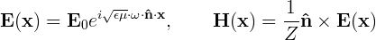
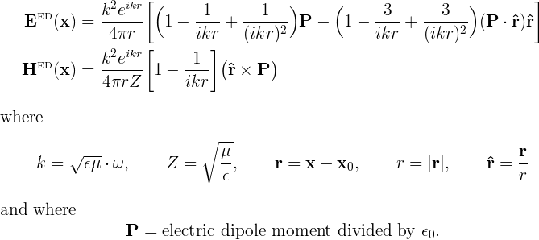

<h1> Incident fields in <span class="SC">scuff-em</span> </h1>

For the classical scattering problems solved by
[<span class="SC">scuff-scatter</span>][scuffScatter]
or by C++ or python codes using the
[<span class="SC">scuff-em</span> API][libscuff],
you will want to specify the incident fields that
scatter from your geometry.

The default [[scuff-em]] distribution offers three
built-in types of incident fields:

 + [Plane waves](#PlaneWaves)
 + [Gaussian beams](#GaussianBeams)
 + The fields of [point electric or magnetic dipole sources.](#PointSources)


If you only need to run scattering calculations with a single
type of incident field, you can just specify that field on
the command line, as described in the sections below. If you
want to run scattering calculations with multiple types of
incident field (for example, perhaps at each frequency you
want to consider two different plane-wave polarizations,
or three different point-source locations) you will want
to write an 
[incident-field file](#IFFile) describing an entire *list*
of incident fields.

It is also easy to [define your own custom incident fields](#RollingYourOwn)
for use in API programs.

[TOC]

## Built-in types of incident field 

<a name="PlaneWaves">
### Plane waves

[[scuff-scatter]] command-line syntax:

````bash
--pwDirection nx ny nz
--pwPolarization Ex Ey Ez 
````

C++ code:

````c
  double  nHat[3] = {nx, ny, nz};
  cdouble E0[3]   = {Ex, Ey, Ez};
  PlaneWave *PW=new PlaneWave(E0, nHat);
````

Selects the incident field to be a plane wave, with propagation vector 
**n**=*(nx,ny,nz)* and **E**-field polarization vector **E**=*(Ex,Ey,Ez).*

More specifically, the fields of a plane wave are



where the components of the vectors $\mathbf{\hat n}$ 
and 
$\mathbf{E}_0$
are what you specify with the `--pwDirection` and 
`--pwPolarization` options to [[scuff-scatter]]. (The frequency 
$\omega$ is specified elsewhere, for example using 
command-line options like `--omega.` The
quantities $\epsilon$ and $\mu$ are the material properties of
the exterior medium at this frequency, which are determined by
the material property designation you give the external medium
in the `.scuffgeo` file; the wave impedance of the medium is
$Z=\sqrt{\mu/\epsilon}\approx 377\,\Omega$ in vacuum.)

The values specified for `--pwPolarization` may be
[complex numbers.][ComplexNumbers]

As an example, the [[scuff-scatter]] command-line options

````bash
--pwDirection 0 0 1 --pwPolarization 0.7071 0.7071i 0.0
````

will specify an incident field consisting of a circularly
polarized plane wave traveling in the positive *z* direction.

<a name="GaussianBeams">
### Gaussian beams

[[scuff-scatter]] command-line syntax:

````bash
--gbCenter Cx Cy Cz
--gbDirection nx ny nz
--gbPolarization Ex Ey Ez
--gbWaist W
````


C++ code:


````c
  double X0[3]={Cx, Cy, Cz};     /* beam center point */
  double KProp[3]={nx, ny, nz};  /* beam propagation vector */
  cdouble E0[3]={Ex, Ey, Ez};    /* complex field-strength vector */
  double W0=W;                   /* beam waist */
  GaussianBeam *GB=new GaussianBeam(X0, KProp, E0, W0);
````

Selects the incident field to be a focused Gaussian beam, 
traveling in the direction defined by the unit vector 
**n**=`(nx,ny,nz)`, with **E**-field polarization 
vector **E**=`(Ex,Ey,Ez)`, beam center point with cartesian 
coordinates **C**=`(Cx,Cy,Cz)`, and beam waist `W`.

The values specified for `--gbPolarization` may be
[complex numbers.][ComplexNumbers]

The [[scuff-em]] implementation of the
field of a Gaussian laser beam was contributed by 
Johannes Feist and follows this paper:

+ Sheppard and Saghafi, "Electromagnetic Gaussian Beams 
Beyond the Paraxial Approximation," *Journal of the Optical 
Society of America A* **16** 1381 (1999), [http://dx.doi.org/10.1364/JOSAA.16.001381](http://dx.doi.org/10.1364/JOSAA.16.001381).

<a name="PointSources">
### Point sources

[[scuff-scatter]] command-line syntax:

````bash
--psStrength Px Py Pz
--psLocation xx yy zz
````

C++ code:

````c
  double  X0[3] = {xx, yy, zz};
  cdouble P0[3] = {Px, Py, Pz};
  PointSource *PS=new PointSource(X0, P0);
````

Selects the incident field to be the field of a pointlike
electric dipole radiator with dipole moment **P**=`(Px,Py,Pz)`
and located at cartesian coordinates (`xx,yy,zz`).

More specifically, the fields of a point source are given by



The values specified for `--psStrength` may be
[complex numbers.][ComplexNumbers]

You may define the incident field to be a superposition of
the fields of multiple point sources by specifying these
options more than once. (The *n*th occurrence of `--psStrength`
will be paired with the *n*th occurrence of `--psLocation.`)

In API codes (but not in [[scuff-scatter]]) it is also
possible to a define a magnetic point source as follows:

````c
  PointSource *PS=new PointSource(X0, P0);
````

<a name="IFFile">
## Specifying an entire list of incident fields

A feature of the 
[surface-integral-equation solver implemented by <span class="SC">scuff-em</sc>][Implementation]
is that, once the computational work needed to solve a single
scattering problem (for a given geometry at given frequency irradiated
by a single incident field) has been done, there is relatively little
computational cost required to solve additional problems (for the same 
geometry at the same frequency) with different incident fields.
To exploit this feature, you may write an "incident-field file"
(a simple text file) describing multiple types of incident field 
with which to irradiate your geometry.

### Example of an incident-field file

[Here's an example](IFFile) of an incident-field file describing 9 
different incident fields. If you specify this file
using the `--IFFile` command-line option to
[<span class="SC">scuff-scatter</span>][scuffScatter],
then every calculation you request (scattered fields,
power/force/torque, visualization, etc.) will be 
done 7 times at each frequency, once for each field.

````
EX    PW    0  0  1       1          0          0
EY    PW    0  0  1       0          1          0
LC    PW    0  0  1       0.7071     0.7071i    0
RC    PW    0  0  1       0.7071    -0.7071i    0

PS1   PS    1.1 2.2 3.3   0.4+0.5i   0.7        -0.8
PS2   MPS   1.1 2.2 3.3   0.4+0.5i   0.7        -0.8

GB    GB    0.0 0.0 0.0   0.0 0.0 1.0    1.0 0.0 0.0    0.5

COMPOUND1
  PW    0   0  1      1        0        0
  PS    1.1 2.2 3.3   0.4+0.5i 0.7      -0.8
END

COMPOUND2
  PW    0   0  1      0        1        0
  PS    1.1 2.2 3.3   0.4+0.5i 0.7      -0.8
END
````

Here's how to understand the 9 incident fields described
by this file.

+ The first several lines define various types of incident
fields in which there is only a single field source. For 
this type of incident field, the first word on the 
line is an 
arbitrary user-specified label (such as `EX` or `PS1`)
that will be used to identify data corresponding to 
this incident field in output files.
The second word on the line is one of the four 
keywords `PW|PS|MPS|GB`. The remainder of the line
consists of numerical parameters:

    + For [plane waves](#PlaneWaves) (keyword `PW`) there are 6 numerical parameters: `nx ny nz Ex Ey Ez`. In the example above, `EX` and `EY` are linearly-polarized plane waves, while `LC` and `RC` are left- and right-circularly polarized waves.

    + For [electric-dipole point sources](#PointSource) (keyword `PS`) there are 6 numerical parameters: `xx yy zz Px Py Pz`.

    + For [magnetic-dipole point sources](#PointSource) (keyword `MPS`) there are 6 numerical parameters: `xx yy zz Mx My Mz`.

    + For [gaussian beams](#GaussianBeam) (keyword `GB`) there are 10 numerical parameters: `Cx Cy Cz nx ny nz Ex Ey Ez W`.    


+ The final two sections of the file describe *compound* fields---that is,
incident fields produced by more than one source acting simultaneously.
These types of fields are described by putting their label (here
`COMPOUND1` or `COMPOUND2`) on line by itself, then specifying
as many `PW|PS|MPS|GB` lines as you like, and finally closing 
the compound-field definition with the `END` keyword.
For example, the field we labeled `COMPOUND1` consists of a
planewave acting simultaneously with the field of a point source.

<a name="RollingYourOwn">
## Using incident fields in API programs

Please see 
[here][oldIncFieldPage]
for further details and examples of how incident fields are manipulated in API codes, including an example of how to create your
own custom-designed incident field.

[scuffScatter]:                 ../applications/scuff-scatter/scuff-scatter.md
[libscuff]:                     ../API/libscuff.md
[ComplexNumbers]:	        ../applications/GeneralReference.md#Complex
[oldIncFieldPage]:              http://homerreid.com/scuff-em/libscuff/IncField.shtml
[Implementation]:               ../forDevelopers/Implementation.md
