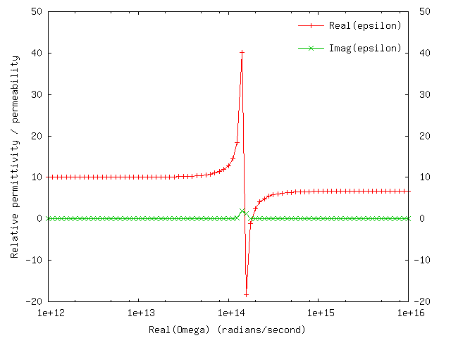

# Material descriptions in [[scuff-em]]

[[scuff-em]] allows the
frequency-dependent electrical properties (dielectric
permittivity and magnetic permeability) of materials to be 
specified in one of several ways:

+ You can use a *built-in* material like ``PEC`` or ``Vacuum.``  
+ You can specify a material with *constant* (frequency-independent) 
permittivity and permeability.
+ You can specify a data file containing tabulated 
permittivity and permeability values over a range of 
frequencies; in this case, [[scuff-em]]
will interpolate between values in your file to estimate
material properties at arbitrary frequencies.
+ You can define your own material with 
arbitrary frequency-dependent material properties,
specified using mathematical expressions.

Materials are generally specified to
[[scuff-em]] by including a line like 

````bash
MATERIAL MyMaterialName
````

in the 
[``.scuffgeo`` file][scuffEMGeometries];
here ``MyMaterialName`` is a string constructed in different
ways depending on which of the above types of material specification
you have in mind, as detailed below.

Note that material specification in [[scuff-em]] are 
*case-insensitive.* The strings ``TEFLON,`` ``Teflon,`` and ``teflon`` all 
refer to the same material.

Note also that the values of the permittivity and permeability
described by [[scuff-em]] material designations are always
the dimensionless *relative* permittivity and permeability,
with values of 1 in vacuum.

<ol class="TOC">

<p align="center">
 <b> Material specifications in <span class="SmallCaps">scuff-em</span></b>
</p>

 <li> <a href="#BuiltIn">Built-in materials</a>
 <li> <a href="#Constant">Frequency-independent materials</a>
 <li> <a href="#Tabulated">Materials specified using tabulated data</a>
 <li> <a href="#Parsed">User-defined materials</a>
 <li> <a href="#scuff-plotEpsMu">
       <span class="SmallCaps">scuff-plotepsmu:</span> A command-line 
       utility for verifying material properties</a>
</ol>

--------------------------------------------------
<a name="BuiltIn"></a>
## 1. Built-In Materials

The two built-in materials are ``Vacuum`` and 
``PEC``. The former describes a material with 
$\epsilon=\mu=1$ at all frequencies, while the latter describes 
a **P**erfect **E**lectrical **C**onductor.

--------------------------------------------------
<a name="Constant"></a>
## 2. Frequency-independent materials

For a non-magnetic material with frequency-independent permittivity
$\epsilon$, you can use a material specification of the form 

````
MATERIAL CONST_EPS_11.8
````

where you would replace ``11.8`` with the constant value 
of the permittivity. (Note that ``CONST_EPS_11.8`` 
is all one word, with no spaces.)

For a material with frequency-independent permittivity $\epsilon$
*and* frequency-independent permeability $\mu\ne1$, you can 
use a material-property designation of the form 

````
MATERIAL CONST_EPS_11.8_MU_0.8
````

where you would replace ``0.8`` with the constant value 
of the permeability. (Again, all one word, no spaces.)

You can also specify materials with negative and/or complex 
permittivity: 


````
MATERIAL CONST_EPS_-54+46i
````

Of course, a dielectric function with a frequency-independent 
imaginary part is unphysical, but no problems will arise as long 
as you are only doing computations at a single frequency.

--------------------------------------------------
<a name="Tabulated"></a>
## 3. Materials specified using tabulated data

If you have tabulated frequency data for the permittivity and/or permeability
of your material, you can specify this to [[scuff-em]] using a material 
specification of the form

````
MATERIAL FILE_MyDataFile.dat
````

where the ``FILE_`` part of the string is fixed, and the 
remainder is the name of your data file (which is of course case-sensitive.)
Again, note that the material property specification is all one word with
no spaces.

The data file is interpreted by [[scuff-em]]
in the following way:

+ Blank lines and comments (lines beginning with ``#``) are ignored.
+ All other lines must contain either two or three space-separated 
strings, which are interpreted as

> ***Omega*** ***Epsilon(Omega)***  [***Mu(Omega)***]

where ***Omega*** is an angular frequency, ***Epsilon(Omega)*** 
is the relative permittivity at that frequency, and the optional
***Mu(Omega)*** is the relative permeability.

The values specified for *Eps* and *Mu* may be
[complex numbers.][ComplexNumbers].

**Note that $\omega$ values in material data files are always specified
in units of radians per second, *not* the specialized frequency
units that are used in [[scuff-em]] application codes.** For 
example, an angular frequency of $3\cdot 10^{14}$ rad/sec would
be specified as ``1.0`` in (for example) the ``--omega`` argument
to [[scuff-scatter]], but as ``3.0e14`` in a material data file.

For example, suppose you have tabulated data for the 
frequency-dependent permittivity of silver over a finite
range of frequencies. Put those data into a text file
called (for example) ``Silver.dat``
with the angular frequencies (in radians per second)
on the first column, and the complex relative permittivity
on the second column, so that the data file looks something
like this:

````
2.5133e15 -28.832+0.39369i
2.6180e15 -26.235+0.35815i
...
5.2360e15 -2.3459+0.23547i
5.3855e15 -1.7349+0.24727i
````

This says that, for example, at angular frequency
$\omega=2.5133\cdot 10^{15}\hbox{ rad/sec}$ we have 
relative permittivity 
$\epsilon(\omega)=-28.832 + 0.39369i.$

Then your ``.scuffgeo`` file may refer to a material
named ``FILE_Silver.dat,`` whose dielectric function at
arbitrary frequencies $\omega$ will be obtained by
interpolating the data specified in your data file.
For example, to describe a sphere made of this material
your ``.scuffgeo'' file could contain a section like

````
OBJECT SilverSphere
	MESHFILE Sphere.msh
	MATERIAL FILE_Silver.dat
ENDOBJECT
````

Note: If you are doing calculations at *imaginary* frequencies
(in [[scuff-cas3d]], [[scuff-caspol]], or [[scuff-scatter]] with
an imaginary value specified for ``--omega``)
and you have tabulated data for the relative permittivity
on the imaginary frequency axis, you can play exactly the 
same game described above, except that now the $\omega$
values on the first column of the data file will be 
pure imaginary (they will end in ``i`` or ``I``).
(Also, on physical grounds the relative permittivity at
each frequency should be real-valued and positive in this 
case).

--------------------------------------------------
<a name="Parsed"></a>
# 4. User-defined materials 

For more general materials, you will want to define your own
frequency-dependent material designations. You do this by 
first creating an entry in a database file that describes 
your material, and then referring back to that entry in 
``.scuffgeo`` files and anywhere else you need to 
specify a material property designation. (Alternatively, 
you can define the material on-the-fly inside a 
``MATERIAL...ENDMATERIAL`` section in your ``.scuffgeo`` file. 
See [here][scuffEMGeometries] for more details.

<a name="Database"></a>
### The location of the database file

[[libmatprop]] looks in the following three places for its 
database file:

+ The file ``${HOME}/.matprop.dat`` (i.e. a file 
named ``.matprop.dat`` in the top-level directory
for your user account.)

+ The file named by the environment variable ``SCUFF_MATPROPFILE.`` 

+ A file named ``matprop.dat`` in the current working
directory. (Note the absence of a leading period as compared
with the previous item.)

Personally, I think the first or second of these options is the most
convenient; they allow you to create and maintain a single database
file that contains all the common materials you will ever need to use.

### Entries in the database file

A typical entry in the database file looks like this:

````
MATERIAL SiliconCarbide

  EpsInf = 6.7;
  a0     = -3.32377e28;
  a1     = +8.93329e11;
  b0     = -2.21677e28;
  b1     = 8.93329e11;

  Eps(w) = EpsInf * ( w^2 + a1*i*w + a0 ) / ( w^2 + b1*i*w + b0);

ENDMATERIAL
````

The first line defines the name of the material (the name you
would supply as an argument to the ``MATERIAL`` keyword 
in a ``.scuffgeo`` file, for example).

The next few lines define some constants. These constant
definitions are specific to this particular ``MATERIAL``;
two different ``MATERIAL`` sections in the database 
file may define the same constant to have two different values.

The line ``Eps(w) = ... `` defines the 
frequency-dependent relative permittivity of your material.
The expression to the right of the ``=`` sign is 
parsed and interpreted as a function
of the single variable ``w,`` the angular frequency.
The expression may refer to any of the constants you have defined 
for the present material; it may also use the symbols
``i`` and ``I`` to denote the imaginary unit.

**Again, $\omega$ values in material property specifications are 
always interpreted in units of radians per second, *not* the 
specialized angular-frequency units that are used in some of the 
[[scuff-em]] application codes.**

If your material has $\mu\ne 1$, you may optionally also include a line 
of the form

````
Mu(w) = some-function(w)
````


### A Sample Database File

Here is a sample database file:[``matprop.dat``](matprop.dat).
I recommend you rename this file to ``${HOME}/.matprop.dat`` and 
augment it as necessary for your applications.

--------------------------------------------------
<a name="scuff-plotEpsMu"></a> 
# 5. ``scuff-plotEpsMu:`` A command-line utility for verifying material properties

The [[scuff-em]] distribution comes with an application program named 
``scuff-plotEpsMu`` that you
can use to make sure that a material property designation is 
interpreted the way you intended. You can run this command with 
no arguments to get usage information:

````bash
% scuff-plotEpsMu 

error: --material option is mandatory (aborting)

usage: scuff-plotEpsMu [options]

options: 

--material xx  (name of material)
--OmegaMin xx  (minimum angular frequency)
--OmegaMax xx  (maximum angular frequency)
--gnuplot      (use GNUPLOT to plot results)
--geometry xx  (.scuffgeo file containing material definition)
````

Running ``scuff-plotEpsMu --material MyMaterial``
will produce an output file name ``MyMaterial.epsmu``,
which will contain 7 columns of data, representing the 
permittivity and permeability of your material at various 
angular frequencies on both the real and imaginary &omega; 
axes:

<p align="center">
<table align="center" border="1" cellpadding="5" cellspacing="5">
<tr> 
<th> Column   </th>
<th> 1 </th> <th> 2 </th> <th> 3 </th> <th> 4 </th> 
<th> 5 </th> <th> 6 </th> <th> 7 </th>
</tr> 
<tr> 
<th> Quantity </th>
<td> &omega; </td>
<td> Re &epsilon;(&omega;)  </td>
<td> Im &epsilon;(&omega;)  </td>
<td> Re &mu;(&omega;)  </td>
<td> Im &mu;(&omega;)  </td>
<td> &epsilon;(i&omega;) </td>
<td> &mu;(i&omega;) </td>
</tr> 
</table>
</p>

If [[gnuplot]] is installed on your system,
then you can use the ``--GnuPlot`` option to generate pop-up 
plots of $\epsilon(\omega)$ and $\mu(\omega)$ vs. $\omega$
for your material.

You can use ``--OmegaMin/--OmegaMax`` to set the
range of angular frequencies over which material properties 
will be plotted. The defaults are equivalent to specifying 
``--OmegaMin 1e8`` and ``--OmegaMax 1e16``, 
respectively.

If your material is defined on-the-fly in a ``.scuffgeo`` 
file, you can pass that file to ``scuff-plotEpsMu`` using 
the ``--geometry`` option. (If your material is defined
in a [material database file](#Database)
then this option is not needed.)

For example, in 
<a href="scuff-em/scuff-scatter/index.shtml#Mie">this example</a>
we used a material named ``SiliconCarbide,`` which was defined
in a geometry file named ``SiCSphere.scuffgeo.`` To check the
the frequency-dependent permittivity of this material, we can say

````bash
% scuff-plotEpsMu --material SiliconCarbide --geometry SiCSphere.scuffgeo --gnuplot
````

This will pop up four graphs, of which one looks something like this:



{!Links.md!}
