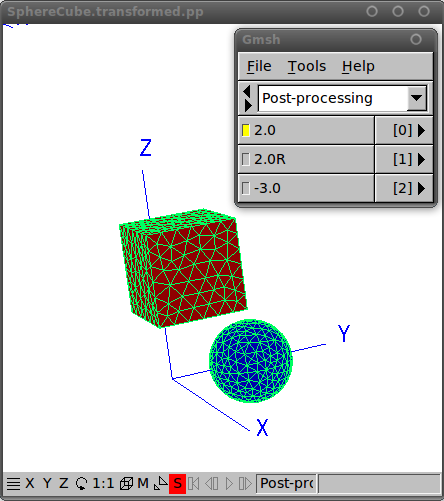
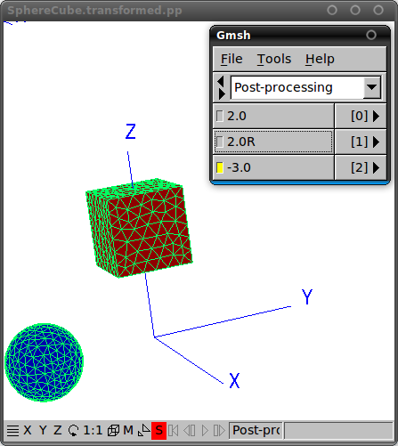

# Geometrical transformations in [[scuff-em]]

For some of the physical problems handled by codes in the 
[[scuff-em]] suite, it is of interest
to consider the effect of *geometrical transformations*---namely, 
rigid displacements and rotations of the objects in a geometry with 
respect to one another.

For example, if you are investigating the Casimir force between 
two nanoparticles of some exotic shape, you will probably want
to carry out the calculation for many (let's say 25) different 
values of the interparticle separation and obtain the full 
force-vs-separation *curve*, not just the force on a single
configuration.

Of course, one way to handle this situation would be simply to
create 25 different ``.scuffgeo`` files, each describing
the nanoparticles at different separation distances, and then run 
[<span class="SmallCaps">scuff-cas3d</span>](../applications/scuff-cas3D/scuff-cas3D.md) 
25 separate times. However, such a procedure would not only be a major
hassle, but would also fail to exploit some significant 
computational redundancies.

For example, in a geometry consisting of two nanoparticles,
the diagonal blocks of the 
[BEM matrix](../forDevelopers/Implementation.md)
are *independent of the interparticle separation* and hence 
need only be assembled once per frequency, after which they 
can be *reused* for all 25 interparticle separations.
This can save a lot of time as compared to the cost of 
running 25 independent calculations.

To facilitate this type of calculation, several of the 
standalone applications in the 
[[scuff-em]] 
suite offer the option of specifying a *transformation list.*
This is a file describing a sequence of geometrical transformations
to be carried out on the base geometry described by your 
``.scuffgeo`` file. Each output quantity that you
request (be it the *y-*directed Casimir force, the 
total heat transfer, or what have you) will then be computed
and reported separately for each of the transformations you 
specified.

An important caveat is that 
**geometrical transformations may not change the *nesting topology* of a 
[[scuff-em]] geometry.** This is discussed in more detail
[below](#Nesting).

<ol class="TOC">

<tr> <th> 
<p align="center"><b> Geometrical Transformations in
                      <span class="SmallCaps">scuff-em</span>
                 </b>
</p>

 <li> <a href="#TransFile">Syntax of the <code>.trans</code> file</a>
 <li> <a href="#Example">An example of a <code>.trans</code> file</a>
 <li> <a href="#Visualizing">Visualizing the effect of the transformations you specified</a>
 <li> <a href="#Nesting">Transformations may not change the nesting topology</a>
</ol>

<a name="TransFile"></a>
# 1. Syntax of the ``.trans`` file 

You will list your geometrical transformations in a file 
whose name conventionally has file extension ``.trans``.
This is the file you will specify using the 
``--transfile`` option to 
[<span class="SmallCaps">scuff-cas3d</span>](../applications/scuff-cas3d) 
and other codes.

The ``.trans`` file may contain any number of 
transformations. 
Each transformation will specify *which* objects in your
geometry are to be transformed, and *how* those objects 
will be displaced or rotated. 

Each transformation will be specified by a section of the file
that looks something like this:

> `TRANSFORMATION` ***name-of-transformation***  
> &nbsp; &nbsp; &nbsp; `OBJECT` ***FirstObjectLabel***  
> &nbsp; &nbsp; &nbsp; &nbsp; &nbsp; &nbsp; ***displacement-or-rotation***  
> &nbsp; &nbsp; &nbsp; &nbsp; &nbsp; &nbsp; ***displacement-or-rotation***  
> &nbsp; &nbsp; &nbsp; &nbsp; &nbsp; &nbsp; ...  
> &nbsp; &nbsp; &nbsp; `OBJECT` ***SecondObjectLabel***  
> &nbsp; &nbsp; &nbsp; &nbsp; &nbsp; &nbsp; ***displacement-or-rotation***  
> &nbsp; &nbsp; &nbsp; &nbsp; &nbsp; &nbsp; ***displacement-or-rotation***  
> &nbsp; &nbsp; &nbsp; &nbsp; &nbsp; &nbsp; ...  
> `ENDTRANSFORMATION`
{.shaded}


The <b>*name-of-transformation*</b> field after the 
`` TRANSFORMATION `` keyword specifies a mandatory label
assigned to this transformation, which will be used
in output files to identify quantities computed under this
transformation. 


The ***FirstObjectLabel*** field should be the label of
an object in your geometry (as assigned using the ``OBJECT``
keyword in a [``.scuffgeo`` file](Geometries.md).
Displacements and rotations specified after this line will apply to the
object named on this line, until the next ``OBJECT`` line is 
encountered.

Each ***displacement-or-rotation*** line should look either like
this:

>> ``DISPLACED``   ***xx yy zz***
{.shaded}

or like this:

>> ``ROTATED`` ***dd*** ``ABOUT`` ***nx ny nz***
{.shaded}


The former case specifies that the object in question is to be displaced
through a displacement vector with cartesian coordinates 
***(xx,yy,zz)***.


The latter case specifies that the object in question is to be rotated
through ***dd*** degrees about an axis passing through the origin
and through the point with cartesian coordinates ***(xx,yy,zz).***
Note that ``ABOUT`` is a fixed keyword that must be repeated
verbatim.
**(Note that the rotation angle is specified in 
degrees, not radians.)**

You may specify any number of ``DISPLACEMENT`` and 
``ROTATION`` statements to be applied to each object.
These statements will be applied in the order they are 
specified in the ``.trans`` file.

Note that ``TRANSFORMATION...ENDTRANSFORMATION``
sections are not cumulative; two consecutive such sections do not 
build on each other, but instead describe distinct transformations
applied to the geometry starting in its original state as described 
in the ``.scuffgeo`` file.

(However, if your ``.scuffgeo`` included any 
``DISPLACED`` or ``ROTATED`` statements to
transform object meshes prior to their inclusion in the
geometry, then the transformations in a ``.trans``
file *are* cumulative with respect to those, as any
such transformations are considered to be included
into the base default configuration of the geometry.)

Blank lines and comments (lines beginning with ``#``) in
``.trans`` files are ignored.

## Abbreviated Syntax
For simple transformations you may use the following
abbreviated one-line syntax in place of an entire
``TRANSFORMATION...ENDTRANSFORMATION`` section:

> ``TRANS`` ***name*** ``OBJECT`` ***Label***   ***displacement-or-rotation***
{.shaded}

This differs from the syntax outlined above in the following
ways: 

+ The entire transformation is specified on a single line.
+ The line begins with the shortened keyword ``TRANS``, and there is no terminating keyword.

## Empty Transformations
The following transformations are perfectly legal:

````bash
TRANSFORMATION Nothing
ENDTRANSFORMATION
````

````bash
TRANS Default
````

These define ``transformations`` that actually leave the geometry
untouched from the configuration specified in the ``.scuffgeo``
file. You may name these transformations anything you please, just
as with any other transformations. This is sometimes useful for
carrying out computations on a sequence of geometric configurations
of which one is the unmodified configuration of the ``.scuffgeo``
file.

<a name="Example"></a>
# 2. An example of a ``.trans`` file

Here's an example of a ``.trans`` file designed to 
be used with [this geometry file][SphereCube],
which contains two objects with
user-assigned labels ``TheSphere`` and ``TheCube``.

Note that, in the ``.scuffgeo`` file, the cube is 
displaced 3 units in the positive *z* direction relative 
to the configuration of its mesh file; as noted above,
transformations in the ``.trans`` are 
carried out starting from that displaced configuration.

This file declares three separate transformations:

+ The first (labeled ``2.0``) displaces the sphere 2.0 
length units in the *y* direction, while simultaneously 
displacing the cube 2.0 units in the *x* direction.  


+ The second (labeled ``2.0R``) is the same as the 
first, but with the cube first rotated 45 degrees 
(&pi;/4 radians) about the *z* axis before it is 
displaced.  


+ The third (labeled ``-3.0``) displaces the sphere 
negative 3.0 length units in the *y* direction, while
leaving the cube untouched.


````
# a transformation in which both cube and sphere are displaced 
TRANSFORMATION 2.0

OBJECT       TheSphere
DISPLACED    0.0 2.0 0.0 

OBJECT       TheCube
DISPLACED    2.0 0.0 0.0

ENDTRANSFORMATION

# similar to the above, but now the square is rotated before it is displaced
TRANSFORMATION 2.0R

OBJECT       TheSphere
DISPLACED    0.0 2.0 0.0 

OBJECT       TheCube
ROTATED      45 ABOUT 0 0 1 
DISPLACED    2.0 0.0 0.0

ENDTRANSFORMATION

# in this transformation, only the sphere is affected, so we can use the abbreviated syntax
TRANS -3.0 OBJECT TheSphere DISP 0.0 -3.0 0.0
````

<a name="Visualizing"></a>
# 3. Visualizing the effect of the transformations you specified

Before running a full calculation using a ``.trans``
file, you will generally want to double-check to make sure 
that the geometrical transformations as interpreted by 
[[scuff-em]] are actually what 
you intended. 

A simple way to do this is to use the 
[<span class="SmallCaps">scuff-analyze</span>][scuff-analyze]
utility application that comes with the [[scuff-em]] distribution. 
Invoking this utility
with the ``--geometry`` and ``--transfile``
options to specify your ``.scuffgeo`` and 
``.trans`` files will produce an output file 
called ``MyGeometry.transformed.pp`` 
(where ``MyGeometry.scuffgeo`` was the name of the 
your geometry file) which you can open in 
[<span class="SmallCaps">gmsh</span>](http://geuz.org/gmsh).

For example, to visualize the impact of the transformations 
in the example above, we could proceed as follows.
(All the files needed to execute this example may be found
in the ``examples/SphereCube`` directory of the 
[[scuff-em]] source distribution.)

````bash
% scuff-analyze --geometry SphereCube.scuffgeo --transfile SphereCube.trans
````

This will generate a file named ``SphereCube.transformed.pp``
that you can open in [[gmsh]]:

````bash
% gmsh SphereCube.transformed.pp
````






Note that the items in the [[gmsh]]
menu here are labeled using the strings you assigned to each
transformation in your ``.trans`` file (the
***name-of-transformation*** field in the syntax 
description above).

<a name="Nesting"></a>
# 4. Geometrical transformations may not change the nesting topology

An important restriction on the use of geometrical transformations 
in [[scuff-em]] is that transformations 
may not change the *nesting topology* of a 
[[scuff-em]] geometry -- that is, the 
containership relations that classify which objects are 
embedded inside which other objects. This is because 
[[scuff-em]] autodetects the nesting 
topology when it first reads in the ``.scuffgeo``
file and cannot subsequently redefine it.

For example, perhaps your ``.scuffgeo`` file describes 
a geometry consisting of a big sphere (perhaps filled with a dielectric 
liquid like water) and a smaller sphere (perhaps a ball of silicon) 
inside this sphere. In this case, you can use geometrical 
transformations to move the smaller sphere around *within* the 
larger sphere, but you may not write a geometrical transformation
that displaces the smaller sphere all the way *outside* 
the larger sphere. If you want to run simulations in which the 
smaller sphere lies outside the larger sphere, you will need to 
write a new ``.scuffgeo`` file in which that condition 
is satisfied from the start.

(Also, you may not write a geometrical transformation that 
displaces the smaller sphere in such a way that its surface
intersects the surface of the larger sphere -- in that case,
your geometry would contain a
[multi-material junction](Geometries.md)
and would require a ``.scuffgeo`` description in terms of 
``REGIONS`` and ``SURFACES`` instead of the simpler 
description in terms of ``OBJECTS``
that suffices for fully-embedded geometries.)

As another example, suppose you want to compute the Casimir force 
between two identical dielectric objects over a range of separations. 
In this case, you might be tempted to write a ``.scuffgeo`` 
file in which the two objects start out lying on top of each other,
and then displace them using geometrical transformations in the
actual force computation. However, this won't work: when 
[[scuff-em]] first processes the 
``.scuffgeo`` file, it will be confused by the appearance
of two objects appearing to coexist in the same physical space,
and the nesting topology will be incorrectly characterized.
Instead, you will want to start out with a ``.scuffgeo``
file in which the objects are displaced from one another; you can,
of course, subsequently rotate or displace them further to your
heart's content using geometrical transformations.

[SphereCube]: SphereCube.scuffgeo
[scuff-analyze]: ../applications/scuff-analyze/scuff-analyze.md
