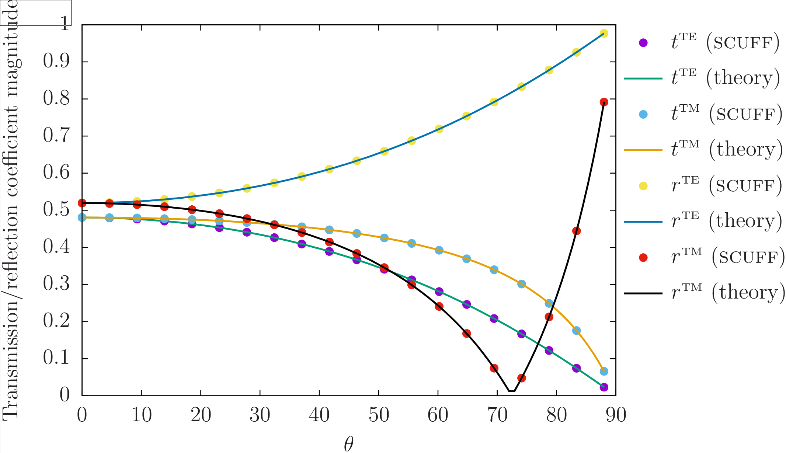

# Fresnel Scattering

The `FresnelScattering` unit of the
[<span class=SC>scuff-em</span> test suite][TestSuite]
uses the [<span class=SC>scuff-transmission</span> command-line module][scuff-transmission]
to study the textbook case of *Fresnel scattering*: the transmission and
reflection of plane waves at a planar dielectric interface of infinite extent
in the transverse dimensions.

More specifically, we consider plane waves incident from below
on a dielectric half-space of permittivity $\epsilon_r=10.$
The geometry is 2D-periodic with a unit cell of dimensions $L_x=L_y=1\, \mu$m;
the only meshed surface is the planar interface between vacuum ($z<0$) and
dielectric ($z>0$), described by a mesh with 40 interior edges.
The incident angle of the plane wave determines the Bloch vector of the 
scattering problem.

The aspects of [[scuff-em]] functionality exercised by this test include the 
following:

#### Core library (<span class=SC>libscuff</span>)

+ Basic handling of periodic geometries. Parsing of `LATTICE...ENDLATTICE`
  statements in `.scuffgeo` files. Processing of "straddler" basis
  functions in periodic geometries containing surfaces that extend across
  unit-cell boundaries. (`libscuff/PBCSetup.cc`)

+ Computation of 2D periodic Green's function via Ewald summation
  (`GBarVDEwald.cc`) and its acceleration via interpolation table 
  (`GBarAccelerator.cc`)

+ Assembly of system matrix for 2D Bloch-periodic geometries, including
  acceleration scheme involving separating contributions of innermost 9 cells
  from contributions of outer ("all but inner" or ABI) cells (`AssembleBEMMatrix.cc`).

+ Computation of scattered fields for Bloch-periodic geometries (`GetFields.cc`).


#### <span class=SC>libmdinterp</span> support library:

+ Instantiation and use of 2D and 3D interpolation 
  tables (`Interp2D.cc, Interp3D.cc`)

#### <span class=SC>scuff-transmission</span> command-line application module:

+ Computation of transmission and reflection coefficients directly
    from surface currents (`GetAmplitudes.cc`)

+ Computation of transmitted and reflected power via Poynting-vector
    integration using scattered fields (`GetFlux.cc`)

### Exact solution

The situation considered here is that of a plane wave impinging 
from below on a dielectric half-space (relative permittivity $\epsilon=10$)
filling the region $z>0$. (More details on the setup for
[[scuff-transmission]] calculations may be found in the document
[Computation of reflection and transmission coefficients in <span class="SC">scuff-em</span>][scuffTransmissionMemo].)

For this case, the transmission and reflection coefficients
for the TE and TM polarizations read 

$$ t^{\scriptsize{\text{TE}}}
   =\frac{2\cos\theta}{\cos\theta + \cos\theta^\prime},
   \qquad
   r^{\scriptsize{\text{TE}}}
   =\frac{\cos\theta-\cos\theta^\prime}{\cos\theta + \cos\theta^\prime},
$$
$$
   t^{\scriptsize{\text{TM}}}
  =\frac{2n\cos\theta}{n^2 \cos\theta + \cos\theta^\prime},
   \qquad
   r^{\scriptsize{\text{TM}}}
  =\frac{n^2\cos\theta-\cos\theta^\prime}{n^2\cos\theta + \cos\theta^\prime}
$$

where $\theta$ is the incident angle ($\theta=0$ for normal incidence),
$n=\sqrt{\epsilon}$ is the index of refraction, and

$$ \cos\theta^\prime = \sqrt{ \epsilon - \sin^2\theta}.$$

## <span class="SC">scuff-em</span> solution

The transmission and reflection coefficients for the $\epsilon=10$ dielectric
half-space problem are computed using `scuff-transmission` as follows:

````bash
ARGS=""
ARGS="${ARGS} --geometry    E10HalfSpace_40.scuffgeo"
ARGS="${ARGS} --Omega       0.1"
ARGS="${ARGS} --Omega       1.0"
ARGS="${ARGS} --ThetaMin    0"
ARGS="${ARGS} --ThetaMax    85"
ARGS="${ARGS} --ThetaPoints 19"
ARGS="${ARGS} --ZAbove      1.0"
 % scuff-transmission ${ARGS}
````

Here the file
[`E10HalfSpace_40.scuffgeo`](E10HalfSpace_40.scuffgeo)
describes the [<span class="SC">scuff-em</span> geometry][scuffEMGeometries]
(it refers to a mesh file named [`Square_40.msh`](Square_40.msh) )
and the command-line arguments ask for a calculation at 
two angular frequencies ($\omega=\{0.1, 1\}\omega_0$ with 
$\omega_0\equiv 3\times 10^{14}$ rad/sec the default
<span class=SC>scuff-em</span> unit of angular frequency)
and at 20 incident angles in the range $0\le \theta < 90 $ degrees.

## Comparison

Running the above command yields the file
[`E10HalfSpace_40.transmission`](E10HalfSpace_40.transmission).
Plotting in [<span class="SC">gnuplot</sc>][gnuplot] yields 
a comparison of [[scuff-transmission]] data (point) to 
theoretical predictions (curves):



Here is the [[gnuplot]] script that I use to produce this 
plot: [PlotFresnelData.gp](PlotFresnelData.gp).

## Unit test

The unit test is performed by running the script `tests/Fresnel/TestFresnel.sh.`
This runs `scuff-transmission` to do the calculation described above, with
results written to output file `E10HalfSpace_40.transmission.`
The `CheckSCUFFData` utility is then invoked to compare the content 
of this file against the reference file `E10HalfSpace_40.transmission.reference`.
(To generate this reference file, run `% TestFresnel.sh --reference` with
no other arguments.)
The items to be checked in the comparison are defined by the checklist
[`Fresnel.Checklist`](Fresnel.Checklist). The unit test passes iff 
all data items for all data sets agree within specified tolerances.


{!Links.md!}
